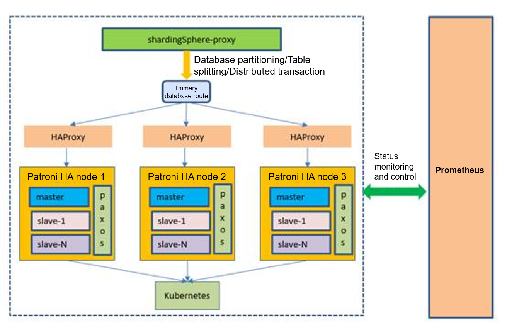

# A Leap of openGauss from Standalone System to Distributed System

Since June 2020, the openGauss standalone database has received wide attention from the industry and attracted many partners and developers to build a prosperous database ecosystem. In the face of massive data and ultra-high concurrency scenarios, openGauss turns to distributed solutions and focuses on solving problems in different aspects, such as massive data storage, ultra-high concurrent throughput, and large table bottlenecks, achieving another breakthrough from standalone system to distributed system.

## **Distributed solution**

Figure 1 Overall architecture of the distributed solution

openGauss integrates many open-source components to build a full-stack open-source distributed solution that integrates data scale-out, distributed transactions, and governance. Figure 1 shows the overall architecture of openGauss. ShardingSphere-proxy is an open-source distributed solution that provides sharding, table partitioning, distributed transactions, auto scaling, and read/write isolation capabilities. HAProxy, working with Patroni REST APIs, can always identify the database primary node, ensuring HA and implementing load balancing. Each Patroni HA node supports one primary node and multiple standby nodes. Each node uses the Paxos protocol to ensure data consistency. Nodes can be deployed in the same or different regions to ensure data security in multiple regions and data centers. This distributed solution uses the powerful distributed capability of shardingSphere-proxy to manage clusters through Kubernetes and monitor cluster status through Prometheus. In this way, a full-stack open-source distributed solution is built.

## **Product advantages**

1.  **Ultimate scalability and flexible scaling**

    The computing and storage capabilities can be linearly expanded through horizontal sharding to a maximum of 6400 shards. The performance increases quasi-linearly with the expansion, which effectively solves the problem of data volume expansion in a single table. Depending on service traffic, data nodes can be flexibly and smoothly scaled in or out, and read and write operations are intelligently separated to implement automatic load balancing of distributed databases.

2.  **Abundant enterprise-class features**

    Provides abundant enterprise-class features, such as distributed stored procedures, triggers, distributed transactions, fully-encrypted data, and Workload Diagnosis Reports \(WDRs\).

3.  **One-click deployment, shielding underlying dependencies**

    Standard images ensure consistent delivery in multiple environments, container-based deployment, and physical resource pooling, reducing dependency on the platform and implementing second-level application deployment.

4.  **Ultra-high availability, implementing remote disaster recovery**

    Provides powerful cluster management and O&M capabilities, and flexible deployment of multiple data centers in the same city, different cities, and multiple regions, ensuring data security and consistency based on the Paxos protocol, and providing multiple DR capabilities with "RPO = 0".

5.  **Open source, building a full-stack ecosystem**

    The standalone and distributed open-source openGauss solutions encourage more partners and developers to jointly build a prosperous database ecosystem and build a full-stack open-source ecosystem.

## **Application scenarios**

1.  **Banking system**

    Based on the consensus protocol Paxos, the distributed strong consistency transaction capability is provided to ensure strong data consistency in the distributed environment. Multiple data centers in multiple regions provide the "RPO = 0" capability to ensure bank-grade reliability.

2.  **Government/Enterprise office**

    Provides fully-encrypted data encryption, which is secure and reliable and supports software and hardware ecosystems to ensure HA and safeguard government and enterprise office work.

3.  **Smart grid**

    Supports flexible deployment of multiple data centers in the same city, in different cities, and in multiple regions, and flexible scaling based on service tidal characteristics, helping build smart grids.

    Currently, the distributed openGauss solution is in the crowdtesting phase. Developers are welcome to participate in this phase and work together to build a powerful distributed solution.
