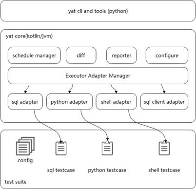
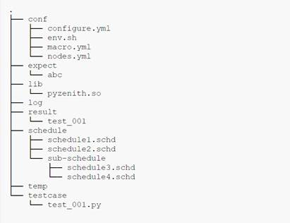

# Automatic Test Framework — YAT<a name="ZH-CN_TOPIC_0000001251306643"></a>

The Yet another test \(YAT\) framework is an automatic test framework based on Python3. The core of the framework is implemented by the Kotlin language. The framework is encapsulated and bonded through Python to provide command line interfaces \(CLIs\). Figure 1 shows the overall framework. The YAT framework is continuously evolving to become a more efficient and advanced automatic test framework.

YAT is the automatic test framework used for openGauss database specification monitoring. openGauss 2.1.0 not only releases open-source YAT, but also contributes over 30,000 automatic test cases to enhance the test capability of the openGauss community, enrich the openGauss ecosystem and attract more developers to participate in community construction. YAT code repository: [https://gitee.com/opengauss/Yat](https://gitee.com/opengauss/Yat)



Figure 1 Overall YAT framework

## Product Advantages<a name="section16650123518161"></a>

- It is friendly to database tests. Users can directly write SQL code and organize the code into a test suite for tests without additional configuration. Test cases are executed through the JDBC API and can adapt to various databases.
- It supports multiple languages and is extensible.

  Currently, languages such as SQL, Shell, Python \(unittes\), and Groovy \(Junit/Spock\) are supported. New languages and frameworks can be added through adapters. SQL statements supported by YAT are supersets of standard SQL statements.That is, YAT is extended based on standard SQL statements. Users can run shell commands, control connections, execute loops, bind SQL statements, control multiple sessions, and concurrently execute SQL statements in SQL scripts. For example:

  ```
  @conn user/passwd@127.0.0.1:9090;  -- Reconnect to the database as the new user.
  drop table if exists tbl_x;  -- Execute SQL statements.

  create table tbl_x (id int, age int, xb int);

  insert into tbl_x values(1, 2, 4);
  insert into tbl_x values(3, 4, 5);

  -- Perform the binding operation.
  insert into tbl_x values(?, ?, ?);
  @bind {
      int 3
      int 5
      int 7
  }
  -- Perform the binding operation in batches.
  insert into tbl_x values(?, ?, ?);
  @batch {
      int 3 int 4 int 0
      int 3 int 4 int 9
      int 3 int 4 int 8
      int 3 int 4 int 7
  }
  -- Run the shell commands.
  @sh zctl.py -t stop;
  @sh zctl.py -t start;

  -- Define sessions.
  @session(name: s1)
  {
      @set autocommit false;
      update table tbl_x set par1 = 2 par2 = 2;
      insert into tbl_x values(1, 3, 4);
      commit;
  }

  @session(name: s2, user: abc, password: 'gauss@123')
  {
      @set autocommit false;
      update table tbl_x set par1 = 2 par2 = 2;
      insert into tbl_x values(1, 3, 4);
      @step
      {
          select * from tbl_x for update;
      }
      commit;
  }
  -- Executes SQL statements in sessions.
  @steps s1.0 s2.0 s1.1 s1.2 s2.2 s2.1;
  -- Execute loops.
  @for (count: 10)
  {
      insert into abc values(1,1,3,4);
  }
  -- Concurrently execute SQL statements.
  @parallel {
      @session {
          select * from abc for update;
          commit;
      }

      @session {
          select * from abc for update;
          commit;
      }
  }
  ```

  The Python language test script must be a unittest test script. YAT provides a public library to facilitate database and remote SSH operations in the Python unittest test script. For example:

  ```
  class TestPrimaryStandby(TestCase):
      node = None
      node_standby = None

      test_table_drop = 'drop table if exists tbl_test';
      test_table_create = '''create table tbl_test (
          id int,
          name char(20),
          address varchar(1024)
      )
      '''

      @classmethod
  def setUpClass(cls):
      # Initialize the connection object.
          cls.node = Node(node='primary')
          cls.node_standby = Node(node='standby')
          cls.node.sql(cls.test_table_drop)
          cls.node.sql(cls.test_table_create)

      @classmethod
      def tearDownClass(cls) -> None:
          cls.node.close()
          cls.node_standby.close() # Close the connection object.

  def test_abc_001(self):
      # Run the shell command through SSH and check the result.
          self.node.sh('echo "success"').expect('success')

          # Run the SQL statement and check the result.
          self.node.sql('select * from tbl_test').expect(
              (1, 'xxx', 'xxxxxxxxxxxxxxxxxxx'),
              (2, 'xxx', 'xxxxxxxxxxxxxxxxxxx'))

  def test_abc_003(self):
      # Run the shell command and determine the result through regular expression matching.
          self.node.sh('cm ctl query').regex(r'.*success.*')
  ```

  Groovy scripts can be used to write JUnit cases or Spock cases. For more details, visit the official website.

- It defines a set of standard test case writing specifications, test execution processes, and test report presentation modes.

  Run the **yat init** command to create a test suite template. After the **yat init** command is executed, modify the content in the specified test suite directory. Then, install the JDBC driver, add the **lib** directory to the root directory of the test suite, copy the driver to this directory, and run the **yat suite run** command to run the test suite. You can add different parameters to set whether to print the report and the report format. Figure 2 shows the test suite directory result. Configure the following directories before running the test suite:

  - **conf** directory, which stores node configuration files.
  - **except** directory, which is the expected file of the test case.
  - **schedule** directory, which stores the schedule files.
  - **testcase** directory, which stores test case files.

  

  Figure 2 Directory structure of the test suite

- Multi-suite Schedule

  YAT Schedule is a scheduler provided by YAT to schedule multiple YAT test suites at the same time. You can schedule multiple YAT test suites in parallel or serial mode by customizing a schedule file. When there are a large number of test suites, you need to determine the combination and sequence of the test suites. YAT provides a convenient method to organize multiple test suites into a large test suite, as shown in the following figure.

  ```
  # File name: all.ys
  serial {# Serial execution of test suites or test suite sets
      suite '../suite1';
      suite '../suite2';
      ...

      parallel { # Parallel execution of test suites or test suite sets
          suite 'parallel/suite1';
          suite 'parallel/suite2';
          ...

          serial { ... }
      }

      suite 'suite3';
      ...
  }
  ```

  Run the following command to execute all test suites in one-click mode:

  ```
  yat schedule -s all.ys
  ```
