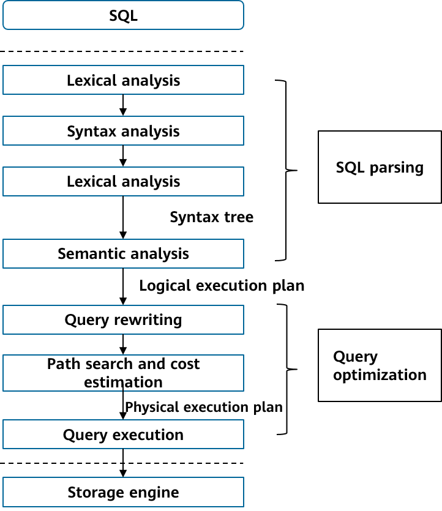
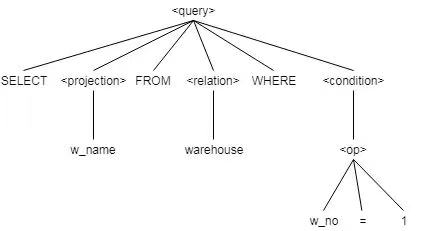
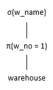

# Core Technologies of openGauss Database \(I\)<a name="ZH-CN_TOPIC_0000001206466686"></a>

## Overview<a name="section1444952643119"></a>

An SQL engine is one of the important subsystems of the database. It receives SQL statements sent by applications and directs executors to execute execution plans. As an important and complex module in an SQL engine, optimizer is regarded as the "brain" of a database. An execution plan generated by the optimizer directly determines the database performance. The following describes modules of the SQL engine.

## **01** SQL Engine Overview<a name="section456963833113"></a>

An SQL engine is an important part of a database system. It is responsible for generating efficient execution plans based on the SQL statements entered by applications in the current load scenario. It plays an important role in efficient SQL execution. The following figure shows the SQL execution process in the SQL engine.

SQL execution process



As shown in the preceding figure, the SQL statement needs to be parsed to generate a logical execution plan, and the physical execution plan needs to be generated through query optimization. Then, the physical execution plan is transferred to the query execution engine for executing the physical operator.

## **02** SQL Parsing<a name="section148651749144816"></a>

The compiling process of SQL statements in DBMS accords with the routine process of compiler implementation, which requires lexical analysis, syntax analysis, and semantic analysis.

In the SQL standards, keywords and syntax rules of the SQL language are determined. During lexical analysis, the SQL parser divides an SQL statement into independent atomic units according to keywords and interval information, and each unit is presented as a word. For example:

◾ Lexical analysis: Identify keywords, identifiers, operators, and terminators supported by the system from query statements. Each word determines its own part-of-speech \(POS\).

◾ Syntax analysis: Define syntax rules based on SQL language standards, and use words generated during lexical analysis to match syntax rules. If an SQL statement can match a syntax rule, an abstract syntax tree \(AST\) is generated.

◾ Semantic analysis: Check the validity of the AST, check whether the tables, columns, functions, and expressions in the syntax tree have corresponding metadata, and convert the AST into a logical execution plan \(relational algebra expression\).

```
SELECT w_name FROM warehouse WHERE w_no = 1;
```

The following table lists atomic units such as keywords, identifiers, operators, and constants.

<a name="table66511959172918"></a>

<table><thead ><tr id="row2776759132917"><th class="cellrowborder"  width="35%" id="mcps1.1.3.1.1"><p id="p1776859132914"><a name="p1776859132914"></a><a name="p1776859132914"></a>POS</p>
</th>
<th class="cellrowborder"  width="65%" id="mcps1.1.3.1.2"><p id="p17776159182917"><a name="p17776159182917"></a><a name="p17776159182917"></a>Content</p>
</th>
</tr>
</thead>
<tbody><tr id="row1977611595291"><td class="cellrowborder"  width="35%" headers="mcps1.1.3.1.1 "><p id="p137761459192917"><a name="p137761459192917"></a><a name="p137761459192917"></a>Keywords</p>
</td>
<td class="cellrowborder"  width="65%" headers="mcps1.1.3.1.2 "><p id="p9776159112916"><a name="p9776159112916"></a><a name="p9776159112916"></a>SELECT, FROM, WHERE</p>
</td>
</tr>
<tr id="row977615597293"><td class="cellrowborder"  width="35%" headers="mcps1.1.3.1.1 "><p id="p197761759142913"><a name="p197761759142913"></a><a name="p197761759142913"></a>Identifiers</p>
</td>
<td class="cellrowborder"  width="65%" headers="mcps1.1.3.1.2 "><p id="p377617593296"><a name="p377617593296"></a><a name="p377617593296"></a>w_name, warehouse, w_no</p>
</td>
</tr>
<tr id="row1877613599297"><td class="cellrowborder"  width="35%" headers="mcps1.1.3.1.1 "><p id="p777619597299"><a name="p777619597299"></a><a name="p777619597299"></a>Operators</p>
</td>
<td class="cellrowborder"  width="65%" headers="mcps1.1.3.1.2 "><p id="p127771659162912"><a name="p127771659162912"></a><a name="p127771659162912"></a><strong id="b177771159132918"><a name="b177771159132918"></a><a name="b177771159132918"></a>=</strong></p>
</td>
</tr>
<tr id="row1277765911291"><td class="cellrowborder"  width="35%" headers="mcps1.1.3.1.1 "><p id="p97776599293"><a name="p97776599293"></a><a name="p97776599293"></a>Constants</p>
</td>
<td class="cellrowborder"  width="65%" headers="mcps1.1.3.1.2 "><p id="p11777559122915"><a name="p11777559122915"></a><a name="p11777559122915"></a><strong id="b16777159122916"><a name="b16777159122916"></a><a name="b16777159122916"></a>1</strong></p>
</td>
</tr>
</tbody>
</table>

During syntax analysis, words obtained through lexical analysis are matched with syntax rules, and an AST is generated. Each word is displayed as a leaf node of the syntax tree, as shown in the following figure.

Abstract syntax tree



The semantics expressed by the AST is limited to ensuring that the applied SQL statements comply with the SQL standard specifications. However, the validity of the internal meaning of the SQL statements needs to be checked.

◾ Check the use of relationships: A relationship in the FROM clause must be a relationship or view in the schema corresponding to the query.

◾ Check and parse the use of attributes: Each attribute in the SELECT statement or WHERE clause must be the attribute of a relationship or view in the FROM clause.

◾ Check data types: The data types of all attributes must be matched.

During the validity check, the semantic analysis process is the same as the validity semantic binding process. Through the semantic analysis check, the AST is converted into a logical execution plan. The logical execution plan can be represented by a relational algebra expression, as shown in the following figure.

Relational algebraic expression



## **03** Query Optimization<a name="section1110310854913"></a>

Based on different optimization methods, the optimization technologies of the optimizer can be classified into the following types:

- Rule-based optimization \(RBO\): optimizes SQL statements based on predefined heuristic rules.
- Cost-based query optimization \(CBO\): performs cost estimation on the to-be-selected execution paths corresponding to the SQL statement, and selects an execution path with a lowest cost from the to-be-selected paths as a final execution plan.
- AI-based optimization \(ABO\): collects feature information of an execution plan , obtains experience information by using a machine learning model, and then optimizes the execution plan to obtain an optimal execution plan.

In recent years, AI technologies, especially in the deep learning field, have developed rapidly. ABOs have great advantages in modeling efficiency, estimation accuracy, and adaptability. They are expected to break the restrictions of RBO and CBO based on static models. By continuously learning historical experience, the mode of the target scenario is abstracted to form a dynamic model, which is adaptively optimized based on the actual scenario of the user. openGauss uses the CBO technology and is actively exploring ABOs.

- **3.1 Query Rewriting**

  Query rewriting is to convert SQL statements entered by users into more efficient equivalent SQL statements. It has two basic principles.

  Equivalence: The output of the original statement is the same as that of the rewritten statement.

  Efficiency: The rewritten statement is more efficient in execution time and resource usage than the original statement.

- **3.2 Common Query Rewriting Technologies**

  Key query rewriting technologies of openGauss: constant expression simplification, subquery optimization, selection pushdown, and equivalent inference.

  - Simplification of Constant Expressions

    A constant expression is an expression whose calculation result is a constant in the SQL statement entered by a user. Constant expressions are classified into arithmetic expressions, logical operation expressions, and function expressions. Query rewriting can pre-calculate constant expressions to improve efficiency.

    **Example 1: **This statement is a typical arithmetic expression query rewriting statement. After the rewriting, 1+1 calculation is not required for each data record during execution.

    ```
    SELECT * FROM t1 WHERE c1 = 1+1;
     SELECT * FROM t1 WHERE c1 = 2;
    ```

    **Example 2:** This statement is a typical logical operation expression. After rewriting, the condition is always false, and no result is returned. This avoids the execution of the entire statement.

    ```
    SELECT * FROM t1 WHERE  1=0  AND a=1;
    SELECT * FROM t1 WHERE  false;
    ```

    **Example 3: **This statement contains a function expression. The input parameters of the function are constants. After rewriting, the function calculation result is directly calculated in the optimization phase, avoiding the function calling overhead of data records one by one during the execution.

    ```
    SELECT * FROM t1 WHERE c1 =  ADD(1,1);
    SELECT * FROM t1 WHERE c1 =  2;
    ```

  - Subquery Optimization

    The subquery structure is clearer and complies with the reading and understanding habits of users. Therefore, the SQL statements entered by users usually contain a large number of subqueries. Subqueries are classified into correlated subqueries and non-correlated subqueries based on whether subqueries can be solved independently.

    Correlated subquery: A correlated subquery contains conditions that depend on its parent query. For example:

    ```
    SELECT * FROM t1 WHERE EXISTS (SELECT t2.c1 FROM t2 WHERE t1.c1=t2.c1);
    ```

    In the statement, the subquery depends on the value of t1.c1 transferred by the parent query.

    Non-correlated subquery: A non-correlated subquery is a subquery that does not depend on a parent query and can be solved independently. For example:

    ```
    SELECT * FROM t1 WHERE c1 = 1+1;
    SELECT * FROM t1 WHERE c1 = 2;
    SELECT * FROM t1 WHERE EXISTS (SELECT t2.c1 FROM t2)
    ```

    In the statement, the subquery does not depend on the conditions of its parent query.

    The correlated subquery needs to execute a parent query to obtain a result, and then drives a subquery operation. Execution efficiency of this nested loop manner is relatively low. If the subquery can be promoted to the same level as the parent query, the table in the subquery can be directly joined with the table in the parent query. Because the join operation can be implemented in multiple ways, the optimizer can select the optimal one. In this way, the query execution efficiency can be improved. In addition, the optimizer can use the Join Reorder optimization rule to exchange the join sequences of different tables to generate a better execution plan.

    **Example: **This statement is a typical subquery rewriting. After rewriting, you can use hash join to improve the query performance.

    ```
    SELECT * FROM t1 WHERE t1.c1 IN (SELECT t2.c1 FROM t2);
    SELECT * FROM t1 Semi Join t2 ON t1.c1 = t2.c1;
    ```

  - SELECT Pushdown and Equivalence Inference

    The SELECT pushdown can greatly reduce the calculation workload of upper-layer operators to achieve optimization. If the SELECT condition has equivalent operations, then equivalence rinference can be implemented by using the feature of equivalent operations, so as to obtain a new select condition.

    For example, if two tables t1 and t2 respectively contain 100 rows of data \[1,2,3, ..100\], the query statement is as follows:

    ```
    SELECT t1.c1, t2.c1 FROM t1 JOIN t2 ON t1.c1=t2.c1 WHERE t1.c1=1;
    ```

    Comparison before and after query rewriting

    

  - Outer Join Elimination

    The main difference between an outer join and an inner join is that NULL values need to be supplemented for tuples that cannot be joined. If a filter condition in the SQL statement meets the null value rejection condition \(that is, the supplemented NULL values are filtered out\), the outer join can be directly eliminated.

    **Example: **After an outer join is converted into an inner join, the optimizer can apply more optimization rules to improve execution efficiency.

    ```
    SELECT * FROM t1  FULL JOIN t2 ON t1.c1 = t2.c1 WHERE t1.c2 > 5 AND t2.c3 < 10;
     SELECT * FROM t1  INNER JOIN  t2 ON t1.c1 = t2.c2 WHERE t1.c2 > 5 AND t2.c3 < 10;
    ```

  - DISTINCT Elimination

    If the DISTINCT column has a primary key constraint, this column cannot be empty and has no duplicate value. Therefore, the DISTINCT operation is not required to reduce the calculation workload.

    **Example: **Some primary key attributes in column c1 determine that the DISTINCT operation is not required. The statement is as follows:

    ```
    CREATE TABLE t1(c1 INT PRIMARY KEY, c2 INT);
     SELECT  DISTINCT(c1) FROM t1;
     SELECT c1 FROM t1;
    ```

  - Expanding IN Predicate

    **Example:** The IN operator is changed to an equivalent filter condition so that indexes can be used to reduce the calculation workload. The statement is as follows:

    ```
    SELECT * FROM t1 WHERE  c1 IN (10,20,30);
    SELECT * FROM t1 WHERE  c1=10 or c1=20 OR c1=30;
    ```

  - Expanding View

    A view can logically simplify SQL writing and improve query usability. A view is virtual, so you need to expand the view during query rewriting.

    Example: You can rewrite the view query into a subquery and then simplify the subquery. The statement is as follows:

    ```
    CREATE VIEW v1 AS (SELECT * FROM t1,t2 WHERE t1.c1=t2.c2);
    SELECT * FROM v1;
    SELECT * FROM (SELECT * FROM t1,t2 WHERE t1.c1=t2.c2) as v1;
    SELECT * FROM t1,t2 WHERE t1.c1=t2.c2;
    ```
