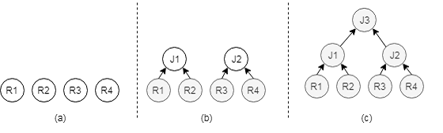
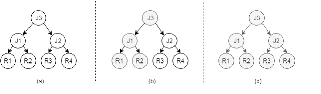

# Core Technologies of openGauss Database \(II\)

## Overview

Previously, we have introduced the principles of SQL parsing and query rewriting in query optimization. Now, we will introduce the technical principles of path search and cost estimation.

## Path Search

The core problem of the optimizer is to obtain the optimal solution for an SQL statement. In this process, the solution space corresponding to the SQL statement needs to be enumerated, that is, different candidate execution paths need to be enumerated. These execution paths are equivalent to each other, but the execution efficiency is different. Execution costs of these execution paths in the solution space are calculated, and finally an optimal execution path may be obtained. Based on different methods for searching for candidate execution paths, the structure of the optimizer is divided into the following modes:

**Bottom-up Mode**

As shown in the preceding figure, in bottom-up mode, the logical execution plan is split. A table scan operator is created first, and then a connection operator is formed by the scan operator. Finally, a physical execution plan is formed. In this process, there are multiple types of physical scan operators and physical join operators. Therefore, multiple physical execution paths are generated. The optimizer selects an execution plan with the lowest cost based on the estimated cost of each execution path, and then transfers the execution plan to the executor for execution.

**Top-down Mode**

As shown in the preceding figure, this mode uses the object-oriented idea to objectify the core functions of the optimizer and generate a logical plan after lexical analysis, syntax analysis, and semantic analysis. Based on the logical plan, an object-based optimization rule is applied to generate a plurality of to-be-selected logical plans. The logical plans are traversed by using a top-down method, and an optimal execution path is obtained by combining dynamic planning, cost estimation, and branch and bound technologies.

- Random Search Mode

  Regardless of the bottom-up or top-down mode, the enumeration time is too long when a large number of tables are joined. Some optimizers search for paths through random enumeration when there are a large number of tables, an attempt is made to obtain a suboptimal execution plan in a random solution space.

  Currently, the optimizers of databases such as MySQL and PostgreSQL use the bottom-up mode, and the optimizers of SQL Server and open-source Calcite and ORCA use the top-down mode. Calcite is widely used in other open source projects, such as Apache Storm, Apache Flink, Apache Kylin, Apache Drill and SQL-Gremlin, due to its good scalability. The openGauss uses a combination of a bottom-up mode and a random search mode.

  Regardless of the top-down or bottom-up mode, a search process is also a process of transforming from a logical execution plan to a physical execution plan. For example, there may be different scan operators for each table, the logical connection operator may also be converted into a plurality of different physical join operators. The following describes a specific physical operator.

- Single-table Scan Path Search

  The openGauss uses the bottom-up path search method. Therefore, the path generation always starts from the single-table access path. There are two types of single-table access paths:

  ◾ Full table scan: Data in a table is accessed one by one.

  ◾ Index scan: Indexes are used to access data in tables. Generally, indexes are used together with predicates.

  The optimizer first estimates the cost of different scan paths based on the data volume, filter condition, and available indexes of the table and the cost model. For example, if **CREATE TABLE t1\(c1 int\)** is defined for a table and the data in the table is consecutive integers ranging from 1 to 100000000 and there is a B+ tree index in the c1 column, **SELECT \* FROM t1 WHERE c1=1;** can obtain data by reading one index page and one table page. However, for a full table scan, 100 million data records need to be read to obtain the same result. In this case, the path of the index scan wins.

  Index scan is not superior to full table scan in all cases. Their advantages and disadvantages depend on how much data can be filtered out. Generally, a database management system uses a B+ tree to create an index. If the selectivity is high, the B+ tree index causes a large number of random I/Os, this reduces the access efficiency of the index scan operator. For example, for the **SELECT \* FROM t1 WHERE c1\>0** statement, an index scan needs to access all data in the index and all data in the table, causing a large number of random I/Os. However, a full table scan only needs to access all data in the table in sequence. Therefore, the cost of a full table scan is lower.

- Multi-table Join Path Search

  The difficulty in generating multiple table paths lies in how to enumerate all table join orders and join algorithms. Assume that two tables t1 and t2 are joined. According to the commutative law in relational algebra, the join order can be t1 x t2 or t2 x t1, and the physical join operators can be hash join, nested loop join, or merge join. In this way, there are six paths available for selection. This number increases exponentially as the number of tables increases. Therefore, an efficient search algorithm is very important.

  openGauss usually uses the bottom-up path search mode. It first generates the scan path of each table. These scan paths are at the bottom layer \(first layer\) of the execution plan. At the second layer, the optimal path for joining two tables is considered, that is, the possibility of joining every two tables is calculated through enumeration. At the third layer, the optimal path of the three-table join is considered. That is, the possibility of the three-table join is calculated through enumeration. The global optimal execution plan is generated until the top layer. Assume that the JOIN operation is performed on four tables. The join path generation process is as follows:

  ◾ Optimal path of a single table: The optimal paths of \{1\}, \{2\}, \{3\}, and \{4\} tables are generated in sequence.

  ◾ Optimal path of two tables: The optimal paths of \{1 2\}, \{1 3\}, \{1 4\}, \{2 3\}, \{2 4\} and \{3 4\} tables are generated in sequence.

  ◾ Optimal path of three tables: The optimal paths of \{1 2 3\}, \{1 2 4\}, \{2 3 4\} and \{1, 3, 4\} tables are generated in sequence.

  ◾ Optimal path of four tables: The optimal path of \{1, 2, 3, 4\} is the final path.

  The core of the multi-table path problem is join order, which is a nondeterministic polynomially \(NP\) problem. To find an optimal path in multiple relational joins, a commonly used algorithm is a cost-based dynamic planning algorithm. As the number of joined tables increases, the expansion of table search space affects the path selection efficiency of the optimizer. The cost-based genetic algorithm and other random search algorithms can be used to solve this problem.

  In addition, to prevent the search space from being too large, the following pruning policies can be used:

  ◾ Consider the paths with join conditions first and delay the Cartesian product as much as possible.

  ◾ In a search process, perform LowBound pruning on an execution path based on cost estimation, and abandon some execution paths with relatively high costs.

  ◾ Retain execution paths with special physical attributes. For example, results of some execution paths are sequential, and these execution paths may avoid re-sorting in a subsequent optimization process.

  Optimization Based on Physical Attributes

  A relationship can be regarded as a set or a package. The data structure does not set the data distribution. To improve the computing performance, some data structures or algorithms need to be used to preprocess the data distribution. These preprocessing methods use the physical attributes \(such as order\) of the physical execution path, or create physical properties for physical execution paths, which often play a significant role in query optimization.

## B+ Tree

The simplest way to query data in a table is to traverse all the data in the table. However, as the data volume increases, the cost of traversing the data in the table increases. The B+ tree becomes a powerful weapon for efficient data query.

In 1970, R. Bayer and E. McCreight proposed a balanced tree for external search, that is, B-tree. The B-tree is to create a directory on the table data, which is similar to the content in a book. In this way, you can quickly locate the data to be queried.

As a data structure, the B+ tree is not directly related to the query optimizer. However, the database management system usually establishes an index based on the B+ tree. In the query optimization process, the query efficiency can be improved through index scanning and bitmap scanning, this involves the use of indexes of the B+ tree type.

## Hash Table

A hash table is also a method of preprocessing data. The openGauss database uses hash tables in multiple places or borrows the idea of hash tables to improve query efficiency.

◾ The hash table can be used to implement the grouping operation because the hash table has the function of classifying data.

◾ A hash index can be created by using the hash algorithm. This index is applicable to equivalent constraints.

◾ Hash join is an important physical join path.

## Sorting

Sorting is also a method of preprocessing data. It is mainly used in the following aspects:

◾ Sorting can be used to group data because the same data is aggregated after sorting.

◾ The B-tree index needs to be created through sorting.

The physical join path Merge Join needs to be implemented through sorting.

The ORDER BY operation in the SQL language needs to be implemented through sorting.

◾ When the data volume is small, all data can be loaded to the memory. In this case, internal sorting can be used. When the data volume is large, external sorting is required. Therefore, the sorting cost needs to be determined based on the data volume and available memory size.

## Materialization

Materialization is to save the result of the scan or join operation. If the intermediate result is large, the result may need to be written to the external memory, which causes the I/O cost. Therefore, the saving cost is high.

The advantage of materialization is that if the internal table can be read once and used for multiple times, the intermediate result can be saved and used for multiple times. For example, table t1 and table t2 are joined. If table t2 is used as the internal table and is scanned, only 5% of the data is used as the intermediate result, if the other 95% data is filtered out, you can materialize the 5% data. In this way, each tuple in the t1 table is joined to only the 5% data. Whether the intermediate result is materialized depends on the cost estimation model. Generally, when a physical path is generated through physical optimization, the cost is estimated for both the materialized and non-materialized paths, and the path with a lower cost is finally selected.

## Cost Estimation

The optimizer enumerates candidate execution paths based on the generated logical execution plan. To ensure efficient execution, the optimizer needs to select the path with the lowest cost and highest execution efficiency from these paths. How to evaluate the execution cost of these plan paths becomes critical. Cost estimation is to complete this task. Based on the collected data statistics, cost estimation models are established for different planned paths to evaluate the costs and provide input for path search.

- Statistics

  Statistical information is a cornerstone for estimating the path cost of a plan, and accuracy of the statistical information plays an important role in row count estimation and cost estimation in a cost estimation model, and directly affects an advantage and a disadvantage of a query plan. openGauss allows you to use the ANALYZE statement to collect statistics on the entire database, a single table, a column, and multiple correlated columns.

  Statistics directly affect the accuracy of cost estimation. Therefore, the frequency of collecting statistics is a sensitive parameter. If the frequency of collecting statistics is too low, the statistics will be delayed. On the contrary, if the frequency of collecting statistics is too high, the query performance will be affected indirectly.

  Generally, the database management system provides a method for manually collecting statistics. The openGauss supports statistics collection by running the ANALYZE command. In addition, the database management system automatically determines whether to re-collect statistics based on data changes. For example, when the number of frequent data updates in a table exceeds a threshold. In this case, you need to automatically update the statistics of the table. During query optimization, if the optimizer finds that the statistics data is severely delayed, the optimizer can also initiate statistics collection.

  Table-level statistics include the number of tuples \(N\) and the number of pages occupied by the table \(B\). Column-level statistics include the attribute width \(W\), maximum value \(Max\), minimum value \(Min\), and most common value \(MCV\). Generally, a histogram \(H\) is created for each column. The data in the column is displayed in a histogram based on the range, which facilitates the calculation of the selectivity.

  Histograms, such as the height-balanced histogram, frequency histogram, and multi-dimensional histogram, may present data distribution from different angles. openGauss uses height-balanced histograms, and each column of the histogram represents a same frequency.

- Selection Rate

  Based on the statistics, the cost estimation system can know how many rows of data exist in a table, how many data pages are used, and the frequency of a value. Then, the cost estimation system can calculate how much data can be filtered out by a constraint \(for example, the WHERE condition in an SQL statement\). The ratio of the data filtered by this constraint to the total data volume is called the selectivity. Selectivity = Number of tuples after the constraint is filtered/Number of tuples before the constraint is filtered. The constraint may be formed by an independent expression, or may be a conjunctive normal form or disjunctive normal form formed by multiple expressions. For an independent expression, a selectivity needs to be calculated according to statistics information, conjunctive normal form and disjunctive normal form obtain the selectivity by means of probability calculation.

  Conjunctive normal form: P\(A and B\) = P\(A\) + P\(B\) – P\(AB\); disjunctive normal form: P\(AB\) = P\(A\) × P\(B\)

  Assume that the selectivity needs to be calculated for the constraint A \> 5 AND B < 3. First, the selectivity needs to be calculated for A \> 5 and B < 3. Because the statistics of columns A and B are available, the proportion of data whose value is greater than 5 in column A can be calculated according to the statistics. Similarly, the selectivity of column B can be calculated. Assume that the selectivity of A \> 5 is 0.3 and that of B < 3 is 0.5. The selectivity of A \> 5 AND B < 3 is calculated as follows:

  P\(A\>5 and B<3\)

  = P\(A\>5\) + P\(B<3\) – P\(A\>5\)×P\(B<3\)

  = 0.3 + 0.5 – 0.3×0.5

  = 0.65

  Due to the diversity of constraints, the calculation of the selectivity usually encounters some difficulties. For example, in the calculation process of the selectivity, it is usually assumed that multiple expressions are "independent" of each other, but in an actual situation, a function dependency relationship may exist between different columns. In this case, the selectivity may be inaccurate.

- Cost Estimation Method

  The optimizer of openGauss is a cost-based optimizer. For each SQL statement, openGauss generates multiple candidate plans, calculates an execution cost for each plan, and selects the plan with the lowest cost. After a constraint determines the selectivity, the number of rows that need to be processed for each plan path can be determined, and the number of pages that need to be processed can be calculated according to the number of rows. When a plan path processes a page, an I/O cost is generated. When a plan path processes a tuple \(for example, expression calculation is performed on the tuple\), a CPU cost is generated. Therefore, an overall cost of a plan may be expressed as follows:

  Total cost = I/O cost + CPU cost

  openGauss defines the cost of scanning a page in sequence as 1 and normalizes the cost of all other operators to 1. For example, if the cost of scanning a random page is defined as 4, it is considered that the cost of scanning a random page is four times the cost of scanning a page sequentially. For another example, if the cost of processing a tuple by the CPU is 0.01, it is considered that the cost required for processing a tuple by the CPU is 1% of the cost required for sequentially scanning a page. From another perspective, openGauss divides costs into startup costs and execution costs.

  Total cost = Startup cost + Execution cost

  Startup cost: indicates the cost required from the time when an SQL statement is executed to the time when the operator outputs the first tuple. Some operators have low startup costs. For example, the scan operator on the base table can output tuples once it starts to read data pages. Therefore, the startup cost is 0. Some operators have relatively high startup costs. For example, the sorting operator needs to read all outputs of lower-layer operators, and output the first tuple only after sorting these tuples. Therefore, the startup cost of the sorting operator is relatively high.

  Execution cost: indicates the cost required from the time when the first tuple is output to the time when the query ends. The cost may further include a CPU cost, an I/O cost, and a communication cost. A size of the execution cost is related to an amount of data that needs to be processed by an operator, and is related to a function completed by each operator. The larger the amount of data to be processed and the heavier the task to be completed by the operator, the higher the execution cost.

  Total cost: Cost estimation is a bottom-up process. The cost of the scan operator is estimated first, and then the cost of the connection operator and the cost of the non-SPJ operator are estimated based on the cost of the scan operator.

- Notes

  1. Selection-Projection-Join \(SPJ\): The basic three operators in relational algebra are SELECTION, PROJECTION, and JOIN.

  SELECTION: In **SELECT XXX FROM T WHERE XX = 5**, the WHERE filter condition indicates a select operation.

  PROJECTION: In **SELECT c FROM t**, selecting column c indicates a projection operation.

  JOIN: In **SELECT xx FROM t1, t2 WHERE t1.c = t2.c**, tables t1 and t2 are joined.

  2. Non-SPJ: Operators other than the SPJ operators, such as SORT, AGGREGATION, and UNION/EXCEPT.

## Summary

This document describes the basic functions and principles of each module of the SQL engine in terms of SQL parser, query rewriting, cost estimation, and path search. You can further understand the optimizer optimization technology based on the analysis of specific SQL optimization cases.
