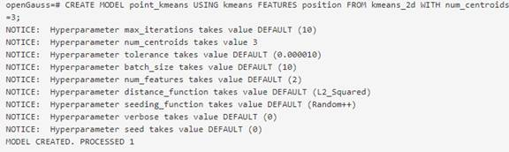
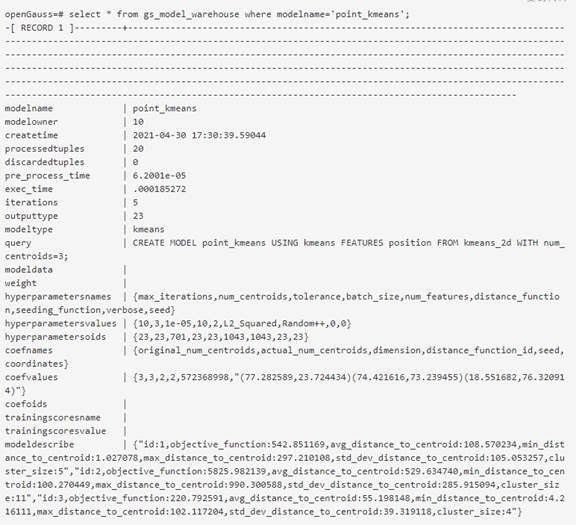
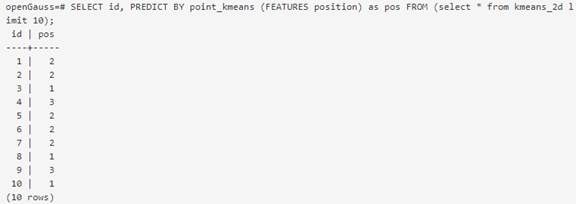

# DB4AI: Enabling Database Native AI Computing and Facilitating Service Success in the Data Lake Scenario<a name="ZH-CN_TOPIC_0000001251306649"></a>

DB4AI tries to embed AI computing capabilities into databases to help users get rid of tedious data migration, export, and management. It sounds reasonable to use a database to store massive data. However, when using a traditional database, users who are algorithm engineers or AI beginners have to export data from a dataset and then import it to the AI computing framework for their computing tasks. Data migration is troublesome and costly. The most direct method is to write the exported data to a file. Before an AI computing task is executed, the program reads data from a file and feeds the data to the model for training.

Here are some obvious challenges:

- 1. Data security:

  Data carriers that are separated from the database do not have protection measures such as permission restriction and privacy protection. The risk of data deletion and tampering is greatly increased. In some fields, such as finance and healthcare, data involves sensitive information. During data migration, data needs to be masked to degrade sensitive information.

- 2. Data migration cost:

  In AI computing, analysts and algorithmists need to focus on model design and model computing verification, instead of spending costs on data migration and sharing. However, the time and computing costs of exporting massive amount of data are inevitable.

- 3. Data version management:

  Data is added, deleted, modified, and queried in both the AP and TP databases. For online learning, how do we capture new data in real time? For offline learning, how do we detect data distribution changes in a dataset in time? To cope with these two questions, the traditional processing methods require more data management and control. When data drift occurs, users need to update the dataset to maintain data validity. In this case, the cost is increased. In addition, users need to store datasets of different versions based on different data processing methods and filter criteria. This further increases storage costs.

The preceding problems do not exist in databases with DB4AI. A database is equipped with an AI framework to reduce the data migration costs. All computing processes are completed in the database. By eliminating the data migration process, DB4AI programmatically avoids the preceding problems.

The following describes how to use the openGauss native AI framework:

- 1. DB4AI-snapshot: data version control.

  DB4AI-Snapshots is a DB4AI feature used to manage dataset versions. Datasets are fixed by using snapshots and classified into the materialized snapshot \(MSS\) mode which uses the materialization algorithm to store data entities of original datasets, and the computed snapshot \(CSS\) mode which uses the relative calculation algorithm to store incremental data information. Compared with the MSS mode, the CSS mode greatly reduces the space usage.

  This function involves the CREATE, PREPARE, SAMPLE, PUBLISH, and PURGE operations. Examples of some operations are as follows:

  - Create a snapshot.

    ```
    openGauss=# create snapshot s1@1.0 comment is 'first version' as select * from t1;
    schema |  name
    --------+--------
    public | s1@1.0
    (1 row)
    ```

  - \(2\) Sample a snapshot.

    0.3 is used as the sampling rate, sampling is performed on the basis of the snapshot s1@1.0.0, and a suffix '\_sample1' is added to the generated sub-snapshot.

    ```
    openGauss=# SAMPLE SNAPSHOT s1@1.0 STRATIFY BY id AS _sample1 AT RATIO .3;
     schema |      name
    --------+----------------
     public | s1_sample1@1.0
    (1 row)
    ```

    This function can be used to generate a test set and a training set during AI computing. For example, in the following syntax, sampling is performed in the ratio of 2:8.

    ```
    openGauss=# SAMPLE SNAPSHOT s1@1.0 STRATIFY BY id AS _test AT RATIO .2, AS _train AT RATIO .8;
     schema |     name
    --------+--------------
     public | s1_test@1.0
     public | s1_train@1.0
    (2 rows)
    ```

  - \(3\) Publish a snapshot.

    In the snapshot feature, other states except the released state cannot be involved in AI computing. If the data in the current snapshot is available, you can publish a snapshot to change the snapshot state. You can view the state of the snapshot in the **db4ai.snapshot** system catalog.

    ```
    openGauss=# openGauss=# select * from db4ai.snapshot;
     id | parent_id | matrix_id | root_id | schema |      name      | owner |          commands           |    comment    | published | archived |          c
    reated           | row_count
    ----+-----------+-----------+---------+--------+----------------+-------+-----------------------------+---------------+-----------+----------+-----------
    -----------------+-----------
      0 |           |           |       0 | public | s1@1.0         | owner    | {"select *","from t1",NULL} | first version | t         | f        | 2021-09-16
     17:15:52.460933 |         5
      1 |         0 |           |       0 | public | s1_sample1@1.0 | owner    | {"SAMPLE _sample1 .3 {id}"} |               | f         | f        | 2021-09-16
     17:19:12.832676 |         1
      2 |         0 |           |       0 | public | s1_test@1.0    | owner    | {"SAMPLE _test .2 {id}"}    |               | f         | f        | 2021-09-16
     17:20:46.778663 |         1
      3 |         0 |           |       0 | public | s1_train@1.0   | owner    | {"SAMPLE _train .8 {id}"}   |               | f         | f        | 2021-09-16
     17:20:46.833184 |         3
    (4 rows)
    ```

  - \(4\) Purge a snapshot.

    ```
    openGauss=# PURGE SNAPSHOT s1_sample1@1.0;
     schema |      name
    --------+----------------
     public | s1_sample1@1.0
    (1 row)
    ```

- 2. DB4AI native AI syntax: used for model training and inference

  This function uses the query syntax to complete AI computing tasks. Currently, AI operators are added to the openGauss database. The operators are added to the execution plan to fully utilize the computing capability of the database to complete model training and inference tasks.

  Currently, the DB4AI engine in openGauss supports four algorithms: logistic regression, linear regression, and support vector machine classification, and K-means clustering algorithms.

  The CREATE MODEL and PREDICT BY syntaxes are used for model training and inference.

  CREATE MODEL: used for model training. After a model training task is complete, the syntax saves the trained model information to the **gs_model_warehouse** system catalog in the database. You can view the model information by viewing the system catalog at any time. The system catalog stores not only the model description information but also the model training information.

PREDICT BY: used for inference. The database searches a system catalog for a model based on the model name and loads the model to the memory. The database inputs the test data into the memory model for inference and returns the result in the form of a temporary result set.

The following is a simple example:

- \( 1\). Run **CREATE MODEL** for training.

  The K-means clustering algorithm is used as an example.

  

  The training syntax consists of four parts: model name, algorithm type, training set, and hyperparameter setting.

  The training set supports the input of tables, views, and subqueries. You only need to run one query statement to set model hyperparameters and specify the training set. The subsequent steps include data input and model saving, which are automatically completed by the database.

  When the training task is complete, the database prints a success message.

  The model has been written into the **gs_model_warehouse** system catalog. You can view the model information by querying the table.

  

- \(2\) Run **PREDICT BY** for inference.

  Use the saved model to perform inference tasks. An example is provided as follows:

  

  In the PREDICT BY syntax, you only need to specify the model name, test set, and feature name to complete the inference task.

- Summary and Prospect

  DB4AI has always been a popular topic in the database field. By making databases intelligent, you can lower the threshold and cost in the AI computing process, and further release the computing resources of the database. Big data and AI computing are good partners, so databases for big data storage should not be independent of this system. The effective combination of the two not only facilitates the AI computing process, but also increases the possibility of optimizing the database performance.

  The native AI framework of the open-source openGauss database is evolving, and there must be many shortcomings. However, the vision of "all things intelligent" inspires countless R&D engineers to move forward.

  When you pursue your goal, do not stop. There is a long way to go.
