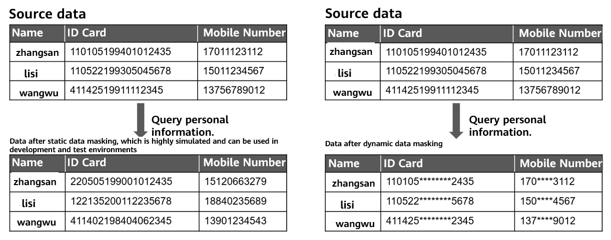
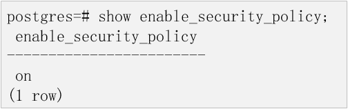
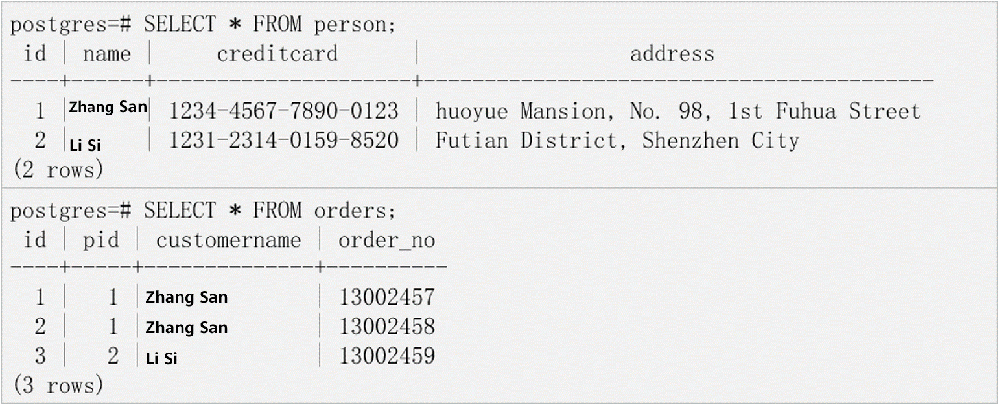
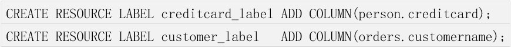
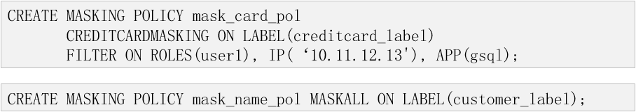
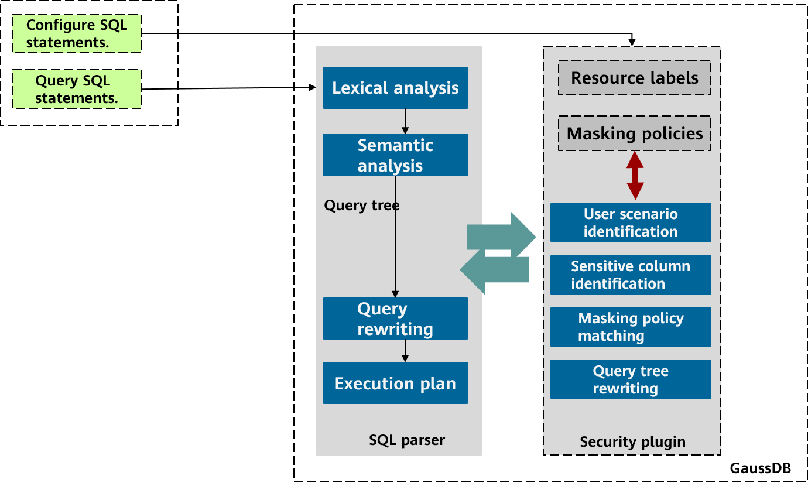
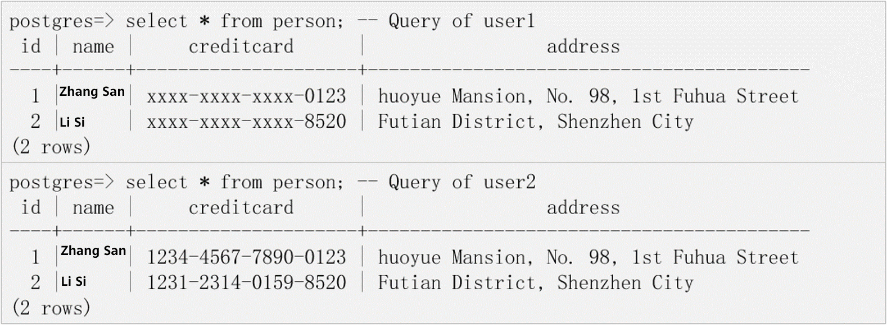
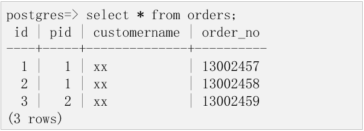
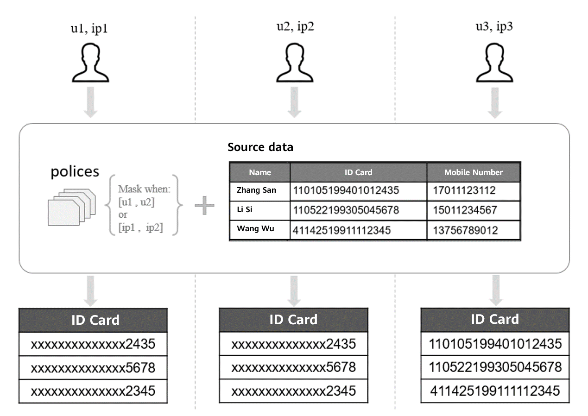
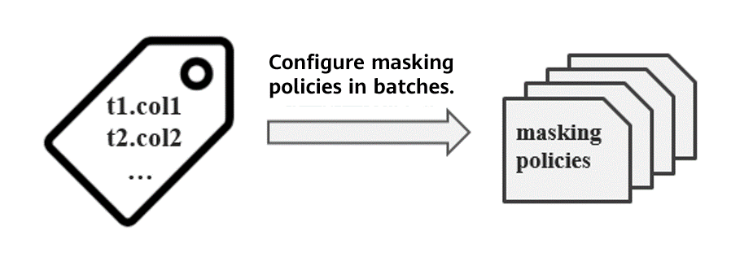

# Dynamic Data Masking of openGauss

## 1 Background and Introduction

- 1.1 Background of Data Masking

  With the rapid development and popularization of emerging technologies, such as Internet big data and cloud services, different data application modes, such as service cloudification, centralized data storage, and data sharing, have become the trend of future development. Cloud databases and cloud computing services are featured with easy deployment, low cost, high efficiency, and high reliability. As such, more and more consumers tend to store their personal data in the cloud rather than in personal portable hard disks. Actually, as data application scenarios become more complex, the risk of personal privacy data leakage and theft is increasing. In recent years, several major database information leakage events have occurred, which poses higher requirements for database security.

  Data masking is to process sensitive data by transforming or shielding the data or by other ways, aiming to protect privacy data and prevent data leakage and malicious snooping. When an enterprise or organization collects sensitive data, such as personal identity data, mobile phone numbers, and bank card numbers, and then exports the data \(in a non-production environment\) or directly queries the data \(in a production environment\), the data must be masked according to privacy protection laws and regulations.

- 1.2 Introduction to Data Masking

  Data masking is classified into static data masking and dynamic data masking. In static data masking, data is masked before being distributed. Generally, data in the production environment is copied to the test environment or development library. Then, the exported data replaces the original data. In this way, the masked data becomes the source data for test and development. Dynamic data masking is closely related to the production environment and is mainly used in scenarios where production data is directly accessed. In dynamic data masking, sensitive data is masked in real time when it is accessed, and the consistency and validity of the source data can be guaranteed.

  **Figure 1-1** Static and dynamic data masking

  

  Dynamic data masking and static data masking are applicable to different scenarios. You can select one based on the application scenario. The latest openGauss officially supports dynamic data masking. The following sections describe the dynamic data masking mechanism of openGauss.

  Currently, the mainstream dynamic data masking technology is achieved by two paths, that is, result set parsing and statement rewriting.

  - Result set parsing: The statements sent to the database are not rewritten and the data table structure needs to be obtained in advance. After the database returns the result, the data to be masked in the set is identified based on the table structure and the result data records are modified one by one.
  - Statement rewriting: The query statements that contain sensitive columns are rewritten. Outer nested functions are used to rewrite the sensitive columns involved in the query so that the database returns result sets that do not contain sensitive data when running query statements.

  In terms of performance, result set parsing requires that columns be parsed, rules be matched, and data be masked after the database returns the result set. Each row of data records in the result set needs to be modified one by one. Therefore, the masking time is linearly related to the result set capacity, and the overall performance loss is large. In contrast, if you choose statement rewriting, short query statements can be parsed and rewritten, and a masking function can be embedded outside sensitive columns in the statements. When executing commands, the database automatically executes the masking function to mask data, and then the returned result set is the masked data. In this method, only one query statement is rewritten and the result set is not parsed. As such, the performance loss can be greatly reduced. openGauss adopts the statement rewriting method. The performance loss of masking 100,000 pieces of sensitive data records is less than 5%.

  In addition, for complex commands, query columns generally contain a large number of columns with the same name, table aliases, and nested queries. If you use result set parsing, you need to map the result set to the actual query column to identify whether a column needs to be masked. The more complex the query is, the more difficult the identification is, causing lower matching accuracy. In contrast, if you use statement rewriting, you can accurately nest masking functions for columns involved in complex queries.

  Based on the preceding analysis, data masking based on statement rewriting is a desirable solution in terms of both performance and accuracy. By using statement rewriting, openGauss identifies the target node of the query tree based on the user-defined masking policy after the query tree is obtained through query parsing. In addition, openGauss rewrites the node to be masked, constructs the masking query tree, and sends the query tree to the database kernel for execution. Then, the masked data is returned.

## 2 Dynamic Data Masking Solution of openGauss

In the industry, the dynamic data masking function is usually loaded as a middleware plug-in or a data masking system. It is used to mask data by intercepting commands or result sets between the database on the client and that on the server. openGauss has the built-in dynamic data masking feature, so that the database can mask data without using external plug-ins, effectively reducing the risk of sensitive data leakage during data transmission.

openGauss has defined a complete built-in security policy model from version 1.1.0. Based on the model, users can define resource labels to identify sensitive data and define related security policy mechanisms for different resource label types and content. Dynamic data masking is one of the security policy mechanisms.

- 2.1 Built-in Security Policy

  The built-in security policy model identifies and protects user behaviors by configuring a series of security policies, providing the capabilities of protecting sensitive user data.

  Resource labels are the basis of the security policy model. It is a collection of database resources in essence. To manage database resources in a unified manner, a data manager can add multiple database resources to the same resource label and configure policies for the resource label to manage database resources in batches.

  For example, if multiple data tables contain sensitive data columns such as **creditcard** which indicates a bank card number, these columns can be classified into the **creditcard_label** resource label in a unified manner, and then the administrator can configure data masking policies for the **creditcard_label** resource label to implement batch configurations for all related sensitive columns.

  Dynamic data masking is a security policy supported by the security policy model. After identifying sensitive data in user tables \(sensitive data discovery and identification are not within this scope\), the data controller configures data masking policies for resource labels that contain sensitive columns and restrict users' data access and information extraction behaviors based on different application scenarios to protect sensitive data.

  In general, resource labels are used to classify database resources and put these resources into various security policies for management. The dynamic data masking feature uses resource labels to identify sensitive data and matches masking policies to mask sensitive data.

- 2.2 Core Idea of Dynamic Data Masking

  The dynamic data masking feature of openGauss is deployed together with the database as a built-in security plug-in. No additional adaptation is required for services. The security policy module of openGauss is responsible for parsing SQL statements and matching masking policies, and the service takes effect after masking policies are configured.

  **Configuring Masking Policies**

  The configuration of a masking policy involves masking functions, resource labels, and masking filters.

  - Masking functions indicate the methods used by a masking policy to mask target columns. Currently, openGauss provides seven masking functions, namely, **creditcardmasking**, **basicemailmasking**, **fullemailmasking**, **alldigitsmasking**, **shufflemasking**, **randommasking**, and **maskall**. They are applicable to different masking scenarios.
  - Resource labels are a set of labels on which a masking policy takes effect. If a target column in a query exists in a label, sensitive data of the column will be masked based on the masking policy. Please note that the dynamic data masking feature of openGauss can mask labels that contain only data columns.
  - Masking filters specify the user scenarios where a masking policy takes effect and mainly involve usernames, login clients, and IP addresses of users. The data masking policy takes effect only when a query user meets the threshold specified by a masking filter.

  The following example shows how to create a dynamic data masking policy.

  **Data Preparation**

  Check whether the built-in security policy is enabled.

  

  Prepare two tables containing the sensitive columns **creditcard** and **customername**.

  

  **Policy Configuration**

  Log in to the database as a policy administrator \(with the **poladmin** permission\) and add the sensitive columns in the two data tables to the resource labels **creditcard_label** and **customer_label** for management.

  

  Create the following two masking policies:

  - **mask_card_pol**: Columns in the **creditcard_label** label are masked by using the **creditcardmasking** function only when the **user1** user uses gsql to access the tables using the IP address 10.11.12.13.
  - **mask_name_pol**: By default, columns in the **customer_label** label are masked by using the **maskall** function for all query users.

    

  **Triggering Data Masking Policies**

  When the system receives a query command, **security_plugin** intercepts the query tree generated by the semantic analysis in the parser and selects the masking policy that is applicable to the user scenario based on the user login information \(username, client, and IP address\). The masking policy is configured based on resource labels \(containing only table columns\). Therefore, you need to identify whether the target node of the query tree belongs to a resource label, match the identified resource label with the masking policy, and rewrite the target node of the query tree based on the policy content. Then, the query tree is returned to the parser.

  Due to the built-in masking function of the query tree in the **security_plugin** module, data visitors are unaware of the process of rewriting the query tree by using the built-in security policy. They access data in the same way as executing a common query with data privacy protected.

  **Figure 2-1** Dynamic data masking architecture of openGauss

  

  Based on the cases described in section "Configuring Masking Policies", you can query the data table to trigger the masking policy.

  **Trigger the data masking policy.**

  If the **user1** user uses gsql to log in to the database and query sensitive data in compliance with the **mask_card_pol** policy, the system returns the masked data. However, the **user2** user does not comply with the policy. Therefore, the data queried by this user is not masked.

  

  When the **user1** user or the **user2** user queries the **order** table, the **mask_name_pol** masking policy is triggered. Therefore, the **customername** column is masked.

  

## 3 Advantages of openGauss Dynamic Data Masking

The dynamic data masking feature of openGauss focuses on identifying users who access data. Masking filters are configured based on a specified user, client tool, and login IP address. The policy administrator can flexibly formulate different masking policies based on different services and user scenarios and is granted with different levels of sensitive data access capabilities to adapt to various complex production environments. For example, in the finance and healthcare industries, counter service personnel can view only some information about ID cards and bank cards, while O&M administrators can query and maintain all user information. On the premise of ensuring the diversity of masking scenarios, the system performs a strict mutual exclusion check when a masking filter is specified. This prevents ambiguity in selecting policies when a user complies with multiple masking filters at the same time.

**Figure 3-1** Data masking of openGauss based on filter criteria

The dynamic data masking feature of openGauss focuses more on batch management of database resources. In the security policy model, database resources to be managed and controlled are classified into labels. Operations on labels are operations on a specified cluster of resources, which greatly simplifies the management process and improves management efficiency. The dynamic data masking feature of other databases is based on a single column or table. The masking policy corresponds to the database resource. Even if you want to use the same masking function, you need to configure multiple masking policies for different database resources, which increases the policy configuration cost as well as the difficulty in subsequent O&M and batch resource policy management. Therefore, allocating database resources to be managed in batches to resource labels is the basis and one of the advantages of the dynamic data masking feature of openGauss.

**Figure 3-2** Batch policy configuration for openGauss resource labels

The openGauss kernel is equipped with dynamic data masking, which ensures the security of data transmission paths to some extent. However, external plug-ins may be bypassed. After an external plug-in rewrites the SQL statements sent from the client or the result set returned by the server, attackers can bypass the plug-in to directly send SQL statements to the database or intercept the source data result set returned by the database. As a result, the masking plug-in becomes invalid. Therefore, compared with masking by using external plug-ins, the dynamic data masking feature of openGauss can reduce the risk of sensitive data leakage on the transmission path to some extent.

Combined with the production environment, the purpose of dynamic data masking is to mask sensitive data in the result set. The service side provides query interfaces, and then the interfaces trigger data masking. To ensure the security of sensitive data, openGauss is adapted to masking policies in most scenarios, including addition, deletion, and modification operations with returned values, MERGE INTO statements, common table expressions \(CTEs\), and subqueries. In this way, the interfaces for the service side to perform operations on sensitive data are enriched, instead of providing only data query interfaces.

To improve usability, openGauss provides a set of simple policy configuration syntaxes, covering the addition, deletion, and modification of resource labels and masking policies. You can use the definition syntax to easily configure masking policies, simplifying the operation process for administrators.

## 4 Prospect of openGauss Dynamic Data Masking

The dynamic data masking feature of openGauss provides a simple and flexible policy configuration solution to prevent user privacy data from being disclosed to some extent. It is an indispensable part of the multi-layer security defense architecture of openGauss.

In the future, the dynamic data masking feature of openGauss will provide more flexible policy configuration methods, such as user-defined function \(UDF\) masking and conditional masking, to support more flexible and rich privacy protection scenarios.
