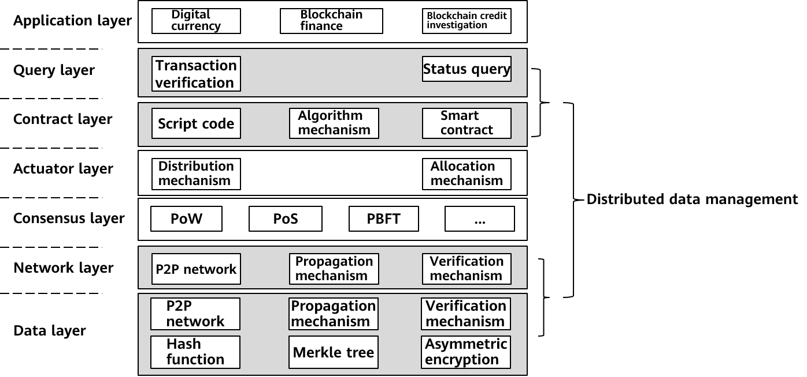
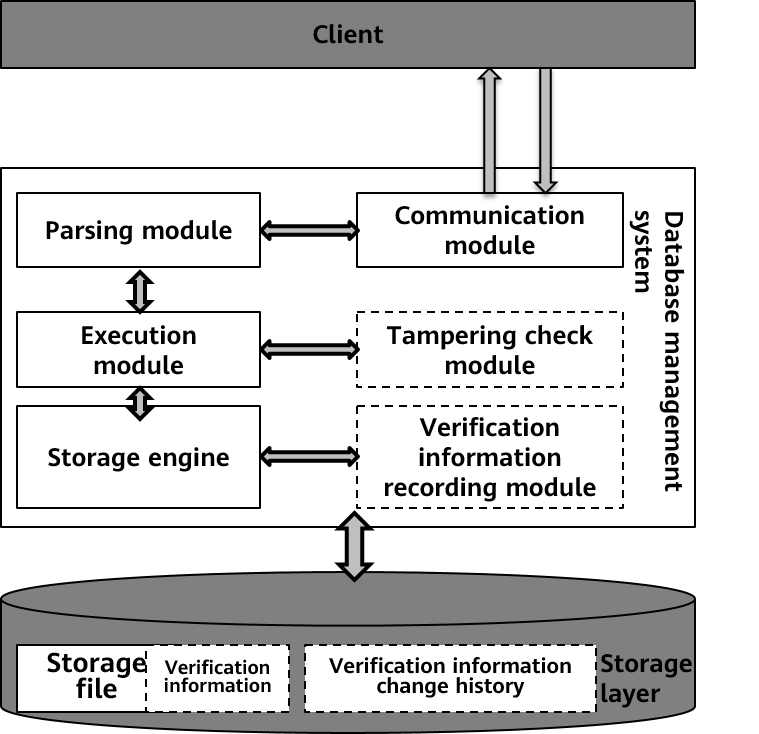
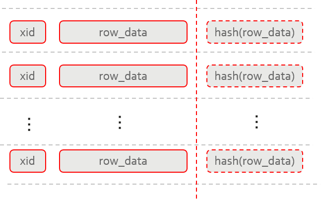
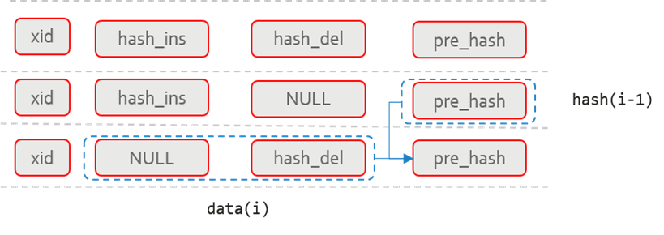
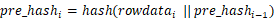
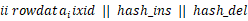
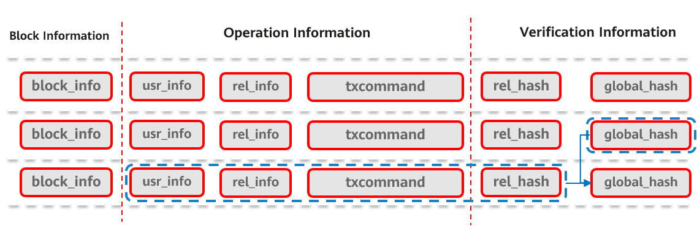
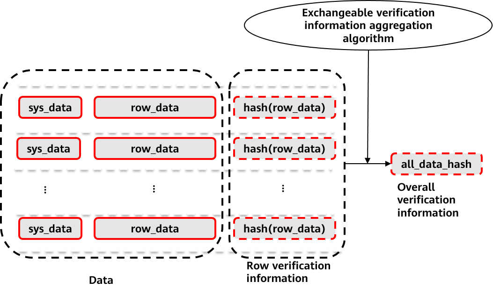
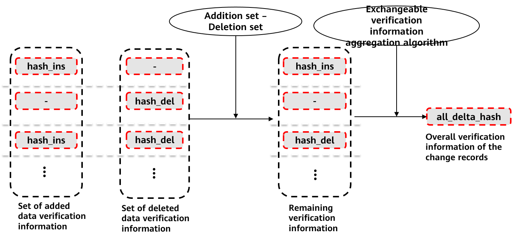

# Everything You Want to Know About the openGauss Ledger Database

## 1 What Is a Ledger Database?

Coins such as bitcoin, ethereum, and dogecoin, as synonyms of the blockchain, not only affect the profit and loss of some people's accounts, but also affect the prices of graphics cards and hard disks. However, as database-related technical personnel or enthusiasts, we are more concerned about the core technology.

As a distributed ledger technology, blockchain overcomes the disadvantages of traditional centralized ledgers, such as low storage efficiency, low reliability, and vulnerability to single-point attacks, and technically ensures that the blockchain features distributed sharing, multi-party consensus, tamper-proof, and traceability.

Then, can we use blockchains to replace databases? The answer is no. The blockchain has many disadvantages, such as low transaction performance and inconvenient query. The bitcoin system can process seven transactions per second. If it is used to process major bank transactions, the efficiency will be very low. The openGauss database features high efficiency, high reliability, and high security. We can start from openGauss and integrate some blockchain technologies such as cryptography tamper-proof and multi-party consensus, to improve the tamper-proo and traceability capabilities of the database. The idea of the ledger database comes into being.

A blockchain is usually divided into seven layers in terms of the architecture model: application layer, query layer, contract layer, actuator layer, consensus layer, network layer, and data layer. The following figure shows the technical points of each layer.

Figure 1 Blockchain infrastructure model

The database absorbs the tamper-proof capability of the blockchain. Naturally, the idea is to start from the bottom layer of the blockchain technology. At the data layer, the database provides the capability of recording data verification information and verifying data tampering. This ensures that the database can faithfully record data changes caused by each transaction when processing sensitive information, forming a faithful and complete data change ledger. The openGauss ledger database that we will introduce this time is to record data change operations when data is modified in the openGauss kernel, ensuring that the entire data link can be queried and traced. In addition, an efficient tampering check API is provided for the upper-layer application system or multiple parties to verify data consistency. In the next chapter, we will introduce the implementation principle of the ledger database and the reconstruction of the openGauss.

## 2 Principles of the openGauss Ledger Database

Figure 2 New modules in the ledger database

When a client sends an SQL statement to modify data in the database, the communication module receives the SQL statement, the parsing module processes the SQL statement, converts the SQL statement into a parsing tree, and then optimizes the parsing tree to generate an execution plan. After obtaining the execution plan, the execution module calls the storage layer API to modify the data. As shown in the preceding figure, the modification verification information is recorded during data modification. In addition, the modification verification module is provided for users to call APIs to perform verification. Tampering information recording and checking are based on the tampering check information designed for database addition, deletion, and modification. The following describes the new tampering check information.

- 2.1 Tamper-proof User Table

  

  Figure 3 Structure of the tamper-proof user table

  In the ledger database feature, schema-level isolation of tamper-proof tables from common tables is adopted. Tables in a tamper-proof schema have verification information and record each data change operation \(add, delete, and modify\). These tables are called tamper-proof tables. A table in a common schema is called a common table.

  The tamper-proof table has a structure shown in Figure 3. When a tamper-proof table is created, the system adds a hash column. When data is inserted or modified in this column, the data digest is calculated in real time. Data and abstracts are stored in the same tuple and are inseparable. Based on the unidirectionality of the hash function, the digest of each row is used as the logical representation of the data in the digest space.

- 2.2 User History Table

  

  Figure 4 Structure of the user history table

  As shown in the preceding figure, the user history table contains four columns: xid, hash_ins, hash_del, and pre_hash. Each row in the user history table corresponds to each row-level data change in the user table. **xid** records the XID when data is changed, indicating the logical time sequence of operations. **hash_ins** records the hash values of data rows inserted using INSERT or UPDATE. **hash_del** records the hash values of data rows deleted using DELETE or UPDATE. In addition, whether **hash_ins** and **hash_del** are empty indicates the INSERT, DELETE, and UPDATE operations. The following table lists the mapping relationship.

  
  <table><thead ><tr id="row18608246517"><th class="cellrowborder"  width="18.33183318331833%" id="mcps1.1.4.1.1">&nbsp;&nbsp;</th>
  <th class="cellrowborder"  width="39.72397239723972%" id="mcps1.1.4.1.2">
hash_ins

  </th>
  <th class="cellrowborder"  width="41.94419441944194%" id="mcps1.1.4.1.3">
hash_del

  </th>
  </tr>
  </thead>
  <tbody><tr id="row18601424154"><td class="cellrowborder"  width="18.33183318331833%" headers="mcps1.1.4.1.1 ">
Insert

  </td>
  <td class="cellrowborder"  width="39.72397239723972%" headers="mcps1.1.4.1.2 ">
√ (Insert data hash.)

  </td>
  <td class="cellrowborder"  width="41.94419441944194%" headers="mcps1.1.4.1.3 ">
--

  </td>
  </tr>
  <tr id="row886062415512"><td class="cellrowborder"  width="18.33183318331833%" headers="mcps1.1.4.1.1 ">
Delete

  </td>
  <td class="cellrowborder"  width="39.72397239723972%" headers="mcps1.1.4.1.2 ">
--

  </td>
  <td class="cellrowborder"  width="41.94419441944194%" headers="mcps1.1.4.1.3 ">
√ (Delete data hash.)

  </td>
  </tr>
  <tr id="row1486032411514"><td class="cellrowborder"  width="18.33183318331833%" headers="mcps1.1.4.1.1 ">
Update

  </td>
  <td class="cellrowborder"  width="39.72397239723972%" headers="mcps1.1.4.1.2 ">
√ (New data hash)

  </td>
  <td class="cellrowborder"  width="41.94419441944194%" headers="mcps1.1.4.1.3 ">
√ (Delete previous data hash)

  </td>
  </tr>
  </tbody>
  </table>

  **pre_hash** combines the data of the current row and the pre_hash data of the previous row in the history table to generate the data summary of the current user's history table. The calculation formula is as follows:

  

  **i** indicates the \_i_th row in the user history table, and **rowdata_i** indicates the data concatenated by **xid || hash_ins || hash_del** in the \_i_th row.

  When verifying the integrity of a user history table, the system uses the row data to calculate the **pre_hash** value in sequence and compares it with the **pre_hash** value in the table. If the data is inconsistent, the integrity of the user history table is damaged.

- 2.3 Structure of the Global Blockchain Table

  

  Figure 5 Structure of the global blockchain table

  The preceding figure shows the structure of the global blockchain table. Each row in the table corresponds to a tamper-proof table modification behavior and is saved as a block. The global blockchain table mainly includes three parts: The block information mainly stores mark information related to a block, including a block number and a time stamp. The operation information includes information about an operation performed by a user on a tamper-proof data table, including identification information such as a database name, a username, and a table name, and a corresponding SQL statement. The verification information stores the hash information used for consistency or integrity verification, including the table-level hash \(rel_hash\) and global hash \(global_hash\).

- 2.4 Tampering Check Algorithm

  

  Figure 6 Generation of tamper-proof user table verification information

  When a user calls the tampering check API, the system can concurrently use the tamper-proof user table to generate table-level verification information and use the records in the history table corresponding to the user table to generate the overall verification information of change records. Then, compare the two pieces of verification information to determine whether the data is consistent with the operation. If they are inconsistent, data modification bypasses the system records, that is, tampering.

  A process of generating table-level verification by using row-level verification information in a tamper-proof user table is shown in Figure 6. During verification, the system scans the data in the table, obtains the verification information of each row, and uses the row verification information to verify the row data. In a process of scanning the overall row calibration information, overall verification information of currently scanned data may be continuously generated by using a built-in exchangeable verification information aggregation algorithm. Because of the interchangeability of the information aggregation algorithm, this process can be completely executed in parallel.

  Figure 7 shows the overall verification information about the change records generated in the user history table. According to the structure of the user history table, the non-null elements in the **hash_ins** column indicate the increase of data verification information caused by all operations, and the non-null elements in the **hash_del** column indicate the decrease of verification data. A set of remaining check information is obtained by performing a difference set on two columns of elements. Then, the exchangeable verification information aggregation algorithm is used to obtain the overall verification information of the change records caused by the record operation in the user history table. In this process, due to the interchangeability of the aggregation algorithm, **hash_ins – hash_del** may be performed on each row first, and then information is continuously stacked and generated during scanning. Herein, generation of the overall verification information of the change records may also be completely parallel.

  

  Figure 7 Generating the verification information of the user history table

## 3 Development Prospect of the openGauss Ledger Database

The ledger database is the basis of the openGauss tamper-proof data. Currently, only the verification information in the database can be recorded and the high-performance verification API is provided. It provides some functions of the storage layer in the blockchain technology. To implement the tamper-proof function, we need to add high-performance remote execution capabilities between multiple databases and provide pluggable high-performance multi-party consensus protocols. In this way, the tamper-proof capability of openGauss is complete and trusted by multiple parties. In the convergence of databases and blockchains, openGauss will continuously evolve to provide more easy-to-use and efficient tamper-proof databases.
