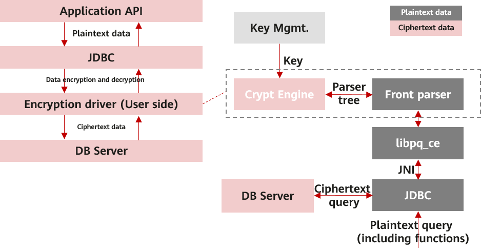
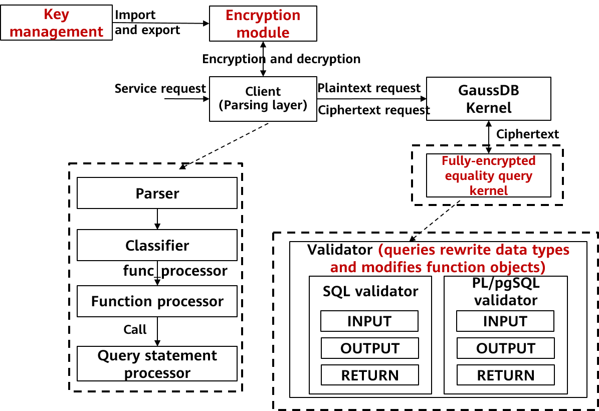
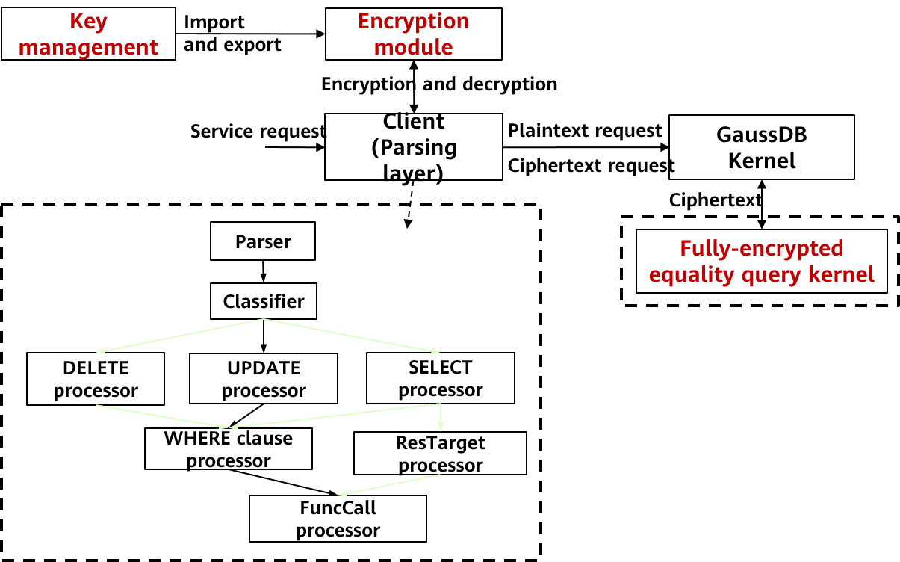
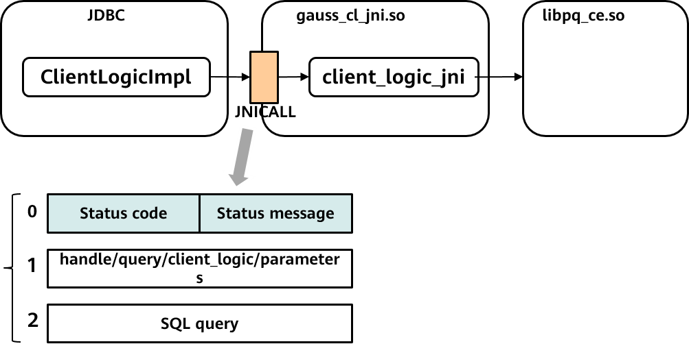

# Full-encryption Upgrade and Unaware Encryption/Decryption Principle Analysis

To implement encryption and decryption on the client, a large number of maintenance and management operations need to be performed on the client, including data key management, sensitive data encryption, and SQL statement parsing and modification. openGauss encapsulates these complex operations in the client encryption driver to implement automatic encryption and replacement of sensitive information. In addition, all encryption-related metadata is stored in the database so that the database can identify and process encrypted data. In addition, parameters related to sensitive information in SQL statements are encrypted to ensure that query tasks do not disclose users' query intents, reduce complex security management and operation difficulties on the client, and ensure that users are unaware of application development. In addition, the openGauss provides a series of configuration APIs to meet users' requirements for encrypted fields, encryption algorithms, and secure key storage. The transparency of the openGauss fully-encrypted database makes task migration very convenient for users.

The most secure protection for data confidentiality and personal privacy is encryption. The full-encryption technology can encrypt and decrypt data in specific applications and process data in the encrypted state in the database to implement full-lifecycle data protection. However, mainstream application encryption and decryption technologies in the industry generally involve a large number of operations such as key management, algorithm selection, SQL statement change, and data type conversion. Therefore, when data needs to be encrypted, a large amount of adaptation and migration work is required, and risks may be caused due to human negligence.

The core of openGauss full-encryption is to parse all input and output statements of users on the client, identify defined sensitive data, and perform automatic encryption and decryption. The whole process of using a fully-encrypted database is as follows: A user inputs the syntax. A client sends the input to a server. The server executes and returns the result to the client. During the process, the only two steps that the user can perceive are inputting syntax and obtaining the result. The technical core of the fully-encrypted database is divided into several modules such as key management, parsing layer, encryption and decryption driver, implicit conversion layer, and data cache. Figure 1 shows the architecture of the fully-encrypted database. The following describes the modules related to user perception.

Figure 1 Fully-encrypted database architecture

## Automatic Syntax Parsing

In the openGauss fully-encrypted database, a lightweight parser is added to the client. The lightweight parser reuses the original parser on the server. After a user enters the syntax, such as INSERT and SELECT statements, the client parser parses the lexicon and syntax to obtain the plaintext value and its location. The encryption and decryption driver automatically replaces the plaintext with the encrypted ciphertext and sends the query statement to the server. In this case, the data transmitted over the network and stored in the database is encrypted. After the server returns the ciphertext execution result to the client, the client encryption and decryption driver automatically decrypts the returned ciphertext data and returns it to the user. The only two steps that the user can perceive are inputting the syntax and obtaining the result. The user is not aware of the entire encryption process. In addition, the syntax is the same as that for non-encrypted data.

In the upgraded openGauss fully-encrypted database, the client parses the syntax in functions and provides an API for decrypting the record data returned by functions. When functions are created, after the syntax of function bodies is parsed at the parsing layer, values to be encrypted in the function bodies are encrypted in the function processors by using the encryption driver. When functions are executed, after the syntax is parsed at the parsing layer, the syntax enters different processors according to the called functions, and parameters are encrypted by using an encryption driver. Users are unaware of the entire parsing and encryption process. The entire process is fully automated, and users do not need to perform other operations.

Figure 2 Creating a function/procedure by using a function or stored procedure in an encrypted equality query

Figure 3 Executing a function/procedure by using a function or stored procedure in an encrypted equality query

## Implicit Data Conversion

The encrypted columns and the original data types of encrypted columns are stored in the database. The data type displayed to users is the original data type. Although the ciphertext stored in the database is in binary format, users are unaware of data encryption, decryption, and type conversion. The openGauss fully-encrypted database checks whether the returned data is encrypted. If yes, the database calls the encryption driver to decrypt the data based on the original data type.

In the fully-encrypted openGauss database after the upgrade, when a user creates an encrypted function, the server verifies the parameter type in the function parsing module. If the data is encrypted or the column is encrypted, the server converts the input, output, and returned parameters in the optimization module. The server converts the parameter type of the function to the encrypted column type \(binary type\) and saves the original data type of the function parameter in the database. Users are unaware of the parsing, encryption, and implicit data type conversion in the entire process. They do not even need to modify the function syntax.

Figure 4 New modules for supporting functions in a fully-encrypted database

## Data Caching

Performance has always been a challenge for fully-encrypted databases. In the openGauss fully-encrypted database, the main performance loss of the database lies in obtaining keys, encrypting and decrypting keys, obtaining encrypted column information, and encrypting and decrypting data. If the waiting time is too long during syntax execution, user experience deteriorates. Therefore, the data cache module is used to cache the client key information and encrypted column information on the client. When a user initializes a connection, the client master key path, column encryption key ciphertext, and encrypted column information is automatically obtained from the database. When the user uses the client for the first time, the key is automatically cached. After the user is disconnected, the key and encrypted column information is automatically destroyed. Data is cached to improve query performance without affecting user experience.

## JDBC API

Considering the migration of tasks between different databases, more users prefer unified access APIs, such as JDBC. In earlier versions, openGauss only allows gsql to use a fully-encrypted database. JDBC is supported in the upgraded openGauss fully-encrypted database. The JDBC client reuses the original encryption driver through the Java native interface \(JNI\). The encryption driver is reconstructed so that it can obtain data from the server through a set of interfaces compatible with libpq/JDBC. The encryption and decryption process when users call JDBC is the same as that of gsql. Users are unaware of data encryption and decryption in the encryption driver during query.

Figure 5 New JDBC modules supported by the encrypted equality query

## State Cryptography Administration \(SCA\) Algorithms

Chinese cryptographic algorithms are Chinese algorithms issued by the State Cryptography Administration Office of Security Commercial Code Administration \(OSCCA\). Common algorithms include SM1, SM2, SM3, and SM4. SM1 is a symmetric encryption algorithm and is not open to the public or supported. SM2 is an asymmetric encryption algorithm based on ECC. SM3 is a message digest algorithm. SM4 is a standard packet data algorithm for WLANs, that is, symmetric encryption. Chinese cryptographic algorithms are used in many user scenarios in China. To provide users with unaware migration and expand the application scenarios of fully-encrypted databases, the master key \(CMK\) on the upgraded openGauss client supports the asymmetric encryption algorithm SM2 when encrypting a column encryption key \(CEK\). When the CEK is used to encrypt or decrypt user data, the symmetric encryption algorithms SM4 and SM3 are used for integrity check. Currently, the openGauss fully-encrypted database supports the algorithms listed in Table 1.

<table><thead ><tr id="row869018537321"><th class="cellrowborder"  width="18.84%" id="mcps1.1.5.1.1">
Fully-encrypted Database

</th>
<th class="cellrowborder"  width="13.77%" id="mcps1.1.5.1.2">
KeyStore

</th>
<th class="cellrowborder"  width="20.11%" id="mcps1.1.5.1.3">
Key Encryption Algorithm

</th>
<th class="cellrowborder"  width="47.28%" id="mcps1.1.5.1.4">
Data Encryption Algorithm

</th>
</tr>
</thead>
<tbody><tr id="row18690195383212"><td class="cellrowborder" rowspan="3"  width="18.84%" headers="mcps1.1.5.1.1 ">
openGauss

</td>
<td class="cellrowborder" rowspan="3"  width="13.77%" headers="mcps1.1.5.1.2 ">
localkms

</td>
<td class="cellrowborder" rowspan="2"  width="20.11%" headers="mcps1.1.5.1.3 ">
RSA_2048

</td>
<td class="cellrowborder"  width="47.28%" headers="mcps1.1.5.1.4 ">
AEAD_AES_256_CBC_HMAC_SHA_256

</td>
</tr>
<tr id="row1669020532329"><td class="cellrowborder"  headers="mcps1.1.5.1.1 ">
AEAD_AES_128_CBC_HMAC_SHA_256

</td>
</tr>
<tr id="row196901539326"><td class="cellrowborder"  headers="mcps1.1.5.1.1 ">
SM2

</td>
<td class="cellrowborder"  headers="mcps1.1.5.1.2 ">
SM4_SM3

</td>
</tr>
</tbody>
</table>

Table 1 Encryption algorithms supported by a fully-encrypted database

Currently, the openGauss fully-encrypted database supports only the encrypted equality query. It provides a pure software solution in the full-encryption technology and has advantages of high security and high performance. In the future, more scenario capabilities will be opened, such as range query and fuzzy query. In addition, the TEE software and hardware integration solution will be used to form complete encrypted query and computing capabilities. In the fully-encrypted database field, openGauss will continuously evolve to provide more secure, easy-to-use, and efficient fully-encrypted databases.
