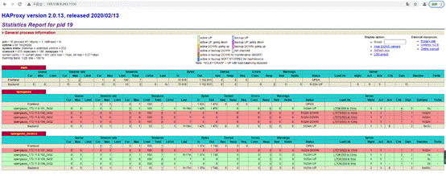

# Guide to Adapting HAProxy to openGauss<a name="ZH-CN_TOPIC_0000001251106705"></a>

## 1. Introduction to HAProxy<a name="section1772619541159"></a>

HAProxy is an open-source project and its code is hosted on GitHub.

Code link: https://github.com/haproxy/haproxy

HAProxy is a free, quick and reliable proxy, which provides HA, load balancing, and TCP- and HTTP-based proxy services. It supports virtual hosts.

HAProxy implements an event-driven, single-process model that supports a large number of concurrent connections.

## 2. Read/Write Isolation and Load Balancing Based on HAProxy<a name="section78221148977"></a>

HAProxy implements read/write isolation and load balancing for the openGauss cluster. The prerequisite is that Patroni manages the openGauss database cluster. The key is the configuration file.

The HAProxy configuration consists of five parts:

- **global**: sets global configuration parameters, which are related to processes and the operating system.

- **defaults**: sets default parameters. These parameters can be used by the frontend, backend, and listen components.

- **frontend**: frontend virtual node that receives requests. The frontend can specify the backend to be used based on the ACL rule.

- **backend**: backend service cluster, which is a real server. One backend corresponds to one or more entity servers.

- **listen**: combination of the frontend and backend.

In the HAProxy configuration file, two listen modules are defined: **opengauss** and **opengauss_balance**, which correspond to the write operations on the primary node and the read operations and load balancing on the standby node, respectively. In the listen modules, you can use the **server** keyword to set the backend server, that is, set the IP address and port number of each database node in the openGauss cluster managed by Patroni. Then, the database node information can be added to the HAProxy management.

- 2.1 Write Configuration for the Primary Node

  ```
  listen opengauss  # Used for monitoring the primary node.
      bind *:5000   # One of the open ports, used to connect to the primary node.
      option httpchk
       # Enable health check for backend servers, supporting health monitoring [check].
      http-check expect status 200
      default-server inter 3s fall 3 rise 2 on-marked-down shutdown-sessions
      # Monitoring interval [inter 3s], number of monitoring failures after which the backend server is considered unavailable [fall 3], number of monitoring successes after which the backend server is considered available [rise 2]; when the server is marked as down, disable the connection between HAProxy and the backend server [on-marked-down shutdown-sessions].
      server opengauss_ip1_port1 ip1:port1 maxconn 100 check port 8008
      server opengauss_ip2_port2 ip2:port2 maxconn 100 check port 8008
      server opengauss_ip3_port3 ip3:port3 maxconn 100 check port 8008
      server opengauss_ip4_port4 ip4:port4 maxconn 100 check port 8008
  # Use the server keyword to set the backend server, which is the internal name [opengauss_i] of the backend server.
  ```

  **Theoretical analysis:**

  HAProxy invokes the health monitoring representational state transfer \(REST\) application programming interface \(API\) endpoint to obtain information about the primary and standby nodes in the cluster through Patroni.

  Patroni has a rich set of REST APIs, which are the best practice of separating the frontend from the backend and are a set of development standards or specifications. Their features are summarized as follows:

  - \(1\) Each uniform resource identifier \(URI\) represents a resource.
  - \(2\) A presentation layer exists between the client and the server for transferring resources.
  - \(3\) The client uses four HTTP verbs to perform operations on server resources to implement REST.

  In the HTTP protocol, four verbs indicating operation modes are GET, POST, PUT, and DELETE, which correspond to four basic operations: GET is used to obtain resources, POST is used to create or update resources, PUT is used to update resources, and DELETE is used to delete resources.

  REST APIs in Patroni are used in the following scenarios:

  Reference: [https://patroni.readthedocs.io/en/latest/rest_api.html](https://patroni.readthedocs.io/en/latest/rest_api.html)

  - \(1\) Used by Patroni for leader election.
  - \(2\) Used by the patronictl tool to perform failover, switchover, reinitialization, restart, and reloading.
  - \(3\) Used by the HAProxy or other load balancers to perform HTTP health check or monitoring.

  In this document, HAProxy uses the Patroni REST API to monitor the health status of the primary node, standby node, and other nodes in the cluster.

  For GET requests in health monitoring, Patroni returns a JSON document containing the node status and HTTP status code. If no complex JSON document is required and only some key information is retained, OPTIONS can be used to replace GET.

  For the following requests, when the Patroni node has the leader lock and is running as the primary node, the Patroni REST API returns the HTTP status code 200.

  _\(1\) GET /_

  _\(2\) GET /master_

  _\(3\) GET /primary_

  _\(4\) GET /read-write_

  In the preceding configuration, **option httpchk** is equivalent to invoking the GET/ request, and **http-check expect status 200** is equivalent to filtering out nodes returning status code 200 during health monitoring. When a database is configured as the primary node, and it returns status code 200 in response to the preceding configuration, it is selected as the primary node. In this way, the IP address of HAProxy and port 5000 can be used as the proxy of the primary node in the cluster. In the openGauss cluster, you can run the **gsql** command to connect to the primary node in the cluster.

  ```
   gsql -d postgres -h HAProxy_ip -p 5000 -U user -W password
  ```

- 2.2 Read and Load Balancing Configuration for the Standby Node

  ```
  listen opengauss_balance  # Used for monitoring the standby node.
      bind *:5001           # One of the open ports, used to connect to the standby node.
          mode tcp
          option tcplog
          balance roundrobin  # balance defines the load balancing algorithm. roundrobin indicates that polling is performed based on weights. This is the most balanced and fair algorithm when the processing time of servers is evenly distributed. This algorithm is dynamic, which means that a weight can be adjusted at run time.
      option httpchk OPTIONS /replica
      http-check expect status 200
      default-server inter 3s fall 3 rise 2 on-marked-down shutdown-sessions
      server opengauss_ip1_port1 ip1:port1 maxconn 100 check port 8008 inter 5000 rise 2 fall 2
      server opengauss_ip2_port2 ip2:port2 maxconn 100 check port 8008 inter 5000 rise 2 fall 2
      server opengauss_ip3_port3 ip3:port3 maxconn 100 check port 8008 inter 5000 rise 2 fall 2
  server opengauss_ip4_port4 ip4:port4 maxconn 100 check port 8008 inter 5000 rise 2 fall 2
  ```

  **Theoretical analysis:**

  **For the GET/replica request, when the Patroni node is in the running state, the role is replica, and the noloadbalance tag is not set, the HTTP returns status code 200.**

  **In the preceding configuration, option httpchk OPTIONS/replica invokes the OPTIONS/replica request and replaces GET with OPTIONS to simplify the returned information; http-check expect status 200 is equivalent to filtering out nodes returning status code 200 during health monitoring. When a database is configured as a standby node in the cluster and it returns status code 200 in response to the preceding configuration, it is selected as a standby node. balance roundrobin configures the load balancing algorithm, so that read requests are sent to each running standby node in polling mode. In this way, the IP address of HAProxy and port 5001 can be used as the proxy of the standby nodes in the cluster to implement load balancing.**

  In the openGauss cluster, you can run the **gsql** command to connect to a standby node in the cluster.

  ```
   gsql -d postgres -h HAProxy_ip -p 5001 -U user -W password
  ```

- 2.3 Monitoring Page

  In addition, an HAProxy monitoring page is configured. You can access this page to view the status of each node in the cluster.

  ```
   listen stats  # Define a part named stats.
      mode http
     # Set the mode to HTTP.
     bind *:7000  # One of the open ports, used for monitoring.
      # Define the listening socket.
      stats enable
      # stats is the socket of a statistics page of HAProxy.
      stats uri /
  # Set the URI of the statistics page to /.
  ```

  In the preceding configuration, you can access http://ip:7000/ to view the monitoring page. _ip_ indicates the IP address of the host where HAProxy is deployed. The following figure shows the page information.

  

  In the preceding figure, the cluster consists of one primary node and three standby nodes. The first module **opengauss** corresponds to the write operation and the green column indicates the primary node in the cluster. The second module **opengauss_balance** corresponds to the read operation, and the green columns indicate the standby nodes in the cluster.

In this way, HAProxy implements read/write isolation and load balancing for the openGauss cluster through Patroni.
