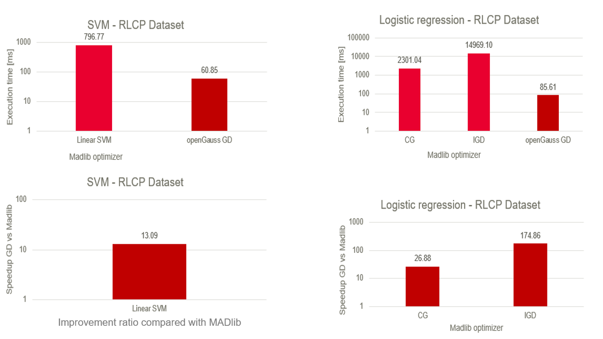
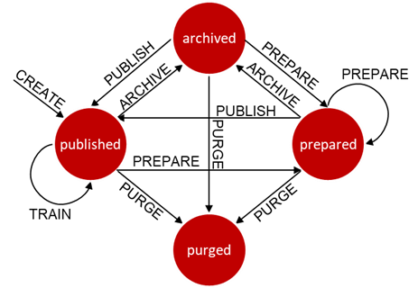
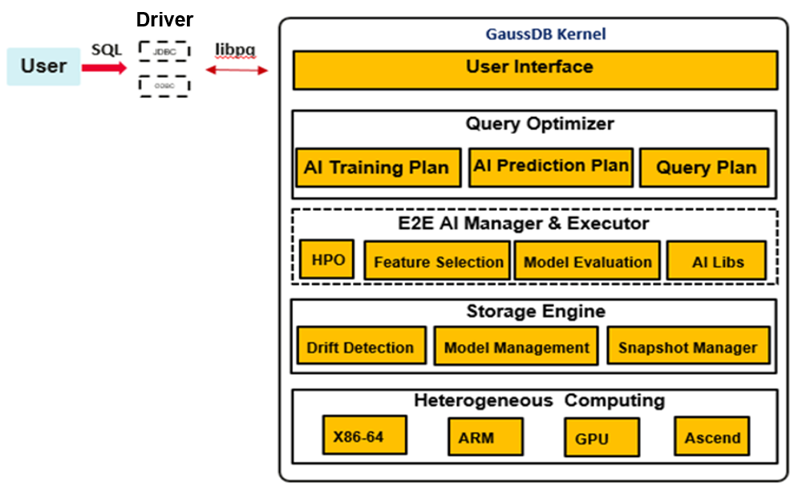
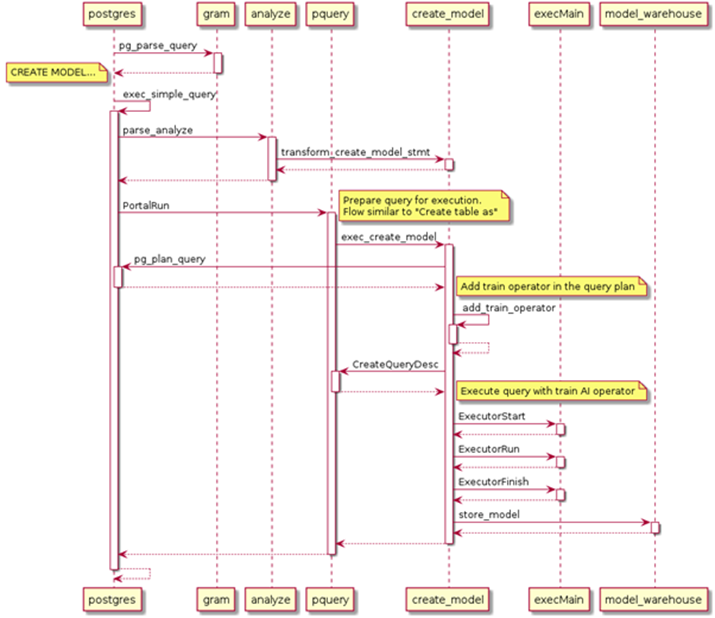

# Internal Mechanism of the openGauss DB4AI Framework<a name="ZH-CN_TOPIC_0000001251426691"></a>

## 1. Features of the openGauss AI Framework<a name="section71741618133113"></a>

In the DB4AI direction, the database integrates AI capabilities to avoid problems caused by data migration during AI computing. Different from other DB4AI frameworks, the open-source inherent framework of openGauss completes AI computing in the database by adding AI operators.

In addition to avoiding the problems caused by data migration, the AI framework of openGauss has the following advantages:

- 1\) Extremely low learning threshold

  Currently, most mainstream computing frameworks, such as TensorFlow, PyTorch, and Keras, rely on Python as the script language. Although it is easy to learn Python, it still requires a certain learning cost. The current framework provides the CREATE MODEL and PREDICT BY syntax to complete AI training and inference tasks. Compared with Python, this syntax is more similar to the natural language and complies with people's intuition.

  ```
  CREATE MODEL point_kmeans USING kmeans FEATURES position FROM kmeans_2d WITH num_centroids=3;
  SELECT id, PREDICT BY point_kmeans (FEATURES position) as pos FROM (select * from kmeans_2d_test limit 10);
  ```

- 2\) Simplified data version management

  The snapshot function is added to the DB4AI feature. The database uses snapshots to fix data in a dataset at a specific time point. It can also save processed and filtered data. Data can be saved in full or incremental mode. In incremental mode, only data changes are stored each time. Therefore, the space occupied by snapshots is greatly reduced. You can directly obtain the corresponding data by using the snapshots of different versions.

- 3\) Excellent performance experience

  Compared with many AIinDB projects, openGauss embeds model computing into the database by adding AI operators. Taking algorithm training as an example, data reading, model calculation and update, and final model storage are completed in an executor of the database. In this way, the computing capability of the database is fully utilized and released. The technical roadmap deep into the kernel makes our features faster than other higher-level invocation methods.

  

Figure 1 Performance comparison with MADlib

## Technical Principles and Advantages<a name="section857483073916"></a>

- 1\) DB4AI-Snapshot

  

  The DB4AI.snapshot feature requires users to specify the data to be filled in the SQL query statement for operating data storage, so as to create a snapshot. The initial snapshot is always created as a real and reusable copy of the operated data, making the specific state of the data immutable. Therefore, the initial snapshot serves as the starting point for subsequent data collation, but it always allows backtracking to the exact state of the original data at the time when the initial snapshot was created.

  Because a created snapshot cannot be changed, you must prepare the snapshot before starting data collation. The prepared snapshot data can be modified collaboratively to prepare for model training, especially for data management. In addition, snapshots automatically track all changes by recording each operation as metadata in the DB4AI system directory, providing a complete integration history for the data.

  After the snapshot is prepared, you can publish it. Published snapshots are immutable, and the DB4AI system specifies that only published snapshots can be used for model training. This ensures data consistency among training tasks.

  Outdated snapshots are archived for data backup. In this state, the data remains unchanged but cannot be used to train a new model. At last, clear the snapshot, delete the data tables and views in the schema, and restore the storage space. It is important to note that, for the purpose of strict model source management, dependent snapshots cannot be deleted.

  By using GUC parameters, snapshots can be stored in materialized view mode or incremental mode. In incremental mode, the view and data table corresponding to a new snapshot store only the modified content compared with the parent snapshot, which greatly reduces the storage space.

- 2\) DB4AI-Query

  The inherent AI framework is deeply embedded in the database kernel. It builds an execution plan that contains AI operators through query optimization and query execution. After the computing is complete, the storage module of the framework saves the model information. The AI framework is divided into three parts: query optimization, computing execution, and model storage.

  - **Query optimization:**

    The lexical rules and syntax rules CREATE MODEL and PREDICT BY are added to the framework as the AI computing entry. During query optimization, this module is responsible for simple input verification, including the validity of attribute names, whether algorithms are supported, and whether model names conflict with each other. After the verification is complete, this module generates a query plan based on the training and inference tasks.

  - **Computing execution:**

    The query execution module adds corresponding AI operators to the execution plan based on the required algorithm type and executes computing, including data reading and model calculation and update. Algorithms are highly cohesive and loosely coupled, have good algorithm scalability, and are friendly for developers to add algorithms.

  - Model storage:

    After the model training is complete, the executor transfers the model data in the form of tuples to the storage module and saves the model to the gs_model_warehouse system catalog.

    

    The following uses CREATE MODEL as an example to describe how to implement the query statement used for model training.

    

    - Step 1: Perform lexical and syntax analysis \(Lex and Yacc\) on the query. Generate an analysis tree by identifying pattern categories and pattern combinations to check whether syntax errors exist in statements.
    - Step 2: The database performs semantic analysis and rewriting on each obtained analysis tree. In the process of generating a query tree through semantic analysis, for a createmodelStmt command case, the database first checks the algorithm type to determine whether the algorithm belongs to supervised learning or unsupervised learning. Then, based on the judgment result, the system further checks whether the attributes, hyperparameters, and model names entered in the query statement are invalid. After the verification is complete, the semantic analysis generates a query tree and transfers it to the database executor.
    - Step 3: The executor adds different algorithm operators to the execution plan based on the algorithm type and adds the AI operator to the upper layer of the scanning operator. During the calculation, the scanned data is input to the algorithm model for calculation and update. Finally, the operator execution ends based on the iteration conditions set by the hyperparameters.
    - Step 4: The executor transfers the trained model to the storage engine in the form of tuples. The received tuple-converted model structure is verified and saved to the gs_model_warehouse system catalog. You can view model information in the system catalog.

      As an original advanced feature of openGauss, DB4AI consolidates the new AI practices of openGauss and further expands the application fields of openGauss. The out-of-the-box DB4AI function provided by openGauss effectively solves data migration problems in data warehouses and data lakes and improves information security during data migration. In the future, with the multi-mode and parallel computing advantages of openGauss, a unified data management platform will be formed to reduce O&M and usage difficulties caused by heterogeneous and fragmented data storage. The release of the DB4 AI feature is a key step in making openGauss a cutting-edge tool.
