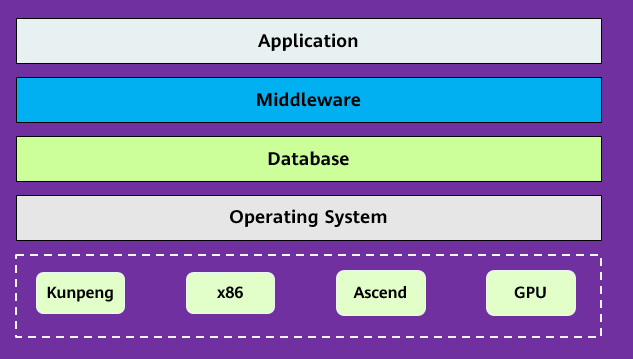
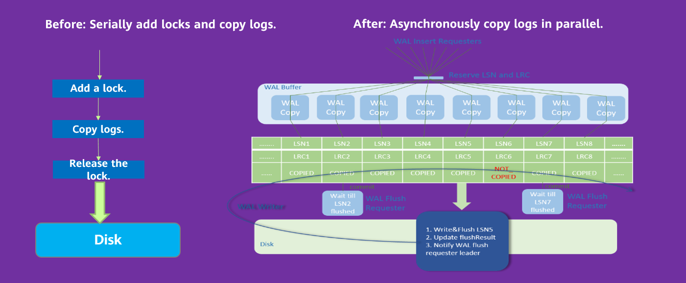
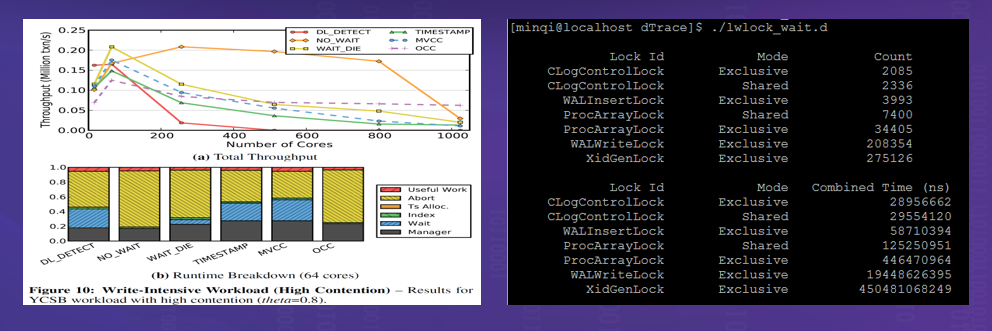
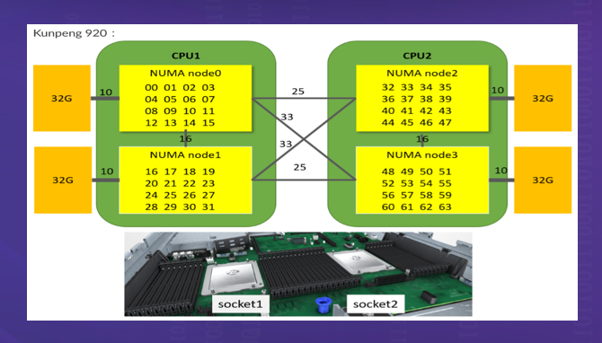
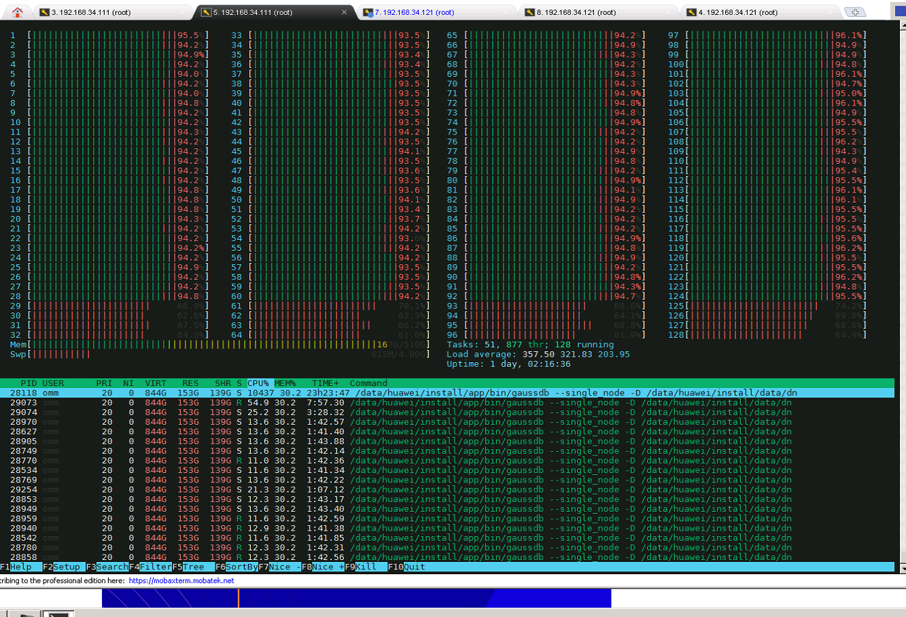

# Introduction to Multi-Core Optimization of openGauss on Kunpeng Servers

Since the birth of integrated circuits, CPUs have experienced three development phases, among which the first phase is to increase the CPU dominant frequency. Six years after integrated circuits were invented, Gordon Moore proposed Moore's law, predicting that the number of transistors on a chip doubles every two years. Moore's law is not the law of nature, but the development of semiconductor chips has proved that Moore's predictions are correct. Technology advances in chips bring benefits mainly to two aspects: smaller manufacturing specifications and larger silicons. However, when it goes to the 7 nm process or smaller, a quantum tunneling effect occurs, and mass production of chips becomes challenging, resulting in a sharp increase in manufacturing costs.

The second phase is to increase the number of CPU cores. If the frequency of a single-core CPU cannot be increased, the number of CPU cores can be increased to improve computing power. However, the CPU is only a logical computing unit. The programs and data in the memory must be loaded to the CPU for computing. All CPU cores share a northbridge to read memory. As the number of cores increases rapidly, the performance bottleneck of the northbridge in response time becomes more and more obvious.

The third phase is to achieve non-uniform memory access \(NUMA\) for CPU cores. To resolve the bottleneck of the memory controller that reads memory in the northbridge, the memory may be evenly allocated to each die. However, this causes asymmetric delays when different CPU cores access different memory. The reason is that although the memory is directly attached to the CPU, the response time is short when the CPU accesses the local address corresponding to the attached memory, while to access the memory data attached to other CPUs, which is called remote access, you need to access the memory data through the inter-connect channel, and the response time is relatively long. This is the origin of NUMA. In the NUMA architecture, the physical distance between the processor and the memory block of a NUMA node is called NUMA distance. You can use the numactl tool to query the CPU access distance. A Kunpeng server is used as an example, as shown in the following figure.

A NUMA-based CPU brings not only surging computing power to servers, but also great challenges to software development. From the perspective of the entire IT software stack, the first thing to support NUMA is the operating system. Currently, most enterprises use Linux. After NUMA appears, Linux also provides targeted optimization solutions to preferentially attempt to allocate space in the local memory of the CPU where the request thread is located. If the local memory is insufficient, useless pages in the local memory are eliminated first. However, NUMA provided by Linux is not suitable for databases because a database is a data-intensive and high-concurrency application and has many kernel data structures inside. These data structures are accessed by both the local CPU core and the remote CPU core. To improve data access performance, the database has its own shared data buffers, which are randomly accessed by service threads on each CPU core. From the perspective of the IT software stack, databases are the core of enterprise applications, and many applications have a database in the background. The database performance determines the overall throughput of many applications. As such, if the database performance cannot be maximized in NUMA and is not in a linear ratio to the number of cores, no enterprise is willing to pay for NUMA-based CPUs though they provide rich computing power.

Nevertheless, NUMA is an inevitable trend in CPU development. If an enterprise-level database cannot adapt to hardware development, this database would be eliminated in enterprise database selection.

openGauss is an open-source relational database management system. It optimizes the concurrency control algorithm, kernel data structure, data access, and others according to hardware development trends of NUMA-based CPUs to release the multi-core computing power of processors and achieve 1.5 million tpmC on 2-socket 128-core Kunpeng servers. This document describes the NUMA-based multi-core optimization technology of openGauss on Kunpeng servers and provides reference for other databases to optimize performance on Kunpeng servers. It is intended for database developers working to optimize database performance.

## 1 Introduction to Multi-Core Optimization of openGauss on Kunpeng Servers

A database is a software system with high concurrency and severe data access conflicts. _Staring into the Abyss: An Evaluation of Concurrency Control with One Thousand Cores_ published by Michael Stonebraker et al., Turing Award winners in the database field in 2014, shows that the transaction processing mechanism of a traditional database cannot effectively use the processing capabilities of dozens to hundreds of cores. Through a more in-depth analysis on the database, it is found that the causes lie in both the concurrency control algorithm and the implementation mechanism. To implement concurrency, the database uses many locks internally, such as Clog, WALInsert, WALWrite, ProcArray, and XidGen in openGauss. These locks are performance bottlenecks, while the essence of the locks is to protect kernel data structures. Therefore, openGauss needs to adjust and optimize these data structures to cope with multi-core concurrency in the NUMA architecture on Kunpeng servers. The main purposes are to implement nearby CPU access, eliminate single-point bottlenecks, and evenly allocate and access shared data.

- 1.1 Binding Threads to Cores to Prevent Thread Offsets Between Cores

  

  To implement nearby access to a CPU core, a thread needs to be fixed to a specific core first. The GUC parameter **numa_distribute_mode** in openGauss is used to control CPU core affinity. By setting this parameter, the service processing threads can be bound to specific NUMA nodes. openGauss adopts the client-server structure. The client and server interact with each other frequently through the network. To prevent network interruption and service processing from interfering with each other, core binding is required for network interruption. In addition, the core binding area for network interruption must be separated from that for background service threads.

- 1.2 Reconstructing NUMA-based Data to Reduce Cross-Core Access

  

  WALInsertLock is used to perform concurrency protection on WAL Insert operations. You can configure multiple WALInsertLocks, for example, 16. There are two types of access: \(1\) Xlog insert, each of which requires an Insert Lock. \(2\) Traversal and access to all WALInsertLocks, which is used to check whether unacknowledged information exists during Xlog flushing.

  In the original implementation solution, all WALInsertLocks are in the same global array and stored in the shared memory. This results in a fierce contention between WALInsertLocks, and there is a high probability that remote memory access is involved. That is, there is cross-node and cross-package contention among multiple threads. Actually, WALInsertLock has multiple instances. For most operations, only one WALInsertLock is required each time. You can allocate WALInsertLocks by NUMA node.

  In the optimized solution, the global WALInsertLock array is divided into multiple subarraies based on the number of NUMA nodes, and memory is allocated by NUMA node. Each transaction thread selects the WALInsertLock corresponding to the NUMA node to which the transaction thread belongs. The WALInsertLock references the LWLock in the shared memory. To minimize cross-node contention, the LWLock is directly embedded into the WALInsertLock. In this way, the LWLock can be distributed to NUMA nodes, and access to cache lines is reduced.

- 1.3 Partitioning Data to Reduce Thread Access Conflicts

  

  As an auxiliary of Xlog, Clog records the final state of transactions and is used to accelerate the process of determining transaction states based on logs.

  There are four transaction states: **IN_PROGRESS**, **COMMITED**, **ABORTED**, and **SUB_COMMITED**. Each log occupies 2 bits. Clog needs to be stored on disks. A page \(occupying 8 KB\) can contain 215 records, each log file \(segment = 2048 x 8 KB\) contains 226 records, and the log ID has 32 bits. Therefore, 256 Clog files may exist. The Clog files are stored in the **PGDATA/pg_clog** directory. To accelerate the access to disk files, the access to Clog is implemented through a buffer pool. A unified SLRU buffer pool is used in the code.

  Before optimization, the log buffer pool of Clog is stored in the same shared memory and globally unique in the name of **CLOG Ctl**. Each worker thread uses the thread local variable ClogCtl to point to the resource. In high concurrency scenarios, resource contention becomes a performance bottleneck. After optimization, logs are evenly distributed to the buffer pools of multiple shared memory based on **PageNo** and are recorded in the thread local object array ClogCtlData. The buffer pools are named **CLOG Ctl** _i_. Buffer pool objects and corresponding global locks are added to the shared memory synchronously.

  Similarly, other internal key shared data structures are also partitioned.

  

- 1.4 Adjusting Concurrency Control Algorithms to Reduce Single-Point Bottlenecks

  

  Before optimization, ProcArrayLock is required for obtaining transaction snapshots when a transaction starts, and for clearing transaction snapshots when the transaction ends. With the increase of concurrent connections, the snapshots obtained by the global transaction manager expand.

  After optimization, snapshots are committed by transaction and each non-read-only transaction is assigned a transaction ID \(XID\) during running. When a transaction is committed, the commit sequence number \(CSN\) is pushed and the mapping between the current CSN and the XID of the transaction is saved. The red vertical line indicates the time when the snapshot is captured. If the CSN is not used, the snapshot set corresponding to the red vertical line is \{2,4,6\}. If the CSN is used, the CSN 3 is used. In other words, modifications to TX2. TX4, TX6, TX7, and TX8 with the CSNs 4, 5, 6, 7, and 8 respectively are invisible to the snapshot.

- 1.5 Using ARM Atomic Instructions to Reduce the Computing Overhead

  

  The atomic operation of a traditional compiler uses the load-linked/store-conditional \(LL/SC\) atomic instructions by default. To obtain the write permission on shared variables, any core must obtain the ownership of all shared variables in an exclusive manner. That is, the modification operation can be performed only after the latest data is loaded to the L1 cache where the core is located. In the case of multiple CPUs, the system performance deteriorates due to fierce contention.

  In ARMv8.1, large-system extensions \(LSE\) that provide atomic operations is introduced to perform computing operations on the storage side, improving computing performance. Theoretically, in a multi-core system, the performance of LSE is better than that of LL/SC. The test result shows that the performance of LSE 6.4.0 is three to five times that of LL/SC in high-concurrency scenarios.

## 2 Multi-Core Optimization Result of openGauss on Kunpeng Servers

 The running of the database system involves multiple resources, including the CPU, memory, network I/O, and disk I/O. The ultimate goal of performance optimization is that each resource usage exactly reaches the bottleneck. However, in actual optimization, the environment may consist of different hardware. As such, the optimization objectives may be different, while the basic objective of system optimization is to fully utilize the CPU capabilities. After optimizing the NUMA architecture, openGauss runs on the Kunpeng 920 processor, the TPC-C test performance reaches 1,500,000 tpmC, and the CPU efficiency is close to 95%. The data shows that openGauss fully utilizes the multi-computing capabilities of CPUs.
