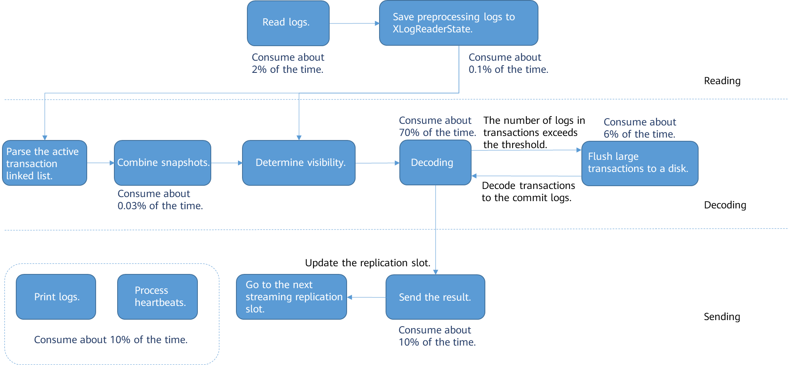
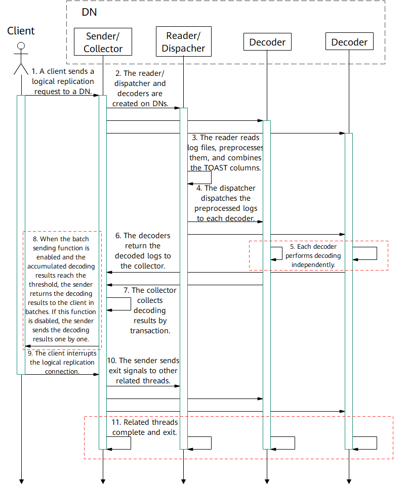
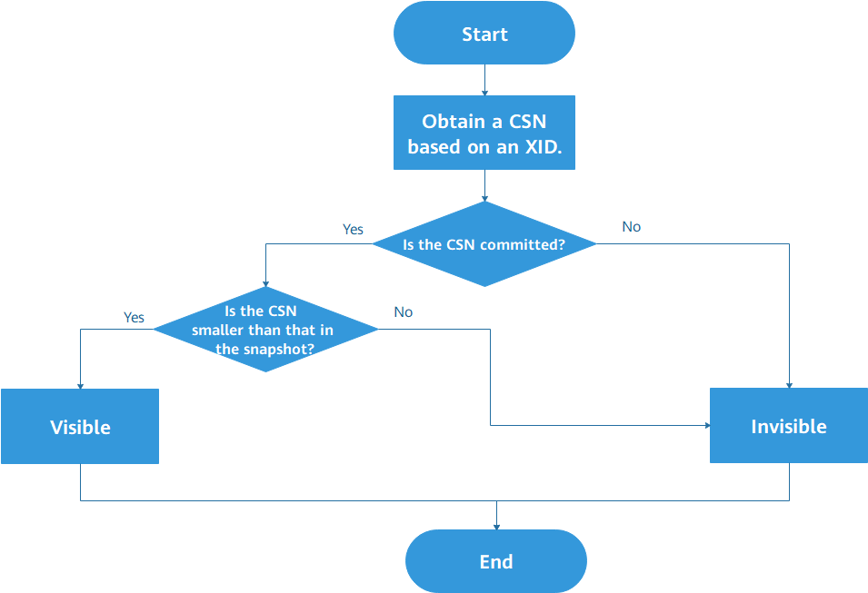
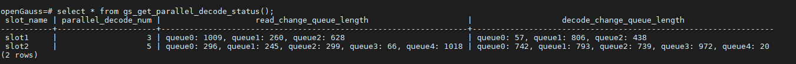

# New Feature of openGauss 3.0.0: Parallel Decoding<a name="ZH-CN_TOPIC_0000001279394761"></a>

## Introduction<a name="section558713197814"></a>

With the rapid development of information technology, various types of databases emerge one after another. Logical replication is increasingly important, with which data can be synchronized between heterogeneous databases. Currently, the average serial decoding performance of logical replication in openGauss is only 3 to 5 Mbit/s, which cannot meet the requirements of real-time synchronization in heavy service pressure scenarios. As a result, logs are stacked, affecting services in the production cluster. Therefore, the parallel decoding feature is designed to enable multiple threads to perform decoding in parallel, improving the decoding performance. In basic scenarios, the decoding performance can reach 100 Mbit/s.

## Design Idea: Why Parallel Decoding Is Considered?<a name="section11083297815"></a>

In the original serial decoding logic, a single thread is used to read logs, decode logs, and combine and send results. The following figure shows the main process and time consumption.



It can be learned that most time of the entire process is consumed in the decoding step, which needs to be optimized by multi-thread decoding. In addition, time consumed in the sending step is obviously the second, which needs to be optimized by batch sending.

## Working Process: Parallel Decoding Message Sequence Diagram<a name="section9188174118915"></a>

As shown in the following figure, in parallel decoding, worker threads on an openGauss DN are classified into three types:

1.  Sender/Collector, which receives decoding requests from a client, collects the results of each decoder, and sends the results to the client. Only one sender/collector is created for each decoding request.
2.  Reader/Dispatcher, which reads WALs and distributes them to decoders for decoding. Only one reader/dispatcher is created for a decoding request.
3.  Decoder, which is responsible for decoding the logs sent by the reader/dispatcher \(when the thread is decoding the logs, the logs are temporarily stored in the read change queue\) and sending the decoding results \(when the committed logs are not decoded, the results are temporarily stored in the decode change queue\) to the sender/collector. Multiple decoders can be created for a decoding request.



The message sequence is described as follows:

1. A client sends a logical replication request to a primary or standby DN. In the logical replication options, you can set parameters to connect only to the standby node to prevent the primary node from being overloaded.

2. In addition to the sender that receives requests from a client, DNs need to create a reader/dispatcher and several decoders.

3. The reader reads and preprocesses Xlogs. If the logs contain TOAST columns, combine the TOAST columns.

4. The dispatcher dispatches the preprocessed logs to each decoder.

5. Each decoder performs decoding independently. You can set the decoding format \(.json, .txt, or .bin\) through configuration options.

6. Each decoder sends the decoding result to the collector.

7. The collector collects decoding results by transaction.

8. To reduce the number of sending times and the impact of network I/O on the decoding performance, when the batch sending function is enabled \(that is, **sending-batch** is set to **1**\), the sender accumulates a certain number of logs \(the threshold is set to 1 MB\) and returns the decoding result to the client in batches.

9. To stop the logical replication process, disconnect the logical replication connection to the DN.

10. The sender sends the exit signal to the reader/dispatcher and decoders.

11. After receiving the exit signal, each thread releases the occupied resources, cleans up the environment, and exits.

## Technical Details 1: Visibility Reconstruction<a name="section479815130103"></a>

In logical decoding, historical logs are parsed. Therefore, it is important to determine the visibility of tuples in logs. In the original serial decoding logic, the active transaction linked list mechanism is used to determine the visibility. However, for parallel decoding, it is costly for each decoder to maintain an active transaction linked list, which adversely affects the decoding performance. Therefore, visibility reconstruction is performed, and the commit sequence number \(CSN\) is used to determine tuple visibility. For each XID, the visibility process is as follows:



The main process is as follows:

1.  Obtain a CSN used to determine the visibility based on XID. Ensure that the CSN value can be obtained based on any XID. If the XID is abnormal, a CSN indicating a specific status is returned. This CSN can also be used to determine the visibility.

1.  If the CSN has been committed, it is compared with the CSN in the snapshot. If the CSN of the transaction is smaller, the transaction is visible. Otherwise, the transaction is invisible.
1.  If the CSN is not committed, the transaction is invisible.

Based on the foregoing logic, in parallel decoding, logic for determining tuple snapshot visibility is sequentially determining snapshot visibilities of tuple **Xmin** \(XID during insertion\) and **Xmax** \(XID during deletion/update\). The overall idea is that if Xmin is invisible/uncommitted or Xmax is visible, the tuple is invisible; if Xmin is visible and Xmax is invisible/uncommitted, the tuple is visible. Each flag bit in the tuple maintains its original meaning and participates in visibility determination.

## Technical Details 2: Batch Sending<a name="section159923113108"></a>

After parallel decoding is used, the time occupied by the decoding process is significantly reduced. However, in this case, the sender becomes a bottleneck, and costs of performing a complete sending process for each decoding result are excessively high. Therefore, the batch sending mode is used. The decoding results are collected temporarily and sent to the client when the threshold is exceeded. During batch sending, the length of each decoding result and the specified separator need to be recorded so that users of the parallel decoding function can split the logs to be sent in batches.

## Usage Mode<a name="section1833884661016"></a>

The following optional configuration items are added for parallel decoding:

1. Decoder concurrency

Configure **parallel-decode-num** to specify the number of decoders for parallel decoding. The value is an integer ranging from 1 to 20. The value **1** indicates that decoding is performed based on the original serial logic and the code logic of this feature is not used. The default value is **1**. When this item is set to **1**, the decoding format **decode-style** cannot be configured.

2. Decoding whitelist

Configure **white-table-list** to specify the table to be decoded. The value is a character string of the text type that contains table names in the whitelist. Different tables are separated by commas \(,\). Example: **select \* from pg_logical_slot_peek_changes\('slot1', NULL, 4096, 'white-table-list', 'public.t1,public.t2'\);**

3. Decoding only on the standby node

Configure the **standby-connection** parameter to specify whether to perform decoding only on the standby node. The value is of the Boolean type. If the value is **true**, only the standby node can be connected for decoding. When the primary node is connected for decoding, an error is reported and the decoding exits. If the value is **false**, there is no restriction. The default value is **false**.

4. Decoding format

Configure **decode-style** to specify the decoding format. The value can be **'j'**, **'t'** or **'b'** of the char type, indicating the JSON, text, or binary format, respectively. The default value is **'b'**, indicating binary decoding.

5. Batch sending

Configure the **sending-batch** parameter to determine whether to send decoding results in batches. The value is **0** or **1**. The default value **0** indicates that batch sending is disabled. The value **1** indicates that batch sending is enabled when the accumulated size of decoding results reaches or just exceeds 1 MB.

The following uses JDBC as an example to describe how to perform parallel decoding. Perform the following configurations when establishing a connection:

```
PGReplicationStream stream = conn
 .getReplicationAPI()
 .replicationStream()
 .logical()
 .withSlotName(replSlotName)
 .withSlotOption("include-xids", true)
 .withSlotOption("skip-empty-xacts", true)
 .withSlotOption("parallel-decode-num", 10)
 .withSlotOption("white-table-list", "public.t1,public.t2")
 .withSlotOption("standby-connection", true)
 .withSlotOption("decode-style", "t")
.withSlotOption("sending-batch", 1)
     .start();
```

The added logic is from the sixth line to the second line from the bottom, indicating that 10 concurrent decoding operations are performed, only the **public.t1** and **public.t2** tables are decoded, the standby node connection is enabled, the decoding format is text, and the batch sending function is enabled. If the parameter value is out of the range, an error is reported and the allowed value range is displayed.

## Auxiliary Functions: Monitoring Function<a name="section1494115131115"></a>

During parallel decoding, the **gs_get_parallel_decode_status\(\)** function is added to help locate the decoding performance bottleneck when the decoding speed is low. This function is used to check the length of the read change queue that stores logs that have not been decoded and the length of the decode change queue that stores decoding results that have not been sent of each decoder on the current DN.

This function has no input parameter. The return result contains four columns: **slot_name**, **parallel_decode_num**, **read_change_queue_length**, and **decode_change_queue_length**.

**slot_name** indicates the replication slot name and its type is text. **parallel_decode_num** indicates the number of parallel decoding threads and its type is integer. **read_change_queue_length** records the read change queue length of each decoder and its type is text. **decode_change_queue_length** records the length of the decode change queue of each decoder and its type is text. The usage is as follows:



If decoding stalls, execute the function on the decoding DN and check the value of **read_change_queue_length** in the query result. Record the length of the log reading queue in each decoder. If the value is too small, log reading is blocked. In this case, check whether the disk I/O is insufficient. Check the value of **decode_change_queue_length** in the query result. The value indicates the length of the decoding log queue in each decoder. If the value is too small, the decoding speed is too slow. You can increase the number of decoders. If the values of **read_change_queue_length** and **decode_change_queue_length** are large, decoding log sending is blocked. In this case, check the log replay speed of the parallel decoding user in the target database. Generally, the decoding stall is caused by insufficient CPU, I/O, or memory resources. The decoding stall can be avoided by using the standby node to ensure sufficient resources.

## Conclusion<a name="section89711524161114"></a>

Parallel decoding can greatly improve the decoding performance of logical replication.Therefore, it is forgiven even if it increases service pressure on decoding instances. As a key technology of heterogeneous database data replication, parallel decoding plays an important role in openGauss.
