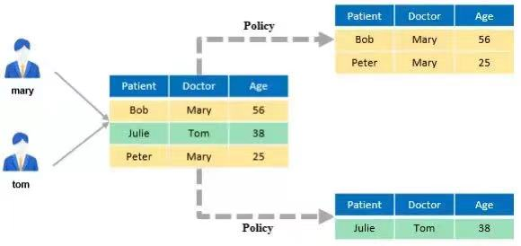

# Permission Management Model of the openGauss Database \(Continued\)<a name="ZH-CN_TOPIC_0000001206306728"></a>

The openGauss database uses a role-based access control model. In addition to the classification of system permissions and object permissions described in the _Permission Management Model of the openGauss Database_, there are some advanced permission management mechanisms to meet customers' service requirements.

## **1. Separation of Duties**<a name="section57751193401"></a>

Separation of duties is a supplement to the system permission management mechanism. The core idea is to separate the permissions for managing database objects, users, and audit logs to prevent high risks caused by excessive centralized rights of an administrator. You can set the GUC parameter **enableSeparationOfDuty** to **on** to enable the function.

After separation-of-duty is enabled, the permission scope of **SYSADMIN** is narrowed down. That is, **SYSADMIN** does not have the permissions to create users or roles, or view or delete database audit logs. The **SYSADMIN**, **CREATEROLE**, and **AUDITADMIN** permissions are isolated from each other and do not affect each other. A user can be assigned only one attribute.

After separation-of-duty is enabled, the permissions are divided as follows:

<a name="table29155594218"></a>

<table><thead ><tr id="row736708220"><th class="cellrowborder"  width="30.7%" id="mcps1.1.3.1.1"><p id="p1336130132210"><a name="p1336130132210"></a><a name="p1336130132210"></a><strong id="b10361108226"><a name="b10361108226"></a><a name="b10361108226"></a>System Permission</strong></p>
</th>
<th class="cellrowborder"  width="69.3%" id="mcps1.1.3.1.2"><p id="p14369012229"><a name="p14369012229"></a><a name="p14369012229"></a><strong id="b1936807223"><a name="b1936807223"></a><a name="b1936807223"></a>Permission Description</strong></p>
</th>
</tr>
</thead>
<tbody><tr id="row436302221"><td class="cellrowborder"  width="30.7%" headers="mcps1.1.3.1.1 "><p id="p23614052219"><a name="p23614052219"></a><a name="p23614052219"></a>SYSADMIN</p>
</td>
<td class="cellrowborder"  width="69.3%" headers="mcps1.1.3.1.2 "><p id="p113610042219"><a name="p113610042219"></a><a name="p113610042219"></a>Allows users to create databases and tablespaces.</p>
</td>
</tr>
<tr id="row1436605221"><td class="cellrowborder"  width="30.7%" headers="mcps1.1.3.1.1 "><p id="p14368019227"><a name="p14368019227"></a><a name="p14368019227"></a>CREATEROLE</p>
</td>
<td class="cellrowborder"  width="69.3%" headers="mcps1.1.3.1.2 "><p id="p73615042217"><a name="p73615042217"></a><a name="p73615042217"></a>Allows users to create users and roles.</p>
</td>
</tr>
<tr id="row3363015227"><td class="cellrowborder"  width="30.7%" headers="mcps1.1.3.1.1 "><p id="p33615018229"><a name="p33615018229"></a><a name="p33615018229"></a>AUDITADMIN</p>
</td>
<td class="cellrowborder"  width="69.3%" headers="mcps1.1.3.1.2 "><p id="p136170102212"><a name="p136170102212"></a><a name="p136170102212"></a>Allows users to view and delete audit logs.</p>
</td>
</tr>
</tbody>
</table>

## **2. Column-Level Access Control**<a name="section1311981354110"></a>

In some service scenarios, some columns in a data table store important information and need to be invisible to users, but data in other columns needs to be viewed or operated by users. In this case, access control needs to be performed on a specific column in the data table to implement column-level access control for users.

openGauss provides the GRANT and REVOKE statements to grant and revoke permissions on column objects.

```
Example 1: Grant the SELECT permission on the first column fir of the tbl table and the UPDATE permission on the second column sec of the tbl table to user1.
openGauss=# GRANT select(fir),update(sec) ON TABLE tbl TO user1;
GRANT
After the permission is granted, user user1 can perform the SELECT operation on the first column of the tbl table and the UPDATE operation on the second column.
Example 2: Revoke the SELECT permission on the first column fir of the tbl table from user1.
openGauss=# REVOKE select(fir) ON tbl FROM user1;
REVOKE
After the revocation, user user1 no longer has the permission to view data in the first column fir of the tbl table.
```

## **3. Row-Level Access Control**<a name="section16840923124217"></a>

In actual services, users may be allowed to view only rows that meet specific conditions in a data table. In this case, row-level access control is required so that different users can read different results when performing the same SQL query, update, or delete operation.

You can create a row-level security policy for a data table. The policy defines an expression that takes effect only for specific database users and SQL operations. When a database user accesses the data table, rows that meet the policy conditions are visible to the user, and rows that do not meet the policy conditions are invisible to the user. In this way, row-level access control is implemented for the user.



openGauss provides the CREATE, ALTER, and DROP ROW LEVEL SECURITY statements to create, modify, and delete row-level access control policies.
