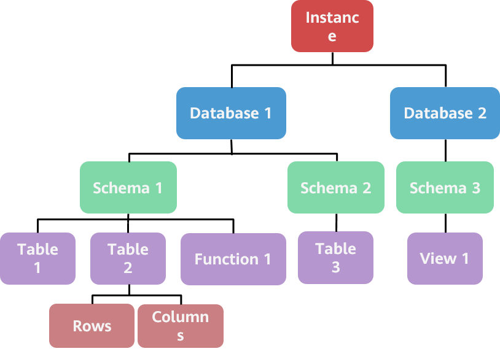
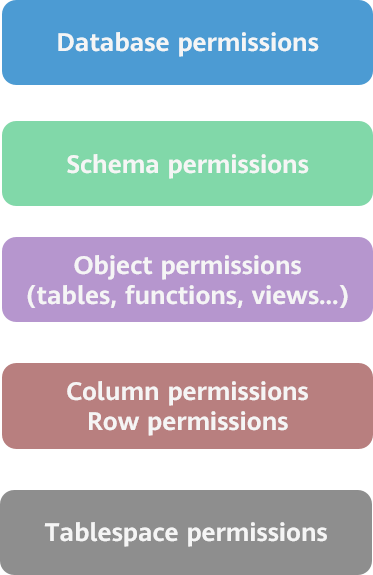

# Permission Management Model of the openGauss Database

The database stores a large amount of important data and sensitive information and provides data sharing services for authorized users with different permissions. Therefore, the database must have a complete security defense mechanism to defend against internal and external malicious attacks, to ensure that data is not lost, privacy is not disclosed, and data is not tampered with. Currently, the openGauss database has built an in-depth defense security system to enhance database security in applications. A complete permission management mechanism can effectively block unauthorized operations of malicious users. This document focuses on the permission management mechanism in the openGauss database.

## 1 Common Permission Management Models

There are three common permission management models: policy-based access control model, role-based access control model, and session- and role-based access control model. The openGauss database inherits the permission management mechanism of PostgreSQL, adopts the role-based access control model, and uses roles to organize and manage permissions, greatly simplifying permission authorization management. With the role mechanism, to grant permissions to a group of users with the same permissions, you only need to grant the permissions to a role and then grant the role to the group of users. You do not need to grant permissions to users one by one. In addition, the separation of roles and permissions can be used to control different permissions of different users and achieve mutual restriction and balance.

With the development of databases and expansion of service scenarios, higher requirements are proposed for database permission separation and fine-grained permission management. The native permission division of PostgreSQL cannot meet diversified service security requirements; therefore, the openGauss database divides permissions at a finer granularity based on the permission models so that users can flexibly assign and manage user permissions based on actual services.

## 2 openGauss Database Permission Levels

In the logical structure of the object layout in the openGauss database system, multiple databases can be created under each instance, multiple schemas can be created under each database, and multiple objects can be created under each schema, such as tables, functions, views, and indexes, and each table can be measured by row and column to form the following logical levels:

The permission system of the openGauss database is constructed based on the preceding logical distribution, as shown in the following figure. Each layer has its own permission control.

For example, if a user wants to view data in a row of a data table, the user must have the LOGIN permission for logging in to the database, CONNECT permission for connecting to the database where the table is stored, USAGE permission for using the schema of the table, and SELECT permission for viewing the table; in addition, the row level security requirements for the row of data must be met. For details about permission concepts and classification, see the next section.

## 3 Classification of openGauss Database Permissions

In the openGauss database, users and roles are basically the same concepts. The only difference is that a role does not have the LOGIN permission by default when being created, and a schema with the same name as the role is not automatically created. That is, a role with the LOGIN permission can be considered as a user. In the following sections, users are used to connect to and access the database and execute SQL statements, and roles are used to organize and manage permissions. Different permissions are packaged into a role and assigned to a user so that the user can obtain all permissions of the role. In addition, after the permissions of a role are changed, the permissions of all members in the role are automatically changed.

In the openGauss database system, permissions are classified into system permissions and object permissions.

- System permissions refer to the permissions of a user to use a database, such as logging in to a database, creating a database, creating a user or role, and creating a security policy.
- Object permissions refer to the permissions to perform special operations on database objects, such as databases, schemas, tables, views, and functions. Different objects are associated with different permissions, such as database connection permissions, permissions to view, update, and insert tables, and permissions to execute functions. It is meaningful to describe object permissions based on specific objects.

**3.1 System Permissions**

System permissions are also called user attributes. Users with specific attributes obtain the permissions corresponding to the specified attributes. System permissions cannot be inherited by roles. When creating a user or role, you can run the **CREATE ROLE/USER** SQL statement to specify some attributes for the user or role, or run the **ALTER ROLE/USER** statement to add or cancel user attributes for the user or role.

The openGauss database supports granting and revoking of the following system permissions:

<table><thead ><tr id="row138461654124013"><th class="cellrowborder"  width="20.990000000000002%" id="mcps1.1.3.1.1">
<strong id="b148468543405">System Permission</strong>

</th>
<th class="cellrowborder"  width="79.01%" id="mcps1.1.3.1.2">
<strong id="b17847954184013">Permission Description</strong>

</th>
</tr>
</thead>
<tbody><tr id="row284735413409"><td class="cellrowborder"  width="20.990000000000002%" headers="mcps1.1.3.1.1 ">
SYSADMIN

</td>
<td class="cellrowborder"  width="79.01%" headers="mcps1.1.3.1.2 ">
Allows users to create databases and tablespaces.

Allows users to create users and roles.

Allows users to view and delete audit logs.

Allows users to view data of other users.

</td>
</tr>
<tr id="row1784719542403"><td class="cellrowborder"  width="20.990000000000002%" headers="mcps1.1.3.1.1 ">
MONADMIN

</td>
<td class="cellrowborder"  width="79.01%" headers="mcps1.1.3.1.2 ">
Allows users to view and manage permissions for the dbe_perf schema and monitoring views or functions in this schema.

</td>
</tr>
<tr id="row10847254174019"><td class="cellrowborder"  width="20.990000000000002%" headers="mcps1.1.3.1.1 ">
OPRADMIN

</td>
<td class="cellrowborder"  width="79.01%" headers="mcps1.1.3.1.2 ">
Allows users to use Roach to back up and restore databases.

</td>
</tr>
<tr id="row98474548409"><td class="cellrowborder"  width="20.990000000000002%" headers="mcps1.1.3.1.1 ">
POLADMIN

</td>
<td class="cellrowborder"  width="79.01%" headers="mcps1.1.3.1.2 ">
Allows users to create resource tags, dynamic data masking policies, and unified audit policies.

</td>
</tr>
<tr id="row1484785414405"><td class="cellrowborder"  width="20.990000000000002%" headers="mcps1.1.3.1.1 ">
AUDITADMIN

</td>
<td class="cellrowborder"  width="79.01%" headers="mcps1.1.3.1.2 ">
Allows users to view and delete audit logs.

</td>
</tr>
<tr id="row8847154144018"><td class="cellrowborder"  width="20.990000000000002%" headers="mcps1.1.3.1.1 ">
CREATEDB

</td>
<td class="cellrowborder"  width="79.01%" headers="mcps1.1.3.1.2 ">
Allows users to create databases.

</td>
</tr>
<tr id="row88472054144010"><td class="cellrowborder"  width="20.990000000000002%" headers="mcps1.1.3.1.1 ">
USEFT

</td>
<td class="cellrowborder"  width="79.01%" headers="mcps1.1.3.1.2 ">
Allows users to create foreign tables.

</td>
</tr>
<tr id="row15847175454012"><td class="cellrowborder"  width="20.990000000000002%" headers="mcps1.1.3.1.1 ">
CREATEROLE

</td>
<td class="cellrowborder"  width="79.01%" headers="mcps1.1.3.1.2 ">
Allows users to create users and roles.

</td>
</tr>
<tr id="row78471854134020"><td class="cellrowborder"  width="20.990000000000002%" headers="mcps1.1.3.1.1 ">
INHERIT

</td>
<td class="cellrowborder"  width="79.01%" headers="mcps1.1.3.1.2 ">
Allows a user to inherit the permissions of the role of the group to which the user belongs.

</td>
</tr>
<tr id="row188481154104013"><td class="cellrowborder"  width="20.990000000000002%" headers="mcps1.1.3.1.1 ">
LOGIN

</td>
<td class="cellrowborder"  width="79.01%" headers="mcps1.1.3.1.2 ">
Allow users to log in to the database.

</td>
</tr>
<tr id="row168481454194017"><td class="cellrowborder"  width="20.990000000000002%" headers="mcps1.1.3.1.1 ">
REPLICATION

</td>
<td class="cellrowborder"  width="79.01%" headers="mcps1.1.3.1.2 ">
Allows users to perform streaming replication operations.

</td>
</tr>
<tr id="row1184819545403"><td class="cellrowborder"  width="20.990000000000002%" headers="mcps1.1.3.1.1 ">
VCADMIN

</td>
<td class="cellrowborder"  width="79.01%" headers="mcps1.1.3.1.2 ">
Allows users to create resource pools in associated logical clusters and manage permissions on the associated logical clusters.

</td>
</tr>
</tbody>
</table>

The openGauss provides the CREATE and ALTER ROLE/USER statements to grant and revoke system permissions. The following is an example:

**3.2 Object Permissions**

By default, an object owner has all the operation permissions on the object, such as modifying, deleting, and viewing the object, granting object operation permissions to other users, and revoking granted operation permissions. ALTER, DROP, COMMENT, INDEX, VACUUM, and regrantable permissions for objects are inherent permissions of the owner and are implicitly owned by the owner. Object owners can remove their own common permissions, for example, making tables read-only to themselves or others.

Object permissions can be inherited by roles. In this way, users can package these individual permissions into a role for permission management. The openGauss database supports the following object permissions for each type of database objects:

<table><tbody><tr id="row684865419405"><td class="cellrowborder"  width="17.608239176082392%">
Object

</td>
<td class="cellrowborder"  width="17.778222177782226%">
Permission

</td>
<td class="cellrowborder"  width="64.61353864613538%">
Description

</td>
</tr>
<tr id="row6848105444018"><td class="cellrowborder" rowspan="4"  width="17.608239176082392%">
TABLESPACE

</td>
<td class="cellrowborder"  width="17.778222177782226%">
CREATE

</td>
<td class="cellrowborder"  width="64.61353864613538%">
Allows users to create tables in specified tablespaces.

</td>
</tr>
<tr id="row8849554184018"><td class="cellrowborder" >
ALTER

</td>
<td class="cellrowborder" >
Allows users to run the <strong id="b11849554184011">ALTER</strong> statement to modify the attributes of a specified tablespace.

</td>
</tr>
<tr id="row78491954174012"><td class="cellrowborder" >
DROP

</td>
<td class="cellrowborder" >
Allows users to delete specified tablespaces.

</td>
</tr>
<tr id="row1984913541403"><td class="cellrowborder" >
COMMENT

</td>
<td class="cellrowborder" >
Allows users to define or modify comments for a specified tablespace.

</td>
</tr>
<tr id="row1784911542408"><td class="cellrowborder" rowspan="6"  width="17.608239176082392%">
DATABASE

</td>
<td class="cellrowborder"  width="17.778222177782226%">
CONNECT

</td>
<td class="cellrowborder"  width="64.61353864613538%">
Allows users to connect to a specified database.

</td>
</tr>
<tr id="row1885035414408"><td class="cellrowborder" >
TEMP

</td>
<td class="cellrowborder" >
Allows users to create temporary tables in a specified database.

</td>
</tr>
<tr id="row685055418404"><td class="cellrowborder" >
CREATE

</td>
<td class="cellrowborder" >
Allows users to create schemas in a specified database.

</td>
</tr>
<tr id="row13850195415407"><td class="cellrowborder" >
ALTER

</td>
<td class="cellrowborder" >
Allows users to run the <strong id="b1285035410408">ALTER</strong> statement to modify attributes of a specified database.

</td>
</tr>
<tr id="row1985016547408"><td class="cellrowborder" >
DROP

</td>
<td class="cellrowborder" >
Allows users to delete a specified database.

</td>
</tr>
<tr id="row5850195494018"><td class="cellrowborder" >
COMMENT

</td>
<td class="cellrowborder" >
Allows users to define or modify comments for a specified database.

</td>
</tr>
<tr id="row5850175444010"><td class="cellrowborder" rowspan="5"  width="17.608239176082392%">
SCHEMA

</td>
<td class="cellrowborder"  width="17.778222177782226%">
CREATE

</td>
<td class="cellrowborder"  width="64.61353864613538%">
Allows users to create new objects in a specified schema.

</td>
</tr>
<tr id="row1885005410405"><td class="cellrowborder" >
USAGE

</td>
<td class="cellrowborder" >
Allows users to access objects contained in a specified schema.

</td>
</tr>
<tr id="row98509540405"><td class="cellrowborder" >
ALTER

</td>
<td class="cellrowborder" >
Allows users to run the <strong id="b15850454194017">ALTER</strong> statement to modify attributes of a specified schema.

</td>
</tr>
<tr id="row1285111547404"><td class="cellrowborder" >
DROP

</td>
<td class="cellrowborder" >
Allows users to delete a specified schema.

</td>
</tr>
<tr id="row585118548401"><td class="cellrowborder" >
COMMENT

</td>
<td class="cellrowborder" >
Allows users to define or modify comments for a specified schema.

</td>
</tr>
<tr id="row148511154104013"><td class="cellrowborder" rowspan="4"  width="17.608239176082392%">
FUNCTION

</td>
<td class="cellrowborder"  width="17.778222177782226%">
EXECUTE

</td>
<td class="cellrowborder"  width="64.61353864613538%">
Allows users to use a specified function.

</td>
</tr>
<tr id="row10851154194019"><td class="cellrowborder" >
ALTER

</td>
<td class="cellrowborder" >
Allows users to run the <strong id="b20851105415403">ALTER</strong> statement to modify attributes of a specified function.

</td>
</tr>
<tr id="row16851195418403"><td class="cellrowborder" >
DROP

</td>
<td class="cellrowborder" >
Allows users to delete a specified function.

</td>
</tr>
<tr id="row14851105444016"><td class="cellrowborder" >
COMMENT

</td>
<td class="cellrowborder" >
Allows users to define or modify comments for a specified function.

</td>
</tr>
<tr id="row19851175444017"><td class="cellrowborder" rowspan="12"  width="17.608239176082392%">
TABLE

</td>
<td class="cellrowborder"  width="17.778222177782226%">
INSERT

</td>
<td class="cellrowborder"  width="64.61353864613538%">
Allows users to run the INSERT statement to insert data into a specified table.

</td>
</tr>
<tr id="row198512545400"><td class="cellrowborder" >
DELETE

</td>
<td class="cellrowborder" >
Allows users to run the <strong id="b118517549407">DELETE</strong> statement to delete data from a specified table.

</td>
</tr>
<tr id="row17852554194014"><td class="cellrowborder" >
UPDATE

</td>
<td class="cellrowborder" >
Allows users to run the <strong id="b2085210544403">UPDATE</strong> statement on a specified table.

</td>
</tr>
<tr id="row18852454144015"><td class="cellrowborder" >
SELECT

</td>
<td class="cellrowborder" >
Allows users to run the <strong id="b38521054164010">SELECT</strong> statement on a specified table.

</td>
</tr>
<tr id="row38524545403"><td class="cellrowborder" >
TRUNCATE

</td>
<td class="cellrowborder" >
Allows users to run the <strong id="b585218541401">TRUNCATE</strong> statement on a specified table.

</td>
</tr>
<tr id="row138521354114014"><td class="cellrowborder" >
REFERENCES

</td>
<td class="cellrowborder" >
Allows users to create a foreign key constraint on a specified table.

</td>
</tr>
<tr id="row148521454104011"><td class="cellrowborder" >
TRIGGER

</td>
<td class="cellrowborder" >
Allows users to create a trigger on a specified table.

</td>
</tr>
<tr id="row108521754204012"><td class="cellrowborder" >
ALTER

</td>
<td class="cellrowborder" >
Allows users to run the <strong id="b10852165418407">ALTER</strong> statement to modify attributes of a specified table.

</td>
</tr>
<tr id="row985215420406"><td class="cellrowborder" >
DROP

</td>
<td class="cellrowborder" >
Allows users to delete a specified table.

</td>
</tr>
<tr id="row1285215414011"><td class="cellrowborder" >
COMMENT

</td>
<td class="cellrowborder" >
Allows users to define or modify comments for a specified table.

</td>
</tr>
<tr id="row17852205424010"><td class="cellrowborder" >
INDEX

</td>
<td class="cellrowborder" >
Allows users to create indexes on a specified table and manage the indexes on the specified table.

</td>
</tr>
<tr id="row38531454104017"><td class="cellrowborder" >
VACUUM

</td>
<td class="cellrowborder" >
Allows users to perform ANALYZE and VACUUM operations on a specified table.

</td>
</tr>
</tbody>
</table>

openGauss provides the GRANT and REVOKE statements to grant and revoke object permissions.

**3.3 User Permission Set**

According to the permission management mechanism of the openGauss database, a user has the union of the following types of permissions:

In actual service applications, you are advised to configure accounts based on the least privilege principle and assign the minimum permissions to users on the basis that service requirements are met.

## 4 openGauss Database Permission Evolution

The openGauss database provides a series of system permissions and object permissions. You can combine permissions into roles based on actual services. However, with the feedback from users in various application scenarios, the openGauss database will provide a series of built-in roles in the future. The permissions that are frequently used in actual applications are packaged into built-in roles. Users can directly use the built-in roles to manage permissions.
