# SQL Engine Source Parsing<a name="ZH-CN_TOPIC_0000001251226651"></a>

---

## Query Optimization<a name="section979911425513"></a>

The query optimization process of the openGauss database is clear. From the perspective of source code organization, related code is distributed in different directories, as shown in Table 1.

Table 1 Description of the query optimization module

<a name="table151297492153"></a>

<table><thead ><tr id="row162013500151"><th class="cellrowborder"  width="18.951895189518954%" id="mcps1.1.4.1.1"><p id="p1020110503151"><a name="p1020110503151"></a><a name="p1020110503151"></a>Module</p>
</th>
<th class="cellrowborder"  width="34.27342734273427%" id="mcps1.1.4.1.2"><p id="p1120125051519"><a name="p1120125051519"></a><a name="p1120125051519"></a>Directory</p>
</th>
<th class="cellrowborder"  width="46.77467746774677%" id="mcps1.1.4.1.3"><p id="p1720115031516"><a name="p1720115031516"></a><a name="p1720115031516"></a>Description</p>
</th>
</tr>
</thead>
<tbody><tr id="row7201450151517"><td class="cellrowborder"  width="18.951895189518954%" headers="mcps1.1.4.1.1 "><p id="p4201125012151"><a name="p4201125012151"></a><a name="p4201125012151"></a>Query rewriting</p>
</td>
<td class="cellrowborder"  width="34.27342734273427%" headers="mcps1.1.4.1.2 "><p id="p220165091512"><a name="p220165091512"></a><a name="p220165091512"></a>src/gausskernel/optimizer/prep</p>
</td>
<td class="cellrowborder"  width="46.77467746774677%" headers="mcps1.1.4.1.3 "><p id="p1220155017156"><a name="p1220155017156"></a><a name="p1220155017156"></a>Includes subquery optimization, predicate simplification and regularization, predicate passing closure, and other query rewriting optimization technologies.</p>
</td>
</tr>
<tr id="row5201145014157"><td class="cellrowborder"  width="18.951895189518954%" headers="mcps1.1.4.1.1 "><p id="p4201650141512"><a name="p4201650141512"></a><a name="p4201650141512"></a>Statistics</p>
</td>
<td class="cellrowborder"  width="34.27342734273427%" headers="mcps1.1.4.1.2 "><p id="p420115041519"><a name="p420115041519"></a><a name="p420115041519"></a>src/gausskernel/optimizer/commands/analyze.cpp</p>
</td>
<td class="cellrowborder"  width="46.77467746774677%" headers="mcps1.1.4.1.3 "><p id="p020185061520"><a name="p020185061520"></a><a name="p020185061520"></a>Generates various types of statistics, which can be used for selectivity estimation, row count estimation, and cost estimation.</p>
</td>
</tr>
<tr id="row162019509158"><td class="cellrowborder"  width="18.951895189518954%" headers="mcps1.1.4.1.1 "><p id="p13201175018154"><a name="p13201175018154"></a><a name="p13201175018154"></a>Cost estimation</p>
</td>
<td class="cellrowborder"  width="34.27342734273427%" headers="mcps1.1.4.1.2 "><p id="p420195081511"><a name="p420195081511"></a><a name="p420195081511"></a>src/common/backend/utils/adt/selfuncs.cpp</p>
<p id="p18201185041516"><a name="p18201185041516"></a><a name="p18201185041516"></a>src/gausskernel/optimizer/path/costsize.cpp</p>
</td>
<td class="cellrowborder"  width="46.77467746774677%" headers="mcps1.1.4.1.3 "><p id="p9201050121513"><a name="p9201050121513"></a><a name="p9201050121513"></a>Includes selectivity estimation, row count estimation, and cost estimation.</p>
</td>
</tr>
<tr id="row1420112503159"><td class="cellrowborder"  width="18.951895189518954%" headers="mcps1.1.4.1.1 "><p id="p2201185081512"><a name="p2201185081512"></a><a name="p2201185081512"></a>Physical path</p>
</td>
<td class="cellrowborder"  width="34.27342734273427%" headers="mcps1.1.4.1.2 "><p id="p17201250101516"><a name="p17201250101516"></a><a name="p17201250101516"></a>src/gausskernel/optimizer/path</p>
</td>
<td class="cellrowborder"  width="46.77467746774677%" headers="mcps1.1.4.1.3 "><p id="p1120165015159"><a name="p1120165015159"></a><a name="p1120165015159"></a>Generates physical paths.</p>
</td>
</tr>
<tr id="row102011550121515"><td class="cellrowborder"  width="18.951895189518954%" headers="mcps1.1.4.1.1 "><p id="p3201550191513"><a name="p3201550191513"></a><a name="p3201550191513"></a>Dynamic programming</p>
</td>
<td class="cellrowborder"  width="34.27342734273427%" headers="mcps1.1.4.1.2 "><p id="p6201205017151"><a name="p6201205017151"></a><a name="p6201205017151"></a>src/gausskernel/optimizer/plan</p>
</td>
<td class="cellrowborder"  width="46.77467746774677%" headers="mcps1.1.4.1.3 "><p id="p320155071514"><a name="p320155071514"></a><a name="p320155071514"></a>Searches for physical paths using the dynamic programming method.</p>
</td>
</tr>
<tr id="row1620114503156"><td class="cellrowborder"  width="18.951895189518954%" headers="mcps1.1.4.1.1 "><p id="p14201155031513"><a name="p14201155031513"></a><a name="p14201155031513"></a>Genetic algorithm</p>
</td>
<td class="cellrowborder"  width="34.27342734273427%" headers="mcps1.1.4.1.2 "><p id="p13201550151513"><a name="p13201550151513"></a><a name="p13201550151513"></a>src/gausskernel/optimizer/geqo</p>
</td>
<td class="cellrowborder"  width="46.77467746774677%" headers="mcps1.1.4.1.3 "><p id="p42011450191518"><a name="p42011450191518"></a><a name="p42011450191518"></a>Searches for physical paths using the genetic algorithm.</p>
</td>
</tr>
</tbody>
</table>
## Query Rewriting<a name="ZH-CN_TOPIC_0000001212219982"></a>

As the SQL language is diversified and flexible, the SQL statements written by different developers vary according to their experience. In addition, the SQL statements can be automatically generated by tools. The SQL language is a descriptive language. A database user only describes a desired result, and does not care about a specific data obtaining manner. The SQL language entered into the database is usually not in their optimal forms, and may include some redundant information. Mining this information could improve the exaction efficiency. Query rewriting is to convert SQL statements entered by users into more efficient equivalent SQL statements. It has two basic principles.

- \(1\) Equivalence: The output of the original statement is the same as that of the rewritten statement.
- \(2\) Efficiency: The rewritten statement is more efficient in execution time and resource usage than the original statement.

Query rewriting is mainly equivalent transformation based on relational algebra. This transformation usually meets the laws of commutativity, associativity, distributive, and decomposition, as shown in Table 2.

Table 2 Equivalent transformation based on relational algebra

<a name="table12862450113513"></a>

<table><thead ><tr id="row188601550133518"><th class="cellrowborder"  width="21.39%" id="mcps1.1.3.1.1"><p id="p686045003515"><a name="p686045003515"></a><a name="p686045003515"></a>Equivalent transformation</p>
</th>
<th class="cellrowborder"  width="78.61%" id="mcps1.1.3.1.2"><p id="p118608502357"><a name="p118608502357"></a><a name="p118608502357"></a>Content</p>
</th>
</tr>
</thead>
<tbody><tr id="row108601450113519"><td class="cellrowborder"  width="21.39%" headers="mcps1.1.3.1.1 "><p id="p5860450123515"><a name="p5860450123515"></a><a name="p5860450123515"></a>Law of commutativity</p>
</td>
<td class="cellrowborder"  width="78.61%" headers="mcps1.1.3.1.2 "><p id="p78601550143513"><a name="p78601550143513"></a><a name="p78601550143513"></a>A x B == B x A</p>
<p id="p786014500359"><a name="p786014500359"></a><a name="p786014500359"></a>A ⨝B == B ⨝ A</p>
<p id="p586085033510"><a name="p586085033510"></a><a name="p586085033510"></a>A ⨝F B == B ⨝F A        Where, F is the join condition.</p>
<p id="p48601450113511"><a name="p48601450113511"></a><a name="p48601450113511"></a>Π p(σF (B)) == σF (Π p(B))      Where, F∈p</p>
</td>
</tr>
<tr id="row7861175073514"><td class="cellrowborder"  width="21.39%" headers="mcps1.1.3.1.1 "><p id="p10860105016359"><a name="p10860105016359"></a><a name="p10860105016359"></a>Law of associativity</p>
</td>
<td class="cellrowborder"  width="78.61%" headers="mcps1.1.3.1.2 "><p id="p1386185073513"><a name="p1386185073513"></a><a name="p1386185073513"></a>(A x B) x C==A x (B x C)</p>
<p id="p15861105020351"><a name="p15861105020351"></a><a name="p15861105020351"></a>(A ⨝ B) ⨝ C==A ⨝ (B ⨝ C)</p>
<p id="p5861105023515"><a name="p5861105023515"></a><a name="p5861105023515"></a>(A ⨝F1 B) ⨝F2 C==A ⨝F1 (B ⨝F2 C)        Where, F1 and F2 are join conditions.</p>
</td>
</tr>
<tr id="row1086116505359"><td class="cellrowborder"  width="21.39%" headers="mcps1.1.3.1.1 "><p id="p3861105023512"><a name="p3861105023512"></a><a name="p3861105023512"></a>Law of distributive</p>
</td>
<td class="cellrowborder"  width="78.61%" headers="mcps1.1.3.1.2 "><p id="p5861950113511"><a name="p5861950113511"></a><a name="p5861950113511"></a>σF(A x B) == σF(A) x B        Where, F ∈ A</p>
<p id="p9861550153511"><a name="p9861550153511"></a><a name="p9861550153511"></a>σF(A x B) == σF1(A) x σF2(B)</p>
<p id="p38611750203512"><a name="p38611750203512"></a><a name="p38611750203512"></a>Where, F = F1 ∪ F2, F1∈A, F2 ∈B</p>
<p id="p10861155013520"><a name="p10861155013520"></a><a name="p10861155013520"></a>σF(A x B) == σFX (σF1(A) x σF2(B))</p>
<p id="p58610501355"><a name="p58610501355"></a><a name="p58610501355"></a>Where, F = F1∪F2∪FX, F1∈A, F2 ∈B</p>
<p id="p158611250163510"><a name="p158611250163510"></a><a name="p158611250163510"></a>Π p,q(A x B) == Π p(A) x Π q(B)        Where, p∈A, q∈B</p>
<p id="p386135053517"><a name="p386135053517"></a><a name="p386135053517"></a>σF(A x B) == σF1(A) x σF2(B)</p>
<p id="p286110506359"><a name="p286110506359"></a><a name="p286110506359"></a>Where, F = F1 ∪ F2, F1∈A, F2 ∈B</p>
<p id="p186125015359"><a name="p186125015359"></a><a name="p186125015359"></a>σF(A x B) == σFx (σF1(A) x σF2(B))</p>
<p id="p1186125013512"><a name="p1186125013512"></a><a name="p1186125013512"></a>Where, F = F1∪F2∪Fx, F1∈A, F2 ∈B</p>
</td>
</tr>
<tr id="row286245033520"><td class="cellrowborder"  width="21.39%" headers="mcps1.1.3.1.1 "><p id="p086125013515"><a name="p086125013515"></a><a name="p086125013515"></a>Law of decomposition</p>
</td>
<td class="cellrowborder"  width="78.61%" headers="mcps1.1.3.1.2 "><p id="p1386245083511"><a name="p1386245083511"></a><a name="p1386245083511"></a>Π P=p1,p2,…pn(Π Q=q1,q2,…qn(A)) == Π P=p1,p2,…pn(A)      Where, P ⊆ Q</p>
<p id="p1386295014355"><a name="p1386295014355"></a><a name="p1386295014355"></a>σF1(σF2(A)) == σF1∧F2(A)</p>
</td>
</tr>
</tbody>
</table>

Query rewriting can achieve optimization based on relational algebra theories, such as predicate pushdown and subquery optimization, or based on heuristic rules, such as outer join elimination and table join elimination. In addition, there are some optimizations related to a specific optimization rule and an actual execution process. For example, based on parallel scanning, consider to execute an aggregation operator by phase. Aggregation is divided into different phases, to improve execution efficiency.

From another perspective, query rewriting is equivalent transformation based on optimization rules and belongs to logical optimization, which can also be called rule-based optimization. How do we measure the performance improvement of an SQL statement after query rewriting? It is very important to evaluate query rewriting based on costs. Therefore, query rewriting can be not only based on experience, but also based on costs.

Taking predicate transfer closure and predicate pushdown as examples, predicate pushdown can greatly reduce the calculation workload of upper-layer operators to achieve optimization. If the predicate condition has equivalent operations, then equivalence inference can be implemented by equivalent operations, so as to obtain a new selection condition.

For example, if two tables t1 and t2 each contain a total of 100 rows of data \[1,2,3, ..100\], the query statement **SELECT t1.c1, t2.c1 FROM t1 JOIN t2 ON t1.c1=t2.c1 WHERE t1.c1=1** may be optimized by select pushdown and equivalent inference, as shown in Figure 1.

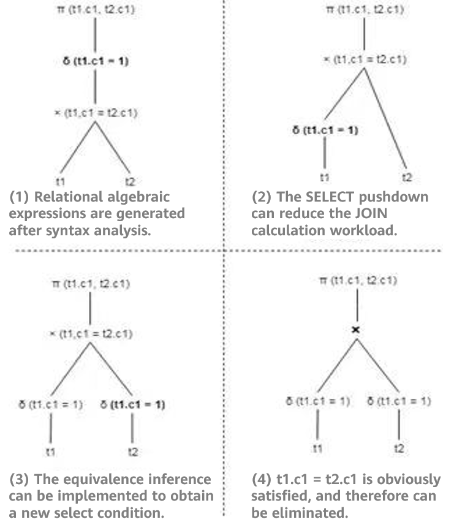

Figure 1 Comparison before and after query rewriting

As shown in Figure 1 \(1\), 100 rows of data in tables t1 and t2 are scanned and joined to generate the intermediate result, and then the selection operation is performed. The final result contains only one row of data. If equivalence inference is used, it may be obtained that values in \{t1.c1, t2.c1, 1\} are equivalent to each other. Therefore, a new selection condition of t2.c1 = 1 is deduced, and the condition is pushed down to t2. In this way, the rewritten logical plan in Figure 1 \(4\) is obtained. As shown in the preceding figure, the rewritten logical plan only needs to obtain one piece of data from the base table. During join, there is only one piece of data in the inner and outer tables. In addition, the filter criteria in the final result are not required, greatly improving the performance.

At the code level, the architecture of query rewriting is roughly shown in Figure 2.

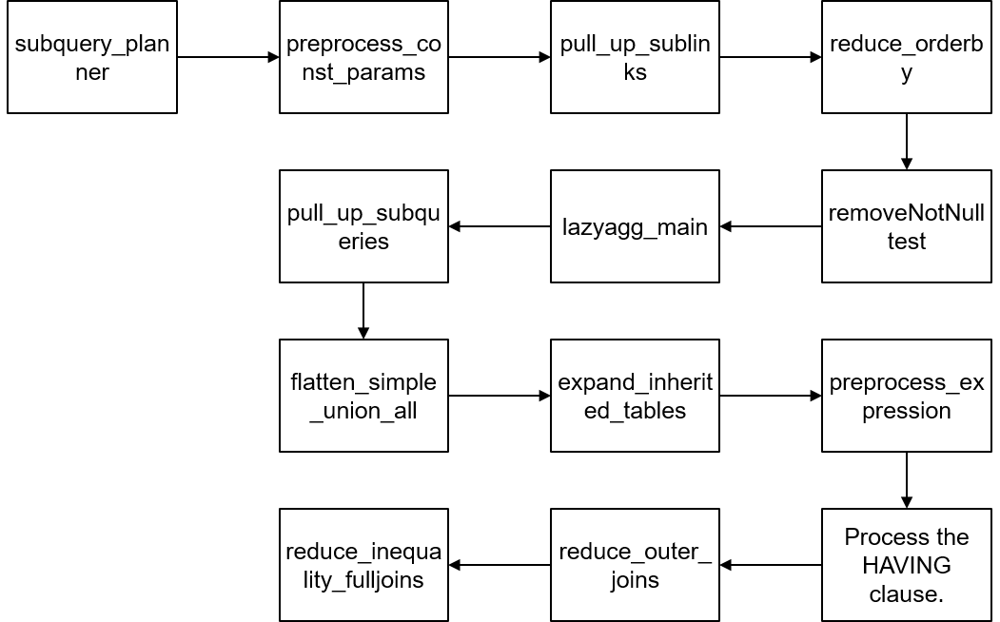

Figure 2 Architecture of query rewriting

- \(1\) Pulling up a subquery: When a subquery appears in RangeTableEntry, it stores a subquery tree. If the subquery is not pulled up, a subquery execution plan is formed after query optimization. The upper-layer execution plan and subquery plan perform nested loops to obtain the final result. In this process, the query optimization module does not have so many optimization choices for the subquery. If the subquery is pulled up, it is joined with tables at the upper layer.

- \(2\) Constant replacement: Because the constant reference speed is faster, the variable can be replaced by the calculated constant. The implementation function is preprocess_const_params.

- \(3\) Replacing common table expressions \(CTEs\) with subqueries: Theoretically, CTEs have the same performance as subqueries. However, subqueries can be further pulled up, rewritten, and optimized. Therefore, subqueries are used to replace CTEs. The implementation function is substitute_ctes_with_subqueries.

- \(4\) Replacing multi count \(distinct\) with multiple subqueries: If this type of query occurs, multiple count \(distinct\) queries are replaced with multiple subqueries. Each subquery contains a count \(distinct\) expression. The implementation function is convert_multi_count_distinct.

- \(5\) Pulling up sublinks: Sublinks appear in constraints such as WHERE and ON, and are usually used together with predicates such as ANY, ALL, IN, EXISTS, and SOME. Although sublinks are clear from the logical level of statements, the efficiency varies. For example, the execution result of a correlated sublink is related to the parent query. That is, each tuple of the parent query corresponds to the re-evaluation of the sublink. In this case, you can pull up the sublink to improve efficiency. In this part, ANY and EXISTS sublinks are pulled up to SemiJoin or Anti-SemiJoin. The implementation function is pull_up_sublinks.

- \(5\) Reducing ORDER BY: In the parent query, database records may need to be reordered. Therefore, reducing the number of ORDER BY statements in the subquery can improve the efficiency. The implementation function is reduce_orderby.

- \(6\) Deleting NotNullTest: Deleting related non-null tests can improve efficiency. The implementation function is removeNotNullTest.

- \(7\) Lazy Agg rewriting: Lazy aggregation is used to reduce the number of aggregation times. The implementation function is lazyagg_main.

- \(8\) A lot of work has been done to optimize the join operation to obtain a better execution plan. The implementation function is pull_up_subqueries.

- \(9\) UNION ALL optimization: The UNION ALL operation at the top layer is processed to convert the UNION ALL set operation to the AppendRelInfo operation. The implementation function is flatten_simple_union_all.

- \(10\) Expanding an inherited table: If an inherited table is used during the execution of a query statement, the inherited table exists as a parent table. The parent table needs to be expanded into multiple inherited tables. The implementation function is expand_inherited_tables.

- \(11\) Expression preprocessing: This module standardizes expressions in the query tree, including replacing the alias Var generated by links, evaluating constant expressions, leveling constraints, and generating execution plans for sublinks. The implementation function is preprocess_expression.

- \(12\) Processing the HAVING clause: In the HAVING clause, some constraints can be converted into filter conditions \(corresponding to WHERE\). The constraints in the HAVING clause are split to improve efficiency.

- \(13\) Outer join elimination: The purpose is to convert an outer join to an inner join to simplify the query optimization process. The reduce_outer_join function is used.

- \(14\) Full join rewriting: Rewrites the full join function to improve its functionality. For example, the statement **SELECT \* FROM t1 FULL JOIN t2 ON TRUE** can be converted to **SELECT \* FROM t1 LEFT JOIN t2 ON TRUE UNION ALL \(SELECT \* FROM t1 RIGHT ANTI FULL JOIN t2 ON TRUE\)**. The implementation function is reduce_inequality_fulljoins.

  The following uses pulling up sublinks as an example to describe the most important subquery optimization in openGauss. A sublink is a special subquery. It appears in constraints such as WHERE and ON, and is often accompanied by predicates such as ANY, EXISTS, ALL, IN, and SOME. The openGauss database sets different SUBLINK types for different predicates. The code is as follows:

  ```
  Typedef enum SubLinkType {
  EXISTS_SUBLINK,
  ALL_SUBLINK,
  ANY_SUBLINK,
  ROWCOMPARE_SUBLINK,
  EXPR_SUBLINK,
  ARRAY_SUBLINK,
  CTE_SUBLINK
  } SubLinkType;
  ```

  The openGauss database defines an independent structure SubLink for sublinks, which describes the sublink types and operators. The code is as follows:

  ```
  Typedef struct SubLink {
  Expr xpr;
  SubLinkType subLinkType;
  Node* testexpr;
  List* operName;
  Node* subselect;
  Int location;
  } SubLink;
  ```

  Figure 3 shows the interface functions related to pulling up sublinks.

  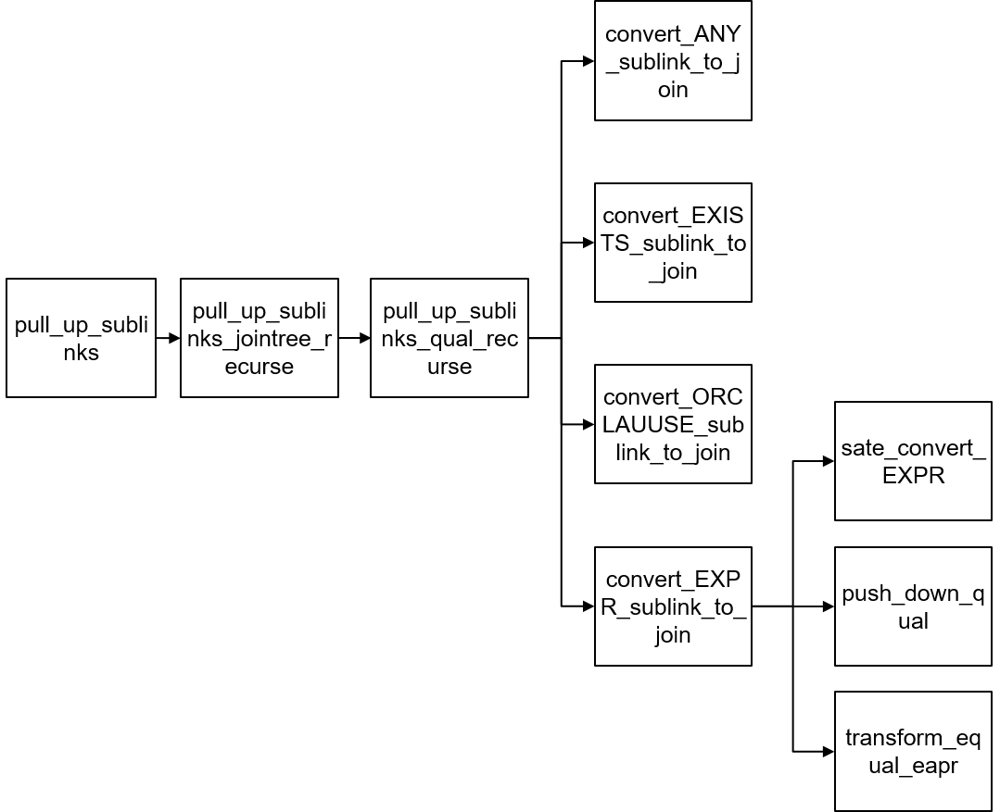

  Figure 3 Interface functions related to sublinks

  The main process of pulling up sublinks is implemented in the pull_up_sublinks function. The pull_up_sublinks function invokes pull_up_sublinks_jointree_recurse to recursively process nodes in Query-\>jointree. Table 3 lists the input parameters of the function.

  Table 3 Input parameters of the function

  <a name="table225074961514"></a>

  <table><thead ><tr id="row22031850101510"><th class="cellrowborder"  width="19.66%" id="mcps1.1.4.1.1"><p id="p13203115021518"><a name="p13203115021518"></a><a name="p13203115021518"></a>Parameter</p>
  </th>
  <th class="cellrowborder"  width="23.25%" id="mcps1.1.4.1.2"><p id="p92031350171518"><a name="p92031350171518"></a><a name="p92031350171518"></a>Type</p>
  </th>
  <th class="cellrowborder"  width="57.089999999999996%" id="mcps1.1.4.1.3"><p id="p12039504155"><a name="p12039504155"></a><a name="p12039504155"></a>Description</p>
  </th>
  </tr>
  </thead>
  <tbody><tr id="row11203550171517"><td class="cellrowborder"  width="19.66%" headers="mcps1.1.4.1.1 "><p id="p12203450111513"><a name="p12203450111513"></a><a name="p12203450111513"></a>root</p>
  </td>
  <td class="cellrowborder"  width="23.25%" headers="mcps1.1.4.1.2 "><p id="p11203175051517"><a name="p11203175051517"></a><a name="p11203175051517"></a>PlannerInfo*</p>
  </td>
  <td class="cellrowborder"  width="57.089999999999996%" headers="mcps1.1.4.1.3 "><p id="p10203850171519"><a name="p10203850171519"></a><a name="p10203850171519"></a>Input parameter, which is used to query the context information about the optimization module.</p>
  </td>
  </tr>
  <tr id="row10203165091510"><td class="cellrowborder"  width="19.66%" headers="mcps1.1.4.1.1 "><p id="p520413509152"><a name="p520413509152"></a><a name="p520413509152"></a>jnode</p>
  </td>
  <td class="cellrowborder"  width="23.25%" headers="mcps1.1.4.1.2 "><p id="p12041550171515"><a name="p12041550171515"></a><a name="p12041550171515"></a>Node*</p>
  </td>
  <td class="cellrowborder"  width="57.089999999999996%" headers="mcps1.1.4.1.3 "><p id="p132042506157"><a name="p132042506157"></a><a name="p132042506157"></a>Input parameter, which indicates the node to be recursively processed. The value can be RangeTblRef, FromExpr, or JoinExpr.</p>
  </td>
  </tr>
  <tr id="row132045506159"><td class="cellrowborder"  width="19.66%" headers="mcps1.1.4.1.1 "><p id="p1020455010157"><a name="p1020455010157"></a><a name="p1020455010157"></a>relids</p>
  </td>
  <td class="cellrowborder"  width="23.25%" headers="mcps1.1.4.1.2 "><p id="p720495061516"><a name="p720495061516"></a><a name="p720495061516"></a>Relids*</p>
  </td>
  <td class="cellrowborder"  width="57.089999999999996%" headers="mcps1.1.4.1.3 "><p id="p1420415505157"><a name="p1420415505157"></a><a name="p1420415505157"></a>Output parameter, which is a set of tables involved in the jnode parameter.</p>
  </td>
  </tr>
  <tr id="row12204145081514"><td class="cellrowborder"  width="19.66%" headers="mcps1.1.4.1.1 "><p id="p1320495031511"><a name="p1320495031511"></a><a name="p1320495031511"></a>Return value</p>
  </td>
  <td class="cellrowborder"  width="23.25%" headers="mcps1.1.4.1.2 "><p id="p4204350181515"><a name="p4204350181515"></a><a name="p4204350181515"></a>Node*</p>
  </td>
  <td class="cellrowborder"  width="57.089999999999996%" headers="mcps1.1.4.1.3 "><p id="p11204125014159"><a name="p11204125014159"></a><a name="p11204125014159"></a>Node after the sublink is pulled up.</p>
  </td>
  </tr>
  </tbody>
  </table>

  There are three types of jnodes: RangeTblRef, FromExpr, and JoinExpr, which are processed by the pull_up_sublinks_jointree_recurse function separately.

- RangeTblRef

  RangeTblRef is a leaf node of Query-\>jointree and is the condition for ending the function recursion. When the program reaches this branch, there are two cases:

  - **\(1\) If the current statement is a single table query and has no join, the recursion proceeds until it ends. Then, the program checks whether the sublink meets other pull-up conditions.**
  - \(2\) If the query statement has joins, during the recursion of From-\>fromlist, JoinExpr-\>larg, or JoinExpr-\>rarg, when it traverses the RangeTblRef leaf node, relids \(a set of tables\) of the RangeTblRef node is returned to the upper layer to determine whether the sublink can be pulled up.

- FromExpr

  - \(1\) Traverse the nodes in From-\>fromlist recursively, and then invoke the pull_up_sublinks_jointree_recurse function recursively for each node until reaching the RangeTblRef leaf node.
  - \(2\) Invoke the pull_up_sublinks_qual_recurse function to process From-\>qual and process ANY_SUBLINK or EXISTS_SUBLINK that may occur.

- JoinExpr

  **\(1\) Invoke the pull_up_sublinks_jointree_recurse function to recursively process JoinExpr-\>larg and JoinExpr-\>rarg until reaching the RangeTblRef leaf node. In addition, check whether the sublink can be pulled up based on the join type.**

  \(2\) Invoke the pull_up_sublinks_qual_recurse function to process JoinExpr-\>quals and process ANY_SUBLINK or EXISTS_SUBLINK that may occur. The **available_rels1** parameter of the pull_up_sublinks_qual_recurse function varies depending on the join type.

  In addition to ANY_SUBLINK and EXISTS_SUBLINK, the pull_up_sublinks_qual_recurse function also performs query rewriting for OR clauses and EXPR-type sublinks. The code logic of pulling up sublinks of the Expr type is as follows:

  - \(1\) Use the safe_convert_EXPR function to check whether the sublink can be pulled up. The code is as follows:

    ```
    //Check whether the current SQL statement meets the condition for pulling up the sublink.
    if (subQuery->cteList ||
    subQuery->hasWindowFuncs ||
    subQuery->hasModifyingCTE ||
    subQuery->havingQual ||
    subQuery->groupingSets ||
    subQuery->groupClause ||
    subQuery->limitOffset ||
    subQuery->rowMarks ||
    subQuery->distinctClause ||
    subQuery->windowClause) {
    ereport(DEBUG2,
    (errmodule(MOD_OPT_REWRITE),
    (errmsg("[Expr sublink pull up failure reason]: Subquery includes cte, windowFun, havingQual, group, "
    "limitoffset, distinct or rowMark."))));
    return false;
    }
    ```

  - \(2\) Use the push_down_qual function to extract related conditions from the sublink. The code is as follows:

    ```
    Static Node* push_down_qual(PlannerInfo* root, Node* all_quals, List* pullUpEqualExpr)
    {
    If (all_quals== NULL) {
    Return NULL;
    }

    List* pullUpExprList = (List*)copyObject(pullUpEqualExpr);
    Node* all_quals_list = (Node*)copyObject(all_quals);

    set_varno_attno(root->parse, (Node*)pullUpExprList, true);
    set_varno_attno(root->parse, (Node*)all_quals_list, false);

    Relids varnos = pull_varnos((Node*)pullUpExprList, 1);
    push_qual_context qual_list;
    SubLink* any_sublink = NULL;
    Node* push_quals = NULL;
    Int attnum = 0;

    While ((attnum = bms_first_member(varnos)) >= 0) {
    RangeTblEntry* r_table = (RangeTblEntry*)rt_fetch(attnum, root->parse->rtable);

    // This table must be a base table. Otherwise, it cannot be processed.
    If (r_table->rtekind == RTE_RELATION) {
    qual_list.varno = attnum;
    qual_list.qual_list = NIL;

    // Obtain the condition that contains the special varno.
    get_varnode_qual(all_quals_list, &qual_list);

    If (qual_list.qual_list != NIL && !contain_volatile_functions((Node*)qual_list.qual_list)) {
    any_sublink = build_any_sublink(root, qual_list.qual_list, attnum,pullUpExprList);
    push_quals = make_and_qual(push_quals, (Node*)any_sublink);
    }

    list_free_ext(qual_list.qual_list);
    }
    }

    list_free_deep(pullUpExprList);
    pfree_ext(all_quals_list);

    return push_quals;
    }
    ```

  - **\(3\) Use the transform_equal_expr function to construct a subquery to be pulled up. \(Add a GROUP BY clause and delete related conditions.\) The code is as follows:**

    ```
    // Add GROUP BY and windowClasues for SubQuery.
    if (isLimit) {
    append_target_and_windowClause(root,subQuery,(Node*)copyObject(node), false);
    } else {
    append_target_and_group(root, subQuery, (Node*)copyObject(node));
    }
    // Delete related conditions.
    subQuery->jointree = (FromExpr*)replace_node_clause((Node*)subQuery->jointree,
    (Node*)pullUpEqualExpr,
    (Node*)constList,
    RNC_RECURSE_AGGREF | RNC_COPY_NON_LEAF_NODES);
    ```

  - \(4\) Construct the conditions that need to be pulled up. The code is as follows:

    ```
    // Construct the conditions to be pulled up.
    joinQual = make_and_qual((Node*)joinQual, (Node*)pullUpExpr);
    ...
    Return joinQual;
    ```

  - \(5\) Generate a join expression. The code is as follows:

    ```
    // Generate a join expression.
    if (IsA(*currJoinLink, JoinExpr)) {
    ((JoinExpr*)*currJoinLink)->quals = replace_node_clause(((JoinExpr*)*currJoinLink)->quals,
    tmpExprQual,
    makeBoolConst(true, false),
    RNC_RECURSE_AGGREF | RNC_COPY_NON_LEAF_NODES);

    } else if (IsA(*currJoinLink, FromExpr)) {
    ((FromExpr*)*currJoinLink)->quals = replace_node_clause(((FromExpr*)*currJoinLink)->quals,
    tmpExprQual,
    makeBoolConst(true, false),
    RNC_RECURSE_AGGREF | RNC_COPY_NON_LEAF_NODES);
    }

    rtr = (RangeTblRef *) makeNode(RangeTblRef);
    rtr->rtindex = list_length(root->parse->rtable);

    // Construct the JoinExpr of the left join.
    JoinExpr *result = NULL;
    result = (JoinExpr *) makeNode(JoinExpr);
    result->jointype = JOIN_LEFT;
    result->quals = joinQual;
    result->larg = *currJoinLink;
    result->rarg = (Node *) rtr;

    // Add JoinExpr to rangetableentry. In subsequent processing, the left outer join can be converted to an inner join.
    rte = addRangeTableEntryForJoin(NULL,
    NIL,
    result->jointype,
    NIL,
    result->alias,
    true);
    root->parse->rtable = lappend(root->parse->rtable, rte);
    ```

## Statistics and Cost Estimation<a name="ZH-CN_TOPIC_0000001212379948"></a>

In different data distribution, the execution efficiency of the same query plan may be significantly different. Therefore, the impact of data distribution on the plan should also be considered during plan selection. Unlike common logical optimization, physical optimization builds plan optimization on data and improves performance by minimizing data operation costs. In terms of functions, the physical optimization of openGauss involves the following three key steps:

\(1\) Data distribution generation: Mines data distribution from data tables and stores the data.

\(2\) Plan cost estimation: Based on data distribution, a cost model is established to estimate the actual execution time of a plan.

\(3\) Optimal plan selection: Based on the cost estimation, the system searches for the plan with the minimum cost from the candidate plans.

First, introduce the concepts related to data distribution and the internal storage mode of the database.

### 1. Data Distribution Storage<a name="section9421354121112"></a>

The distribution of dataset _D_ consists of the frequencies of different values on _D_. Assume that _D_ is the projection data in the **Grade** column of Table 4. This column has three values 1, 2, and 3. For details about the frequency distribution, see Table 5. Here, the number of **Grade** values is referred to as number of distinct values \(NDV\).

Table 4 Grade attribute distribution

<a name="table4260749171515"></a>

<table><tbody><tr id="row22067508159"><td class="cellrowborder"  width="25%"><p id="p0206185061516"><a name="p0206185061516"></a><a name="p0206185061516"></a>Sno</p>
</td>
<td class="cellrowborder"  width="25%"><p id="p112064509153"><a name="p112064509153"></a><a name="p112064509153"></a>Name</p>
</td>
<td class="cellrowborder"  width="25%"><p id="p620665014154"><a name="p620665014154"></a><a name="p620665014154"></a>Gender</p>
</td>
<td class="cellrowborder"  width="25%"><p id="p102061950151510"><a name="p102061950151510"></a><a name="p102061950151510"></a>Grade</p>
</td>
</tr>
<tr id="row42061850191515"><td class="cellrowborder"  width="25%"><p id="p8206195011520"><a name="p8206195011520"></a><a name="p8206195011520"></a>001</p>
</td>
<td class="cellrowborder"  width="25%"><p id="p420618500150"><a name="p420618500150"></a><a name="p420618500150"></a>Xiao Zhang</p>
</td>
<td class="cellrowborder"  width="25%"><p id="p62071550131515"><a name="p62071550131515"></a><a name="p62071550131515"></a>Male</p>
</td>
<td class="cellrowborder"  width="25%"><p id="p6207250131516"><a name="p6207250131516"></a><a name="p6207250131516"></a>1</p>
</td>
</tr>
<tr id="row1020745017153"><td class="cellrowborder"  width="25%"><p id="p122072050111515"><a name="p122072050111515"></a><a name="p122072050111515"></a>002</p>
</td>
<td class="cellrowborder"  width="25%"><p id="p620725061520"><a name="p620725061520"></a><a name="p620725061520"></a>Xiao Li</p>
</td>
<td class="cellrowborder"  width="25%"><p id="p1420719505158"><a name="p1420719505158"></a><a name="p1420719505158"></a>Male</p>
</td>
<td class="cellrowborder"  width="25%"><p id="p520745010152"><a name="p520745010152"></a><a name="p520745010152"></a>2</p>
</td>
</tr>
<tr id="row1620715071515"><td class="cellrowborder"  width="25%"><p id="p820810503154"><a name="p820810503154"></a><a name="p820810503154"></a>003</p>
</td>
<td class="cellrowborder"  width="25%"><p id="p2208150101517"><a name="p2208150101517"></a><a name="p2208150101517"></a>Xiao Wang</p>
</td>
<td class="cellrowborder"  width="25%"><p id="p1420855013158"><a name="p1420855013158"></a><a name="p1420855013158"></a>Male</p>
</td>
<td class="cellrowborder"  width="25%"><p id="p62086501159"><a name="p62086501159"></a><a name="p62086501159"></a>3</p>
</td>
</tr>
<tr id="row4208450121518"><td class="cellrowborder"  width="25%"><p id="p10208135051515"><a name="p10208135051515"></a><a name="p10208135051515"></a>004</p>
</td>
<td class="cellrowborder"  width="25%"><p id="p152081950141517"><a name="p152081950141517"></a><a name="p152081950141517"></a>Xiao Zhou</p>
</td>
<td class="cellrowborder"  width="25%"><p id="p2020825021516"><a name="p2020825021516"></a><a name="p2020825021516"></a>Female</p>
</td>
<td class="cellrowborder"  width="25%"><p id="p420885091517"><a name="p420885091517"></a><a name="p420885091517"></a>1</p>
</td>
</tr>
<tr id="row720811505158"><td class="cellrowborder"  width="25%"><p id="p142082050101511"><a name="p142082050101511"></a><a name="p142082050101511"></a>005</p>
</td>
<td class="cellrowborder"  width="25%"><p id="p8208205012159"><a name="p8208205012159"></a><a name="p8208205012159"></a>Xiao Chen</p>
</td>
<td class="cellrowborder"  width="25%"><p id="p9208450181517"><a name="p9208450181517"></a><a name="p9208450181517"></a>Female</p>
</td>
<td class="cellrowborder"  width="25%"><p id="p122081507152"><a name="p122081507152"></a><a name="p122081507152"></a>1</p>
</td>
</tr>
</tbody>
</table>

Table 5 Grade frequency distribution

<a name="table1135614961512"></a>

<table><tbody><tr id="row72081850121510"><td class="cellrowborder"  width="31.130000000000003%"><p id="p1520812506151"><a name="p1520812506151"></a><a name="p1520812506151"></a>Grade</p>
</td>
<td class="cellrowborder"  width="21.85%"><p id="p1920810505159"><a name="p1920810505159"></a><a name="p1920810505159"></a>1</p>
</td>
<td class="cellrowborder"  width="25.169999999999998%"><p id="p13208650121516"><a name="p13208650121516"></a><a name="p13208650121516"></a>2</p>
</td>
<td class="cellrowborder"  width="21.85%"><p id="p16208125011514"><a name="p16208125011514"></a><a name="p16208125011514"></a>3</p>
</td>
</tr>
<tr id="row182089505156"><td class="cellrowborder"  width="31.130000000000003%"><p id="p2020812500151"><a name="p2020812500151"></a><a name="p2020812500151"></a>Frequency</p>
</td>
<td class="cellrowborder"  width="21.85%"><p id="p11208450201513"><a name="p11208450201513"></a><a name="p11208450201513"></a>3</p>
</td>
<td class="cellrowborder"  width="25.169999999999998%"><p id="p10208175011510"><a name="p10208175011510"></a><a name="p10208175011510"></a>1</p>
</td>
<td class="cellrowborder"  width="21.85%"><p id="p220835018158"><a name="p220835018158"></a><a name="p220835018158"></a>1</p>
</td>
</tr>
</tbody>
</table>

_D_ may relate to a plurality of attributes, and distribution of the plurality of attributes is referred to as joint distribution. The value space of the joint distribution may be very large. From the perspective of performance, the database does not store the joint distribution of _D_, but stores the attribute distribution of _D_ separately. For example, the database stores the frequency of \{Gender='Male'\} and \{Grade='1'\}, instead of \{Gender='Male', Grade='1'\}. This practice loses much of the information distributed on _D_. As will be seen in the subsequent section on selectivity and data distribution, openGauss will use prediction techniques to infer the joint distribution when the system requires it. Although, in some cases, the results of this speculation may differ significantly from the actual situation.

The data structure of data distribution is especially critical to understanding how the database stores this information. Generally, a key-value \(KV\) pair is the most commonly used structure for describing distribution, where key indicates a value, and value indicates a frequency. However, when the NDV is large, the expansion of the key value causes low storage and read performance of the KV. To improve efficiency, the openGauss uses the "KV vector + histogram" to indicate the attribute distribution.

**Logical structure of data distribution**: A high-frequency value frequency is stored by using a KV, and its storage structure is referred to as a most common value \(MCV\). A frequency other than the high-frequency value is described by using an equal-bin-count histogram \(EH\). In the implementation, the openGauss puts the k \(k = 100\) key values with the highest frequency into the MCV, and puts the other key values into the EH.

It should be noted that the EH combines the frequencies of multiple values, which significantly improves the access efficiency but also blurs the distribution. However, as can be seen in the following sections, the high frequency value is more critical to the estimation of the plan cost than the low frequency value. Therefore, this hybrid strategy, which trades for high performance at the cost of losing the accuracy of low frequency values, is undoubtedly a fairly cost-effective approach.

**Storage location of data distribution**: In openGauss, information such as the MCV and EH is stored in the PG_STATISTIC system catalog. Table 6 describes the table definition.

Table 6 Definitions of the PG_STATISTIC system catalog

<a name="table1136015493151"></a>

<table><tbody><tr id="row3209185019155"><td class="cellrowborder"  width="12.5%"><p id="p620965013159"><a name="p620965013159"></a><a name="p620965013159"></a>starelid</p>
</td>
<td class="cellrowborder"  width="12.5%"><p id="p102096501155"><a name="p102096501155"></a><a name="p102096501155"></a>staattnum</p>
</td>
<td class="cellrowborder"  width="12.5%"><p id="p1520925051514"><a name="p1520925051514"></a><a name="p1520925051514"></a>stanullfrac</p>
</td>
<td class="cellrowborder"  width="12.5%"><p id="p7209205021513"><a name="p7209205021513"></a><a name="p7209205021513"></a>stakind1</p>
</td>
<td class="cellrowborder"  width="12.5%"><p id="p82091650111511"><a name="p82091650111511"></a><a name="p82091650111511"></a>stanumbers1</p>
</td>
<td class="cellrowborder"  width="12.5%"><p id="p520935051511"><a name="p520935051511"></a><a name="p520935051511"></a>stavalues1</p>
</td>
<td class="cellrowborder"  width="12.5%"><p id="p192091550151518"><a name="p192091550151518"></a><a name="p192091550151518"></a>Stakind2</p>
</td>
<td class="cellrowborder"  width="12.5%"><p id="p16209165051516"><a name="p16209165051516"></a><a name="p16209165051516"></a>...</p>
</td>
</tr>
<tr id="row122091150131518"><td class="cellrowborder"  width="12.5%"><p id="p2020975014155"><a name="p2020975014155"></a><a name="p2020975014155"></a>0001</p>
</td>
<td class="cellrowborder"  width="12.5%"><p id="p15209185011516"><a name="p15209185011516"></a><a name="p15209185011516"></a>1</p>
</td>
<td class="cellrowborder"  width="12.5%"><p id="p220910506154"><a name="p220910506154"></a><a name="p220910506154"></a>0</p>
</td>
<td class="cellrowborder"  width="12.5%"><p id="p14209250171516"><a name="p14209250171516"></a><a name="p14209250171516"></a>1</p>
</td>
<td class="cellrowborder"  width="12.5%"><p id="p18209650111514"><a name="p18209650111514"></a><a name="p18209650111514"></a>{0.2851, 0.1345}</p>
</td>
<td class="cellrowborder"  width="12.5%"><p id="p32091150131510"><a name="p32091150131510"></a><a name="p32091150131510"></a>{1, 2}</p>
</td>
<td class="cellrowborder"  width="12.5%"><p id="p192091550191510"><a name="p192091550191510"></a><a name="p192091550191510"></a>2</p>
</td>
<td class="cellrowborder"  width="12.5%">&nbsp;&nbsp;</td>
</tr>
<tr id="row202091450171513"><td class="cellrowborder"  width="12.5%"><p id="p22091550171511"><a name="p22091550171511"></a><a name="p22091550171511"></a>0001</p>
</td>
<td class="cellrowborder"  width="12.5%"><p id="p921015505159"><a name="p921015505159"></a><a name="p921015505159"></a>2</p>
</td>
<td class="cellrowborder"  width="12.5%"><p id="p19210185016158"><a name="p19210185016158"></a><a name="p19210185016158"></a>0</p>
</td>
<td class="cellrowborder"  width="12.5%"><p id="p10210125020152"><a name="p10210125020152"></a><a name="p10210125020152"></a>1</p>
</td>
<td class="cellrowborder"  width="12.5%"><p id="p3210050131517"><a name="p3210050131517"></a><a name="p3210050131517"></a>{0.1955, 0.1741}</p>
</td>
<td class="cellrowborder"  width="12.5%"><p id="p1121055011154"><a name="p1121055011154"></a><a name="p1121055011154"></a>{mathematics, language}</p>
</td>
<td class="cellrowborder"  width="12.5%"><p id="p221095016154"><a name="p221095016154"></a><a name="p221095016154"></a>2</p>
</td>
<td class="cellrowborder"  width="12.5%">&nbsp;&nbsp;</td>
</tr>
</tbody>
</table>

One tuple in Table 6 stores statistics of one attribute. The following describes the attribute meanings of tuples.

\(1\) The **starelid/staattnum** attribute indicates the table OID and attribute ID.

\(2\) The attribute **stanullfrac** indicates the percentage of null values in the attribute. The value **0** indicates that the column has no null value.

\(3\) The attribute group **\{stakind1, stanumbers1, stavalues1\}** forms a slot in the PG_STATISTIC system catalog and stores information about a data structure type in Table 7. There are five slots in the PG_STATISTIC system catalog. Generally, the first slot stores the MCV information, and the second slot stores the EH information. Take the MCV slot as an example. The **stakind1** attribute indicates that the slot type is MCV, and **1** is the enumerated value of STATISTIC_KIND_MCV. The **stanumbers1** and **stavalues1** attributes record the MCV content. The **stavalues1** attribute records the key value, and the **stanumbers1** attribute records the frequency corresponding to the key. In the preceding example, the frequency ratio for value **1** is 0.2851, and the frequency ratio for value **2** is 0.1345.

Table 7 Description of PG_STATISTIC

<a name="table1237124913155"></a>

<table><tbody><tr id="row0211155091518"><td class="cellrowborder"  width="50%"><p id="p11211135016154"><a name="p11211135016154"></a><a name="p11211135016154"></a>Type</p>
</td>
<td class="cellrowborder"  width="50%"><p id="p021195017154"><a name="p021195017154"></a><a name="p021195017154"></a>Description</p>
</td>
</tr>
<tr id="row19211145019153"><td class="cellrowborder"  width="50%"><p id="p172112504152"><a name="p172112504152"></a><a name="p172112504152"></a>STATISTIC_KIND_MCV</p>
</td>
<td class="cellrowborder"  width="50%"><p id="p20211105020154"><a name="p20211105020154"></a><a name="p20211105020154"></a>High-frequency values (MCVs): The values that appear most frequently in a column are sorted according to the occurrence frequency, and a corresponding frequency array is generated. In this way, you can know the high-frequency values in a column and the frequencies of these high-frequency values.</p>
</td>
</tr>
<tr id="row221115071519"><td class="cellrowborder"  width="50%"><p id="p2211175015155"><a name="p2211175015155"></a><a name="p2211175015155"></a>STATISTIC_KIND_HISTOGRAM</p>
</td>
<td class="cellrowborder"  width="50%"><p id="p22111550111513"><a name="p22111550111513"></a><a name="p22111550111513"></a>Histogram. The openGauss database uses an EH to describe the distribution of data in a column. High-frequency values are not displayed in the histogram, ensuring that the data distribution is relatively flat.</p>
</td>
</tr>
<tr id="row12111650161511"><td class="cellrowborder"  width="50%"><p id="p16211115010151"><a name="p16211115010151"></a><a name="p16211115010151"></a>STATISTIC_KIND_CORRELATION</p>
</td>
<td class="cellrowborder"  width="50%"><p id="p14211250151520"><a name="p14211250151520"></a><a name="p14211250151520"></a>Correlation coefficient. The correlation coefficient records the correlation between the unsorted data distribution and the sorted data distribution in the current column. This value is used to estimate the cost during index scanning. Assume that the correlation between the unsorted data distribution and sorted data distribution in a column is 0, that is, the data is not correlated. In this case, the cost of index scanning is higher.</p>
</td>
</tr>
<tr id="row1211135017154"><td class="cellrowborder"  width="50%"><p id="p13211175018155"><a name="p13211175018155"></a><a name="p13211175018155"></a>STATISTIC_KIND_MCELEM</p>
</td>
<td class="cellrowborder"  width="50%"><p id="p5211175012158"><a name="p5211175012158"></a><a name="p5211175012158"></a>High-frequency type values (MCVs), which is used for the array type or other types. The openGauss database provides the ts_typanalyze system function to generate statistics of this type.</p>
</td>
</tr>
<tr id="row7211750151517"><td class="cellrowborder"  width="50%"><p id="p1421115031519"><a name="p1421115031519"></a><a name="p1421115031519"></a>STATISTIC_KIND_DECHIST</p>
</td>
<td class="cellrowborder"  width="50%"><p id="p4211175010159"><a name="p4211175010159"></a><a name="p4211175010159"></a>Array histogram, which is used to generate histograms for array types. The openGauss database provides the array_typanalyze system function to generate statistics of this type.</p>
</td>
</tr>
</tbody>
</table>

Note that data distribution and the content of the PG_STATISTIC system catalog are not automatically generated when the table is created. They are generated when the ANALYZE operation is performed on the table.

### 2. Data Distribution Extraction<a name="section18581183813126"></a>

This section describes the logical structure and storage of data distribution in the openGauss. How can we obtain data distribution information from data? The following describes the distribution extraction process in the openGauss. To deepen the understanding of the method, let's begin with analyzing the challenges.

The most direct way to obtain the distribution is to traverse all data and generate the MCV and EH information directly by counting. However, in practice, there may be a large amount of data, and the I/O cost of traversal is usually unacceptable. For example, the bill data of a bank involves hundreds of billions of records and is stored at the TB level. In addition to the I/O cost, the memory consumption of the counting process may exceed the upper limit, which makes the algorithm implementation especially difficult. Therefore, a more realistic approach is to reduce the scale of data analysis and use small sample analysis to estimate the overall data distribution. Then, the quality of selected samples is particularly important.

Currently, the sample generation process of the openGauss database is implemented in the acquire_sample_rows function, which uses the two-phase sampling algorithm to estimate the data distribution. In the first phase, an S algorithm is used to randomly sample a physical page, to generate a sample S1. In the second phase, a Z \(Vitter\) algorithm is used to perform reservoir sampling on tuples included in S1, to finally generate a sample S2 including 30000 tuples. The two-phase algorithm ensures that S2 is an unbiased sample of the original data. Therefore, you can infer the original data distribution by analyzing S2 and record the distribution information in the PG_STATISTIC system catalog.

openGauss divides sample generation into two steps to improve sampling efficiency. A theoretical basis of the method depends on the following practical condition: A quantity _M_ of physical pages occupied by data can be accurately obtained, but a quantity _n_ of tuples included in each physical page is unknown. Because _M_ is known, the S algorithm may evenly sample a page by using a probability of 1/_M_, and may generate a small sample S1 of original data. Generally, a tuple belonging to any physical page is an equal probability event, which ensures that S1 is an unbiased sample. However, the total number of tuples in S1 is far less than that of original data, so costs of performing secondary sampling on S1 are greatly reduced. The main reason why the S algorithm is not used in the second phase is that the total number of tuples _N_ of S1 is unknown \(because _n_ is unknown\), and the sampling probability \(1/_N_\) cannot be obtained using the S algorithm. The Z \(Vitter\) algorithm is a reservoir sampling algorithm, which can ensure uniform sampling when the total amount of data is unknown. The principle of reservoir sampling algorithm is not the focus of this section. You can refer to related information by yourself.

### 3. Selectivity and Data Distribution<a name="section15481195914128"></a>

SQL query often contains the WHERE constraint \(filtering condition\), for example,** SELECT \* FROM student WHERE gender = 'male';** and **SELECT \* FROM student WHERE grade \> '1'**. What is the actual effect of the constraint on the query result? In order to measure the effectiveness of constraints, the concept of selectivity is first introduced.

**Selectivity**: Given the query dataset _C_ \(which can be a data table or any intermediate result set\) and constraint expression _x_, the selectivity of _x_ relative to _C_ is defined as follows:


Where, |C| indicates the total number of records in _C_, and |C|x indicates the number of records that meet the _x_ constraint on _C_. As shown in Table 8, when _x_ is **"grade = 1"**, 3/5.


Table 8 Selectivity of dataset C

<a name="table103784496159"></a>

<table><tbody><tr id="row5212950111510"><td class="cellrowborder"  width="25%"><p id="p18212105016158"><a name="p18212105016158"></a><a name="p18212105016158"></a>Sno</p>
</td>
<td class="cellrowborder"  width="25%"><p id="p2212145012152"><a name="p2212145012152"></a><a name="p2212145012152"></a>Name</p>
</td>
<td class="cellrowborder"  width="25%"><p id="p20212450111514"><a name="p20212450111514"></a><a name="p20212450111514"></a>Gender</p>
</td>
<td class="cellrowborder"  width="25%"><p id="p621285012151"><a name="p621285012151"></a><a name="p621285012151"></a>Grade</p>
</td>
</tr>
<tr id="row1521255051519"><td class="cellrowborder"  width="25%"><p id="p82121250121511"><a name="p82121250121511"></a><a name="p82121250121511"></a>001</p>
</td>
<td class="cellrowborder"  width="25%"><p id="p12212175021518"><a name="p12212175021518"></a><a name="p12212175021518"></a>Xiao Zhang</p>
</td>
<td class="cellrowborder"  width="25%"><p id="p52123509151"><a name="p52123509151"></a><a name="p52123509151"></a>Male</p>
</td>
<td class="cellrowborder"  width="25%"><p id="p021285015159"><a name="p021285015159"></a><a name="p021285015159"></a>1</p>
</td>
</tr>
<tr id="row421218505151"><td class="cellrowborder"  width="25%"><p id="p2021205019150"><a name="p2021205019150"></a><a name="p2021205019150"></a>002</p>
</td>
<td class="cellrowborder"  width="25%"><p id="p3212195001514"><a name="p3212195001514"></a><a name="p3212195001514"></a>Xiao Li</p>
</td>
<td class="cellrowborder"  width="25%"><p id="p162121650191515"><a name="p162121650191515"></a><a name="p162121650191515"></a>Male</p>
</td>
<td class="cellrowborder"  width="25%"><p id="p921225017158"><a name="p921225017158"></a><a name="p921225017158"></a>2</p>
</td>
</tr>
<tr id="row19212125021511"><td class="cellrowborder"  width="25%"><p id="p22131850151512"><a name="p22131850151512"></a><a name="p22131850151512"></a>003</p>
</td>
<td class="cellrowborder"  width="25%"><p id="p4213115011156"><a name="p4213115011156"></a><a name="p4213115011156"></a>Xiao Wang</p>
</td>
<td class="cellrowborder"  width="25%"><p id="p1021314508152"><a name="p1021314508152"></a><a name="p1021314508152"></a>Male</p>
</td>
<td class="cellrowborder"  width="25%"><p id="p72133505159"><a name="p72133505159"></a><a name="p72133505159"></a>3</p>
</td>
</tr>
<tr id="row122131150161520"><td class="cellrowborder"  width="25%"><p id="p221385051516"><a name="p221385051516"></a><a name="p221385051516"></a>004</p>
</td>
<td class="cellrowborder"  width="25%"><p id="p1021315507155"><a name="p1021315507155"></a><a name="p1021315507155"></a>Xiao Zhou</p>
</td>
<td class="cellrowborder"  width="25%"><p id="p921316503153"><a name="p921316503153"></a><a name="p921316503153"></a>Female</p>
</td>
<td class="cellrowborder"  width="25%"><p id="p1221365001519"><a name="p1221365001519"></a><a name="p1221365001519"></a>1</p>
</td>
</tr>
<tr id="row162131350171513"><td class="cellrowborder"  width="25%"><p id="p112134501153"><a name="p112134501153"></a><a name="p112134501153"></a>005</p>
</td>
<td class="cellrowborder"  width="25%"><p id="p162134507156"><a name="p162134507156"></a><a name="p162134507156"></a>Xiao Chen</p>
</td>
<td class="cellrowborder"  width="25%"><p id="p22134507151"><a name="p22134507151"></a><a name="p22134507151"></a>Female</p>
</td>
<td class="cellrowborder"  width="25%"><p id="p1621325019154"><a name="p1621325019154"></a><a name="p1621325019154"></a>1</p>
</td>
</tr>
</tbody>
</table>

Data distribution of _C_ is denoted as π. It can be learned from the definition that selec\(x│C\) is actually a description of π according to semantic _x_. Data distribution helps calculate the selectivity so that the calculation process does not need to traverse the original data. In the cost estimation section, you will see that the selectivity plays a significant role in estimating the cost of a plan.

Based on this idea, this section will focus on the selectivity calculation in the openGauss. As the selectivity calculation under simple constraints is representative, this section will take simple constraints as an example for illustration. A simple constraint is defined as a non-range constraint that involves only a single attribute in the base table.

For details about the calculation method of non-simple constraint selectivity, read the source code in this chapter.

- Selectivity Calculation Under Simple Constraints

  Assume that _x_ is a simple constraint, and the attribute distribution information related to _x_ already exists in the tuple _r_ of the PG*STATISTIC system catalog \(see the Data Distribution Storage section\). openGauss calls the clause_selectivity function to convert the tuple \_r* to the selectivity based on the requirements of _x_.

  The second parameter **clause** of **clause_selectivity** is constraint statement _x_. For different SQL queries, there may be multiple types of clauses for the input **clause_selectivity**. Table 9 lists the typical types.

  Table 9 Simple constraint types

  <a name="table15395124918154"></a>

  <table><tbody><tr id="row7213850201514"><td class="cellrowborder"  width="23.25%"><p id="p102131501156"><a name="p102131501156"></a><a name="p102131501156"></a>Simple Constraint Type</p>
  </td>
  <td class="cellrowborder"  width="76.75%"><p id="p1821385031517"><a name="p1821385031517"></a><a name="p1821385031517"></a>Example</p>
  </td>
  </tr>
  <tr id="row121314508155"><td class="cellrowborder"  width="23.25%"><p id="p102147500152"><a name="p102147500152"></a><a name="p102147500152"></a>Var</p>
  </td>
  <td class="cellrowborder"  width="76.75%"><p id="p02140509156"><a name="p02140509156"></a><a name="p02140509156"></a>SELECT * FROM PRODUCT WHERE ISSOLD;</p>
  </td>
  </tr>
  <tr id="row621465018153"><td class="cellrowborder"  width="23.25%"><p id="p17214165071515"><a name="p17214165071515"></a><a name="p17214165071515"></a>Const</p>
  </td>
  <td class="cellrowborder"  width="76.75%"><p id="p3214155019154"><a name="p3214155019154"></a><a name="p3214155019154"></a>SELECT * FROM PRODUCT WHERE TRUE;</p>
  </td>
  </tr>
  <tr id="row1121410501158"><td class="cellrowborder"  width="23.25%"><p id="p921415500155"><a name="p921415500155"></a><a name="p921415500155"></a>Param</p>
  </td>
  <td class="cellrowborder"  width="76.75%"><p id="p19214105021516"><a name="p19214105021516"></a><a name="p19214105021516"></a>SELECT * FROM PRODUCT WHERE $1;</p>
  </td>
  </tr>
  <tr id="row3214350181514"><td class="cellrowborder"  width="23.25%"><p id="p1521418500151"><a name="p1521418500151"></a><a name="p1521418500151"></a>OpExpr</p>
  </td>
  <td class="cellrowborder"  width="76.75%"><p id="p72141650141519"><a name="p72141650141519"></a><a name="p72141650141519"></a>SELECT * FROM PRODUCT WHERE PRIZE = '100';</p>
  </td>
  </tr>
  <tr id="row1921425001515"><td class="cellrowborder"  width="23.25%"><p id="p221435013151"><a name="p221435013151"></a><a name="p221435013151"></a>AND</p>
  </td>
  <td class="cellrowborder"  width="76.75%"><p id="p321455021510"><a name="p321455021510"></a><a name="p321455021510"></a>SELECT * FROM PRODUCT WHERE PRIZE = '100' AND TYPE = 'HAT';</p>
  </td>
  </tr>
  <tr id="row8214250141518"><td class="cellrowborder"  width="23.25%"><p id="p1221410509154"><a name="p1221410509154"></a><a name="p1221410509154"></a>OR</p>
  </td>
  <td class="cellrowborder"  width="76.75%"><p id="p22145501159"><a name="p22145501159"></a><a name="p22145501159"></a>SELECT * FROM PRODUCT WHERE PRIZE = '100' OR TYPE = 'HAT';</p>
  </td>
  </tr>
  <tr id="row122141350171518"><td class="cellrowborder"  width="23.25%"><p id="p3214135091519"><a name="p3214135091519"></a><a name="p3214135091519"></a>NOT</p>
  </td>
  <td class="cellrowborder"  width="76.75%"><p id="p17214165011513"><a name="p17214165011513"></a><a name="p17214165011513"></a>SELECT * FROM PRODUCT WHERE NOT EXIST TYPE = 'HAT';</p>
  </td>
  </tr>
  <tr id="row921417507153"><td class="cellrowborder"  width="23.25%"><p id="p10214750151516"><a name="p10214750151516"></a><a name="p10214750151516"></a>Other</p>
  </td>
  <td class="cellrowborder"  width="76.75%">&nbsp;&nbsp;</td>
  </tr>
  </tbody>
  </table>

  \{Var, Const, Param, OpExpr\} are basic constraints and \{AND, OR, NOT\} are SET constraints. Obviously, the constraint \{Var, Const, Param\} can be considered as a special example of the OpExpr constraint. For example, **SELECT \* FROM PRODUCT WHERE ISSOLD** is equivalent to **SELECT \* FROM PRODUCT WHERE ISSOLD = TRUE**. Due to limitations of space, this section will describe the selectivity calculation based on the OpExpr constraint in detail, and briefly introduces the key logic of the selectivity calculation based on constraints of the SET type.

  \(1\) Selectivity calculation based on the OpExpr constraint

  The query statement **SELECT \* FROM PRODUCT WHERE PRIZE = '100'** is used as an example. The clause_selectivity function finds the OpExpr branch based on the clause \(PRIZE = '100'\) type. Then it calls the treat_as_join_clause function to determine whether the clause is a join constraint. If the result is false, the clause is a filter condition \(OP\). In this case, it calls the restriction_selectivity function to estimate the selectivity of the **clause** parameter. The code is as follows:

  ```
  Selectivity
  clause_selectivity(PlannerInfo *root,
  Node *clause,
  int varRelid,
  JoinType jointype,
  SpecialJoinInfo *sjinfo)
  {
  Selectivity s1 = 0.5;/* default for any unhandled clause type */
  RestrictInfo *rinfo = NULL;

  if (clause == NULL)      /* can this still happen? */
  return s1;
  if (IsA(clause, Var))...
  else if (IsA(clause, Const))...
  else if (IsA(clause, Param))

  // Processing branch of the NOT clause
  else if (not_clause(clause))
  {
  /* inverse of the selectivity of the underlying clause */
  s1 = 1.0 - clause_selectivity(root,
  (Node *) get_notclausearg((Expr *) clause),
  varRelid,
  jointype,
  sjinfo);
  }

  // Processing branch of the AND clause
  else if (and_clause(clause))
  {
  /* share code with clauselist_selectivity() */
  s1 = clauselist_selectivity(root,
  ((BoolExpr *) clause)->args,
  varRelid,
  jointype,
  sjinfo);
  }

  // Processing branch of the OR clause
  else if (or_clause(clause))
  {
  ListCell   *arg;

  s1 = 0.0;
  foreach(arg, ((BoolExpr *) clause)->args)
  {
  Selectivity s2 = clause_selectivity(root,
  (Node *) lfirst(arg),
  varRelid,
  jointype,
  sjinfo);

  s1 = s1 + s2 - s1 * s2;
  }
  }

  // Processing branch of the join or OP clause
  else if (is_opclause(clause) || IsA(clause, DistinctExpr))
  {
  OpExpr   *opclause = (OpExpr *) clause;
  Oidopno = opclause->opno;

  // Process the join clause.
  if (treat_as_join_clause(clause, rinfo, varRelid, sjinfo))
  {
  /* Estimate selectivity for a join clause. */
  s1 = join_selectivity(root, opno,
  opclause->args,
  opclause->inputcollid,
  jointype,
  sjinfo);
  }

  //Process the OP clause.
  else
  {
  /* Estimate selectivity for a restriction clause. */
  s1 = restriction_selectivity(root, opno,
  opclause->args,
  opclause->inputcollid,
  varRelid);
  }
  }
  ... ...
  return s1;
  }
  ```

  The restriction_selectivity function identifies that PRIZE = '100' is an equivalent constraint like Var = Const. It indirectly calls the var_eq_const function through the eqsel function to estimate the selectivity. In this process, the var_eq_const function reads the PRIZE column distribution information in the PG_STATISTIC system catalog and attempts to use the MCV in the information to calculate the selectivity. The get_attstatsslot function is preferentially called to check whether 100 exists in the MCV in the following cases:

  - Case 1: If yes, the proportion of '100' is directly returned from the MCV as the selectivity.

  - Case 2: If no, calculate the total proportion **sumcommon** of high frequency values and return \(1.0 – **sumcommon** – **nullfrac**\)/**otherdistinct** as the selectivity. **nullfrac** is the proportion of NULL values, and **otherdistinct** is the NDV of low frequency values.

    Because the constraint added for query is PRIZE < '100', the restriction*selectivity function will call the scalargtsel function based on the operator type and attempt to calculate the selectivity using the information in the PG_STATISTIC system catalog. The values that meet the condition <'100' may exist in the MCV and EH respectively. Therefore, values need to be collected in the two structures respectively. Compared with that in the MCV, the process of collecting the values that meet the conditions in the EH is more complex. Based on the order of keys in the EH, openGauss uses binary search to quickly search for values that meet the conditions, sums up the total proportion of the values, and records the sum as selec_histogram. Note that the EH does not record the frequency of '100' separately. Instead, it combines '100' and adjacent values into a bucket \(recorded as bucket \_B*\) and records only the total frequency \(_F<sub>b</sub>_\) of the values in bucket _B_. To solve this problem, openGauss assumes that the frequencies of elements in the bucket are the same and uses the following formula:

    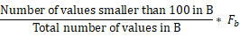

    To estimate the proportion of values that meet the conditions in _B_. The specific code of this process is implemented in the ineq_histogram_selectivity function. Finally, the selectivity value returned by the restriction_selectivity function is **selec** = **selec_mcv** + **selec_histogram**, where **selec_mcv** is the percentage of MCVs that meet the conditions.

- Selectivity calculation based on constraints of the SET type

  For a SET constraint, the clause_selectivity function recursively calculates the selectivity of its basic constraints. The final selectivity is then returned in the manner listed in Table 10 according to the semantics of the SET type.

  Table 10 Selectivity of the SET type

  <a name="table134047495154"></a>

  <table><tbody><tr id="row3216105012156"><td class="cellrowborder"  width="30.3%"><p id="p9216175091517"><a name="p9216175091517"></a><a name="p9216175091517"></a>SET Type</p>
  </td>
  <td class="cellrowborder"  width="69.69999999999999%"><p id="p1821665011513"><a name="p1821665011513"></a><a name="p1821665011513"></a>Description</p>
  </td>
  </tr>
  <tr id="row621665011518"><td class="cellrowborder"  width="30.3%"><p id="p7216250101520"><a name="p7216250101520"></a><a name="p7216250101520"></a>NOT</p>
  </td>
  <td class="cellrowborder"  width="69.69999999999999%"><p id="p7216105018154"><a name="p7216105018154"></a><a name="p7216105018154"></a>selec(B) = 1 –selec(A)  {B = NOT A}</p>
  </td>
  </tr>
  <tr id="row1921611509151"><td class="cellrowborder"  width="30.3%"><p id="p421635021512"><a name="p421635021512"></a><a name="p421635021512"></a>AND</p>
  </td>
  <td class="cellrowborder"  width="69.69999999999999%"><p id="p221645012159"><a name="p221645012159"></a><a name="p221645012159"></a>{A AND B}<a name="image10216125051519"></a><a name="image10216125051519"></a><span>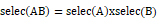</span></p>
  </td>
  </tr>
  <tr id="row8216195013154"><td class="cellrowborder"  width="30.3%"><p id="p52163504153"><a name="p52163504153"></a><a name="p52163504153"></a>OR</p>
  </td>
  <td class="cellrowborder"  width="69.69999999999999%"><p id="p921615091519"><a name="p921615091519"></a><a name="p921615091519"></a>{A OR B}<a name="image1216950121511"></a><a name="image1216950121511"></a><span></span></p>
  </td>
  </tr>
  </tbody>
  </table>

  By refering to the data distribution storage section, you may find that openGauss does not store the multi-attribute joint distribution. As shown in Table 6-15, openGauss calculates the joint distribution based on the assumption that the values of different columns are independent of each other. In the scenario where columns are not independent, the prediction often has deviations. For example, for the student table, the gender is related to the major. Therefore, the number of students in a computer department cannot be calculated by multiplying the proportion of male students by the number of students in the department. However, independent assumptions can generally lead to accurate results.

- \(3\) Default selectivity parameters

  When the data distribution is unknown, the selectivity cannot be estimated by using the conventional method. For example, the ANALYZE operation is not performed on the data table, or the filter condition is an uncertain parameter. To provide a proper reference value for the optimizer, openGauss provides a series of empirical parameters of the selectivity, as shown in Table 11.

  Table 11 Selectivity parameters

  <a name="table1941112491155"></a>

  <table><tbody><tr id="row1821625015152"><td class="cellrowborder"  width="30.43%"><p id="p2021645011158"><a name="p2021645011158"></a><a name="p2021645011158"></a>Variable</p>
  </td>
  <td class="cellrowborder"  width="25.52%"><p id="p182161750151514"><a name="p182161750151514"></a><a name="p182161750151514"></a>Value</p>
  </td>
  <td class="cellrowborder"  width="44.05%"><p id="p15216165017154"><a name="p15216165017154"></a><a name="p15216165017154"></a>Description</p>
  </td>
  </tr>
  <tr id="row42168502154"><td class="cellrowborder"  width="30.43%"><p id="p421685081518"><a name="p421685081518"></a><a name="p421685081518"></a>DEFAULT_EQ_SEL</p>
  </td>
  <td class="cellrowborder"  width="25.52%"><p id="p182161850111516"><a name="p182161850111516"></a><a name="p182161850111516"></a>0.005</p>
  </td>
  <td class="cellrowborder"  width="44.05%"><p id="p1821685041510"><a name="p1821685041510"></a><a name="p1821685041510"></a>Default selectivity for an equivalent constraint, for example, A = b.</p>
  </td>
  </tr>
  <tr id="row1216155071519"><td class="cellrowborder"  width="30.43%"><p id="p6216115018157"><a name="p6216115018157"></a><a name="p6216115018157"></a>DEFAULT_INEQ_SEL</p>
  </td>
  <td class="cellrowborder"  width="25.52%"><p id="p2217350191519"><a name="p2217350191519"></a><a name="p2217350191519"></a>0.3333333333333333</p>
  </td>
  <td class="cellrowborder"  width="44.05%"><p id="p192171450151517"><a name="p192171450151517"></a><a name="p192171450151517"></a>Default selectivity for an unequal constraint, for example, A &lt; b.</p>
  </td>
  </tr>
  <tr id="row1121710504154"><td class="cellrowborder"  width="30.43%"><p id="p921711506154"><a name="p921711506154"></a><a name="p921711506154"></a>DEFAULT_RANGE_INEQ_SEL</p>
  </td>
  <td class="cellrowborder"  width="25.52%"><p id="p221719506158"><a name="p221719506158"></a><a name="p221719506158"></a>0.005</p>
  </td>
  <td class="cellrowborder"  width="44.05%"><p id="p12171950121511"><a name="p12171950121511"></a><a name="p12171950121511"></a>Default selectivity for range constraints involving the same attribute (column), for example, A &gt; b AND A &lt; c.</p>
  </td>
  </tr>
  <tr id="row7217175001520"><td class="cellrowborder"  width="30.43%"><p id="p5217155020155"><a name="p5217155020155"></a><a name="p5217155020155"></a>DEFAULT_MATCH_SEL</p>
  </td>
  <td class="cellrowborder"  width="25.52%"><p id="p1217105011514"><a name="p1217105011514"></a><a name="p1217105011514"></a>0.005</p>
  </td>
  <td class="cellrowborder"  width="44.05%"><p id="p17217150151515"><a name="p17217150151515"></a><a name="p17217150151515"></a>Default selectivity for constraints based on pattern matching, for example, LIKE.</p>
  </td>
  </tr>
  <tr id="row521710506157"><td class="cellrowborder"  width="30.43%"><p id="p4217195020156"><a name="p4217195020156"></a><a name="p4217195020156"></a>DEFAULT_NUM_DISTINCT</p>
  </td>
  <td class="cellrowborder"  width="25.52%"><p id="p132171550161512"><a name="p132171550161512"></a><a name="p132171550161512"></a>200</p>
  </td>
  <td class="cellrowborder"  width="44.05%"><p id="p1321714506155"><a name="p1321714506155"></a><a name="p1321714506155"></a>Number of elements in the value range after an attribute is deduplicated (distinct). Generally, <strong id="b2217950111520"><a name="b2217950111520"></a><a name="b2217950111520"></a>DEFAULT_EQ_SEL</strong> and <strong id="b021713502153"><a name="b021713502153"></a><a name="b021713502153"></a>DEFAULT_EQ_SEL</strong> are the reciprocal of each other.</p>
  </td>
  </tr>
  <tr id="row221719504151"><td class="cellrowborder"  width="30.43%"><p id="p6217750151512"><a name="p6217750151512"></a><a name="p6217750151512"></a>DEFAULT_UNK_SEL</p>
  </td>
  <td class="cellrowborder"  width="25.52%"><p id="p1421745091515"><a name="p1421745091515"></a><a name="p1421745091515"></a>0.005</p>
  </td>
  <td class="cellrowborder"  width="44.05%"><p id="p172171050161517"><a name="p172171050161517"></a><a name="p172171050161517"></a>Default selectivity for constraints such as BoolTest or NullText, for example, IS TRUE or IS NULL.</p>
  </td>
  </tr>
  <tr id="row1121716506152"><td class="cellrowborder"  width="30.43%"><p id="p1721725091512"><a name="p1721725091512"></a><a name="p1721725091512"></a>DEFAULT_NOT_UNK_SEL</p>
  </td>
  <td class="cellrowborder"  width="25.52%"><p id="p421725011514"><a name="p421725011514"></a><a name="p421725011514"></a>(1.0 - DEFAULT_UNK_SEL)</p>
  </td>
  <td class="cellrowborder"  width="44.05%"><p id="p20217155061513"><a name="p20217155061513"></a><a name="p20217155061513"></a>Default selectivity for constraints such as BoolTest or NullText, for example, IS NOT TRUE or IS NOT NULL.</p>
  </td>
  </tr>
  </tbody>
  </table>

### 4. Cost Estimation<a name="section1683134971416"></a>

Query execution costs are classified into I/O costs and CPU costs. Both costs are positively correlated with the number of tuples processed during the query. Therefore, it is relatively accurate to estimate the total cost of the query plan by using the selectivity. However, due to the differences in hardware environments, the cost model of openGauss outputs only a common indicator for measuring the plan quality, not the execution time. To describe the measurement process, the following describes the I/O and CPU cost estimation methods from the perspective of cost model parameters.

- \(1\) I/O cost estimation

  On disks, tuples are organized as data pages. Page access modes include sequential read and random read. Restricted by the performance of storage media, the efficiency of sequential read is much higher than that of random read. For example, when HDDs face a large number of random access requests, the head seek time occupies most of the data read time. In openGauss, the I/O costs in different access modes are as follows:

  ```
  DEFAULT_SEQ_PAGE_COST  1.0
  DEFAULT_RANDOM_PAGE_COST  4.0
  ```

  By default, the ratio of sequential read overheads to random read overheads on data pages is set to 1:4.

  The setting is reasonable for HDDs. However, for SSDs with excellent addressing capabilities, this parameter needs to be adjusted based on the actual requirements. In practice, database deployment is complex, and a system may have multiple different storage media at the same time. To enable the cost model to cope with the I/O performance of different storage media, openGauss provides users with a method of setting the unit cost of file I/O.

  ```
  CREATE TABLESPACE TEST_SPC LOCATION '...' WITH (SEQ_PAGE_COST=2, RANDOM_PAGE_COST=3);
  ```

  According to the I/O cost parameter and the selectivity, the I/O overhead of the candidate plan can be easily estimated. The following uses sequential scan \(SeqScan\) and index scan \(IndexScan\) as examples to describe the cost estimation process.

  - 1. SeqScan: traverses table data from the beginning to the end. This is a sequential read. Therefore, the I/O cost of SeqScan is **DEFAULT_SEQ_PAGE_COST** multiplied by the total number of data pages in the table.

  - 2. IndexScan: uses indexes to search for table data that meets constraints. This is a random read. Therefore, the I/O cost of IndexScan is x **DEFAULT_RANDOM_PAGE_COST**.

    _P_ \(number of data pages that meet the constraint\) is positively correlated with _R_ \(number of tuples that meet the constraint\), and _R_ = Total number of tuples in the table x Selectivity. After openGauss calculates _R_, it invokes the index*pages_fetched\(R, ...\) function to estimate \_P*. This function is implemented in the **costsize.c** file. For details, see the paper* Index scans using a finite LRU buffer: A validated I/O model* of Mackert L F and Lohman G M.

    By observing the cost model, we can find that when the selectivity exceeds a certain threshold, _P_ is relatively large, and the cost of IndexScan is higher than that of SeqScan. Therefore, the efficiency of IndexScan is not always higher than that of SeqScan.

- \(2\) CPU cost estimation

  The database consumes CPU resources in the data addressing and data processing phases, for example, tuple projection selection and index search. Obviously, for different operations, the cost of the CPU is different. openGauss divides the CPU cost into tuple processing cost and data operation cost.

  ① Tuple processing cost: cost of converting a piece of disk data into a tuple. For ordinary table data and index data, the cost parameters are as follows:

  ```
  #define DEFAULT_CPU_TUPLE_COST 0.01
  #define DEFAULT_CPU_INDEX_TUPLE_COST 0.005
  ```

  Among the default parameters, the index cost is lower. This is because index data typically involves fewer columns than table data and requires less CPU resources.

  ② Data operation cost: cost of projecting a tuple or determining whether a tuple meets the condition based on the constraint expression. The cost parameters are as follows:

  ```
  #define DEFAULT_CPU_OPERATOR_COST  0.0025
  ```

  Given the above parameters, the estimated CPU cost is proportional to the computation scale of the problem, which depends on the selectivity. This relationship is similar to the relationship between the complexity of the algorithm instance and _n_. Due to limited space, this section does not provide details.

##

## Physical Path<a name="ZH-CN_TOPIC_0000001256859931"></a>

In the database, paths are represented by the path structure. The path structure is derived from the node structure. The path structure is also a base structure, which is similar to the base class in C++. Each specific path is derived from the path structure. For example, the IndexPath structure used by the index scanning path is derived from the path structure.

```
typedef struct Path
{
NodeTag    type;
NodeTag    pathtype;          /* Path type, such as T_IndexPath and T_NestPath.*/
RelOptInfo *parent;        /* Intermediate result generated after the current path is executed.*/
PathTarget *pathtarget;        /* Projection of the path. The expression cost is also saved.*/
/* Pay attention to the expression index.*/
ParamPathInfo *param_info;        /* Parameter used during execution. In the executor, subqueries or some special */
/*  joins need to obtain the current value of another table in real time.*/
Bool    parallel_aware;     /* Parallel parameter, which is used to distinguish parallel and non-parallel.*/
bool    parallel_safe;        /* Parallel parameter, which is determined by the set_rel_consider_parallel function.*/
int    parallel_workers;        /* Parallel parameter, indicating the number of parallel threads.*/
double    rows;        /* Estimated amount of data in the intermediate result generated during the execution of the current path.*/
Cost    startup_cost;      /* Startup cost, that is, the cost from statement execution to obtaining the first result.*/
Cost    total_cost;          /* Overall execution cost of the current path.*/
List   *pathkeys;       /* Key value for sorting intermediate results generated in the current path. If the intermediate results are unordered, the value is NULL.*/
} Path;
```

## Dynamic Programming<a name="ZH-CN_TOPIC_0000001212060006"></a>

Currently, openGauss has completed rule-based query rewriting and logical decomposition, and has generated the physical path of each base table. The physical path of the base table is only a small part of the optimizer planning. Now, openGauss will enter another important task of the optimizer, that is, generating the join path. openGauss uses the bottom-up optimization. For the multi-table join path, dynamic programming and genetic algorithm are used. This section mainly introduces dynamic programming. But if there are a large number of tables, genetic algorithm is required. Genetic algorithm can avoid the problem of space expansion during join path search in the case of too many tables. In common scenarios, dynamic programming is used, which is the default optimization method used by the openGauss.

After logical decomposition and optimization, tables in the statement are flattened, that is, the original tree structure is changed to the flattened array structure. The join relationships between tables are also recorded in the **SpecialJoinInfo** structure in the **root** directory, which is the basis for dynamic join planning.

### 1. Dynamic Programming Method<a name="section284172510266"></a>

First, the dynamic programming method is applicable to an optimal solution problem including a large quantity of repeated sub-problems. By memorizing the optimal solution to each sub-problem, same sub-problems are solved only once, and a record of solving the previous same sub-problem may be reused next time. As such, it is required that the optimal solutions to these sub-problems can form the optimal solution to the whole problem, that is, they should have the property of the optimal substructure. For statement join optimization, the optimal solution to an entire statement join is the optimal solution to a block of statement join. In a planning process, a local optimal solution cannot be repeatedly calculated, and the local optimal solution calculated last time is directly used.

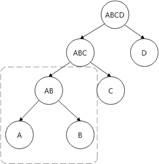

FIG. 1 Optimal solution to a repeated sub-problem

For example, the join operation of A x B in two join trees in Figure 1 is a repeated sub-problem, because no matter whether the A x B x C x D join path or the A x B x C join path is generated, the A x B join path needs to be generated first. There may be hundreds of join methods for a path generated by multi-table join, that is, when many layers are stacked. The number of repeated sub-problems of these join trees is large. Therefore, the join tree has repeated sub-problems, which can be solved once and used for multiple times. That is, for the join A x B, the optimal solution needs to be generated only once.

The code of the multi-table join dynamic programming algorithm starts from the make_rel_from_joinlist function, as shown in Figure 2.


Figure 2 Multi-table join dynamic programming algorithm

- 1）make_rel_from_joinlist function

  The main entry of the implementation code of dynamic programming starts from the make_rel_from_joinlist function. The input parameter of the make_rel_from_joinlist function is the RangeTableRef linked list after the deconstruct_jointree function is flattened. Each RangeTableRef represents a table. You can search for the RelOptInfo structure of the base table based on the linked list. The found RelOptInfo structure is used to construct a base table RelOptInfo structure at layer 1 of the dynamic programming algorithm, and "accumulation" continues to be performed at layer-1 RelOptInfo structure subsequently. The code is as follows:

  ```
  // Traverse the joinlist after leveling. The linked list is the linked list of RangeTableRef.
  foreach(jl, joinlist)
  {
  Node   *jlnode = (Node *) lfirst(jl);
  RelOptInfo *thisrel;

  // In most cases, the RangeTableRef linked list is used. The subscript value (rtindex) stored in the RangeTableRef linked list is used.
  // Search for the corresponding RelOptInfo structure.
  if (IsA(jlnode, RangeTblRef))
  {
  int varno = ((RangeTblRef *) jlnode)->rtindex;
  thisrel = find_base_rel(root, varno);
  }
  // Affected by the from_collapse_limit and join_collapse_limit parameters, there are nodes that are not flattened. In this case, the make_rel_from_joinlist function is invoked recursively.
  else if (IsA(jlnode, List))
  thisrel = make_rel_from_joinlist(root, (List *) jlnode);
  else
  ereport (......);

  // The first initial linked list is generated, that is, the linked list of the base table.
  // This linked list is the basis of the dynamic programming method.
  initial_rels = lappend(initial_rels, thisrel);
  }
  ```

- 2）standard_join_search function

  In the dynamic programming method, a table is added to each layer in the process of accumulating tables. When all tables are added, the final join tree is generated. Therefore, the number of accumulated layers is the number of tables. If there are _N_ tables, data needs to be accumulated for _N_ times. The accumulation process at each layer is described in the join_search_one_level function. This function is mainly used to prepare for the accumulation join, including allocating memory space occupied by RelOptInfos at each layer and reserving some information after RelOptInfos at each layer are accumulated.

  Create a "join array", which is similar to a structure of \[LIST1, LIST2, LIST3\], where a linked list in the array is used to store all RelOptInfo structures of a layer in the dynamic programming method. For example, the first linked list in the array stores linked lists related to all base table paths. The code is as follows:

  ```
  // Allocate the RelOptInfo linked lists of all layers during accumulation.
  root->join_rel_level = (List**)palloc0((levels_needed + 1) * sizeof(List*));
  // Initialize all layer-1 base table RelOptInfos.
  root->join_rel_level[1] = initial_rels;
  After completing the initialization, you can start trying to build RelOptInfo for each layer. The code is as follows:
  for (lev = 2; lev <= levels_needed; lev++) {
  ListCell* lc = NULL;
  // Generate all RelOptInfo structures of the corresponding layer in the join_search_one_level function.
  join_search_one_level(root, lev);

  ...
  }
  ```

- 3）join_search_one_level function

  The join_search_one_level function is mainly used to generate all RelOptInfos in one layer, as shown in Figure 3. To generate RelOptInfo of the \_N_th layer, there are mainly three manners: one is to attempt to generate a left-deep tree and a right-deep tree, one is to attempt to generate a bushy tree, and the other is to attempt to generate a join path of a Cartesian product \(commonly referred to as a traversal attempt\).

  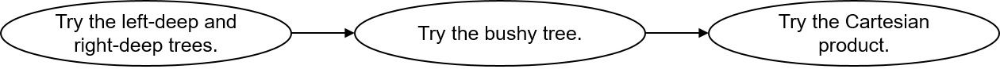

  Figure 3 Manners of generating RelOptInfo of the Nth layer

  - \(1\) Left-deep tree and right-deep tree

    The generation principle of the left-deep tree is the same as that of the right-deep tree, except that the positions of the two RelOptInfos to be joined are exchanged in the make_join_rel function. That is, each RelOptInfo has a chance to be used as an inner table or an outer table. In this way, more joins may be created to help generate the optimal path.

    As shown in Figure 4, two RelOptInfos to be selected need to be joined to generate A x B x C, and the left-deep tree is to exchange positions of AxB and C. A x B is used as an inner table to form a left-deep tree, and A x B is used as an outer table to form a right-deep tree.

    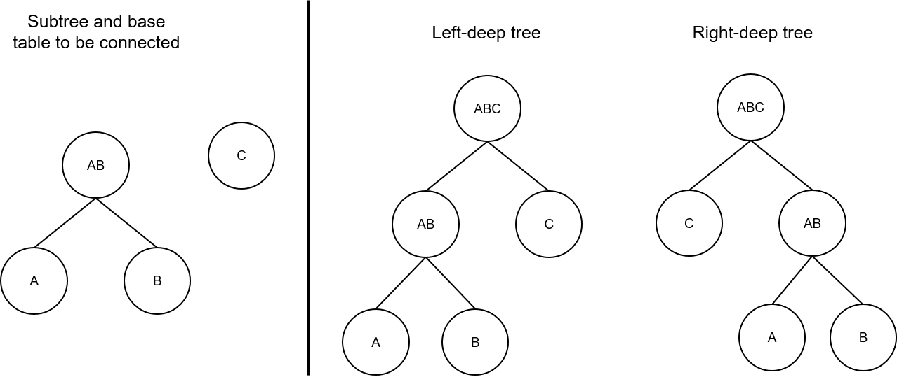

    Figure 4 Schematic diagram of a left-deep tree and a right-deep tree

    The code is as follows:

    ```
    // Traverse the upper layer of the current layer, that is, to generate RelOptInfo of layer 4,
    // try to join RelOptInfo at layer 3 and the base table at layer 1.
    foreach(r, joinrels[level - 1])
    {
    RelOptInfo *old_rel = (RelOptInfo *) lfirst(r);
    // If there is a join relationship or join sequence restriction between two RelOptInfos,
    // a join is preferentially generated for the two RelOptInfos.
    // The has_join_restriction function may make a misjudgment. However, more refined filtering will be provided in the future.
    if (old_rel->joininfo != NIL || old_rel->has_eclass_joins ||
    has_join_restriction(root, old_rel))
    {
    ListCell   *other_rels;
    // To generate RelOptInfo of the Nth layer, RelOptInfo of the (N – 1)th layer needs to be joined with the base table set of the first layer.
    // That is, if the RelOptInfo of layer 2 needs to be generated, the RelOptInfo of layer 1 and the base table set of layer 1 are joined.
    // Therefore, processing is required when tables at layer 2 are generated from base tables to prevent itself from being joined with itself.
    if (level == 2)
    other_rels = lnext(r);
    else
    other_rels = list_head(joinrels[1]);
    // old_rel "may" have join constraints or join sequence restrictions with other tables.
    // other_rels "may" contain the possible tables. The make_rels_clause_joins function performs accurate judgment.
    make_rels_by_clause_joins(root,  old_rel,  other_rels);
    }
    else
    {
    // Try to generate a join path for tables without join relationships or tables with join sequence restrictions.
    make_rels_by_clauseless_joins(root,  old_rel,  list_head(joinrels[1]));
    }
    }
    ```

  - \(2\) Bushy tree

    To generate RelOptInfo of the _N_th layer, the left-deep tree or the right-deep tree joins RelOptInfo of the \(N – 1\)th layer with the base table of the first layer. Regardless of the left-deep tree or the right-deep tree, in essence, it constructs the current-layer RelOptInfo by referencing the base table RelOptInfo. A bushy tree is generated without using the base table. The bushy tree attempts to randomly join RelOptInfos of all layers. For example, RelOptInfo of the \(\_N_ – 2\)th layer and that of the second layer are joined, and circumstances with \(2,_N_ – 2\), \(3,_N_ – 3\), \(4,_N_ – 4\), and more may be deduced in sequence. The establishment of a bushy tree must meet two conditions: One is that two RelOptInfos have a related constraint or a restriction on the join sequence, and the other is that two RelOptInfos cannot have an intersection table.

    ```
    for (k = 2;; k++)
    {
    int other_level = level - k;
    foreach(r, joinrels[k])
    {
    // There are join constraints or join sequence restrictions.
    if (old_rel->joininfo == NIL && !old_rel->has_eclass_joins &&
    !has_join_restriction(root, old_rel))
    continue;
    ...
    for_each_cell(r2, other_rels)
    {
    RelOptInfo *new_rel = (RelOptInfo *) lfirst(r2);
    // No intersection is allowed.
    if (!bms_overlap(old_rel->relids, new_rel->relids))
    {
    // There are related join constraints or restrictions on the join sequence.
    if (have_relevant_joinclause(root, old_rel, new_rel) ||
    have_join_order_restriction(root, old_rel, new_rel))
    {
    (void) make_join_rel(root, old_rel, new_rel);
    }
    }
    }
    }
    }
    ```

  - \(3\) Cartesian product

    After trying the left-deep tree, right-deep tree, and bushy tree, if no legal join is generated, a final attempt needs to be made on RelOptInfos of layer _N_ – 1 and layer 1. That is, an attempt is made to join each RelOptInfo at the \(_N_ – 1\)th layer with RelOptInfo at the first layer.

### 2. Path Generation<a name="section375435414268"></a>

We have learned the dynamic programming method used in path generation, and how to generate RelOptInfo for the current layer during the accumulation process in the previous section. For generating RelOptInfo of the current layer, several problems may be faced: one is to determine whether two RelOptInfos can be joined, and the other is to generate a physical join path. Currently, a physical join path mainly has three implementations: NestLoopJoin, HashJoin, and MergeJoin. A process of establishing the join path is a process of continuously attempting to generate the three paths.

- Perform check

  In the dynamic programming method, each RelOptInfo of the _N_ – 1 layer and each RelOptInfo of the first layer need to be joined, and then the RelOptInfo of the new join is stored in the current _N_th layer. The time complexity of the algorithm is about O \(M x N\). If there are a relatively large quantity of RelOptInfos at both the \(\_N_ – 1\)th layer and the first layer, the search space expands greatly. However, some RelOptInfos can be avoided during join. This is also the purpose of timely check. Detecting and skipping the join between two RelOptInfos in advance can save unnecessary overheads and improve the optimization efficiency of the optimizer.

  - \(1\) Preliminary check

    The following conditions are the main factors to be measured in the preliminary check:

    - The value of **joininfo** in RelOptinfo is not **NULL**. This indicates that the RelOptInfo has related constraints with other RelOptInfos. That is, the current RelOptInfo may be associated with other tables.

    - The value of **has_eclass_joins** in RelOptInfo is **true**, indicating that the current RelOptInfo and other RelOptInfos may have equivalent join conditions in the equivalence class record.

    - The return value of the has_join_restriction function is **true**, indicating that the join sequence between the current RelOptInfo and other RelOptInfos is limited.

      The preliminary check is to use the RelOptInfo information to determine the possibility, that is, to check whether there are join conditions and join sequence constraints.

      ```
      static bool has_join_restriction(PlannerInfo* root, RelOptInfo* rel)
      {
      ListCell* l = NULL;

      // If the current RelOptInfo involves Lateral semantics, there must be join sequence constraints.
      foreach(l, root->lateral_info_list)
      {
      LateralJoinInfo *ljinfo = (LateralJoinInfo *) lfirst(l);

      if (bms_is_member(ljinfo->lateral_rhs, rel->relids) ||
      bms_overlap(ljinfo->lateral_lhs, rel->relids))
      return true;
      }

      // Process only the conditions except the inner join.
      foreach (l, root->join_info_list) {
      SpecialJoinInfo* sjinfo = (SpecialJoinInfo*)lfirst(l);

      // Skip the full-join check. Other mechanisms are used to ensure the join sequence.
      if (sjinfo->jointype == JOIN_FULL)
      continue;

      // If the SpecialJoinInfo has been included in the RelOptInfo, skip this step.
      if (bms_is_subset(sjinfo->min_lefthand, rel->relids) &&
      bms_is_subset(sjinfo->min_righthand, rel->relids))
      continue;

      //If the relids and min_lefthand or min_righthand variables of the RelOptInfo structure overlap, there may be constraints on the join sequence.
      if (bms_overlap(sjinfo->min_lefthand, rel->relids) ||
      bms_overlap(sjinfo->min_righthand, rel->relids))
      return true;
      }

      return false;
      }
      ```

  - \(2\) Precise check

    After the preliminary check, if it is determined that there is no join condition or join sequence constraint on the RelOptInfos on both sides, the make_rels_by_clauseless_joins function is entered, and all possible paths in the RelOptInfo are joined with the RelOptInfo at layer 1. If the current RelOptInfo may have join constraints or join sequence restrictions, the make_rel_by_clause_joins function is invoked to further check the current RelOptInfo and other RelOptInfo at layer 1 to determine whether the join can be performed.

    The have_join_order_restriction function determines whether there are join sequence restrictions on two RelOptInfos from the following two aspects: One is to determine whether the two RelOptInfos have a Lateral semantic sequence restriction, and the other is to determine whether min_lefthand and min_righthand in SpecialJoinInfo have a join sequence restriction on the two RelOptInfos.

    The analysis of the have_join_order_restriction source code is as follows:

    ```
    bool have_join_order_restriction(PlannerInfo* root, RelOptInfo* rel1, RelOptInfo* rel2)
    {
    bool result = false;
    ListCell* l = NULL;

    // If the dependency relationship with Lateral semantics exists, the join sequence must be restricted.
    foreach(l, root->lateral_info_list)
    {
    LateralJoinInfo *ljinfo = (LateralJoinInfo *) lfirst(l);

    if (bms_is_member(ljinfo->lateral_rhs, rel2->relids) &&
    bms_overlap(ljinfo->lateral_lhs, rel1->relids))
    return true;
    if (bms_is_member(ljinfo->lateral_rhs, rel1->relids) &&
    bms_overlap(ljinfo->lateral_lhs, rel2->relids))
    return true;
    }

    // Traverse all SpecialJoinInfo in the root directory and check whether the two RelOptInfos have join constraints.
    foreach (l, root->join_info_list) {
    SpecialJoinInfo* sjinfo = (SpecialJoinInfo*)lfirst(l);

    if (sjinfo->jointype == JOIN_FULL)
    continue;

    // The minimum set is a subset of the two tables. The two tables must be joined in the specified sequence.
    if (bms_is_subset(sjinfo->min_lefthand, rel1->relids) &&
    bms_is_subset(sjinfo->min_righthand, rel2->relids)) {
    result = true;
    break;
    }
    // Conversely, the minimum set is a subset of the two tables. The two tables must be joined in the specified sequence.
    if (bms_is_subset(sjinfo->min_lefthand, rel2->relids) &&
    bms_is_subset(sjinfo->min_righthand, rel1->relids)) {
    result = true;
    break;
    }

    // If both tables have intersection with one end of the minimum set, the two tables should be joined at the end.
    // So let them join first.
    if (bms_overlap(sjinfo->min_righthand, rel1->relids) && bms_overlap(sjinfo->min_righthand, rel2->relids)) {
    result = true;
    break;
    }
    // The reverse is the same as above.
    if (bms_overlap(sjinfo->min_lefthand, rel1->relids) && bms_overlap(sjinfo->min_lefthand, rel2->relids)) {
    result = true;
    break;
    }
    }

    // If the two tables have corresponding join relationships with other tables,
    // you can join them with the tables with join relationships first.
    if (result) {
    if (has_legal_joinclause(root, rel1) || has_legal_joinclause(root, rel2))
    result = false;
    }

    return result;
    }
    ```

  - \(3\) Legal join

    As RelOptInfo causes search space expansion, if the legal join check is performed on the two RelOptInfo structures, the search time is too long. This is why the preliminary check and accurate check need to be performed in advance. The search time can be reduced to achieve the pruning effect.

    For legal joins, the main code is in join_is_legal, which is used to determine whether two RelOptInfo structures can be joined to generate a physical path. The input parameters are the two RelOpInfo structures. The logical join between two RelOptInfo structures to be selected may be InnerJoin, LeftJoin, or SemiJoin, or no legal logical join exists. In this case, you need to determine the join in two steps.

    Step 1: Traverse SpecialJoinInfo in the join_info_list linked list in the **root** directory to check whether a legal SpecialJoinInfo can be found. A corresponding SpecialJoinInfo is generated for each logical join relationship except InnerJoin. In addition, the legal join sequence is recorded in SpecialJoinInfo.

    Step 2: Check the Lateral relationship in RelOptInfo and check whether the found SpecialJoinInfo meets the join sequence requirement specified by the Lateral semantics.

- Create a join path

  So far, two RelOptInfo structures that meet the condition have been filtered out. The next step is to establish a physical join relationship for paths in the two RelOptInfo structures. Common physical join paths include NestLoop, MergeJoin, and HashJoin, which are implemented by using the sort_inner_and_outer, match_unsorted_outer, and hash_inner_and_outer functions.

  For example, the sort_inner_and_outer function is used to generate the MergeJoin path. It is assumed that the paths of the inner and outer tables are unordered. Therefore, the paths must be sorted explicitly. The path with the lowest total cost is selected for the inner and outer tables. The matvh_unsorted_outer function indicates that the outer table is sorted. In this case, you only need to sort the inner table to generate the MergeJoin path, NestLoop, or parameterized path. The final choice is to set up a HashJoin path to join the two tables, that is, to set up a hash table.

  To facilitate the creation of MergeJoin, constraints need to be processed first. Therefore, the constraints applicable to MergeJoin are filtered out \(select_mergejoin_clauses function\). In this way, the Mergejoinable join constraint can be used in both the sort_inner_and_outer and match_unsorted_outer functions. The code is as follows:

  ```
  // Extract the conditions for MergeJoin.
  foreach (l, restrictlist) {
  RestrictInfo* restrictinfo = (RestrictInfo*)lfirst(l);

  // If the current join is an outer join and is a filter condition, ignore it.
  if (isouterjoin && restrictinfo->is_pushed_down)
  continue;

  // Preliminarily determine whether the join constraint can be used for MergeJoin.
  // restrictinfo->can_join and restrictinfo->mergeopfamilies are generated in distribute_qual_to_rels.
  if (!restrictinfo->can_join || restrictinfo->mergeopfamilies == NIL) {
  // Ignore FULL JOIN ON FALSE.
  if (!restrictinfo->clause || !IsA(restrictinfo->clause, Const))
  have_nonmergeable_joinclause = true;
  continue; /* not mergejoinable */
  }

  // Check whether the constraint is in the form of outer op inner or inner op outer.
  if (!clause_sides_match_join(restrictinfo, outerrel, innerrel)) {
  have_nonmergeable_joinclause = true;
  continue; /* no good for these input relations */
  }

  // Update and use the final equivalence class.
  // Normalize pathkeys so that constraints can match pathkeys.
  update_mergeclause_eclasses(root, restrictinfo);

  if (EC_MUST_BE_REDUNDANT(restrictinfo->left_ec) || EC_MUST_BE_REDUNDANT(restrictinfo->right_ec)) {
  have_nonmergeable_joinclause = true;
  continue; /* can't handle redundant eclasses */
  }

  result_list = lappend(result_list, restrictinfo);
  }
  ```

  - \(1\) sort_inner_and_outer function

    The sort_inner_and_outer function is mainly used to generate a MergeJoin path. It needs to explicitly sort the two child RelOptInfo structures, and only the cheapest_total_path function in the child RelOptInfo needs to be considered. Generate pathkeys by using the join constraint of MergeJoinable \(which can be used to generate Merge Join\), and then continuously adjust the sequence of pathkeys in pathkeys to obtain different pathkeys. Then, the innerkeys of the inner table and outerkeys of the outer table are determined based on the pathkeys in different sequences. The code is as follows:

    ```
    // Try to join and traverse each path in the outer table and inner table.
    foreach (lc1, outerrel->cheapest_total_path) {
    Path* outer_path_orig = (Path*)lfirst(lc1);
    Path* outer_path = NULL;
    j = 0;
    foreach (lc2, innerrel->cheapest_total_path) {
    Path* inner_path = (Path*)lfirst(lc2);
    outer_path = outer_path_orig;

    // The parameterized path cannot be used to generate the MergeJoin path.
    if (PATH_PARAM_BY_REL(outer_path, innerrel) ||
    PATH_PARAM_BY_REL(inner_path, outerrel))
    return;

    // The lowest-cost path of the outer table and inner table must be met.
    if (outer_path != linitial(outerrel->cheapest_total_path) &&
    inner_path != linitial(innerrel->cheapest_total_path)) {
    if (!join_used[(i - 1) * num_inner + j - 1]) {
    j++;
    continue;
    }
    }

    // Generate a unique path.
    jointype = save_jointype;
    if (jointype == JOIN_UNIQUE_OUTER) {
    outer_path = (Path*)create_unique_path(root, outerrel, outer_path, sjinfo);
    jointype = JOIN_INNER;
    } else if (jointype == JOIN_UNIQUE_INNER) {
    inner_path = (Path*)create_unique_path(root, innerrel, inner_path, sjinfo);
    jointype = JOIN_INNER;
    }
    // Determine the pathkeys set that can be generated by the MergeJoin path based on the extracted conditions.
    all_pathkeys = select_outer_pathkeys_for_merge(root, mergeclause_list, joinrel);
    // Process each pathkey in the preceding pathkeys and try to generate a MergeJoin path.
    foreach (l, all_pathkeys) {
    ...
    // Generate the pathkey of the inner table.
    innerkeys = make_inner_pathkeys_for_merge(root, cur_mergeclauses, outerkeys);

    // Generate the pathkey of the outer table.
    merge_pathkeys = build_join_pathkeys(root, joinrel, jointype, outerkeys);

    // Generate the MergeJoin path based on the pathkey and inner and outer table paths.
    try_mergejoin_path(root, ......, innerkeys);
    }
    j++;
    }
    i++;
    }
    ```

  - \(2\) match_unsorted_outer function

    The overall code roadmap of the match_unsorted_outer function is similar to that of the sort_inner_and_outer function, except that the sort_inner_and_outer function infers the pathkeys of the inner and outer tables based on conditions. In the match_unsorted_outer function, the outer table path is assumed to be ordered. It sorts the join constraints based on the pathkey of the outer table. That is, the pathkeys of the outer table can be used as outerkeys, so as to check which join constraint matches the current pathkeys, filter the matched join constraint, and generate the innerkeys that needs to be displayed and sorted based on the matched join constraint.

  - \(3\) hash_inner_and_outer function

    The hash_inner_and_outer function is used to create a HashJoin path. The distribute_restrictinfo_to_rels function has determined whether a constraint is applicable to HashJoin. To create a hash table, HashJoin can be used only when at least one join constraint applicable to HashJoin exists. Otherwise, the hash table cannot be created.

- Filter paths

  So far, the physical join paths Hashjoin, NestLoop, and MergeJoin are generated. You need to determine whether a path is worth storage according to the cost calculated during the generation process, because many paths are generated in the path join phase. In addition, some obviously poor paths are generated. In this case, filtering can help you perform a basic check and save the time for generating the plan. Taking a long time to generate a plan is unacceptable, even if it is a "good" execution plan.

  add_path is the main function for filtering paths. The code is as follows:

  ```
  switch (costcmp) {
  case COSTS_EQUAL:
  outercmp = bms_subset_compare(PATH_REQ_OUTER(new_path),
  PATH_REQ_OUTER(old_path));
  if (keyscmp == PATHKEYS_BETTER1) {
  if ((outercmp == BMS_EQUAL || outercmp == BMS_SUBSET1) &&
  new_path->rows <= old_path->rows)
  // The cost of the new path is similar to that of the old path, while the pathkeys is longer and fewer parameters are required.
  // The number of rows in the result set is small. Therefore, the new path is accepted and the old path is discarded.
  remove_old = true; /* new dominates old */
  } else if (keyscmp == PATHKEYS_BETTER2) {
  if ((outercmp == BMS_EQUAL || outercmp == BMS_SUBSET2) &&
  new_path->rows >= old_path->rows)
  // The cost of the new path is similar to that of the old path, while the pathkeys is shorter and more parameters are required.
  // If the result set contains more rows, the new path is not accepted and the old path is retained.
  accept_new = false; /* old dominates new */
  } else {
  if (outercmp == BMS_EQUAL) {
  // The cost, pathkeys, and path parameters of the new and old paths are the same or similar.
  // If the number of rows returned by the new path is small, the new path is accepted and the old path is discarded.
  if (new_path->rows < old_path->rows)
  remove_old = true; /* new dominates old */
  // If the number of rows returned by the new path is large, the new path is not accepted and the old path is retained.
  else if (new_path->rows > old_path->rows)
  accept_new = false; /* old dominates new */
  // The cost, pathkeys, path parameters, and number of rows in the result sets are similar.
  // The range for determining the cost is strictly specified. If the new path is good, the new path is used and the old path is discarded.
  else {
  small_fuzzy_factor_is_used = true;
  if (compare_path_costs_fuzzily(new_path, old_path, SMALL_FUZZY_FACTOR) ==
  COSTS_BETTER1)
  remove_old = true; /* new dominates old */
  else
  accept_new = false; /* old equals or
  * dominates new */
  }
  // If the cost and pathkeys are similar, compare the number of rows and parameters. If the number of rows and parameters of the new path is better than those of the old path, discard the old path; if the number of rows and parameters of the old path is better than those of the new path, discard the new path.
  } else if (outercmp == BMS_SUBSET1 &&
  new_path->rows <= old_path->rows)
  remove_old = true; /* new dominates old */
  else if (outercmp == BMS_SUBSET2 &&
  new_path->rows >= old_path->rows)
  accept_new = false; /* old dominates new */
  /* else different parameterizations, keep both */
  }
  break;
  case COSTS_BETTER1:
  // Based on all the comparison results of the new and old paths, it is determined that the new path is better than or equal to the old path.
  // Therefore, the new path is accepted and the old path is discarded.
  if (keyscmp != PATHKEYS_BETTER2) {
  outercmp = bms_subset_compare(PATH_REQ_OUTER(new_path),
  PATH_REQ_OUTER(old_path));
  if ((outercmp == BMS_EQUAL || outercmp == BMS_SUBSET1) &&
  new_path->rows <= old_path->rows)
  remove_old = true; /* new dominates old */
  }
  break;
  case COSTS_BETTER2:
  // Based on all the comparison results of the new and old paths, it is determined that the old path is better than the old path.
  //The new path is not accepted and the old path is retained.
  if (keyscmp != PATHKEYS_BETTER1) {
  outercmp = bms_subset_compare(PATH_REQ_OUTER(new_path),
  PATH_REQ_OUTER(old_path));
  if ((outercmp == BMS_EQUAL || outercmp == BMS_SUBSET2) &&
  new_path->rows >= old_path->rows)
  accept_new = false; /* old dominates new */
  }
  break;
  default:

  /*
  * can't get here, but keep this case to keep compiler
  * quiet
  */
  break;
  }
  ```

## Genetic Algorithm<a name="ZH-CN_TOPIC_0000001212062724"></a>

As a kind of evolutionary algorithm, the genetic algorithm draws on natural selection and genetic mechanism in the Darwinian theory of biological evolution. The optimal individual is generated by simulating the evolution process of natural selection and survival of the fittest.

After a specific quantity of original individuals are generated, a new chromosome may be generated by means of gene arrangement and combination, and then a next-generation chromosome is obtained by means of chromosome hybridization and mutation. To select an excellent chromosome, a fitness function needs to be established to calculate a fitness value, so as to eliminate chromosomes with low fitness. In this way, the best individual is gradually evolved through constant inheritance and mutation among individuals. The individual is the solution of the problem by substituting this process into the solution. By genetic algorithm, the solution of the problem can converge to the optimal solution through this kind of intergenerational inheritance.

Different from a method in which dynamic programming resolves a problem into several independent sub-problems, the genetic algorithm is a selection process. The genetic algorithm enlarges a solution space by using a method of constructing a new chromosome by means of chromosome hybridization, and performs screening in the solution space at any time by using a fitness function, to recommend a good gene and eliminate bad genes. As a result, the solution obtained by genetic algorithm is not necessarily the global optimal solution like dynamic programming, but it can be close to the global optimal solution as much as possible by improving hybridization and mutation.

Thanks to the efficiency advantage in multi-table join, genetic algorithm is a useful supplement to the dynamic programming method in openGauss database. The genetic algorithm is used only when the Enable_geqo parameter is enabled and the number of RelOptInfo structures to be joined exceeds Geqo_threshold \(12 by default\).

The genetic algorithm is implemented in the following five steps:

\(1\) Pool initialization: A gene is encoded, and a plurality of chromosomes is generated by randomly arranging and combining the genes. These chromosomes form a new pool. In addition, fitness of the chromosome is calculated in the chro**mosome generation process.**

\(2\) Chromosome selection: A chromosome used for crossover and mutation is selected through random selection \(actually, a probability-based random number generation algorithm is used, so that an excellent chromosome can be selected\).

\(3\) Crossover: Chromosomes are crossed over, to generate a new chromosome and add the new chromosome to the pool.

\(4\) Mutation: A mutation operation is performed on chromosomes, to generate a new chromosome and add the new chromosome to the pool.

\(5\) Fitness calculation: Eliminates bad chromosomes.

For example, if the genetic algorithm is used to resolve a travelling salesman problem \(TSP\), cities may be used as genes, a path traveling through each city is used as a chromosome, a total length of the paths is used as fitness, and the fitness function is responsible for screening out a relatively long path and retaining a relatively short path. The algorithm procedure is as follows:

\(1\) Pool initialization: Cities are numbered, and the cities are arranged and grouped according to the numbers, to generate multiple new paths \(chromosomes\). Then, an overall path length \(fitness\) is calculated according to a distance between the cities, and the multiple new paths form a pool.

\(2\) Chromosome selection: Two paths are selected for crossover \(it should be noted that a city cannot repeatedly appear in a new chromosome generated through crossover\), and a path length is calculated for a new path generated through the crossover operation.

\(3\) Mutation: A chromosome is randomly selected for mutation \(a common method is to exchange locations of cities in a path\), and a path length is calculated for a new path obtained after the mutation operation.

\(4\) Fitness calculation: All paths in the pool are sorted in ascending order based on the path length, and paths ranked at the bottom are eliminated.

The genetic algorithm of the openGauss database simulates the method of solving the TSP. RelOptInfo is used as a gene, the finally generated join tree is used as a chromosome, the total cost of the join tree is used as fitness, and the fitness function is used for filtering based on the cost of the path; but the join path search in the openGauss database is slightly different from the path search for the TSP. For the TSP, the paths have no connection problems. The two cities are connected and the distance between any two cities can be calculated. Due to the restriction of the join constraints in the database, the two tables cannot be joined, or the join tree cannot be generated. In addition, it should be noted that the implementation of genetic algorithm in the openGauss database is slightly different from that of a common genetic algorithm, and the genetic algorithm in the openGauss database does not have a mutation process, and generates a new chromosome only by means of crossover.

The general entry of genetic algorithm in the openGauss database is the geqo function. The input parameters are **root** \(querying the optimized context information\), **number_of_rels** \(number of RelOptInfo structures to be joined\), and **initial_rels** \(all base tables\).

### File Directory Structure<a name="section1967732241611"></a>

As a relatively independent optimizer module, genetic algorithm has its own file directory structure, as shown in Table 6-17.

Table 6-17 Optimizer file directory structure

<a name="table3428104971512"></a>

<table><tbody><tr id="row722315010159"><td class="cellrowborder"  width="28.98%"><p id="p132231850131520"><a name="p132231850131520"></a><a name="p132231850131520"></a>Document</p>
</td>
<td class="cellrowborder"  width="71.02000000000001%"><p id="p422365020155"><a name="p422365020155"></a><a name="p422365020155"></a>Function</p>
</td>
</tr>
<tr id="row72232501153"><td class="cellrowborder"  width="28.98%"><p id="p422325041514"><a name="p422325041514"></a><a name="p422325041514"></a>geqo_copy.cpp</p>
</td>
<td class="cellrowborder"  width="71.02000000000001%"><p id="p122375051511"><a name="p122375051511"></a><a name="p122375051511"></a>Gene copy function, that is, the gepo_copy function.</p>
</td>
</tr>
<tr id="row102231509159"><td class="cellrowborder"  width="28.98%"><p id="p3224205061510"><a name="p3224205061510"></a><a name="p3224205061510"></a>geqo_cx.cpp</p>
</td>
<td class="cellrowborder"  width="71.02000000000001%"><p id="p142244500158"><a name="p142244500158"></a><a name="p142244500158"></a>Cycle crossover (cx) algorithm function.</p>
</td>
</tr>
<tr id="row1522416501150"><td class="cellrowborder"  width="28.98%"><p id="p32241150161514"><a name="p32241150161514"></a><a name="p32241150161514"></a>geqo_erx.cpp</p>
</td>
<td class="cellrowborder"  width="71.02000000000001%"><p id="p7224155071517"><a name="p7224155071517"></a><a name="p7224155071517"></a>Implemented based on EGDE RECOMBINATION CROSSOVER and provides the gimme_edge_table function.</p>
</td>
</tr>
<tr id="row172241502155"><td class="cellrowborder"  width="28.98%"><p id="p1222455071513"><a name="p1222455071513"></a><a name="p1222455071513"></a>geqo_eval.cpp</p>
</td>
<td class="cellrowborder"  width="71.02000000000001%"><p id="p02246507151"><a name="p02246507151"></a><a name="p02246507151"></a>Calculates the fitness and calls the make_one_rel function to generate the join relationship.</p>
</td>
</tr>
<tr id="row52241650131514"><td class="cellrowborder"  width="28.98%"><p id="p15224185081518"><a name="p15224185081518"></a><a name="p15224185081518"></a>geqo_main.cpp</p>
</td>
<td class="cellrowborder"  width="71.02000000000001%"><p id="p13224450141517"><a name="p13224450141517"></a><a name="p13224450141517"></a>Genetic algorithm entry, that is, the main function geqo.</p>
</td>
</tr>
<tr id="row922475051513"><td class="cellrowborder"  width="28.98%"><p id="p1722425051516"><a name="p1722425051516"></a><a name="p1722425051516"></a>geqo_misc.cpp</p>
</td>
<td class="cellrowborder"  width="71.02000000000001%"><p id="p132243504156"><a name="p132243504156"></a><a name="p132243504156"></a>Genetic algorithm information printing function, which is an auxiliary function.</p>
</td>
</tr>
<tr id="row15224145014155"><td class="cellrowborder"  width="28.98%"><p id="p1224105018158"><a name="p1224105018158"></a><a name="p1224105018158"></a>geqo_mutation.cpp</p>
</td>
<td class="cellrowborder"  width="71.02000000000001%"><p id="p12241850191514"><a name="p12241850191514"></a><a name="p12241850191514"></a>Gene mutation function, that is, the geqo_mutation function, which is called when the cx function fails.</p>
</td>
</tr>
<tr id="row2022455017156"><td class="cellrowborder"  width="28.98%"><p id="p13224125012157"><a name="p13224125012157"></a><a name="p13224125012157"></a>geqo_ox1.cpp</p>
</td>
<td class="cellrowborder"  width="71.02000000000001%"><p id="p19224165017154"><a name="p19224165017154"></a><a name="p19224165017154"></a>Order crossover algorithm mode 1 (ox1) function.</p>
</td>
</tr>
<tr id="row172249503155"><td class="cellrowborder"  width="28.98%"><p id="p2022485081514"><a name="p2022485081514"></a><a name="p2022485081514"></a>geqo_ox2.cpp</p>
</td>
<td class="cellrowborder"  width="71.02000000000001%"><p id="p15224185041511"><a name="p15224185041511"></a><a name="p15224185041511"></a>Order crossover algorithm mode 2 (ox2) function.</p>
</td>
</tr>
<tr id="row14224165017150"><td class="cellrowborder"  width="28.98%"><p id="p2022414502158"><a name="p2022414502158"></a><a name="p2022414502158"></a>geqo_pmx.cpp</p>
</td>
<td class="cellrowborder"  width="71.02000000000001%"><p id="p102241250101515"><a name="p102241250101515"></a><a name="p102241250101515"></a>Partially matched crossover (PMX) function.</p>
</td>
</tr>
<tr id="row422475020159"><td class="cellrowborder"  width="28.98%"><p id="p122495011157"><a name="p122495011157"></a><a name="p122495011157"></a>geqo_pool.cpp</p>
</td>
<td class="cellrowborder"  width="71.02000000000001%"><p id="p6224150191513"><a name="p6224150191513"></a><a name="p6224150191513"></a>A gene pool that processes the genetic algorithm. A gene pool is a collection of all individuals (including chromosomes and new chromosomes obtained after multiple tables are joined).</p>
</td>
</tr>
<tr id="row7224175017157"><td class="cellrowborder"  width="28.98%"><p id="p9224125051516"><a name="p9224125051516"></a><a name="p9224125051516"></a>geqo_px.cpp</p>
</td>
<td class="cellrowborder"  width="71.02000000000001%"><p id="p922455013152"><a name="p922455013152"></a><a name="p922455013152"></a>Position crossover (px) algorithm function.</p>
</td>
</tr>
<tr id="row192243500151"><td class="cellrowborder"  width="28.98%"><p id="p11225850161519"><a name="p11225850161519"></a><a name="p11225850161519"></a>geqo_random.cpp</p>
</td>
<td class="cellrowborder"  width="71.02000000000001%"><p id="p922515502151"><a name="p922515502151"></a><a name="p922515502151"></a>Random algorithm function of the genetic algorithm, which is used to randomly generate mutation content.</p>
</td>
</tr>
<tr id="row13225105011510"><td class="cellrowborder"  width="28.98%"><p id="p72251350161519"><a name="p72251350161519"></a><a name="p72251350161519"></a>geqo_recombination.cpp</p>
</td>
<td class="cellrowborder"  width="71.02000000000001%"><p id="p1922535011155"><a name="p1922535011155"></a><a name="p1922535011155"></a>Recombination algorithm of the genetic algorithm, that is, the init_tour function.</p>
</td>
</tr>
<tr id="row22254508151"><td class="cellrowborder"  width="28.98%"><p id="p1922525011151"><a name="p1922525011151"></a><a name="p1922525011151"></a>geqo_selection.cpp</p>
</td>
<td class="cellrowborder"  width="71.02000000000001%"><p id="p12251850171520"><a name="p12251850171520"></a><a name="p12251850171520"></a>Random individual selection function of the genetic algorithm, that is, the geqo_selection function.</p>
</td>
</tr>
</tbody>
</table>

These files are stored in **src/gausskernel/optimizer/gepo** as modules of the optimizer genetic algorithm. We will interpret the code in these files in later sections.

### Pool Initialization<a name="section17749113861614"></a>

Before using the genetic algorithm, you can use the value of **Gepo_threshold** to adjust the triggering condition. To facilitate code interpretation, the threshold condition is reduced to 4 \(that is, the genetic algorithm is used when the number of RelOptInfo structures or base tables is 4\). In the following code interpretation process, four tables t1, t2, t3, and t4 are used as examples for description.

As a gene of the genetic algorithm, RelOptInfo needs to be encoded first. The openGauss database uses a real number encoding manner, that is, \{1,2,3,4\} is used to represent four tables t1, t2, t3, and t4, respectively.

Then, the size of a pool is obtained by using the gimme_pool_size function. The size of the pool is affected by two parameters: **Geqo_pool_size** and **Geqo_effort**. The pool is represented by using a Pool structure, and the chromosome is represented by using a Chromosome structure. The code is as follows:

```
/* Chromosome structure*/
typedef struct Chromosome {
/* string is an integer array, which represents a sorting mode of genes and corresponds to a join tree.*/
/* For example, {1,2,3,4} corresponds to t1 JOIN t2 JOIN t3 JOIN t4. */
/* For example, {2,3,1,4} corresponds to t2 JOIN t3 JOIN t1 JOIN t4. */
Gene*    string;
Cost worth;      /* Fitness of a chromosome, which is actually a path cost. */
} Chromosome;

/* Pool structure */
typedef struct Pool {
Chromosome *data;  /* Chromosome array. Each tuple in the array is a join tree.*/
int size;  /* Number of chromosomes, that is, number of join trees in data, generated by gimme_pool_size.*/
int string_length;  /* A quantity of genes in each chromosome is the same as a quantity of genes in the base table.*/
} Pool;
```

In addition, a quantity of times of chromosome crossover is obtained by using the gimme_number_generations function. A larger quantity of times of chromosome crossover indicates that more new chromosomes are generated, and a better solution is more likely to be found. However, the larger quantity of times of chromosome crossover also affects performance. You can adjust the quantity of times of crossover by setting the **Geqo_generations** parameter.

The variables in the structure are as follows:

\(1\) A quantity \(Pool.size\) of chromosomes that are determined by using gimme_pool_size.

\(2\) A quantity \(Pool.string_length\) of genes in each chromosome, which is the same as the quantity of base tables.

Then, a chromosome may be generated. The chromosome is generated by using a Fisher-Yates shuffle algorithm, and finally a quantity \(Pool.size\) of chromosomes are generated. The algorithm is implemented as follows:

```
/* Initialize the gene sequence to {1,2,3,4}.*/
for (i = 0; i < num_gene; i++)
tmp[i] = (Gene)(i + 1);

remainder = num_gene - 1;  /* Define the number of remaining genes.*/

/* Implement the shuffle method to randomly select genes for multiple times as a part of gene encoding.*/
for (i = 0; i < num_gene; i++) {
/* choose value between 0 and remainder inclusive */
next = geqo_randint(root, remainder, 0);
/* output that element of the tmp array */
tour[i] = tmp[next];  /* Gene encoding*/
/* and delete it */
tmp[next] = tmp[remainder];   /* Update the remaining gene sequence.*/
remainder--;
}
```

Table 6-18 describes the process of generating a chromosome. It is assumed that four random results are \{1, 1, 1, 0\}.

Table 6-18 Process of generating a chromosome

<a name="table344594931512"></a>

<table><tbody><tr id="row172251850111514"><td class="cellrowborder"  width="14.178582141785823%"><p id="p322535011519"><a name="p322535011519"></a><a name="p322535011519"></a>Gene Candidate Set</p>
<p id="p122535015157"><a name="p122535015157"></a><a name="p122535015157"></a>(Tmp)</p>
</td>
<td class="cellrowborder"  width="12.47875212478752%"><p id="p162251150141515"><a name="p162251150141515"></a><a name="p162251150141515"></a>Result Set</p>
<p id="p222525017150"><a name="p222525017150"></a><a name="p222525017150"></a>(tour)</p>
</td>
<td class="cellrowborder"  width="13.22867713228677%"><p id="p11225950191517"><a name="p11225950191517"></a><a name="p11225950191517"></a>Random Number</p>
<p id="p32251501158"><a name="p32251501158"></a><a name="p32251501158"></a>Range</p>
</td>
<td class="cellrowborder"  width="12.098790120987902%"><p id="p18226350131510"><a name="p18226350131510"></a><a name="p18226350131510"></a>Random Number</p>
</td>
<td class="cellrowborder"  width="48.01519848015199%"><p id="p72268502150"><a name="p72268502150"></a><a name="p72268502150"></a>Description</p>
</td>
</tr>
<tr id="row192268505152"><td class="cellrowborder"  width="14.178582141785823%"><p id="p1322619503154"><a name="p1322619503154"></a><a name="p1322619503154"></a>1 2 3 4</p>
</td>
<td class="cellrowborder"  width="12.47875212478752%"><p id="p822619500158"><a name="p822619500158"></a><a name="p822619500158"></a>2</p>
</td>
<td class="cellrowborder"  width="13.22867713228677%"><p id="p422665011154"><a name="p422665011154"></a><a name="p422665011154"></a>0–3</p>
</td>
<td class="cellrowborder"  width="12.098790120987902%"><p id="p0226350101510"><a name="p0226350101510"></a><a name="p0226350101510"></a>1</p>
</td>
<td class="cellrowborder"  width="48.01519848015199%"><p id="p122620508156"><a name="p122620508156"></a><a name="p122620508156"></a>Assume that the random number is 1, the first gene of the result set is tmp[1], and the value is 2. The candidate set tmp is updated and the unselected tail value is placed to the selected position.</p>
</td>
</tr>
<tr id="row6226250181510"><td class="cellrowborder"  width="14.178582141785823%"><p id="p192261050161512"><a name="p192261050161512"></a><a name="p192261050161512"></a>1 4 3</p>
</td>
<td class="cellrowborder"  width="12.47875212478752%"><p id="p1822645091520"><a name="p1822645091520"></a><a name="p1822645091520"></a>2 4</p>
</td>
<td class="cellrowborder"  width="13.22867713228677%"><p id="p172261150151513"><a name="p172261150151513"></a><a name="p172261150151513"></a>0–2</p>
</td>
<td class="cellrowborder"  width="12.098790120987902%"><p id="p9226150181514"><a name="p9226150181514"></a><a name="p9226150181514"></a>1</p>
</td>
<td class="cellrowborder"  width="48.01519848015199%"><p id="p722695012153"><a name="p722695012153"></a><a name="p722695012153"></a>Assume that the random number is 1 and the second gene of the result set is 4. The candidate set tmp is updated again.</p>
</td>
</tr>
<tr id="row1226750101511"><td class="cellrowborder"  width="14.178582141785823%"><p id="p1322655013156"><a name="p1322655013156"></a><a name="p1322655013156"></a>1 3</p>
</td>
<td class="cellrowborder"  width="12.47875212478752%"><p id="p822614505154"><a name="p822614505154"></a><a name="p822614505154"></a>2 4 3</p>
</td>
<td class="cellrowborder"  width="13.22867713228677%"><p id="p132261450201514"><a name="p132261450201514"></a><a name="p132261450201514"></a>0–1</p>
</td>
<td class="cellrowborder"  width="12.098790120987902%"><p id="p152262050141512"><a name="p152262050141512"></a><a name="p152262050141512"></a>1</p>
</td>
<td class="cellrowborder"  width="48.01519848015199%"><p id="p17226105014150"><a name="p17226105014150"></a><a name="p17226105014150"></a>Assume that the random number is 1, and the third gene in the result set is 3. Because the tail value is selected, the candidate set does not need to be updated.</p>
</td>
</tr>
<tr id="row16226850151510"><td class="cellrowborder"  width="14.178582141785823%"><p id="p1422616508151"><a name="p1422616508151"></a><a name="p1422616508151"></a>1</p>
</td>
<td class="cellrowborder"  width="12.47875212478752%"><p id="p8226115051518"><a name="p8226115051518"></a><a name="p8226115051518"></a>2 4 3 1</p>
</td>
<td class="cellrowborder"  width="13.22867713228677%"><p id="p1422611505156"><a name="p1422611505156"></a><a name="p1422611505156"></a>0–0</p>
</td>
<td class="cellrowborder"  width="12.098790120987902%"><p id="p5226165017150"><a name="p5226165017150"></a><a name="p5226165017150"></a>0</p>
</td>
<td class="cellrowborder"  width="48.01519848015199%"><p id="p1226155091511"><a name="p1226155091511"></a><a name="p1226155091511"></a>The last gene is 1.</p>
</td>
</tr>
</tbody>
</table>

After a chromosome is randomly generated for a plurality of times, a pool is obtained. It is assumed that there are four chromosomes in total in the pool, and a structure of the pool is described by using a diagram, as shown in Figure 6-13.

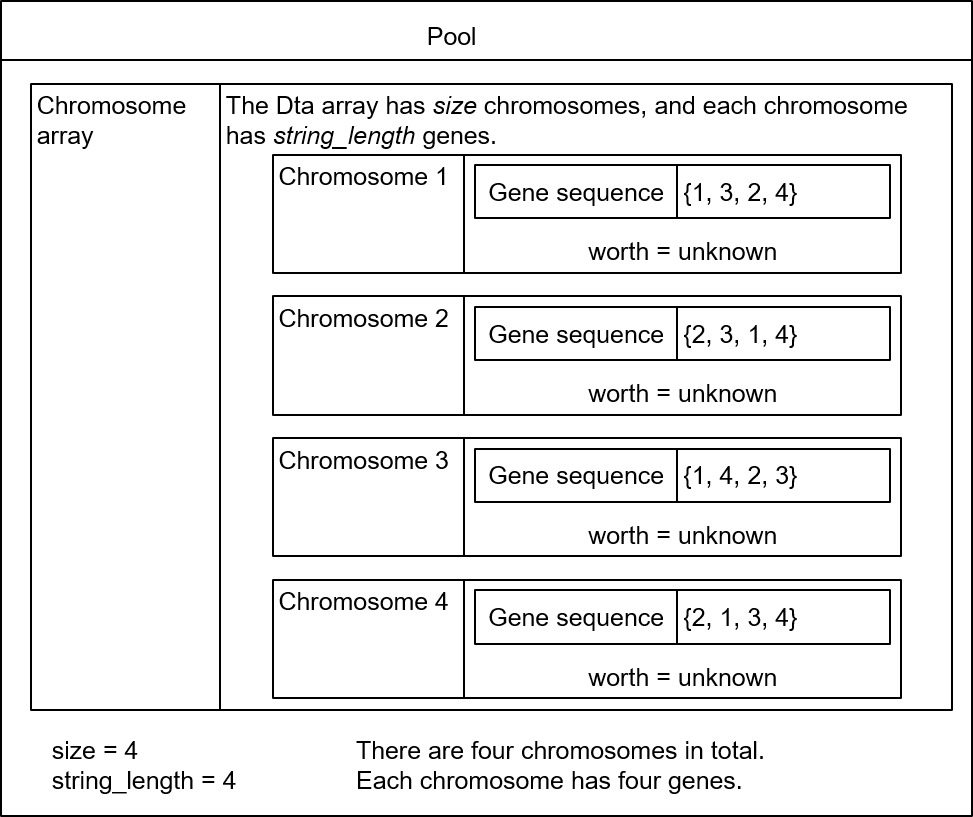

Figure 6-13 Chromosome structure

Then, fitness \(worth\) is calculated for each chromosome. A process of calculating fitness is actually a process of generating a join tree according to the gene encoding sequence of the chromosome and calculating the cost of the join tree.

In the openGauss database, each chromosome uses a left-deep tree by default. Therefore, after gene encoding of each chromosome is determined, a join tree of the chromosome is determined accordingly. For example, for a chromosome \{2, 4, 3, 1\}, the corresponding join tree is \(\(t2, t4\), t3\), t1\), as shown in Figure 6-14.

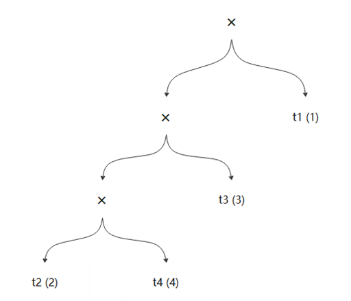

Figure 6-14 Chromosome join tree

The openGauss database generates fitness by using the geqo_eval function. The geqo_eval function first generates a join tree based on gene encoding of a chromosome, and then calculates the cost of the join tree.

The genetic algorithm uses the gimme_tree function to generate a join tree. The merge_clump function is recursively called in the function. The merge_clump function joins tables as many as possible, generates a join subtree, and records the number of nodes in each join subtree. Then, the join subtree is recorded in the clumps linked list in descending order of the number of nodes. The code is as follows:

```
/* Traverse all tables cyclically and join tables as many as possible.*/
For (rel_count = 0; rel_count < num_gene; rel_count++) {
int cur_rel_index;
RelOptInfo* cur_rel = NULL;
Clump* *cur_clump = NULL;

/* tour represents a chromosome. Here, a gene in the chromosome is obtained, that is, a base table.*/
cur_rel_index = (int) tour[rel_count];
cur_rel = (RelOptInfo *) list_nth(private->initial_rels, cur_rel_index - 1);

/* Generate a clump for the base table. size=1 indicates that there is only one base table in the current clump.*/
cur_clump = (Clump*)palloc(sizeof(Clump));
cur_clump->joinrel = cur_rel;
cur_clump->size = 1;

/* Attempt to join, perform recursive operations, and record the clumps to the clumps linked list.*/
clumps = merge_clump(root, clumps, cur_clump, false);
}
```

The previously generated chromosome \{2, 4, 3, 1\} is used as an example, assuming that:

\(1\) 2 and 4 cannot be joined.

\(2\) 4 and 3 can be joined.

\(3\) 2 and 1 can be joined.

Table 6-19 describes the process of generating a join tree under these conditions.

Table 6-19 Join tree generation process

<a name="table94581349181517"></a>

<table><tbody><tr id="row142271950111512"><td class="cellrowborder"  width="14.74%"><p id="p922715061518"><a name="p922715061518"></a><a name="p922715061518"></a>Number of Rounds</p>
<p id="p1822745014152"><a name="p1822745014152"></a><a name="p1822745014152"></a>relcount</p>
</td>
<td class="cellrowborder"  width="27.98%"><p id="p7227050191516"><a name="p7227050191516"></a><a name="p7227050191516"></a>Join Result Set</p>
<p id="p1422725001513"><a name="p1422725001513"></a><a name="p1422725001513"></a>clumps</p>
</td>
<td class="cellrowborder"  width="57.28%"><p id="p1222713508159"><a name="p1222713508159"></a><a name="p1222713508159"></a>Description</p>
</td>
</tr>
<tr id="row1022765018156"><td class="cellrowborder"  width="14.74%"><p id="p42271250141512"><a name="p42271250141512"></a><a name="p42271250141512"></a>Initial</p>
</td>
<td class="cellrowborder"  width="27.98%"><p id="p722795016154"><a name="p722795016154"></a><a name="p722795016154"></a>NULL</p>
</td>
<td class="cellrowborder"  width="57.28%"><p id="p52270501154"><a name="p52270501154"></a><a name="p52270501154"></a>Create a <strong id="b112276508152"><a name="b112276508152"></a><a name="b112276508152"></a>cur_clump</strong> node whose <strong id="b2022795031511"><a name="b2022795031511"></a><a name="b2022795031511"></a>gene</strong> is <strong id="b822716505158"><a name="b822716505158"></a><a name="b822716505158"></a>2</strong> and <strong id="b92271050141511"><a name="b92271050141511"></a><a name="b92271050141511"></a>cur_clump.size</strong> is <strong id="b1922785081519"><a name="b1922785081519"></a><a name="b1922785081519"></a>1</strong>.</p>
</td>
</tr>
<tr id="row92277503158"><td class="cellrowborder"  width="14.74%"><p id="p8227125031513"><a name="p8227125031513"></a><a name="p8227125031513"></a>0</p>
</td>
<td class="cellrowborder"  width="27.98%"><p id="p1922775071520"><a name="p1922775071520"></a><a name="p1922775071520"></a>{2}</p>
</td>
<td class="cellrowborder"  width="57.28%"><p id="p16227165051513"><a name="p16227165051513"></a><a name="p16227165051513"></a>Because <strong id="b1422716508155"><a name="b1422716508155"></a><a name="b1422716508155"></a>clumps == NULL</strong> and <strong id="b6227950191515"><a name="b6227950191515"></a><a name="b6227950191515"></a>cur_clump</strong> is not joined with any table, <strong id="b1822755016152"><a name="b1822755016152"></a><a name="b1822755016152"></a>cur_clump</strong> is directly added to <strong id="b0227175015157"><a name="b0227175015157"></a><a name="b0227175015157"></a>clumps</strong>.</p>
</td>
</tr>
<tr id="row202272050181519"><td class="cellrowborder"  width="14.74%"><p id="p152281503155"><a name="p152281503155"></a><a name="p152281503155"></a>1</p>
</td>
<td class="cellrowborder"  width="27.98%"><p id="p622815081511"><a name="p622815081511"></a><a name="p622815081511"></a>{2}, {4}</p>
</td>
<td class="cellrowborder"  width="57.28%"><p id="p10228165013151"><a name="p10228165013151"></a><a name="p10228165013151"></a>Create a <strong id="b1222815081512"><a name="b1222815081512"></a><a name="b1222815081512"></a>cur_clump</strong> node whose <strong id="b12228750191519"><a name="b12228750191519"></a><a name="b12228750191519"></a>gene</strong> is <strong id="b0228350191513"><a name="b0228350191513"></a><a name="b0228350191513"></a>4</strong> and <strong id="b822885019150"><a name="b822885019150"></a><a name="b822885019150"></a>cur_clump.size</strong> is <strong id="b1622885091511"><a name="b1622885091511"></a><a name="b1622885091511"></a>1</strong>, and attempt to join the <strong id="b1322816508151"><a name="b1322816508151"></a><a name="b1322816508151"></a>cur_clump</strong> node whose <strong id="b1122815011516"><a name="b1122815011516"></a><a name="b1122815011516"></a>gene</strong> is <strong id="b18228650151510"><a name="b18228650151510"></a><a name="b18228650151510"></a>4</strong> with the node in the <strong id="b122288504153"><a name="b122288504153"></a><a name="b122288504153"></a>clumps</strong> linked list. Because 2 and 4 cannot be joined, node 4 is also added to the <strong id="b15228125091516"><a name="b15228125091516"></a><a name="b15228125091516"></a>clumps</strong> linked list.</p>
</td>
</tr>
<tr id="row522819503157"><td class="cellrowborder" rowspan="2"  width="14.74%"><p id="p1022811502153"><a name="p1022811502153"></a><a name="p1022811502153"></a>2</p>
</td>
<td class="cellrowborder"  width="27.98%"><p id="p15228205018156"><a name="p15228205018156"></a><a name="p15228205018156"></a>{2}</p>
</td>
<td class="cellrowborder"  width="57.28%"><p id="p162281650161514"><a name="p162281650161514"></a><a name="p162281650161514"></a>Create a <strong id="b22284509153"><a name="b22284509153"></a><a name="b22284509153"></a>cur_clump</strong> node whose <strong id="b162281250181516"><a name="b162281250181516"></a><a name="b162281250181516"></a>gene</strong> is <strong id="b20228350201511"><a name="b20228350201511"></a><a name="b20228350201511"></a>3</strong> and <strong id="b15228135012156"><a name="b15228135012156"></a><a name="b15228135012156"></a>cur_clump.size</strong> is <strong id="b1122818503152"><a name="b1122818503152"></a><a name="b1122818503152"></a>1</strong>, traverse the <strong id="b1522885011516"><a name="b1522885011516"></a><a name="b1522885011516"></a>clumps</strong> linked list, and attempt to join with 2 and 4 respectively. It is found that the join with 4 can be established. Create a new <strong id="b4228125011516"><a name="b4228125011516"></a><a name="b4228125011516"></a>old_clumps</strong> node whose <strong id="b102289500159"><a name="b102289500159"></a><a name="b102289500159"></a>ols_clumps.size</strong> is <strong id="b112283509153"><a name="b112283509153"></a><a name="b112283509153"></a>2</strong> based on the join between 3 and 4 and delete node 4 from the <strong id="b122289508154"><a name="b122289508154"></a><a name="b122289508154"></a>clumps</strong> linked list.</p>
</td>
</tr>
<tr id="row9228165051514"><td class="cellrowborder" ><p id="p132283508155"><a name="p132283508155"></a><a name="p132283508155"></a>{3, 4} {2}</p>
</td>
<td class="cellrowborder" ><p id="p102281250161518"><a name="p102281250161518"></a><a name="p102281250161518"></a>Use the <strong id="b13228115016159"><a name="b13228115016159"></a><a name="b13228115016159"></a>old_clumps</strong> generated by joining 2 and 4 as the parameter to recursively invoke merge_clump and attempt to join <strong id="b152281750121518"><a name="b152281750121518"></a><a name="b152281750121518"></a>old_clumps</strong> with nodes in the <strong id="b72281650121518"><a name="b72281650121518"></a><a name="b72281650121518"></a>clumps</strong> linked list. It is found that they cannot be joined. That is, {3,4} and {2} cannot be joined. In this case, add <strong id="b152291250111519"><a name="b152291250111519"></a><a name="b152291250111519"></a>old_clumps</strong> to <strong id="b6229950131519"><a name="b6229950131519"></a><a name="b6229950131519"></a>clumps</strong>. Because <strong id="b19229550201512"><a name="b19229550201512"></a><a name="b19229550201512"></a>old_clumps.size</strong> is the largest currently, insert <strong id="b422917509156"><a name="b422917509156"></a><a name="b422917509156"></a>old_clumps</strong> to the beginning of <strong id="b19229450181515"><a name="b19229450181515"></a><a name="b19229450181515"></a>clumps</strong>.</p>
</td>
</tr>
<tr id="row4229135091512"><td class="cellrowborder" rowspan="2"  width="14.74%"><p id="p622945016151"><a name="p622945016151"></a><a name="p622945016151"></a>3</p>
</td>
<td class="cellrowborder"  width="27.98%"><p id="p122295508156"><a name="p122295508156"></a><a name="p122295508156"></a>{3, 4}</p>
</td>
<td class="cellrowborder"  width="57.28%"><p id="p19229950181510"><a name="p19229950181510"></a><a name="p19229950181510"></a>Create a <strong id="b3229155012153"><a name="b3229155012153"></a><a name="b3229155012153"></a>cur_clump</strong> node whose <strong id="b18229145021512"><a name="b18229145021512"></a><a name="b18229145021512"></a>gene</strong> is <strong id="b7229165021512"><a name="b7229165021512"></a><a name="b7229165021512"></a>1</strong> and <strong id="b1122925041515"><a name="b1122925041515"></a><a name="b1122925041515"></a>cur_clump.size</strong> is <strong id="b1822935018158"><a name="b1822935018158"></a><a name="b1822935018158"></a>1</strong>.</p>
<p id="p52291950151515"><a name="p52291950151515"></a><a name="p52291950151515"></a>Traverse the <strong id="b152291350191516"><a name="b152291350191516"></a><a name="b152291350191516"></a>clumps</strong> linked list and try to join with {3, 4} and {2} respectively. It is found that the join with 2 can be established. Create a new <strong id="b1822915508154"><a name="b1822915508154"></a><a name="b1822915508154"></a>old_clumps</strong> node whose <strong id="b72301750191520"><a name="b72301750191520"></a><a name="b72301750191520"></a>ols_clumps.size</strong> is <strong id="b152304503159"><a name="b152304503159"></a><a name="b152304503159"></a>2</strong> based on 1 and 2, and delete node 2 from the <strong id="b1123085061520"><a name="b1123085061520"></a><a name="b1123085061520"></a>clumps</strong> linked list.</p>
</td>
</tr>
<tr id="row1223045091512"><td class="cellrowborder" ><p id="p1223019503159"><a name="p1223019503159"></a><a name="p1223019503159"></a>{3, 4} {1, 2}</p>
</td>
<td class="cellrowborder" ><p id="p923012506155"><a name="p923012506155"></a><a name="p923012506155"></a>Use the new <strong id="b923065091518"><a name="b923065091518"></a><a name="b923065091518"></a>old_clumps</strong> generated by joining 1 and 2 as the parameter to recursively invoke merge_clump. Use <strong id="b0230195014159"><a name="b0230195014159"></a><a name="b0230195014159"></a>old_clumps</strong> to join with the nodes in the <strong id="b1623013509157"><a name="b1623013509157"></a><a name="b1623013509157"></a>clumps</strong> linked list. If the join fails, add <strong id="b1423095010151"><a name="b1423095010151"></a><a name="b1423095010151"></a>old_clumps</strong> to <strong id="b18230195041519"><a name="b18230195041519"></a><a name="b18230195041519"></a>clumps</strong>. Because <strong id="b17230125019159"><a name="b17230125019159"></a><a name="b17230125019159"></a>old_clumps.size</strong> is <strong id="b14230155001513"><a name="b14230155001513"></a><a name="b14230155001513"></a>2</strong>, insert <strong id="b17230145081515"><a name="b17230145081515"></a><a name="b17230145081515"></a>clumps</strong> to the end of <strong id="b12230195019158"><a name="b12230195019158"></a><a name="b12230195019158"></a>clumps</strong>.</p>
</td>
</tr>
</tbody>
</table>

According to the steps in the example, the process of the merge_clumps function is to continuously attempt to generate a larger clump.

```
/* If a join can be generated, try to generate a join with more nodes through recursion.*/
if (joinrel != NULL) {
...
/* Generate a new join node and increase the number of joined nodes.*/
old_clump->size += new_clump->size;
pfree_ext(new_clump);

/* Delete the joined nodes from the clumps join table.*/
clumps = list_delete_cell(clumps, lc, prev);
/* Use clumps and the newly generated join node (old_clump) as parameters to continue to generate joins.*/
return merge_clump(root, clumps, old_clump, force);
}
```

According to the example in the preceding table, the **clumps** linked list contains two nodes, which are two join subtrees. After **force** is set to **true**, the system attempts to join the two nodes again.

```
/* If there are multiple nodes in clumps, it indicates that the join tree is not generated successfully.*/
if (list_length(clumps) > 1) {
...
foreach(lc, clumps) {
Clump* clump = (Clump*)lfirst(lc);
/* Set the force parameter to true and try to join unconditionally.*/
fclumps = merge_clump(root, fclumps, clump, true);
}
clumps = fclumps;
}
```

### 3. Operator Selection<a name="section14602145916162"></a>

After a pool is generated, intergenerational genetic optimization can be performed. Two chromosomes are randomly selected from the pool to perform a crossover operation. In this way, a new chromosome can be generated.

As chromosomes in the pool are already sorted according to fitness, a chromosome with lower fitness \(lower cost\) is better. It is expected that a better chromosome is inherited. Therefore, a chromosome with lower fitness is preferred when a father chromosome and a mother chromosome are selected. The concept of bias is involved in the selection process. It is a fixed value in the operator. The value of bias can be adjusted through the parameter **Geqo_selection_bias** \(by default, it is **2.0**\).

```
/* A father chromosome and a mother chromosome are selected by using the linear_rand function.*/
first = linear_rand(root, pool->size, bias);
second = linear_rand(root, pool->size, bias);
```

To generate a random number \(x\) based on a certain probability distribution, you need to know the probability distribution function or probability density function \(PDF\) first. The PDF 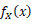used by the openGauss database is as follows:

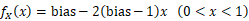

The following cumulative distribution function \(CDF\) is obtained by using the PDF:

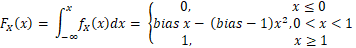

Then, a random number that conforms to the probability distribution can be obtained by using the PDF and the inverse function method.

Function:

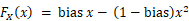

Inverse function:

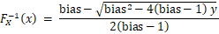

This is consistent with the implementation of the linear_rand function in the source code.

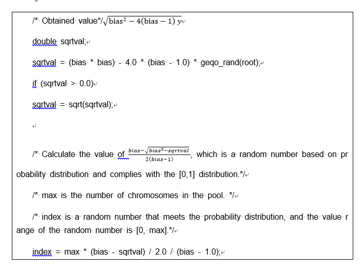

The code of probability-based random number generation algorithm is extracted for calculation and verification, and the characteristics of random number generation are analyzed. It is assumed that bias is 2.0, and then the PDF is used to calculate the theoretical probability value of each interval for analysis. For example, for a range from 0.6 to 0.7, the theoretical probability is calculated as follows:

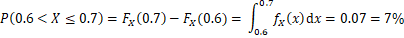

Figure 6-15 shows the theoretical probability values in each range.

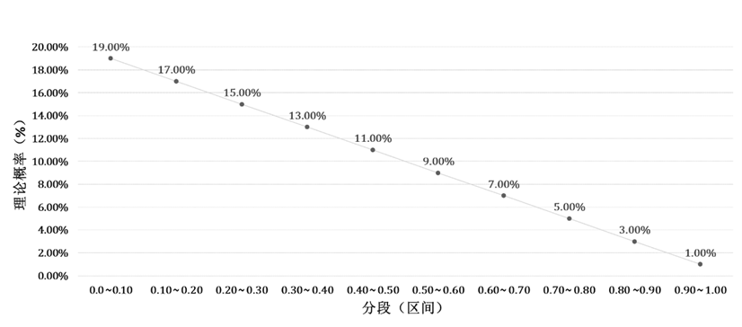

Figure 6-15 Theoretical probability value of random number generation

It can be learned from Figure 6-15 that theoretical probability values in all ranges decrease sequentially. In other words, when a parent chromosome is selected, a chromosome with lower fitness \(lower cost\) is more likely to be selected.

### 4. Crossover Operator<a name="section47971321186"></a>

After the parent chromosomes are selected by using the selection operator, a crossover operation may be performed on the selected parent chromosomes, to generate a new child chromosome.

The openGauss provides a plurality of crossover methods, including edge combination crossover, partially matched crossover, cycle crossover, position crossover, and order crossover. In the process of source code analysis, the position crossover method is taken as an example for illustration.

It is assumed that the gene code of the selected father chromosome is \{1, 3, 2, 4\} with a fitness of 100, and the gene code of the selected mother chromosome is \{2, 3, 1, 4\} with a fitness of 200. When a child chromosome is not generated and is in an uninitialized state, the statuses of these chromosomes are shown in Figure 6-16.

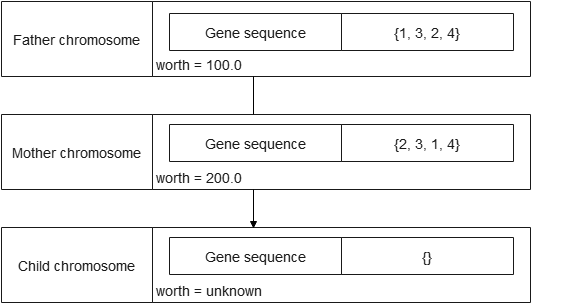

Figure 6-16 Chromosome status

A random number **num_positions** needs to be generated for the crossover operation. The position of the random number is in a range between 1/3 and 2/3 of a total quantity of genes. The random number represents a quantity of father chromosome genes that need to be inherited to a child chromosome according to the position. The code is as follows:

```
/* num_positions determines the number of genes inherited from the father chromosome to the child chromosome.*/
num_positions = geqo_randint(root, 2 * num_gene / 3, num_gene / 3);

/* Select a random position.*/
for (i = 0; i < num_positions; i++)
{
/* A position is randomly generated, and genes at the position of the father chromosome are inherited to the child chromosome.*/
pos = geqo_randint(root, num_gene - 1, 0);

offspring[pos] = tour1[pos];
/* Mark that the genes at this position have been used. The mother chromosome cannot inherit the same genes to the child chromosome.*/
city_table[(int) tour1[pos]].used = 1;
}
```

It is assumed that the father chromosome needs to inherit two genes to the child chromosome, to respectively transmit gene 1 and gene 2. In this case, the status of the child chromosome is shown in Figure 6-17.


Figure 6-17 Current chromosome status

Currently, the child chromosome already has two genes: 3 and 2. After the mother chromosome excludes the two genes, there are still two genes: 1 and 4. The two genes are written into the child chromosome according to the sequence in the mother chromosome, and a new child chromosome is generated, as shown in Figure 6-18.

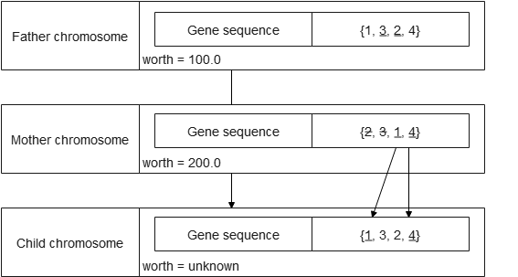

Figure 6-18 New chromosome status

### 5. Fitness Calculation<a name="section67977496241"></a>

After the newly generated child chromosome is obtained, you can calculate fitness by using the geqo_eval function. Then, add the chromosome to the pool by using the spread_chromo function.

```
/* Fitness analysis */
kid->worth = geqo_eval(root, kid->string, pool->string_length);

/* Diffusion of the chromosome based on fitness*/
spread_chromo(root, kid, pool);
```

Because chromosomes in the pool should always be in an ordered state, the spread_chromo function may traverse the pool by using the dichotomy to compare fitness of the chromosomes in the pool and fitness of the new chromosome, and search for a position for inserting the new chromosome according to the fitness. The chromosome behind it automatically moves back by one position, and the last chromosome is eliminated. If the fitness of the new chromosome is the highest, the chromosome is eliminated directly. The code is as follows:

```
/* Use the dichotomy to traverse chromosomes in the pool.*/
top = 0;
mid = pool->size / 2;
bot = pool->size - 1;
index = -1;

/* Chromosome screening*/
while (index == -1) {
/* Moving is required in the following four cases.*/
if (chromo->worth <= pool->data[top].worth) {
index = top;
} else if (chromo->worth - pool->data[mid].worth == 0) {
index = mid;
} else if (chromo->worth - pool->data[bot].worth == 0) {
index = bot;
} else if (bot - top <= 1) {
index = bot;
} else if (chromo->worth < pool->data[mid].worth) {
/*
* The following two cases are handled separately because no new position is found.
*/
bot = mid;
mid = top + ((bot - top) / 2);
} else { /* (chromo->worth > pool->data[mid].worth) */
top = mid;
mid = top + ((bot - top) / 2);
}
}
```

The genetic algorithm continuously generates a new chromosome for a pool by selecting an excellent chromosome and performing intergenerational crossover for a plurality of times, and the chromosome is repeatedly generated, so as to push a solution of the algorithm to approach from local optimal to global optimal.

## Summary<a name="section1484872714912"></a>

This chapter describes the implementation process of the SQL engine, including SQL parsing, query rewriting, and query optimization. The SQL engine involves a large amount of code, featuring high code coupling and complex implementation logic. For better understanding, you are advised to master the overall code process and key structures, and summarize them in practice.
