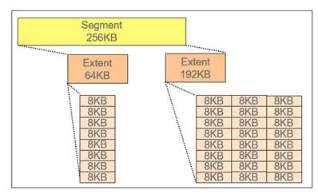
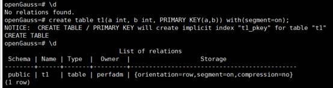
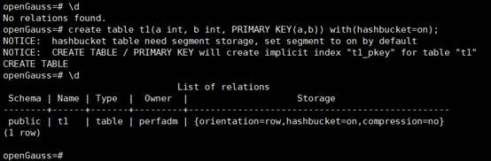
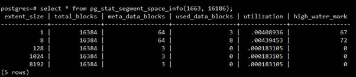

# Segment-Page Feature of openGauss for Solving File Storage Problems

In modern society, data is growing explosively, and service requirements in the industry are complex. The amount of data to be stored and the number of tables to be created keep increasing. Each common data table of openGauss corresponds to a logical large file \(maximum size: 32 TB\). The logical file is divided into multiple actual files based on the fixed size and stored in the corresponding database directory. Therefore, as the data volume of each data table increases, the number of files required for underlying data storage increases gradually. In addition, openGauss provides features such as hash bucket tables and large partitioned tables. Each data table is split into several sub-tables, and the number of files required at the bottom layer increases exponentially. Therefore, this storage management mode has the following problems:

- 1. It depends greatly on the file system and cannot perform fine-grained control to improve maintainability.
- 2. There are too many file handles in the case of a large amount of data. Currently, only virtual handles can be used to solve the problem, which affects the system performance.
- 3. Too many small files may cause random I/O problems in scenarios such as full build and full backup, affecting performance.

To resolve the foregoing problems, openGauss introduces a segment-page storage management mechanism, which is similar to segment-page memory management of an operating system, but differs greatly in implementation mechanisms.

## Implementation Principle of the Segment-Page Mechanism

With the segment-page storage management, tablespaces and data files are logically organized into segments, extents, and pages/blocks for storage allocation and management, as shown in the following figure. Specifically, a database \(in a tablespace\) has only one segment space. The actual physical storage may be a file or may be split into multiple files. Data is allocated to all tables in the database from this space. Therefore, the number of tables is irrelevant to the number of physical files. Each table has a logical segment, and all data in the table is stored in the segment. Multiple extents are mounted to each segment. Each extent is a continuous physical page. Extent sizes can be flexibly adjusted based on service requirements to avoid storage space waste.

Figure 1 Segment-page storage design

Segment-page files can be automatically expanded until the disk space is used up or the limit threshold for the tablespace is reached. Segment-page storage does not automatically reclaim disk space. After some data tables are deleted, the space occupied by the data tables in the segment-page file is reserved and the disk space is not released. These reserved spaces will be reused by tables that are expanded or created later. If you do not need to reuse the space, you can manually call system functions to recycle and then release disk space.

In internal implementation, each segment corresponds to a physical file that is originally stored in page mode. For example, each partitioned table and a bucket in each hash bucket table have an independent segment. Multiple extents are mounted to each segment. Each extent is consecutive in a file, but extents may not be consecutive between each other. A segment can be dynamically expanded by adding new extents, but an extent cannot be directly reclaimed. You can reclaim storage space by segment by truncating or clustering the entire table.

Currently, four sizes of extents are supported: 64 KB, 1 MB, 8 MB, and 64 MB. For a segment, the size of the extent expanded each time is fixed. The size of the first 16 extents is 64 KB, the size of the 17th to 143th extents is 1 MB. The same rule applies to other extents. The following figure lists the parameters.

Table 1 Classification of extents stored in a segment

<table><thead ><tr id="row11837109105215"><th class="cellrowborder"  width="10.141014101410141%" id="mcps1.1.7.1.1">
Group

</th>
<th class="cellrowborder"  width="15.4015401540154%" id="mcps1.1.7.1.2">
Extent Size

</th>
<th class="cellrowborder"  width="20.47204720472047%" id="mcps1.1.7.1.3">
Extent Page Count

</th>
<th class="cellrowborder"  width="22.28222822282228%" id="mcps1.1.7.1.4">
Extent Count Range

</th>
<th class="cellrowborder"  width="18.84188418841884%" id="mcps1.1.7.1.5">
Total Page Count

</th>
<th class="cellrowborder"  width="12.861286128612862%" id="mcps1.1.7.1.6">
Total Size

</th>
</tr>
</thead>
<tbody><tr id="row1484617955219"><td class="cellrowborder"  width="10.141014101410141%" headers="mcps1.1.7.1.1 ">
1

</td>
<td class="cellrowborder"  width="15.4015401540154%" headers="mcps1.1.7.1.2 ">
64 KB

</td>
<td class="cellrowborder"  width="20.47204720472047%" headers="mcps1.1.7.1.3 ">
8

</td>
<td class="cellrowborder"  width="22.28222822282228%" headers="mcps1.1.7.1.4 ">
[1, 16]

</td>
<td class="cellrowborder"  width="18.84188418841884%" headers="mcps1.1.7.1.5 ">
128

</td>
<td class="cellrowborder"  width="12.861286128612862%" headers="mcps1.1.7.1.6 ">
1 MB

</td>
</tr>
<tr id="row148466919525"><td class="cellrowborder"  width="10.141014101410141%" headers="mcps1.1.7.1.1 ">
2

</td>
<td class="cellrowborder"  width="15.4015401540154%" headers="mcps1.1.7.1.2 ">
1 MB

</td>
<td class="cellrowborder"  width="20.47204720472047%" headers="mcps1.1.7.1.3 ">
128

</td>
<td class="cellrowborder"  width="22.28222822282228%" headers="mcps1.1.7.1.4 ">
[17, 143]

</td>
<td class="cellrowborder"  width="18.84188418841884%" headers="mcps1.1.7.1.5 ">
16K

</td>
<td class="cellrowborder"  width="12.861286128612862%" headers="mcps1.1.7.1.6 ">
128 MB

</td>
</tr>
<tr id="row684759205219"><td class="cellrowborder"  width="10.141014101410141%" headers="mcps1.1.7.1.1 ">
3

</td>
<td class="cellrowborder"  width="15.4015401540154%" headers="mcps1.1.7.1.2 ">
8 MB

</td>
<td class="cellrowborder"  width="20.47204720472047%" headers="mcps1.1.7.1.3 ">
1024

</td>
<td class="cellrowborder"  width="22.28222822282228%" headers="mcps1.1.7.1.4 ">
[144, 255]

</td>
<td class="cellrowborder"  width="18.84188418841884%" headers="mcps1.1.7.1.5 ">
128K

</td>
<td class="cellrowborder"  width="12.861286128612862%" headers="mcps1.1.7.1.6 ">
1 GB

</td>
</tr>
<tr id="row1384799115213"><td class="cellrowborder"  width="10.141014101410141%" headers="mcps1.1.7.1.1 ">
4

</td>
<td class="cellrowborder"  width="15.4015401540154%" headers="mcps1.1.7.1.2 ">
64 MB

</td>
<td class="cellrowborder"  width="20.47204720472047%" headers="mcps1.1.7.1.3 ">
8192

</td>
<td class="cellrowborder"  width="22.28222822282228%" headers="mcps1.1.7.1.4 ">
[256, …]

</td>
<td class="cellrowborder"  width="18.84188418841884%" headers="mcps1.1.7.1.5 ">
...

</td>
<td class="cellrowborder"  width="12.861286128612862%" headers="mcps1.1.7.1.6 ">
...

</td>
</tr>
</tbody>
</table>

## Guide to Using Segment-Page Tables

When using the CREATE TABLE statement to create a table, you can specify **segment=on** to enable a row-store table to store data in segment-page mode. If **hashbucket=on** is specified, **segment=on** is forcibly used by default. Currently, segment-page storage does not support column-store tables. Segment-page tablespaces are automatically created and do not require additional commands.

- Set **segment** to **on** to create a segment-page common table.

  create table t1\(a int, b int, PRIMARY KEY\(a,b\)\) with\(segment=on\);

  

- Set **hashbucket** to **on** to create a segment-page hash bucket table.

  create table t1\(a int, b int, PRIMARY KEY\(a,b\)\) with\(hashbucket=on\);

  

  To help users better use the segment-page storage function, openGauss provides two built-in system functions to display the extent usage. Users can use the two views to determine whether to reclaim data and which part of the data to be reclaimed.

- **pg_stat_segment_space_info\(Oid tablespace, Oid database\);**specifies the OIDs of the tablespace and database to display the usage information about all extent groups in the tablespace.

  Table 2 pg_stat_segment_space_info view column information

  
  <table><thead ><tr id="row1849139195216"><th class="cellrowborder"  width="40.67%" id="mcps1.1.3.1.1">
<strong id="b108498911525">Name</strong>

  </th>
  <th class="cellrowborder"  width="59.330000000000005%" id="mcps1.1.3.1.2">
<strong id="b98494913528">Description</strong>

  </th>
  </tr>
  </thead>
  <tbody><tr id="row13849793529"><td class="cellrowborder"  width="40.67%" headers="mcps1.1.3.1.1 ">
extent_size

  </td>
  <td class="cellrowborder"  width="59.330000000000005%" headers="mcps1.1.3.1.2 ">
Extent specifications of an extent group. The unit is the number of blocks.

  </td>
  </tr>
  <tr id="row118496912522"><td class="cellrowborder"  width="40.67%" headers="mcps1.1.3.1.1 ">
total_blocks

  </td>
  <td class="cellrowborder"  width="59.330000000000005%" headers="mcps1.1.3.1.2 ">
Total number of extents in a physical file

  </td>
  </tr>
  <tr id="row108491298522"><td class="cellrowborder"  width="40.67%" headers="mcps1.1.3.1.1 ">
meta_data_blocks

  </td>
  <td class="cellrowborder"  width="59.330000000000005%" headers="mcps1.1.3.1.2 ">
Number of blocks occupied by the metadata managed in a tablespace, including the space header and map page but excluding the segment head

  </td>
  </tr>
  <tr id="row138491945211"><td class="cellrowborder"  width="40.67%" headers="mcps1.1.3.1.1 ">
used_data_blocks

  </td>
  <td class="cellrowborder"  width="59.330000000000005%" headers="mcps1.1.3.1.2 ">
Number of extents used for storing data, including the segment head

  </td>
  </tr>
  <tr id="row158493915526"><td class="cellrowborder"  width="40.67%" headers="mcps1.1.3.1.1 ">
utilization

  </td>
  <td class="cellrowborder"  width="59.330000000000005%" headers="mcps1.1.3.1.2 ">
Percentage of the number of used blocks to the total number of blocks, that is, (the value of <strong id="b785019165216">used_data_blocks</strong> + the value of <strong id="b118509913522">meta_data_block</strong>)/the value of <strong id="b88502955218">total_blocks</strong>

  </td>
  </tr>
  <tr id="row12850198520"><td class="cellrowborder"  width="40.67%" headers="mcps1.1.3.1.1 ">
high_water_mark

  </td>
  <td class="cellrowborder"  width="59.330000000000005%" headers="mcps1.1.3.1.2 ">
High-water mark, indicating the number of allocated extents and maximum physical page number. Blocks that exceed the high-water mark are not used and can be directly recycled.

  </td>
  </tr>
  </tbody>
  </table>

  

- **pg_stat_segment_extent_usage\(Oid tablespace, Oid databse, uint32 extent_type\);**specifies the usage information of each allocated extent in an extent group returned each time.**extent_type** indicates the type of the extent group. The value is an integer ranging from 1 to 5.If the value is not within the range, an error is reported.

  Table 3 pg_stat_segment_extent_usage view column information

  
  <table><thead ><tr id="row16850497529"><th class="cellrowborder"  width="39.32%" id="mcps1.1.3.1.1">
<strong id="b68517917523">Name</strong>

  </th>
  <th class="cellrowborder"  width="60.68%" id="mcps1.1.3.1.2">
<strong id="b198519912529">Description</strong>

  </th>
  </tr>
  </thead>
  <tbody><tr id="row108518925215"><td class="cellrowborder"  width="39.32%" headers="mcps1.1.3.1.1 ">
start_block

  </td>
  <td class="cellrowborder"  width="60.68%" headers="mcps1.1.3.1.2 ">
Start physical page number of an extent

  </td>
  </tr>
  <tr id="row12851490524"><td class="cellrowborder"  width="39.32%" headers="mcps1.1.3.1.1 ">
extent_size

  </td>
  <td class="cellrowborder"  width="60.68%" headers="mcps1.1.3.1.2 ">
Extent size

  </td>
  </tr>
  <tr id="row18851159195219"><td class="cellrowborder"  width="39.32%" headers="mcps1.1.3.1.1 ">
usage_type

  </td>
  <td class="cellrowborder"  width="60.68%" headers="mcps1.1.3.1.2 ">
Usage type of an extent, for example, <strong id="b1485179135214">segment head</strong> and <strong id="b1885111975212">data extent</strong>

  </td>
  </tr>
  <tr id="row08515919523"><td class="cellrowborder"  width="39.32%" headers="mcps1.1.3.1.1 ">
ower_location

  </td>
  <td class="cellrowborder"  width="60.68%" headers="mcps1.1.3.1.2 ">
Object location of an extent to which a pointer points. For example, the owner of a data extent is the head of the segment to which the data extent belongs.

  </td>
  </tr>
  <tr id="row18851395521"><td class="cellrowborder"  width="39.32%" headers="mcps1.1.3.1.1 ">
special_data

  </td>
  <td class="cellrowborder"  width="60.68%" headers="mcps1.1.3.1.2 ">
Position of an extent in its owner. The value of this column is related to the usage type. For example, special data of a data extent is the extent ID in the segment to which the data extent belongs.

  </td>
  </tr>
  </tbody>
  </table>

- **gs_spc_shrink\(Oid tablespace, Oid database, uint32 extent_type\);**specifies that one extent group is cleared at a time. The target size in shrinking is automatically calculated as follows: Active data volume + 128 MB. The value is rounded up and aligned with 128 MB.

## Summary

openGauss provides the segment-page solution to solve the problem that there are too many underlying file handles when there are a large number of hash bucket tables and large partitioned tables. In the segment-page solution, a table corresponds to a logical segment. Different segments at the bottom layer are stored in a physical file, greatly reducing the number of handles of the physical file at the bottom layer. Even in the case of a large amount of data, the scenario where there are too many file handles such as common tables is avoided, and the system maintainability is improved. In addition, in scenarios such as full build and full backup, random I/Os caused by too many small files can be reduced to improve system I/O performance. The parameters related to the current segment-page table are fixed. In the future, openGauss can use the AI technology to automatically adjust parameters for the segment-page storage mechanism, providing users with more intelligent and better-performance segment-page storage policies.
