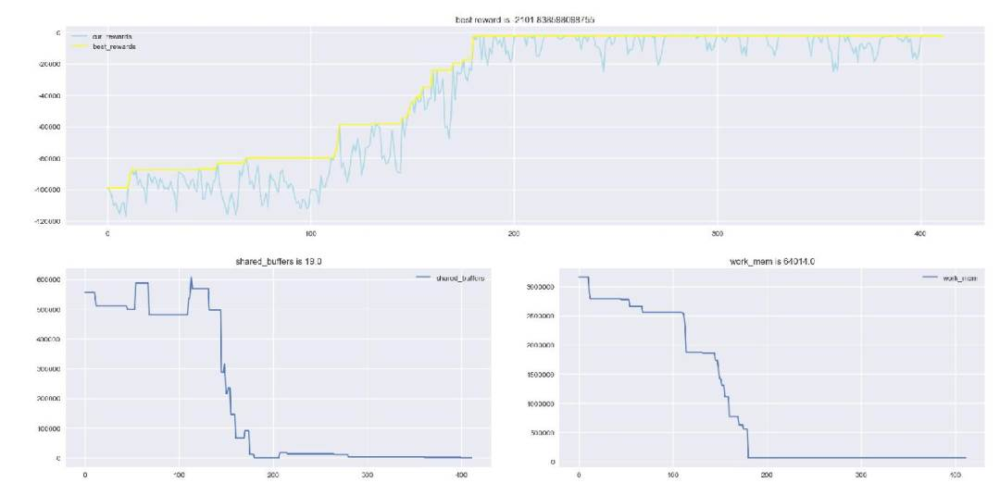
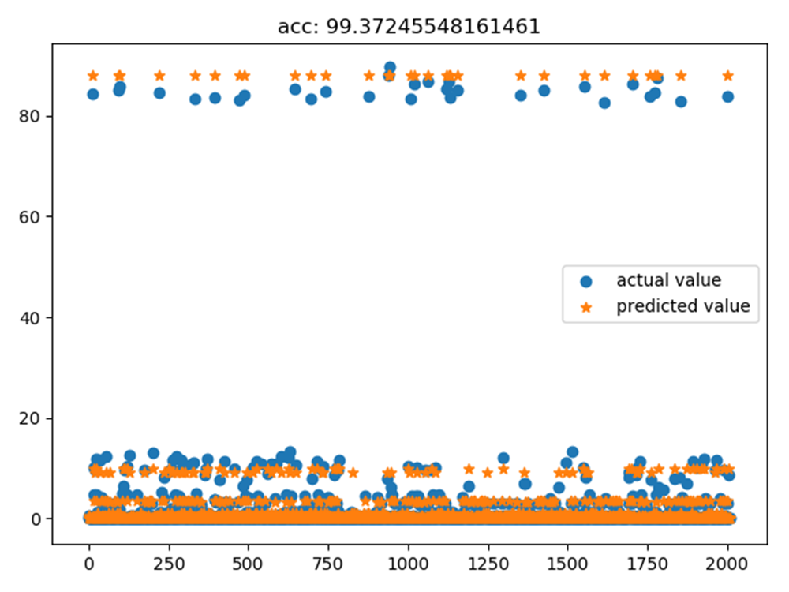
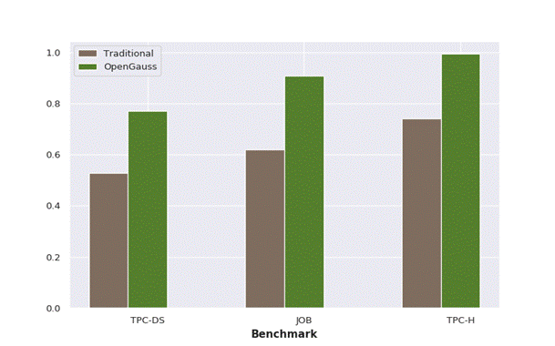
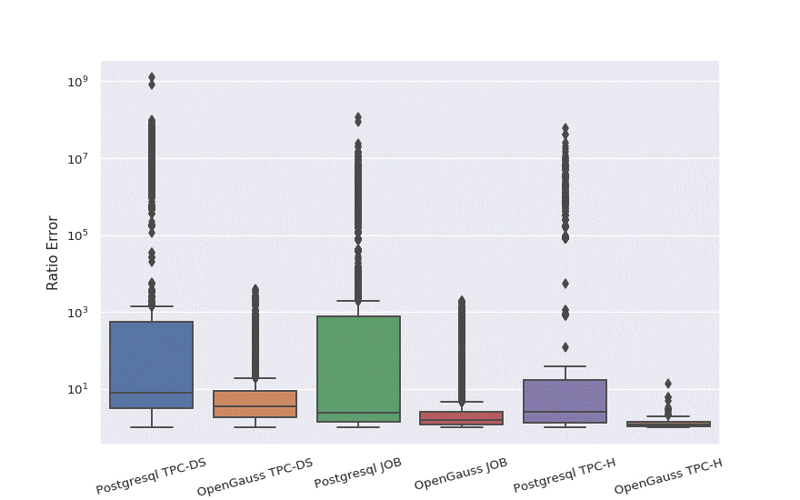

# The Combination of openGauss Database and AI

openGauss has powerful computing performance and efficient data processing capabilities. It is also a native AI database that supports self-tuning parameters, SQL diagnosis, fault self-diagnosis, and full lifecycle management. The following describes the AI features of openGauss.

## X-Tuner: database parameter tuning framework.

A database is a very complex system. It contains a large number of configuration parameters and controls memory allocation, I/O optimization, query plan cost, parallelism, log recording, data recovery, and other behaviors. The database performance varies according to the configuration parameters under specific loads. Many database administrators and experts are trying to adjust these parameters to achieve good database performance.

However, database parameter tuning is a NP-hard problem. Generally, people adjust parameters based on their own experience and understanding of the current environment. There are a large number of uncertainties during tuning. To solve this problem, database engineers try to build an intelligent system that can perform automatic tuning, such as Postgresqltuner.pl of PostgreSQL and mysqltuner.pl of MySQL. Similarly, with the emergence of AI technologies, some AI-based tuning solutions, such as OtterTune, have emerged. Nevertheless, all tuning solutions have the following restrictions:

- The database has hundreds of parameters. DBAs cannot adjust such a number of parameters at a time.
- Traditional machine learning requires a large amount of data training. It is difficult to collect data, especially data with good performance, regardless of whether this method is feasible.

- Some methods use reinforcement learning, but the relationship between database status and database parameters is not considered during tuning.

Considering the preceding restrictions, openGauss develops its own database parameter tuning framework X-Tuner. Compared with the traditional methods, X-Tuner has the following features:

- **1. **Robust and fault-tolerant:

  The X-Tuner framework is designed with a large number of fault tolerance and emergency handling mechanisms. When the system or database is faulty, the algorithm can exit normally without affecting the system.

- **2. **Flexible deployment and easy to use:

  X-Tuner is developed based on Python 3.0+ and supports Linux and Windows OSs. Users can easily deploy X-Tuner. In terms of usage, X-Tuner supports local and remote connection modes, which are applicable to various user situations.

- **3. **Easy to understand and facilitate secondary development:

  X-Tuner is compiled strictly based on the benchmark test module, tuning algorithm module, connection module, and log module. X-Tuner is highly hierarchical and easy to understand. In addition, users can tune or compile their own functional modules based on X-Tuner.

  Tests show that the X-Tuner parameter tuning framework based on reinforcement learning and heuristic algorithms can greatly improve system performance with the minimum memory usage. Figure 1 shows the parameter tuning process.

  Figure 1 X-Tuner parameter tuning process

With the X-Tuner technology, HUAWEI CLOUD DAS can intelligently recommend parameters based on the historical load of user databases. Tests show that the overall performance is improved by about 20%, greatly saving cloud computing resources and reducing production costs.

## SQLDiag: intelligently identifies SQL statements.

SQLDiag is a framework for estimating the SQL statement execution duration in openGauss. An existing prediction technology is mainly a model prediction based on an execution plan. However, these prediction solutions are mainly applicable to an OLAP scenario, and a complete execution plan of an SQL statement needs to be obtained. This greatly limits short queries such as OLTP or HTAP.

Different from the preceding solution, SQLDiag focuses on a historical SQL statement of a database. Because execution duration of the SQL statement of the database does not differ greatly in a short time, SQLDiag may detect a similar SQL statement from historical data, and predict the execution duration of the SQL statement based on an SQL vectorization technology and a time series prediction algorithm. In this way, potential slow SQL statements can be identified. This framework has the following advantages:

- Execution plans do not require SQL statements and have no impact on database performance.
- SQLDiag is widely used in many scenarios and can even be used in NoSQL after reconstruction, while many other algorithms in the industry only target at a scenario, such as, OLTP or OLAP.
- The framework is robust and easy to understand. Users can design their own prediction models by simply modifying the framework.

  

Figure 2 shows the SQLDiag prediction result.

Figure 2 SQLDiag prediction result

## Intelligent optimizer: database execution cost prediction.

In a large number of service scenarios that depend on databases, operations such as account login, order query, as well as report query, data mining involving hundreds of millions of lines are performed. These operations are abstracted and converted at the service application layer and performed in the form of SQL statements. The SQL engine in the database kernel further optimizes the SQL statements.

Challenges from service logic: During SQL statement processing, service scenarios become increasingly complex and business intelligence tools are used, generating SQL statements of different quality. Some of the SQL statements may consume a large number of read/write and computing resources. As a result, servers block other service statements. Therefore, the SQL diagnosis capability of the upper-layer service components of the database is required.

Challenges from SQL statements: During optimization of a query execution plan, more complex query statements also bring new challenges to query optimization. In the early stage of database system development, query optimization mainly depends on rule-based expert system, that is, a series of optimization rules with strict sequence. This type of expert system can be considered as the experience summary of database optimization experts in some common scenarios. As a result, the rule system always generates the same query plan for the same query statement regardless of the actual data volume and distribution in the database. If a scenario does not comply with experience rules, the database efficiency cannot be ensured.

The core problem of SQL diagnosis and plan optimization is the evaluation of resource overhead. In mainstream database products, the query resource overhead mainly depends on sampling and analysis of full data in the database, establishment of statistical models and cost models, and abstraction of the plan execution process. Currently, the following challenges are faced:

- The data sampling and analysis process occupies the disk read/write and CPU computing resources of the server to a large extent. However, if the sampling rate is reduced to avoid the resource overhead, the evaluation accuracy of the query resource overhead decreases.
- As service statements are executed continuously, the data scale and distribution change gradually, which invalidates the original data models. These two types of problems may cause the server to fail to respond for a long time.
- Is there a way to maintain the accuracy of resource overhead prediction with as little encroachment on database resources as possible? The answer is yes. openGauss provides the query performance prediction function based on online deep learning for database users.

The intelligent optimizer has the following features:

- **1. **One-click modeling and machine learning.

  For SQL performance evaluation, openGauss integrates data collection, cleaning, preprocessing, and encoding, and training monitoring. Users only need to configure a few parameters for the model based on the recommendation and call the model prediction API to obtain the performance prediction result after the model training is complete.

- **2. **Fine-grained, easily locating performance bottlenecks.

  It supports fragment-level query performance prediction of fine-grained query plans, helping users locate performance bottlenecks and better rewrite statements. In the future, intelligent SQL optimization based on plan segment cost performance prediction will be supported.

- **3. **Flexible deployment, minimizing the impact on database performance.

  The model computing module can be deployed on the cloud or in other environments isolated from the database based on user requirements. Historical performance data is used for modeling, and no extra resource overhead caused by data sampling is required.

- **4. **Open APIs, benefiting data scientists.

  The HTTPS protocol is used to connect the database kernel to the deep learning model. Open APIs allow users to build custom machine learning jobs into database functions for one-click calling.

According to actual tests, the prediction accuracy of query performance is improved by 40% compared with the native PostgreSQL model.

Figure 3 Predicted query performance of openGauss compared with the native PostgreSQL database

According to the distribution of the prediction accuracy, the accuracy of the 95th percentile is improved by 3e5 times, and the accuracy of the 75th percentile is improved by 124 times. The overall prediction reliability is greatly improved.

Figure 4 Prediction accuracy distribution of openGauss and PostgreSQL

## Summary and Prospect

openGauss is a shallow attempt to combine AI with databases, and there may still be many shortcomings. In addition to the preceding typical open-source AI features, many AI features are still under exploration. We can feel that in the preceding application scenarios, the AI-based method can greatly reduce manpower and improve production efficiency.

Although the road to combining AI with databases is very difficult and rough, and even faces doubts from the industry, numerous R&D engineers have never given up their beliefs and are moving forward with the ideal of "all things intelligent." We hope that the open source openGauss can attract more developers in the industry to integrate AI with databases, further promote the upgrade of database technologies, and stimulate the emergence of more valuable and meaningful AI databases. In this way, we can realize the great vision of intelligent databases in the future.
