# Transaction Mechanism Source Code Analysis<a name="ZH-CN_TOPIC_0000001251306647"></a>

A transaction is the execution unit of a database operation and must have the basic atomicity, consistency, isolation, and durability \(ACID\) properties.

1.  Atomicity: After a transaction is committed, operations in the transaction are all executed or none of the operations is executed.
2.  Consistency: Transaction execution cannot damage the integrity and consistency of database data.
3.  Isolation: The execution of a transaction cannot be interfered by other transactions in a concurrent environment.
4.  Durability: Once a transaction is committed, its changes to the state of the database are permanently saved in the database.

This chapter describes how the openGauss transaction module implements the basic properties of database transactions to ensure that user data is not lost, is modified correctly, and is queried correctly.

## 5.1 Overall Transaction Architecture and Code Overview<a name="section9512453143710"></a>

Figure 5-1 shows the overall structure of the transaction module.

Overall structure


In openGauss, the implementation of transactions is closely related to the implementation of the storage engine. The code is mainly stored in the **src/gausskernel/storage/access/transam** and **src/gausskernel/storage/lmgr** directories. Figure 5-1 shows the key files.

1.  Transaction manager: It is the core of the transaction system. It is implemented as a finite loop state machine. It receives commands from external systems and determines the next execution process of a transaction based on the state of the current transaction.
2.  Log manager: It records the transaction execution state and data change process, including transaction commit logs \(Clogs\), transaction commit sequence number logs \(CSNlogs\), and transaction logs \(Xlogs\). Clogs record only transaction execution results. CSNlogs record the sequence in which logs are committed for visibility determination. Xlogs are redo logs for data restoration and persistency.
3.  Thread management mechanism: Transaction information of all threads is recorded at a memory area. Any thread can access this area to obtain the status information of other transactions.
4.  Multi-Version Concurrency Control \(MVCC\) mechanism: In openGauss, the MVCC mechanism is used in the transaction read process based on the commit sequence number \(CSN\) committed by each transaction. In this way, read and write operations on tuples do not block each other. For details about how to determine visibility, see section 5.2 "Transaction Concurrency Control."
5.  Lock manager: It controls the write concurrency of the system and uses the lock mechanism to ensure the isolation between the transaction write processes.

## 5.2 Transaction Concurrency Control<a name="section1818972034317"></a>

The transaction concurrency control mechanism is used to ensure the ACID properties of openGauss when transactions are concurrently executed. The following describes the components of the transaction concurrency control mechanism in more detail.

- **Transaction State Machine**

  openGauss divides the transaction system into two layers: TBlockState \(upper layer\) and TransState \(lower layer\).

  With a layered design, details can be shielded when upper-layer services are processed to flexibly support various transaction execution statements \(BEGIN, START TRANSACTION, COMMIT, ROLLBACK, and END\) on the client.

  1.  TBlockState: state of the query statements sent from the client, which is used to improve data operation flexibility. Multiple query statements can be executed in a transaction in the form of transaction blocks.
  2.  TransState: state of the entire transaction from the perspective of the kernel.

      - **Upper-Layer Transaction State Machines**

        The code of the TBlockState structure is as follows:

        ```
        typeset enum TBlockState
        {
        /* State not in the transaction block: A transaction contains a single SQL statement.*/
        TBLOCK_DEFAULT, /* Default state of the transaction block*/
        TBLOCK_STARTED,/* Execute a single query statement.*/

        /* State in the transaction block: A transaction contains multiple statements.*/
        TBLOCK_BEGIN,/* Execute the BEGIN or START TRANSACTION statement.*/
        TBLOCK_INPROGRESS,/* The transaction block is being processed.*/
        TBLOCK_END, /* Execute the END or COMMIT statement.*/
        TBLOCK_ABORT,/* Wait for the ROLLBACK statement from the client and then execute it after an error is reported during execution in the transaction block.*/
        TBLOCK_ABORT_END, /* Receive the ROLLBACK statement from the client and then execute it after an error is reported during execution in the transaction block.*/
        TBLOCK_ABORT_PENDING,/* Receive the ROLLBACK statement from the client and then execute it after execution in the transaction block is successful.*/
        TBLOCK_PREPARE, /* Execute the PREPARE TRANSACTION statement for two-phase transaction commit.*/

        /* The state of the sub-transaction block is similar to that of the preceding transaction block.*/
        TBLOCK_SUBBEGIN,/* Execute the SAVEPOINT statement.*/
        TBLOCK_SUBINPROGRESS,/* The sub-transaction block is being processed.*/
        TBLOCK_SUBRELEASE,/* Execute the RELEASE SAVEPOINT statement.*/
        TBLOCK_SUBCOMMIT,/* Execute the END or COMMIT statement to recursively commit the lowest-layer sub-transaction to the top-layer transaction.*/
        TBLOCK_SUBABORT,/* Wait for the ROLLBACK TO or ROLLBACK statement from the client and then execute them after an error is reported during execution in the sub-transaction block.*/
        TBLOCK_SUBABORT_END,/* Receive and then execute the ROLLBACK TO statement to roll back to the upper-layer sub-transaction or the ROLLBACK statement from the client after an error is reported during execution in the sub-transaction block.*/
        TBLOCK_SUBABORT_PENDING,/* Receive and then execute the ROLLBACK TO statement to roll back to the upper-layer sub-transaction or the ROLLBACK statement from the client after execution in the sub-transaction block is successful.*/
        TBLOCK_SUBRESTART,/* Receive and then execute the ROLLBACK TO statement to roll back to the current sub-transaction after execution in the sub-transaction block is successful.*/
        TBLOCK_SUBABORT_RESTART /* Receive and then execute the ROLLBACK TO statement to roll back to the current sub-transaction after an error is reported during execution in the sub-transaction block.*/
        } TBlockState;
        ```

        For better understanding, the state of the sub-transaction block is omitted. The state machine behavior of the sub-transaction block is similar to that of the transaction block. The relationship between a transaction block and its sub-transaction block is similar to the implementation of a stack. The sub-transaction block starts later the transaction block and ends earlier.

        Figure 5-2 shows the state machine of an explicit transaction block and the corresponding transition functions.

        Figure 5-2：State machine of a transaction block

        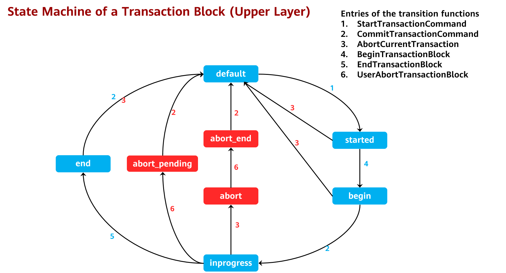

        Table 1 lists the values in the transaction state machine structure corresponding to the transaction block states in Figure 5-2.

        **表 1** Transaction block states

        <a name="table8754103172114"></a>
        <table><thead ><tr id="row18152833162114"><th class="cellrowborder"  width="44.72%" id="mcps1.2.3.1.1"><p id="p1415217336216"><a name="p1415217336216"></a><a name="p1415217336216"></a>Transaction State</p>
        </th>
        <th class="cellrowborder"  width="55.279999999999994%" id="mcps1.2.3.1.2"><p id="p6152133112114"><a name="p6152133112114"></a><a name="p6152133112114"></a>Transaction State Machine Structure</p>
        </th>
        </tr>
        </thead>
        <tbody><tr id="row11153193316214"><td class="cellrowborder"  width="44.72%" headers="mcps1.2.3.1.1 "><p id="p17153103382112"><a name="p17153103382112"></a><a name="p17153103382112"></a>Default</p>
        </td>
        <td class="cellrowborder"  width="55.279999999999994%" headers="mcps1.2.3.1.2 "><p id="p191531933192111"><a name="p191531933192111"></a><a name="p191531933192111"></a>TBLOCK_DEFAULT</p>
        </td>
        </tr>
        <tr id="row3153173317213"><td class="cellrowborder"  width="44.72%" headers="mcps1.2.3.1.1 "><p id="p1515373392115"><a name="p1515373392115"></a><a name="p1515373392115"></a>Started</p>
        </td>
        <td class="cellrowborder"  width="55.279999999999994%" headers="mcps1.2.3.1.2 "><p id="p6153533132118"><a name="p6153533132118"></a><a name="p6153533132118"></a>TBLOCK_STARTED</p>
        </td>
        </tr>
        <tr id="row101539332211"><td class="cellrowborder"  width="44.72%" headers="mcps1.2.3.1.1 "><p id="p14153203310216"><a name="p14153203310216"></a><a name="p14153203310216"></a>Transaction block started</p>
        </td>
        <td class="cellrowborder"  width="55.279999999999994%" headers="mcps1.2.3.1.2 "><p id="p11538334214"><a name="p11538334214"></a><a name="p11538334214"></a>TBLOCK_BEGIN</p>
        </td>
        </tr>
        <tr id="row12153113310217"><td class="cellrowborder"  width="44.72%" headers="mcps1.2.3.1.1 "><p id="p9153103382110"><a name="p9153103382110"></a><a name="p9153103382110"></a>Transaction block in progress</p>
        </td>
        <td class="cellrowborder"  width="55.279999999999994%" headers="mcps1.2.3.1.2 "><p id="p1315393315213"><a name="p1315393315213"></a><a name="p1315393315213"></a>TBLOCK_INPROGRESS</p>
        </td>
        </tr>
        <tr id="row1915314331211"><td class="cellrowborder"  width="44.72%" headers="mcps1.2.3.1.1 "><p id="p1015311334211"><a name="p1015311334211"></a><a name="p1015311334211"></a>Transaction block ended</p>
        </td>
        <td class="cellrowborder"  width="55.279999999999994%" headers="mcps1.2.3.1.2 "><p id="p12153203315219"><a name="p12153203315219"></a><a name="p12153203315219"></a>TBLOCK_END</p>
        </td>
        </tr>
        <tr id="row91531633172114"><td class="cellrowborder"  width="44.72%" headers="mcps1.2.3.1.1 "><p id="p121533331216"><a name="p121533331216"></a><a name="p121533331216"></a>Rolling back</p>
        </td>
        <td class="cellrowborder"  width="55.279999999999994%" headers="mcps1.2.3.1.2 "><p id="p1415333342113"><a name="p1415333342113"></a><a name="p1415333342113"></a>TBLOCK_ABORT</p>
        </td>
        </tr>
        <tr id="row12153113312113"><td class="cellrowborder"  width="44.72%" headers="mcps1.2.3.1.1 "><p id="p1715353311214"><a name="p1715353311214"></a><a name="p1715353311214"></a>Rollback ended</p>
        </td>
        <td class="cellrowborder"  width="55.279999999999994%" headers="mcps1.2.3.1.2 "><p id="p151531233102113"><a name="p151531233102113"></a><a name="p151531233102113"></a>TBLOCK_ABORT_END</p>
        </td>
        </tr>
        <tr id="row515393322114"><td class="cellrowborder"  width="44.72%" headers="mcps1.2.3.1.1 "><p id="p41538335211"><a name="p41538335211"></a><a name="p41538335211"></a>Waiting for rollback</p>
        </td>
        <td class="cellrowborder"  width="55.279999999999994%" headers="mcps1.2.3.1.2 "><p id="p1415413302111"><a name="p1415413302111"></a><a name="p1415413302111"></a>TBLOCK_ABORT_PENDING</p>
        </td>
        </tr>
        </tbody>
        </table>

        When no exception occurs, the state machine of a transaction block runs in the following states cyclically: TBLOCK_DEFAULT -\> TBLOCK_STARTED -\> TBLOCK_BEGIN -\> TBLOCK_INPROGRESS -\> TBLOCK_END -\> TBLOCK_DEFAULT, as shown in Figure 5-2. The remaining state machines are exception processing branches of each state point in the preceding normal scenarios.

        1.  Errors that occur before entering the TBLOCK_INPROGRESS state: If a transaction does not start, an error will be reported and the transaction will be rolled back. The system will clear resources and return to the TBLOCK_DEFAULT state.
        2.  Errors that occur in the TBLOCK_INPROGRESS state in the following scenarios: Transaction execution failure: TBLOCK_INPROGRESS -\> TBLOCK_ABORT -\> TBLOCK_ABORT_END -\> TBLOCK_DEFAULT; manual rollback of a transaction that is successfully executed: TBLOCK_INPROGRESS -\> TBLOCK_ABORT_PENDING -\> TBLOCK_DEFAULT
        3.  Errors that occur when a user executes the COMMIT statement: TBLOCK_END -\> TBLOCK_DEFAULT As shown in Figure 5-2, the transaction exits the TBLOCK_DEFAULT state after it starts and returns to this state after it ends.
        4.  openGauss also supports implicit transaction blocks. When a client executes a single SQL statement, the SQL statement can be automatically committed. The state machine of openGauss is relatively simple and runs in the following states cyclically: TBLOCK_DEFAULT -\> TBLOCK_STARTED -\> TBLOCK_DEFAULT.

      - **Lower-Layer Transaction States**

        The TransState structure specifies transaction states from the perspective of the kernel. Its code is as follows:

        ```
        typedef enum TransState
        {
        TRANS_DEFAULT, /* The current state is the default idle state. No transaction starts.*/
        TRANS_START, /* The transaction is being started.*/
        TRANS_INPROGRESS, /* The transaction is stared and is in progress.*/
        TRANS_COMMIT, /* The transaction is being committed.*/
        TRANS_ABORT, /* The transaction is being rolled back.*/
        TRANS_PREPARE /* The two-phase commit transaction enters the PREPARE TRANSACTION state.*/
        } TransState;
        ```

        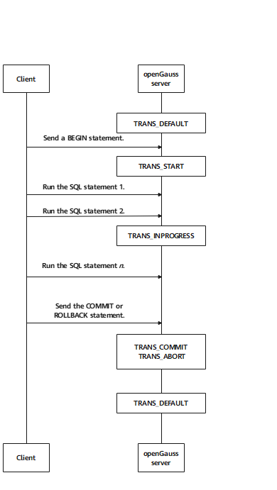

        Figure 5-3 Lower-layer transaction states

        Figure 5-3 shows the lower-layer states in the kernel. For details about the lower-layer state machine, see the description of TransState.

        1.  Before a transaction starts, the transaction state is TRANS_DEFAULT.
        2.  When a transaction starts, the transaction state is TRANS_START.
        3.  After a transaction is successfully started, the transaction state is always TRANS_INPROGRESS.
        4.  When a transaction ends or is rolled back, the transaction state is TARNS_COMMIT or TRANS_ABORT.
        5.  After a transaction ends, the transaction state goes back to TRANS_DEFAULT.

      - **Transaction State Machine Running Instance**

        This section provides a running instance of a state machine in SQL to help you better understand how internal transactions work. Execute the following SQL statements on the client:

        ```
            BEGIN;
                SELECT * FROM TABLE1;
            END;
        ```

        1\) Overall execution process

        Figure 5-4 shows the overall execution process. The execution of any statement first enters the transaction block of the transaction processing interface, then calls the underlying function of the transaction to process the specific statement, and finally returns to the transaction block.

        **Figure 5-4** Overall execution process

        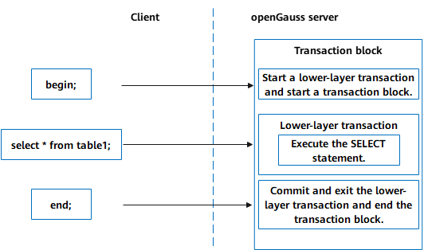

        2\) Execution process of the BEGIN statement \(Figure 5-5\)

        \(1\)The entry function **exec_simple_query** processes the BEGIN statement.

        \(2\)The **start_xact_command** function starts a QUERY statement and calls the **StartTransactionCommand** function. At this time, the upper-layer state of the transaction block is not TBLOCK_DEFAULT. The **StartTransaction** function is called to set the lower-layer state of the transaction to TRANS_START. After the memory, buffer, and lock resources are initialized, the lower-layer state of the transaction is set to TRANS_INPROGRESS, and the upper-layer state of the transaction block is set to TBLOCK_STARTED in the **StartTransactionCommand** function.

        \(3\) The **PortalRun** function processes the BEGIN statement, calls functions downwards, and calls the **BeginTransactionBlock** function to set the upper-layer state of the transaction block to TBLOCK_BEGIN.

        \(4\) The **finish_xact_command** function ends a QUERY statement, calls the **CommitTransactionCommand** function to change the upper-layer state of the transaction block from TBLOCK_BEGIN to TBLOCK_INPROGRESS, and waits for reading the next statement.

        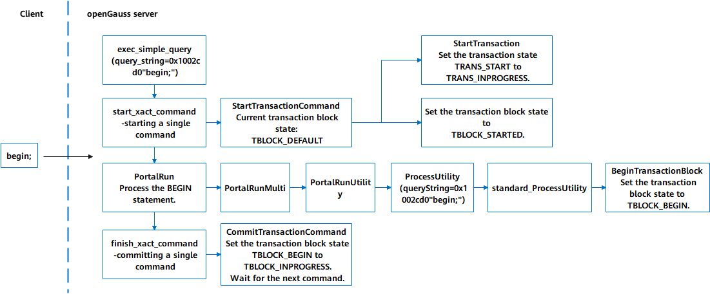

        Figure 5-6 Execution process of the BEGIN statement

        3\) Execution process of the SELECT statement \(Figure 5-6\)

        \(1\) The entry function exec_simple_query processes the SELECT \* FROM table1; command.

        \(2\) The start_xact_command function starts a QUERY statement and calls the StartTransactionCommand function. The upper-layer state of the transaction block is TBLOCK_INPROGRESS, which indicates that the TBlockState structure is inside the transaction block. Therefore, NULL is returned without changing the upper-layer state and lower-layer state of the transaction.

        \(3\) The PortalRun function executes the SELECT statement and calls the ExecutorRun function downwards to query the optimal path based on the execution plan.

        \(4\) The finish_xact_command function ends the QUERY statement and calls the CommitTransactionCommand function. The current upper-layer state of the transaction block is still TBLOCK_INPROGESS, and the current upper-layer state and lower-layer state of the transaction are not changed.

        

        Figure 5-7 Execution process of the SELECT statement

        4\) Execution process of the END statement \(Figure 5-7\)

        \(1\) The entry function exec_simple_query processes the END statement.

        \(2\) The start_xact_command function starts a QUERY statement and calls the StartTransactionCommand function. The current upper-layer state of the transaction block is TBLOCK_INPROGESS, indicating that the transaction is still in progress. In this case, the upper-layer state and lower-layer state of the transaction are not changed.

        \(3\) The PortalRun function processes the END statement, calls the processUtility function in sequence, and finally calls the EndTransactionBlock function to set the current upper-layer state of the transaction block to TBLOCK_END.

        \(4\) The finish_xact_command function ends the QUERY statement and calls the CommitTransactionCommand function. The current state of the transaction block is TBLOCK_END. Then, this function calls the CommitTransaction function to commit the transaction, sets the lower-layer state of the transaction to TRANS_COMMIT, commits the transaction, and clears transaction resources. After the cleanup, the lower-layer state of the transaction is set to TRANS_DEFAULT, and the CommitTansactionCommand function is returned. The upper-layer state of the transaction block is set to TBLOCK_DEFAULT, and the entire transaction block ends.

        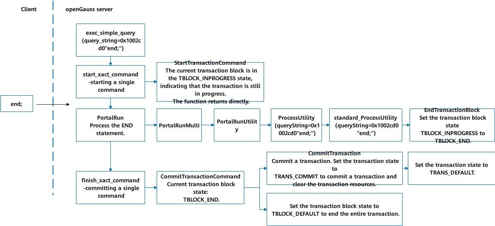

        Figure 5-8 Execution process of the END statement

      - Functions related to transaction state transition

        1\) Transaction processing subfunctions for applying for, recycling, and clearing transaction resources based on the current upper-layer state machine of the transaction

        For details, see Table 5-2.

        **表 2** Transaction processing subfunctions

        <a name="table1899113172116"></a>
        <table><thead ><tr id="row19157203311219"><th class="cellrowborder"  width="34.21%" id="mcps1.2.3.1.1"><p id="p13157333112119"><a name="p13157333112119"></a><a name="p13157333112119"></a>Subfunction</p>
        </th>
        <th class="cellrowborder"  width="65.79%" id="mcps1.2.3.1.2"><p id="p81577338218"><a name="p81577338218"></a><a name="p81577338218"></a>Description</p>
        </th>
        </tr>
        </thead>
        <tbody><tr id="row8157733182119"><td class="cellrowborder"  width="34.21%" headers="mcps1.2.3.1.1 "><p id="p1915713333212"><a name="p1915713333212"></a><a name="p1915713333212"></a>StartTransaction</p>
        </td>
        <td class="cellrowborder"  width="65.79%" headers="mcps1.2.3.1.2 "><p id="p161572033142120"><a name="p161572033142120"></a><a name="p161572033142120"></a>Starts a transaction, initializes the memory and variables, and sets the lower-layer state of the transaction to TRANS_INPROGRESS.</p>
        </td>
        </tr>
        <tr id="row191582033192113"><td class="cellrowborder"  width="34.21%" headers="mcps1.2.3.1.1 "><p id="p1115853314213"><a name="p1115853314213"></a><a name="p1115853314213"></a>CommitTransaction</p>
        </td>
        <td class="cellrowborder"  width="65.79%" headers="mcps1.2.3.1.2 "><p id="p315823319218"><a name="p315823319218"></a><a name="p315823319218"></a>Transits the current lower-layer state from TRANS_INPROGRESS to TRANS_COMMIT, makes Clogs and Xlogs persistent locally, clears the corresponding transaction slot information, and then sets the lower-layer state to TRANS_DEFAULT.</p>
        </td>
        </tr>
        <tr id="row15158113392114"><td class="cellrowborder"  width="34.21%" headers="mcps1.2.3.1.1 "><p id="p15158173332114"><a name="p15158173332114"></a><a name="p15158173332114"></a>PrepareTransaction</p>
        </td>
        <td class="cellrowborder"  width="65.79%" headers="mcps1.2.3.1.2 "><p id="p9158153392110"><a name="p9158153392110"></a><a name="p9158153392110"></a>Similar to the <strong id="b1715843342118"><a name="b1715843342118"></a><a name="b1715843342118"></a>CommitTransaction</strong> function, transits the current lower-layer state from TRANS_INPROGRESS to TRANS_PREPARE, constructs a two-phase GXACT structure, creates a two-phase file, adds dummy slot information, transfers the thread lock information to the dummy slot, releases resources, and finally sets the lower-layer state to TRANS_DEFAULT.</p>
        </td>
        </tr>
        <tr id="row19158173319219"><td class="cellrowborder"  width="34.21%" headers="mcps1.2.3.1.1 "><p id="p1615816334219"><a name="p1615816334219"></a><a name="p1615816334219"></a>AbortTransaction</p>
        </td>
        <td class="cellrowborder"  width="65.79%" headers="mcps1.2.3.1.2 "><p id="p7158333112117"><a name="p7158333112117"></a><a name="p7158333112117"></a>Releases LWLocks, UnlockBuffers, and LockErrorCleanup, transits the lower-layer state from TRANS_INPROGRESS to TRANS_ABORT, records the corresponding Clogs, clears the transaction slot information, and releases various resources.</p>
        </td>
        </tr>
        <tr id="row81583339214"><td class="cellrowborder"  width="34.21%" headers="mcps1.2.3.1.1 "><p id="p015843312117"><a name="p015843312117"></a><a name="p015843312117"></a>CleanupTransaction</p>
        </td>
        <td class="cellrowborder"  width="65.79%" headers="mcps1.2.3.1.2 "><p id="p31584336219"><a name="p31584336219"></a><a name="p31584336219"></a>The current lower-layer state should be TRANS_ABORT. This function is generally called after the <strong id="b7158113311218"><a name="b7158113311218"></a><a name="b7158113311218"></a>AbortTransaction</strong> function is called and also clears some resources.</p>
        </td>
        </tr>
        <tr id="row101588336219"><td class="cellrowborder"  width="34.21%" headers="mcps1.2.3.1.1 "><p id="p131581133192120"><a name="p131581133192120"></a><a name="p131581133192120"></a>FinishPreparedTransaction</p>
        </td>
        <td class="cellrowborder"  width="65.79%" headers="mcps1.2.3.1.2 "><p id="p115953320218"><a name="p115953320218"></a><a name="p115953320218"></a>Ends a two-phase commit transaction.</p>
        </td>
        </tr>
        <tr id="row31591933172118"><td class="cellrowborder"  width="34.21%" headers="mcps1.2.3.1.1 "><p id="p201596331219"><a name="p201596331219"></a><a name="p201596331219"></a>StartSubTransaction</p>
        </td>
        <td class="cellrowborder"  width="65.79%" headers="mcps1.2.3.1.2 "><p id="p191593336216"><a name="p191593336216"></a><a name="p191593336216"></a>Starts a sub-transaction.</p>
        </td>
        </tr>
        <tr id="row1415917331217"><td class="cellrowborder"  width="34.21%" headers="mcps1.2.3.1.1 "><p id="p4159123342115"><a name="p4159123342115"></a><a name="p4159123342115"></a>CommitSubTransaction</p>
        </td>
        <td class="cellrowborder"  width="65.79%" headers="mcps1.2.3.1.2 "><p id="p19159183372114"><a name="p19159183372114"></a><a name="p19159183372114"></a>Commits a sub-transaction.</p>
        </td>
        </tr>
        <tr id="row18159333142116"><td class="cellrowborder"  width="34.21%" headers="mcps1.2.3.1.1 "><p id="p15159163352112"><a name="p15159163352112"></a><a name="p15159163352112"></a>AbortSubTransaction</p>
        </td>
        <td class="cellrowborder"  width="65.79%" headers="mcps1.2.3.1.2 "><p id="p11159163352116"><a name="p11159163352116"></a><a name="p11159163352116"></a>Rolls back a sub-transaction.</p>
        </td>
        </tr>
        <tr id="row415913331217"><td class="cellrowborder"  width="34.21%" headers="mcps1.2.3.1.1 "><p id="p8159203302117"><a name="p8159203302117"></a><a name="p8159203302117"></a>CleanupSubTransaction</p>
        </td>
        <td class="cellrowborder"  width="65.79%" headers="mcps1.2.3.1.2 "><p id="p9159173310214"><a name="p9159173310214"></a><a name="p9159173310214"></a>Clears resource information about sub-transactions, which is similar to <strong id="b1115923332110"><a name="b1115923332110"></a><a name="b1115923332110"></a>CleanupTransaction</strong>.</p>
        </td>
        </tr>
        <tr id="row10159123382111"><td class="cellrowborder"  width="34.21%" headers="mcps1.2.3.1.1 "><p id="p1615973320217"><a name="p1615973320217"></a><a name="p1615973320217"></a>PushTransaction/PopTransaction</p>
        </td>
        <td class="cellrowborder"  width="65.79%" headers="mcps1.2.3.1.2 "><p id="p181591733152118"><a name="p181591733152118"></a><a name="p181591733152118"></a>A sub-transaction is similar to stack information. These two functions start and end a sub-transaction, respectively.</p>
        </td>
        </tr>
        </tbody>
        </table>

        2\) Processing functions for calling subfunctions based on the corresponding state machine

        For details, see Table 5-3.

        **表 3** Transaction execution function

        <a name="table1392413122116"></a>
        <table><thead ><tr id="row1116014333219"><th class="cellrowborder"  width="33.56%" id="mcps1.2.3.1.1"><p id="p1016017331219"><a name="p1016017331219"></a><a name="p1016017331219"></a>Function</p>
        </th>
        <th class="cellrowborder"  width="66.44%" id="mcps1.2.3.1.2"><p id="p20160183319213"><a name="p20160183319213"></a><a name="p20160183319213"></a>Description</p>
        </th>
        </tr>
        </thead>
        <tbody><tr id="row116093382110"><td class="cellrowborder"  width="33.56%" headers="mcps1.2.3.1.1 "><p id="p216017336215"><a name="p216017336215"></a><a name="p216017336215"></a>StartTransactionCommand</p>
        </td>
        <td class="cellrowborder"  width="66.44%" headers="mcps1.2.3.1.2 "><p id="p01603330214"><a name="p01603330214"></a><a name="p01603330214"></a>Calls the corresponding transaction execution function based on the upper-layer state when a transaction starts.</p>
        </td>
        </tr>
        <tr id="row1316033382117"><td class="cellrowborder"  width="33.56%" headers="mcps1.2.3.1.1 "><p id="p141600334216"><a name="p141600334216"></a><a name="p141600334216"></a>CommitTransactionCommand</p>
        </td>
        <td class="cellrowborder"  width="66.44%" headers="mcps1.2.3.1.2 "><p id="p01607333210"><a name="p01607333210"></a><a name="p01607333210"></a>Calls the corresponding transaction execution function based on the upper-layer state when a transaction ends.</p>
        </td>
        </tr>
        <tr id="row916043332117"><td class="cellrowborder"  width="33.56%" headers="mcps1.2.3.1.1 "><p id="p15160333172111"><a name="p15160333172111"></a><a name="p15160333172111"></a>AbortCurrentTransaction</p>
        </td>
        <td class="cellrowborder"  width="66.44%" headers="mcps1.2.3.1.2 "><p id="p19160103320216"><a name="p19160103320216"></a><a name="p19160103320216"></a>Calls the <strong id="b4160113312219"><a name="b4160113312219"></a><a name="b4160113312219"></a>longjump</strong> function, clears the corresponding resources in advance, and sets the upper-layer state of a transaction to TBLOCK_ABORT when an internal error occurs in the transaction.</p>
        </td>
        </tr>
        </tbody>
        </table>

        3\) Functions for controlling the upper-layer transaction state machine

        For details, see Table 5-4.

        **表 4** Functions for controlling the upper-layer transaction state machine

        <a name="table29371831132111"></a>
        <table><thead ><tr id="row7160133372110"><th class="cellrowborder"  width="31.04%" id="mcps1.2.3.1.1"><p id="p15161633172115"><a name="p15161633172115"></a><a name="p15161633172115"></a>Function</p>
        </th>
        <th class="cellrowborder"  width="68.96%" id="mcps1.2.3.1.2"><p id="p516183342113"><a name="p516183342113"></a><a name="p516183342113"></a>Description</p>
        </th>
        </tr>
        </thead>
        <tbody><tr id="row11615330219"><td class="cellrowborder"  width="31.04%" headers="mcps1.2.3.1.1 "><p id="p8161433172114"><a name="p8161433172114"></a><a name="p8161433172114"></a>BeginTransactionBlock</p>
        </td>
        <td class="cellrowborder"  width="68.96%" headers="mcps1.2.3.1.2 "><p id="p171611933202114"><a name="p171611933202114"></a><a name="p171611933202114"></a>Sets the upper-layer transaction state to TBLOCK_BEGIN when a transaction starts explicitly.</p>
        </td>
        </tr>
        <tr id="row14161333172117"><td class="cellrowborder"  width="31.04%" headers="mcps1.2.3.1.1 "><p id="p13161173352115"><a name="p13161173352115"></a><a name="p13161173352115"></a>EndTransactionBlock</p>
        </td>
        <td class="cellrowborder"  width="68.96%" headers="mcps1.2.3.1.2 "><p id="p1616153342110"><a name="p1616153342110"></a><a name="p1616153342110"></a>Sets the upper-layer transaction state to TBLOCK_END when a transaction is committed explicitly.</p>
        </td>
        </tr>
        <tr id="row1516143382115"><td class="cellrowborder"  width="31.04%" headers="mcps1.2.3.1.1 "><p id="p6161633122118"><a name="p6161633122118"></a><a name="p6161633122118"></a>UserAbortTransactionBlock</p>
        </td>
        <td class="cellrowborder"  width="68.96%" headers="mcps1.2.3.1.2 "><p id="p01611233112119"><a name="p01611233112119"></a><a name="p01611233112119"></a>Sets the upper-layer transaction state to TBLOCK_ABORT_PENDING or TBLOCK_ABORT_END when a transaction is rolled back explicitly.</p>
        </td>
        </tr>
        <tr id="row17161173392120"><td class="cellrowborder"  width="31.04%" headers="mcps1.2.3.1.1 "><p id="p101611033122118"><a name="p101611033122118"></a><a name="p101611033122118"></a>PrepareTransactionBlock</p>
        </td>
        <td class="cellrowborder"  width="68.96%" headers="mcps1.2.3.1.2 "><p id="p1116113332116"><a name="p1116113332116"></a><a name="p1116113332116"></a>Sets the upper-layer transaction state to TBLOCK_PREPARE when the PREPARE statement is executed explicitly.</p>
        </td>
        </tr>
        <tr id="row20161203317218"><td class="cellrowborder"  width="31.04%" headers="mcps1.2.3.1.1 "><p id="p9161163382113"><a name="p9161163382113"></a><a name="p9161163382113"></a>DefineSavepoint</p>
        </td>
        <td class="cellrowborder"  width="68.96%" headers="mcps1.2.3.1.2 "><p id="p1116163312218"><a name="p1116163312218"></a><a name="p1116163312218"></a>Calls the <strong id="b8161333182119"><a name="b8161333182119"></a><a name="b8161333182119"></a>PushTransaction</strong> function to set the upper-layer transaction state of the sub-transaction to TBLOCK_SUBBEGIN when the SAVEPOINT statement is executed.</p>
        </td>
        </tr>
        <tr id="row10161233162112"><td class="cellrowborder"  width="31.04%" headers="mcps1.2.3.1.1 "><p id="p131612336215"><a name="p131612336215"></a><a name="p131612336215"></a>ReleaseSavepoint</p>
        </td>
        <td class="cellrowborder"  width="68.96%" headers="mcps1.2.3.1.2 "><p id="p01611433112118"><a name="p01611433112118"></a><a name="p01611433112118"></a>Sets the upper-layer transaction state of the sub-transaction to TBLOCK_SUBRELEASE when the RELEASE SAVEPOINT statement is executed.</p>
        </td>
        </tr>
        <tr id="row6162533192115"><td class="cellrowborder"  width="31.04%" headers="mcps1.2.3.1.1 "><p id="p121625339214"><a name="p121625339214"></a><a name="p121625339214"></a>RollbackToSavepoint</p>
        </td>
        <td class="cellrowborder"  width="68.96%" headers="mcps1.2.3.1.2 "><p id="p161621333192113"><a name="p161621333192113"></a><a name="p161621333192113"></a>Sets the upper-layer transaction state of all sub-transactions to TBLOCK_SUBABORT_PENDING or TBLOCK_SUBABORT_END and that of top-layer transactions to TBLOCK_SUBABORT_RESTART when the ROLLBACK TO statement is executed.</p>
        </td>
        </tr>
        </tbody>
        </table>

- **XID Allocation, Clogs, and CSNlogs**

  To distinguish different transactions in the database, openGauss allocates unique identifiers to the transactions, that is, transaction IDs \(XIDs\). An XID is a monotonically increasing number of the uint64 type. After a transaction ends, Clogs are used to record whether the transaction is committed, and CSNlogs are used to record the sequence number of the committed transaction for visibility determination.

  - 64-Bit XID Allocation

    openGauss assigns a unique XID to each write transaction. When a transaction is inserted, the transaction information is written to the **xmin** field in the tuple header, indicating the XID of tuple insertion. When a transaction is updated or deleted, the current transaction information is written to the **xmax** field in the tuple header, indicating the XID of tuple deletion. Currently, XIDs are allocated as uint64 numbers that monotonically increase. To save space and be compatible with earlier versions, the **xmin** and **xmax** fields in the tuple header are stored in two parts. The values of the **xmin** and **xmax** fields in the tuple header are both uint32 numbers. The page header stores the 64-bit **xid_base** field, which is the **xid_base** field of the current page.

    Figure 5-8 shows the tuple structure, and Figure 5-9 shows the page header structure. The formula for calculating the values of the **xmin** and **xmax** fields of each tuple is as follows: Value of **xmin**/Value of **xmax** in the tuple header + Value of **xid_base** in the page header.

    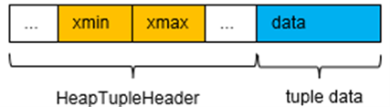

    Figure 5-9 Tuple structure

    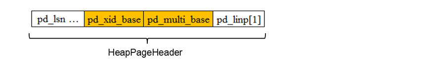

    Figure 5-9 Page header structure

    When larger XIDs are continuously inserted into the page, the XID may exceed the value of **xid_base** + 2<sup>32</sup>. In this case, you need to adjust the value of **xid_base** to ensure that the values of the **xmin** and **xmax** fields of all tuples can be calculated based on the value of **xid_base** and the tuple header value. For details about the logic, see section \(3\) in section 3\) "Key functions" in 5.2.2.4 "Clogs and CSNlogs".

    To prevent XIDs from being consumed too quickly, openGauss allocates XIDs only to write transactions and does not allocate extra XIDs to read-only transactions. That is, XIDs are allocated only when they are required. If an XID has not been allocated to a transaction when an XID is allocated to its sub-transaction, the system allocates an XID to the transaction first to ensure that the XID of the sub-transaction is greater than that of the transaction. Theoretically, 64-bit XIDs are sufficient. If transactions per second \(TPS\) of the database are 10 million, that is, 10 million transactions can be processed per second, 64-bit XIDs can be used for 580,000 years.

  - **Clogs and CSNlogs**

        Clogs and CSNlogs are used to maintain the mapping between XIDs and Clogs and that between XIDs and CSNlogs, respectively. Because memory resources are limited and long transactions may exist in the system, not all mappings can be stored in the memory. In this case, the mappings need to be written to disks as physical files. Therefore, Clog files \(XID - \> CommitLog Map\) and CSNlog files \(XID -\> CommitSeqNoLog Map\) are generated. Both CSNlogs and Clogs use the simple least recently used \(SLRU\) mechanism to read files and flush data to disks.

        1\) Clogs are used to record the commit status of XIDs. In openGauss, four bits are used to identify the status of each XID. The code of Clogs is as follows:

        ```
        #define CLOG_XID_STATUS_IN_PROGRESS 0x00: The transaction has not started or is in progress (crash may occur).
        #define CLOG_XID_STATUS_COMMITTED 0x01: The transaction has been committed.
        #define CLOG_XID_STATUS_ABORTED 0x02: The transaction has been rolled back.

    #define CLOG_XID_STATUS_SUB_COMMITTED 0x03: The sub-transaction has been committed but the status of its transaction is unknown.

    ````

        Figure 5-10 shows the physical structure of a Clog page.

        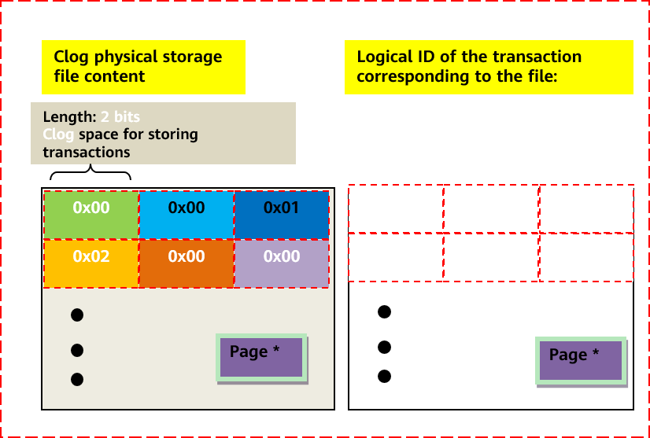

        Figure 5-10 Physical structure of a Clog page

        Figure 5-10 shows that transactions 1, 4, and 5 are still in progress, transaction 2 has been committed, and transaction 3 has been rolled back.

        2\) CSNlogs are used to record the sequence number of transaction commit. openGauss allocates an 8-byte CSN of the uint64 type to each XID. Therefore, an 8-KB page can store the CSNs of 1000 transactions. When the size of the CSNlogs reaches a certain value, the logs are divided into file blocks. The size of each CSNlog file block is 256 KB. Similar to the XIDs, several special numbers are reserved for the CSNs. The code of CSNlogs is as follows:

        ```
        #define COMMITSEQNO_INPROGRESS UINT64CONST(0x0): The transaction has not been committed or rolled back.
        #define COMMITSEQNO_ABORTED UINT64CONST(0x1): The transaction has been rolled back.
        #define COMMITSEQNO_FROZEN UINT64CONST(0x2): The transaction has been committed and is visible to any snapshot.
        #define COMMITSEQNO_FIRST_NORMAL UINT64CONST(0x3): start value of the CSN of the transaction

    #define COMMITSEQNO_COMMIT_INPROGRESS (UINT64CONST(1) << 62): The transaction is being committed.
    ````

        Similar to the Clogs, the physical structure of the CSNlogs is shown in Figure 5-11.

        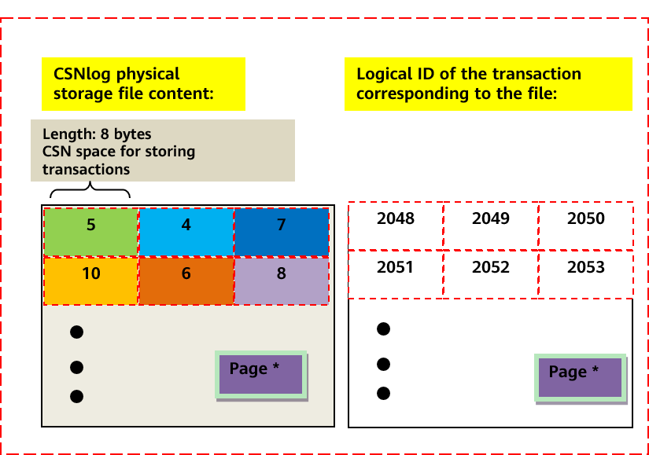

        Figure 5-11 Physical structure of CSNlogs

        The CSNs corresponding to the XIDs 2048, 2049, 2050, 2051, 2052 and 2053 are 5, 4, 7, 10, 6, and 8 respectively. That is, the transaction commit sequence is 2049 -\> 2048 -\> 2052 -\> 2050 -\> 2053 -\> 2051.

        3\) Key functions

        Functions for calculating the value of  **xid\_base**  on the page with 64-bit XIDs are as follows:

        \(1\)  **Heap\_page\_prepare\_for\_xid**: This function is called when a write operation is performed on the page to adjust the value of  **xid\_base**.

         If a new XID is between the value of  **xid\_base**  + value of  **FirstNormalxid**  and the value of  **xid\_base**  + value of  **MaxShortxid\(0xFFFFFFFF\)**, the value of  **xid\_base**  does not need to be adjusted.

        ‚ If a new XID is less than the value of  **xid\_base**  + value of  **FirstNormalxid**, the value of  **xid\_base**  needs to be decreased.

        ƒ If a new XID is larger than the value of  **xid\_base**  + value of  **MaxShortxid**, the value of  **xid\_base**  needs to be increased.

        „ In special cases, if the XID span of the page is greater than the range that can be represented by 32 bits, smaller XIDs on the page need to be frozen. That is,  **xid**  of the transaction to be committed is set to  **FrozenTransactionId \(2\)**, which is visible to all transactions, and  **xid**  of the transaction to be rolled back is set to  **InvalidTransactionId \(0\)**, which is invisible to all transactions.

        \(2\)  **Freeze\_single\_heap\_page**: This function is used to freeze small XIDs on the page.

         Calculate the value of  **oldestxid**. Transactions with an XID smaller than the value of  **oldestxid**  will not be accessed anymore. In this case, the XID of the transaction that has been committed can be marked as  **FrozenTransactionId**, which is visible to all transactions, and the XID of the transaction that has been rolled back can be marked as  **InvalidTransactionId**, which is invisible to all transactions.

        ‚ Clear the hot update link, redirect the item ID, and arrange the page space.

        ƒ Process each tuple based on  **oldestxid**.

        \(3\)  **Heap\_page\_shift\_base**: This function is used to update the value of  **xid\_base**  and adjust the values of  **xmin**  and  **xmax**  in each tuple header on the page.

        \(4\)  **GetNewTransactionId**: This function is used to obtain the latest XID.

- **MVCC Mechanism for Visibility Determination**

  openGauss uses the MVCC mechanism to ensure data consistency. During data scanning, each transaction obtains only the data generated when the snapshot is obtained, instead of the latest state of data. This prevents data inconsistency caused by updates of other concurrent transactions. A main advantage of the MVCC mechanism is that a lock request for reading data does not conflict with a lock request for writing data, so that the read operation and the write operation do not block each other. The following describes the transaction isolation levels and the CSN mechanism for determining visibility in openGauss.

  - **Transaction Isolation Levels**

        The SQL standard considers the phenomena that should be avoided between parallel transactions and defines the following isolation levels, as shown in Table 5-5.

        **表 5** Transaction isolation levels

        <a name="table199321145189"></a>
        <table><thead ><tr id="row109301459819"><th class="cellrowborder"  width="20.80791920807919%" id="mcps1.2.6.1.1"><p id="p8929245983"><a name="p8929245983"></a><a name="p8929245983"></a>Isolation Level</p>
        </th>
        <th class="cellrowborder"  width="15.768423157684234%" id="mcps1.2.6.1.2"><p id="p1392919458812"><a name="p1392919458812"></a><a name="p1392919458812"></a>P0 (Dirty Read)</p>
        </th>
        <th class="cellrowborder"  width="20.63793620637936%" id="mcps1.2.6.1.3"><p id="p209301045782"><a name="p209301045782"></a><a name="p209301045782"></a>P1 (Dirty Read)</p>
        </th>
        <th class="cellrowborder"  width="20.63793620637936%" id="mcps1.2.6.1.4"><p id="p209309451280"><a name="p209309451280"></a><a name="p209309451280"></a>P2 (Fuzzy Read)</p>
        </th>
        <th class="cellrowborder"  width="22.147785221477854%" id="mcps1.2.6.1.5"><p id="p11930045386"><a name="p11930045386"></a><a name="p11930045386"></a>P3 (Phantom Read)</p>
        </th>
        </tr>
        </thead>
        <tbody><tr id="row59311945880"><td class="cellrowborder"  width="20.80791920807919%" headers="mcps1.2.6.1.1 "><p id="p29307454810"><a name="p29307454810"></a><a name="p29307454810"></a>Read uncommitted</p>
        </td>
        <td class="cellrowborder"  width="15.768423157684234%" headers="mcps1.2.6.1.2 "><p id="p493020455815"><a name="p493020455815"></a><a name="p493020455815"></a>Impossible</p>
        </td>
        <td class="cellrowborder"  width="20.63793620637936%" headers="mcps1.2.6.1.3 "><p id="p29310455810"><a name="p29310455810"></a><a name="p29310455810"></a>Possible</p>
        </td>
        <td class="cellrowborder"  width="20.63793620637936%" headers="mcps1.2.6.1.4 "><p id="p99311454819"><a name="p99311454819"></a><a name="p99311454819"></a>Possible</p>
        </td>
        <td class="cellrowborder"  width="22.147785221477854%" headers="mcps1.2.6.1.5 "><p id="p189313451285"><a name="p189313451285"></a><a name="p189313451285"></a>Possible</p>
        </td>
        </tr>
        <tr id="row1093164518815"><td class="cellrowborder"  width="20.80791920807919%" headers="mcps1.2.6.1.1 "><p id="p159315454811"><a name="p159315454811"></a><a name="p159315454811"></a>Read committed</p>
        </td>
        <td class="cellrowborder"  width="15.768423157684234%" headers="mcps1.2.6.1.2 "><p id="p1293119451584"><a name="p1293119451584"></a><a name="p1293119451584"></a>Impossible</p>
        </td>
        <td class="cellrowborder"  width="20.63793620637936%" headers="mcps1.2.6.1.3 "><p id="p1093116458819"><a name="p1093116458819"></a><a name="p1093116458819"></a>Impossible</p>
        </td>
        <td class="cellrowborder"  width="20.63793620637936%" headers="mcps1.2.6.1.4 "><p id="p19931245589"><a name="p19931245589"></a><a name="p19931245589"></a>Possible</p>
        </td>
        <td class="cellrowborder"  width="22.147785221477854%" headers="mcps1.2.6.1.5 "><p id="p893111451182"><a name="p893111451182"></a><a name="p893111451182"></a>Possible</p>
        </td>
        </tr>
        <tr id="row893217456810"><td class="cellrowborder"  width="20.80791920807919%" headers="mcps1.2.6.1.1 "><p id="p1793215451789"><a name="p1793215451789"></a><a name="p1793215451789"></a>Repeatable read</p>
        </td>
        <td class="cellrowborder"  width="15.768423157684234%" headers="mcps1.2.6.1.2 "><p id="p49328458812"><a name="p49328458812"></a><a name="p49328458812"></a>Impossible</p>
        </td>
        <td class="cellrowborder"  width="20.63793620637936%" headers="mcps1.2.6.1.3 "><p id="p39321345481"><a name="p39321345481"></a><a name="p39321345481"></a>Impossible</p>
        </td>
        <td class="cellrowborder"  width="20.63793620637936%" headers="mcps1.2.6.1.4 "><p id="p19932245185"><a name="p19932245185"></a><a name="p19932245185"></a>Impossible</p>
        </td>
        <td class="cellrowborder"  width="22.147785221477854%" headers="mcps1.2.6.1.5 "><p id="p09321045382"><a name="p09321045382"></a><a name="p09321045382"></a>Possible</p>
        </td>
        </tr>
        <tr id="row16932164516813"><td class="cellrowborder"  width="20.80791920807919%" headers="mcps1.2.6.1.1 "><p id="p693210458813"><a name="p693210458813"></a><a name="p693210458813"></a>Serializable</p>
        </td>
        <td class="cellrowborder"  width="15.768423157684234%" headers="mcps1.2.6.1.2 "><p id="p79321451182"><a name="p79321451182"></a><a name="p79321451182"></a>Impossible</p>
        </td>
        <td class="cellrowborder"  width="20.63793620637936%" headers="mcps1.2.6.1.3 "><p id="p109325459812"><a name="p109325459812"></a><a name="p109325459812"></a>Impossible</p>
        </td>
        <td class="cellrowborder"  width="20.63793620637936%" headers="mcps1.2.6.1.4 "><p id="p1893264515816"><a name="p1893264515816"></a><a name="p1893264515816"></a>Impossible</p>
        </td>
        <td class="cellrowborder"  width="22.147785221477854%" headers="mcps1.2.6.1.5 "><p id="p1693213457814"><a name="p1693213457814"></a><a name="p1693213457814"></a>Impossible</p>
        </td>
        </tr>
        </tbody>
        </table>

        \(1\) Dirty write: Two transactions are written, committed, or rolled back separately, and the transaction results cannot be determined. That is, one transaction can roll back the commit of the other transaction.

        \(2\) Dirty read: A transaction can read modified data that is not committed by another transaction.

        \(3\) Fuzzy read: A transaction repeatedly reads data that has been read, and the data result is modified by another transaction.

        \(4\) Phantom read: A transaction repeatedly performs a range query and returns a group of data that meets the conditions. The number of data records in the result set of each query changes due to the modification of other transactions.

        During the implementation of various types of databases, some new phenomena occur in concurrent transactions, and some extensions are made based on the original isolation level. For details, see Table 5-6.

        **表 6** Transaction isolation level extensions

        <a name="table1937545581"></a>
        <table><thead ><tr id="row14934345288"><th class="cellrowborder"  width="14.237152569486103%" id="mcps1.2.9.1.1"><p id="p1993316451985"><a name="p1993316451985"></a><a name="p1993316451985"></a>Isolation Level</p>
        </th>
        <th class="cellrowborder"  width="12.20755848830234%" id="mcps1.2.9.1.2"><p id="p15933164512815"><a name="p15933164512815"></a><a name="p15933164512815"></a>P0 (Dirty Read)</p>
        </th>
        <th class="cellrowborder"  width="12.20755848830234%" id="mcps1.2.9.1.3"><p id="p89337451689"><a name="p89337451689"></a><a name="p89337451689"></a>P1 (Dirty Read)</p>
        </th>
        <th class="cellrowborder"  width="12.20755848830234%" id="mcps1.2.9.1.4"><p id="p3933045287"><a name="p3933045287"></a><a name="p3933045287"></a>P4 (Lost Update)</p>
        </th>
        <th class="cellrowborder"  width="12.20755848830234%" id="mcps1.2.9.1.5"><p id="p7933194520814"><a name="p7933194520814"></a><a name="p7933194520814"></a>P2 (Fuzzy Read)</p>
        </th>
        <th class="cellrowborder"  width="12.51749650069986%" id="mcps1.2.9.1.6"><p id="p1793317451184"><a name="p1793317451184"></a><a name="p1793317451184"></a>P3 (Phantom Read)</p>
        </th>
        <th class="cellrowborder"  width="12.20755848830234%" id="mcps1.2.9.1.7"><p id="p139331545283"><a name="p139331545283"></a><a name="p139331545283"></a>A5A (Read Skew)</p>
        </th>
        <th class="cellrowborder"  width="12.20755848830234%" id="mcps1.2.9.1.8"><p id="p10934545186"><a name="p10934545186"></a><a name="p10934545186"></a>A5B (Write Skew)</p>
        </th>
        </tr>
        </thead>
        <tbody><tr id="row11934945680"><td class="cellrowborder"  width="14.237152569486103%" headers="mcps1.2.9.1.1 "><p id="p15934194519815"><a name="p15934194519815"></a><a name="p15934194519815"></a>Read uncommitted</p>
        </td>
        <td class="cellrowborder"  width="12.20755848830234%" headers="mcps1.2.9.1.2 "><p id="p9934194520816"><a name="p9934194520816"></a><a name="p9934194520816"></a>Impossible</p>
        </td>
        <td class="cellrowborder"  width="12.20755848830234%" headers="mcps1.2.9.1.3 "><p id="p9934134518818"><a name="p9934134518818"></a><a name="p9934134518818"></a>Possible</p>
        </td>
        <td class="cellrowborder"  width="12.20755848830234%" headers="mcps1.2.9.1.4 "><p id="p169345453820"><a name="p169345453820"></a><a name="p169345453820"></a>Possible</p>
        </td>
        <td class="cellrowborder"  width="12.20755848830234%" headers="mcps1.2.9.1.5 "><p id="p493404516814"><a name="p493404516814"></a><a name="p493404516814"></a>Possible</p>
        </td>
        <td class="cellrowborder"  width="12.51749650069986%" headers="mcps1.2.9.1.6 "><p id="p159342451088"><a name="p159342451088"></a><a name="p159342451088"></a>Possible</p>
        </td>
        <td class="cellrowborder"  width="12.20755848830234%" headers="mcps1.2.9.1.7 "><p id="p189342451485"><a name="p189342451485"></a><a name="p189342451485"></a>Possible</p>
        </td>
        <td class="cellrowborder"  width="12.20755848830234%" headers="mcps1.2.9.1.8 "><p id="p139346451580"><a name="p139346451580"></a><a name="p139346451580"></a>Possible</p>
        </td>
        </tr>
        <tr id="row209357453810"><td class="cellrowborder"  width="14.237152569486103%" headers="mcps1.2.9.1.1 "><p id="p199342451788"><a name="p199342451788"></a><a name="p199342451788"></a>Read committed</p>
        </td>
        <td class="cellrowborder"  width="12.20755848830234%" headers="mcps1.2.9.1.2 "><p id="p99341845089"><a name="p99341845089"></a><a name="p99341845089"></a>Impossible</p>
        </td>
        <td class="cellrowborder"  width="12.20755848830234%" headers="mcps1.2.9.1.3 "><p id="p99351145687"><a name="p99351145687"></a><a name="p99351145687"></a>Impossible</p>
        </td>
        <td class="cellrowborder"  width="12.20755848830234%" headers="mcps1.2.9.1.4 "><p id="p59356454815"><a name="p59356454815"></a><a name="p59356454815"></a>Possible</p>
        </td>
        <td class="cellrowborder"  width="12.20755848830234%" headers="mcps1.2.9.1.5 "><p id="p593544518819"><a name="p593544518819"></a><a name="p593544518819"></a>Possible</p>
        </td>
        <td class="cellrowborder"  width="12.51749650069986%" headers="mcps1.2.9.1.6 "><p id="p139357452818"><a name="p139357452818"></a><a name="p139357452818"></a>Possible</p>
        </td>
        <td class="cellrowborder"  width="12.20755848830234%" headers="mcps1.2.9.1.7 "><p id="p1993515451580"><a name="p1993515451580"></a><a name="p1993515451580"></a>Possible</p>
        </td>
        <td class="cellrowborder"  width="12.20755848830234%" headers="mcps1.2.9.1.8 "><p id="p199351245489"><a name="p199351245489"></a><a name="p199351245489"></a>Possible</p>
        </td>
        </tr>
        <tr id="row59368457814"><td class="cellrowborder"  width="14.237152569486103%" headers="mcps1.2.9.1.1 "><p id="p79351345187"><a name="p79351345187"></a><a name="p79351345187"></a>Repeatable read</p>
        </td>
        <td class="cellrowborder"  width="12.20755848830234%" headers="mcps1.2.9.1.2 "><p id="p393511453816"><a name="p393511453816"></a><a name="p393511453816"></a>Impossible</p>
        </td>
        <td class="cellrowborder"  width="12.20755848830234%" headers="mcps1.2.9.1.3 "><p id="p109356451983"><a name="p109356451983"></a><a name="p109356451983"></a>Impossible</p>
        </td>
        <td class="cellrowborder"  width="12.20755848830234%" headers="mcps1.2.9.1.4 "><p id="p8935174517818"><a name="p8935174517818"></a><a name="p8935174517818"></a>Impossible</p>
        </td>
        <td class="cellrowborder"  width="12.20755848830234%" headers="mcps1.2.9.1.5 "><p id="p3935245887"><a name="p3935245887"></a><a name="p3935245887"></a>Impossible</p>
        </td>
        <td class="cellrowborder"  width="12.51749650069986%" headers="mcps1.2.9.1.6 "><p id="p1393516454817"><a name="p1393516454817"></a><a name="p1393516454817"></a>Possible</p>
        </td>
        <td class="cellrowborder"  width="12.20755848830234%" headers="mcps1.2.9.1.7 "><p id="p199352451585"><a name="p199352451585"></a><a name="p199352451585"></a>Impossible</p>
        </td>
        <td class="cellrowborder"  width="12.20755848830234%" headers="mcps1.2.9.1.8 "><p id="p149362456811"><a name="p149362456811"></a><a name="p149362456811"></a>Impossible</p>
        </td>
        </tr>
        <tr id="row1993684510810"><td class="cellrowborder"  width="14.237152569486103%" headers="mcps1.2.9.1.1 "><p id="p393684517813"><a name="p393684517813"></a><a name="p393684517813"></a>Snapshot consistent read</p>
        </td>
        <td class="cellrowborder"  width="12.20755848830234%" headers="mcps1.2.9.1.2 "><p id="p6936245787"><a name="p6936245787"></a><a name="p6936245787"></a>Impossible</p>
        </td>
        <td class="cellrowborder"  width="12.20755848830234%" headers="mcps1.2.9.1.3 "><p id="p5936154514814"><a name="p5936154514814"></a><a name="p5936154514814"></a>Impossible</p>
        </td>
        <td class="cellrowborder"  width="12.20755848830234%" headers="mcps1.2.9.1.4 "><p id="p29364451811"><a name="p29364451811"></a><a name="p29364451811"></a>Impossible</p>
        </td>
        <td class="cellrowborder"  width="12.20755848830234%" headers="mcps1.2.9.1.5 "><p id="p293610453811"><a name="p293610453811"></a><a name="p293610453811"></a>Impossible</p>
        </td>
        <td class="cellrowborder"  width="12.51749650069986%" headers="mcps1.2.9.1.6 "><p id="p159367451388"><a name="p159367451388"></a><a name="p159367451388"></a>Occasional</p>
        </td>
        <td class="cellrowborder"  width="12.20755848830234%" headers="mcps1.2.9.1.7 "><p id="p3936114512819"><a name="p3936114512819"></a><a name="p3936114512819"></a>Impossible</p>
        </td>
        <td class="cellrowborder"  width="12.20755848830234%" headers="mcps1.2.9.1.8 "><p id="p4936045689"><a name="p4936045689"></a><a name="p4936045689"></a>Possible</p>
        </td>
        </tr>
        <tr id="row1693714451984"><td class="cellrowborder"  width="14.237152569486103%" headers="mcps1.2.9.1.1 "><p id="p593634512817"><a name="p593634512817"></a><a name="p593634512817"></a>Serializable</p>
        </td>
        <td class="cellrowborder"  width="12.20755848830234%" headers="mcps1.2.9.1.2 "><p id="p1893664512817"><a name="p1893664512817"></a><a name="p1893664512817"></a>Impossible</p>
        </td>
        <td class="cellrowborder"  width="12.20755848830234%" headers="mcps1.2.9.1.3 "><p id="p59361145489"><a name="p59361145489"></a><a name="p59361145489"></a>Impossible</p>
        </td>
        <td class="cellrowborder"  width="12.20755848830234%" headers="mcps1.2.9.1.4 "><p id="p99361945186"><a name="p99361945186"></a><a name="p99361945186"></a>Impossible</p>
        </td>
        <td class="cellrowborder"  width="12.20755848830234%" headers="mcps1.2.9.1.5 "><p id="p593754519811"><a name="p593754519811"></a><a name="p593754519811"></a>Impossible</p>
        </td>
        <td class="cellrowborder"  width="12.51749650069986%" headers="mcps1.2.9.1.6 "><p id="p1193712457810"><a name="p1193712457810"></a><a name="p1193712457810"></a>Impossible</p>
        </td>
        <td class="cellrowborder"  width="12.20755848830234%" headers="mcps1.2.9.1.7 "><p id="p199377451783"><a name="p199377451783"></a><a name="p199377451783"></a>Impossible</p>
        </td>
        <td class="cellrowborder"  width="12.20755848830234%" headers="mcps1.2.9.1.8 "><p id="p493794515817"><a name="p493794515817"></a><a name="p493794515817"></a>Impossible</p>
        </td>
        </tr>
        </tbody>
        </table>

        \(5\) Lost upcategory: 'blog'

    date: When a transaction reads a tuple and updates the tuple, another transaction modifies the tuple value. As a result, the modification is lost.

        \(6\) Read skew: It is assumed that data x and y have an implicit constraint x + y =100. Transaction 1 reads x = 50, and transaction 2 writes x = 25 and updates y = 75 to ensure that the constraint is met. After transaction 2 is committed, transaction 1 reads y = 75 again. As a result, transaction 1 reads x + y = 125, which does not meet the constraint.

        \(7\) Write skew: It is assumed that data x and y have an implicit constraint x + y ≤ 100. Transaction 1 reads x=50 and writes y = 50. Transaction 2 reads y=30, writes x = 70, and commits the data. Then, transaction 1 commits its data. As a result, x = 70 and y = 50 do not meet the constraint of x + y ≤ 100.

        openGauss provides the read committed and repeatable read isolation levels. The repeatable read isolation level does not have the phantom read problem but has the A5B \(write skew\) problem.

  - **CSN Mechanism**

    1\) Working principles of CSNs \(Figure 5-12\)

    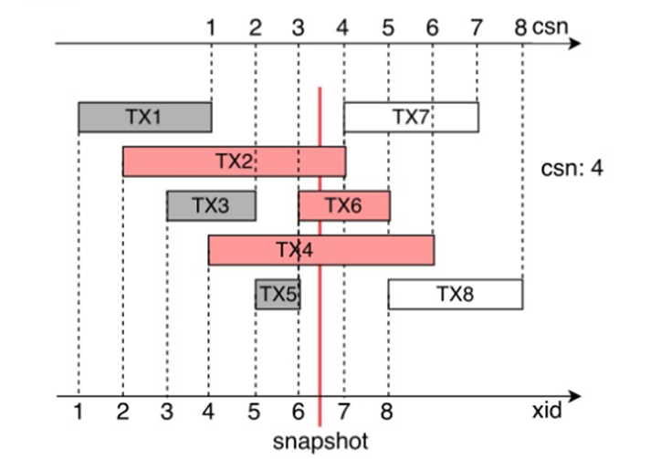

    Figure 5-12 Working principles of CSNs

    Each non-read-only transaction is assigned with an XID during running. Then the CSN is pushed when the transaction is committed, and the mapping between the CSN and the XID is saved \(in CSNlogs\). In Figure 5-12, the solid vertical line indicates that value 4 which is the next value of the CSN \(3\) of the latest committed transaction is obtained when the snapshot is obtained. Transactions TX1, TX3, and TX5 have been committed, and their CSNs are 1, 2, and 3, respectively. Transactions TX2, TX4, and TX6 are in progress, and transactions TX7 and TX8 have not started. For the current snapshot, the commit results of transactions whose CSN is smaller than 4 are visible. The commit results of other transactions are invisible because they are not committed when the snapshot is obtained.

    2\) Process for determining visibility by using MVCC snapshots

    When a snapshot is obtained, the minimum active XID is recorded as the value of **snapshot.xmin**. The XID of the latest committed transaction \(specified by **latestCompleteXid**\) + 1 is recorded as the value of **snapshot.xmax**. The CSN of the latest committed transaction + 1 \(**NextCommitSeqNo**\) is recorded as the value of **snapshot.csn**. Figure 5-13 shows the process of determining visibility.

    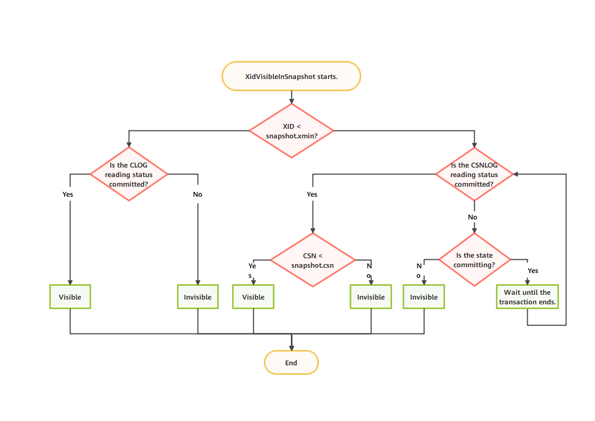

    Figure 5-13 Process for determining visibility by using MVCC snapshots

    \(1\) If the XID is greater than or equal to the value of **snapshot.xmax**, the XID is invisible.

    \(2\) If the XID is smaller than the value of **snapshot.xmin**, the XID has ended before the transaction starts. You need to query the commit state of the transaction in the Clog and set a flag in the tuple header.

    \(3\) If the XID is between the value of **snapshot.xmin** and that of **snapshot.xmax**, the CSN of transaction ending needs to be read from the CSN-XID mapping. If the CSN has a value that is smaller than the value of **snapshot.csn**, the transaction is visible. Otherwise, the transaction is invisible.

    3\) Commit process

    Figure 5-14 shows the transaction commit process.

    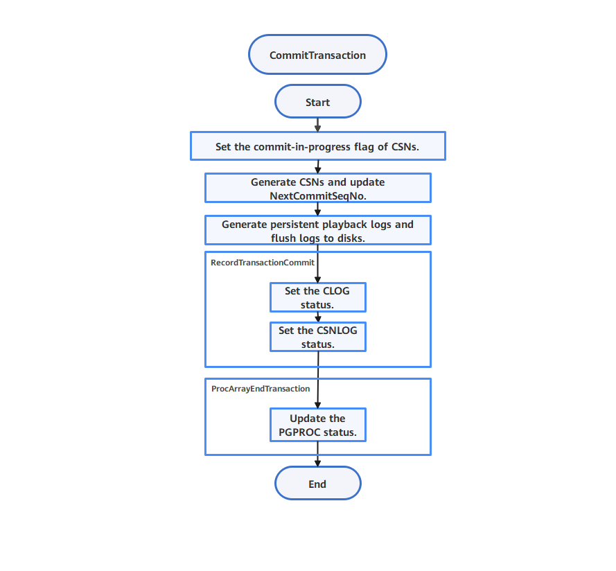

    Figure 5-14 Commit process

    \(1\) The **commit-in-progress** flag is set for the CSN-XID mapping.

    \(2\) The atom updates the value of **NextCommitSeqNo**.

    \(3\) Redo logs are generated, and Clogs and CSNlogs are written.

    \(4\) The PGPROC structure is updated to remove the corresponding transaction information from the PGPROC structure. Both **xid** and **xmin** are set to **InvalidTransactionId**.

    4\) Hot backup support

    Xlogs of the **commit-in-progress** flag are added between steps \(1\) and \(2\) in the transaction commit process. When reading the snapshot, the standby node obtains the lightweight lock ProcArrayLock and calculates the current snapshot. If the CSN corresponding to the XID has the **COMMITSEQNO_COMMIT_INPROGRESS** flag when the CSN in the current snapshot is used, you must wait for the corresponding transaction to commit the Xlog and then read the corresponding CSN for visibility determination after the Xlog playback is complete. To implement the preceding wait operation, the standby node calls the **XactLockTableInsert** function to obtain the transaction exclusive lock of the corresponding XID when performing the redo operation on the Xlog of the **commit-in-progress** flag. If other read transactions access the XID, they wait on the transaction lock of the XID until the corresponding transaction commits the Xlog for playback.

  - **Key Data Structures and Functions**

    1\). Snapshots

    ```
    Code related to snapshots is as follows:
    typedef struct SnapshotData {
        SnapshotSatisfiesFunc satisfies;  /* Function for determining visibility. Generally, HeapTupleSatisfiesMVCC is used.*/
        TransactionId xmin; /* Minimum XID of the current active transaction. If the XID is less than the value, the transaction ends.*/
        TransactionId xmax; /* XID of the latest committed transaction (specified by latestCompeleteXid) + 1. If the XID is greater than or equal to the value, the transaction has not started and the XID is invisible.*/
        TransactionId* xip; /* Recorded linked list of current active transactions. The value is invalid in the CSN version.*/
        TransactionId* subxip; /* Recorded linked list of cached active sub-transactions. The value is invalid in the CSN version.*/
        uint32 xcnt; /* Recorded number of active transactions (number of tuples in XIDs of active transactions). The value is invalid in the CSN version.*/
        GTM_Timeline timeline; /* Invalid in standalone openGauss.*/
        uint32 max_xcnt;       /* Maximum number of XIDs of active transactions. The value is invalid in the CSN version.*/
        int32 subxcnt; /* Number of linked lists of cached active sub-transactions. The value is invalid in the CSN version.*/
        int32 maxsubxcnt;  /* Maximum number of linked lists of cached active sub-transactions. The value is invalid in the CSN version.*/
        bool suboverflowed; /* Whether the number of linked lists of active sub-transactions exceeds the pre-allocated upper limit in the shared memory. The value is invalid in the CSN version.   */

        CommitSeqNo snapshotcsn; /* CSN of the snapshot. Generally, the value is the CSN of the latest committed transaction + 1 (NextCommitSeqNo). Transactions whose CSN is smaller than the value are visible.   */

        int prepared_array_capacity; /* Invalid in standalone openGauss.*/
        int prepared_count; /* Invalid in standalone openGauss.*/
        TransactionId* prepared_array; /* Invalid in standalone openGauss.*/

        bool takenDuringRecovery;  /* Whether the snapshot is generated during recovery.*/
        bool copied; /* Whether the snapshot is static at the session level or is copied from the newly allocated memory.*/

        CommandId curcid; /* Command sequence number in the transaction block. Data inserted earlier in the same transaction is visible to subsequent statements.   */
        uint32 active_count; /* refcount of ActiveSnapshot stack*/
        refcount of uint32 regd_count;   /* refcount of RegisteredSnapshotList*/
        void* user_data;     /* Used by the local multi-version snapshot, indicating that the snapshot is used by threads and cannot be released directly.*/
        SnapshotType snapshot_type; /* Invalid in standalone openGauss.*/
    } SnapshotData;
    ```

    2\) HeapTupleSatisfiesMVCC

    This function is used to scan snapshots of common read transactions based on the CSN logic. The code is as follows:

    ```
    bool HeapTupleSatisfiesMVCC(HeapTuple htup, Snapshot snapshot, Buffer buffer)
    {
    …… /* Initializes variables.*/

        if (!HeapTupleHeaderXminCommitted(tuple)) { /* Determines the hint bit recorded by a bit. During visibility determination, openGauss needs to know the commit state of the Clog corresponding to xmin and xmax of tuples. To avoid repeated access to the Clog, openGauss optimizes visibility determination. The hint bit records the transaction state in the tuple header and uses a bit to indicate the commit or rollback states. openGauss does not update the hint bit in a tuple when a transaction is committed or rolled back. Instead, openGauss reads and sets the hint bit from the Clog if the hint bit is not set during visibility determination. Otherwise, openGauss directly reads the hint bit, and this prevents a tuple from repeatedly obtaining the final transaction commit state. If xmin and xmax of the tuple are found to have been committed during a scanning, the corresponding flag is added to accelerate the scanning. If no flag is added, visibility determination continues.   */
            if (HeapTupleHeaderXminInvalid(tuple)) /* Also check the hint bit. If xmin is marked as invalid, the transaction that inserts the tuple has been rolled back. In this case, the tuple is invisible.*/
                return false;

            if (TransactionIdIsCurrentTransactionId(HeapTupleHeaderGetXmin(page, tuple))) { /* If the tuple is accessed inside a transaction, the command ID (CID) of the tuple needs to be identified. That is, in the same transaction. The scanning result inserted earlier by the current transaction can be queried in the subsequent query.*/
              …….
            } else {  /* If other transactions are scanned, determines whether the transactions are visible based on the snapshot.*/
            } else {  /*visible = XidVisibleInSnapshot(HeapTupleHeaderGetXmin(page, tuple), snapshot, &hintstatus); /* Determine whether the transaction is visible based on CSNlogs and return the final commit state of the transaction.*/
                if (hintstatus == XID_COMMITTED) /* If the transaction is committed, add the committed hint bit to accelerate determination.*/
                    SetHintBits(tuple, buffer, HEAP_XMIN_COMMITTED, HeapTupleHeaderGetXmin(page, tuple));

                if (hintstatus == XID_ABORTED) {
                    … /* If the transaction is rolled back, add a rollback flag.*/
                    SetHintBits(tuple, buffer, HEAP_XMIN_INVALID, InvalidTransactionId);
                }
                 if (!visible) {  /* If xmin is invisible, the tuple is invisible; otherwise, the transaction that inserts the tuple has been committed for the snapshot. In this case, continue to determine whether the tuple deletion transaction is committed for the snapshot.*/
                        return false;
                    }
                }
            }
        } else {/* If xmin of the tuple has been marked with the committed hint bit, use the function interface CommittedXidVisibleInSnapshot to determine whether the tuple is visible to the snapshot.*/
            /* xmin is committed, but maybe not according to our snapshot */
            if (!HeapTupleHeaderXminFrozen(tuple) &&
                !CommittedXidVisibleInSnapshot(HeapTupleHeaderGetXmin(page, tuple), snapshot)) {
               return false;
            }
        }
       …… /* Subsequent visibility determination for xmax is similar to that for xmin. If xmax is visible to the current snapshot, the tuple deletion transaction has been committed, and xmax is invisible. Otherwise, xmax is visible.*/
        if (!(tuple->t_infomask & HEAP_XMAX_COMMITTED)) {
            if (TransactionIdIsCurrentTransactionId(HeapTupleHeaderGetXmax(page, tuple))) {
                if (HeapTupleHeaderGetCmax(tuple, page) >= snapshot->curcid)
                    return true; /* The transaction to be deleted has been committed before the scanning starts.*/
                else
                    return false; /* The operation deletion transaction is committed after the scanning starts.*/
            }

            visible = XidVisibleInSnapshot(HeapTupleHeaderGetXmax(page, tuple), snapshot, &hintstatus);
            if (hintstatus == XID_COMMITTED) {
                /* Set the hint bit of xmax.*/
                SetHintBits(tuple, buffer, HEAP_XMAX_COMMITTED, HeapTupleHeaderGetXmax(page, tuple));
            }
            if (hintstatus == XID_ABORTED) {
                /* Rollback or crash*/
                SetHintBits(tuple, buffer, HEAP_XMAX_INVALID, InvalidTransactionId);
            }
            if (!visible) {
                return true; /* Consider the tuple active if the transaction corresponding to xmax in the snapshot is invisible.*/
            }
        } else {
            /* Consider that the operation of deleting the tuple is not complete and the tuple is still visible if the transaction corresponding to xmax has been committed but the transaction in the snapshot is invisible.*/
            if (!CommittedXidVisibleInSnapshot(HeapTupleHeaderGetXmax(page, tuple), snapshot)) {
                return true; /* Consider the tuple visible.*/
            }
        }
        return false;
    }
    ```

    3\) HeapTupleSatisfiesNow

    The logic of this function is similar to that of MVCC. The only difference is that this function only determines the states of **xmin** and **xmax**, and no longer calls the **XidVisibleInSnapshot** and **CommittedXidVisibleInSnapshot** functions to determine visibility to snapshots.

    4\) HeapTupleSatisfiesVacuum

    This function returns the corresponding state according to the value of **oldestXmin**. A dead tuple \(invisible tuple of an earlier version in the openGauss MVCC mechanism\) that is not accessed by any other unfinished transactions \(value of **xmax** < value of **oldestXmin**\) can be cleared by executing the VACUUM statement. The function code is as follows:

    ```
    HTSV_Result HeapTupleSatisfiesVacuum(HeapTuple htup, TransactionId OldestXmin, Buffer buffer)
    {
    ……  /* Initializes variables.*/
        if (!HeapTupleHeaderXminCommitted(tuple)) {  /* Accelerate hint bits. The logic is the same as that of MVCC.   */
            if (HeapTupleHeaderXminInvalid(tuple))  /* Return and clear the dead tuple if xmin is not committed.  */
                return HEAPTUPLE_DEAD;
                xidstatus = TransactionIdGetStatus(HeapTupleGetRawXmin(htup), false);  /* Obtain the current transaction state through the CSNlog.*/
            if (xidstatus == XID_INPROGRESS) {
                if (tuple->t_infomask & HEAP_XMAX_INVALID) /* If xmax does not exist, the tuple is not deleted. In this case, the tuple is being inserted. Otherwise, the tuple is being deleted.*/
                    return HEAPTUPLE_INSERT_IN_PROGRESS;
                return HEAPTUPLE_DELETE_IN_PROGRESS;  /* Return a message indicating that the deletion is in progress.*/
            } else if (xidstatus == XID_COMMITTED) { /* Add the hint bit and then check whether xmax is committed if xmin is committed.   */
                SetHintBits(tuple, buffer, HEAP_XMIN_COMMITTED, HeapTupleGetRawXmin(htup));
            } else {
    .... /* If a transaction ends and is not committed, it may be aborted or crashed. Generally, a dead tuple is returned and can be deleted. In a standalone system, t_thrd.xact_cxt.useLocalSnapshot does not take effect, and its value is always false.  */
                SetHintBits(tuple, buffer, HEAP_XMIN_INVALID, InvalidTransactionId);
                return ((!t_thrd.xact_cxt.useLocalSnapshot || IsInitdb) ? HEAPTUPLE_DEAD : HEAPTUPLE_LIVE);
            }
        }
      /* Check xmax. If xmax is not set, the tuple is not deleted. In this case, the tuple is alive and cannot be deleted.   */
        if (tuple->t_infomask & HEAP_XMAX_INVALID)
            return HEAPTUPLE_LIVE;
    ......
        if (!(tuple->t_infomask & HEAP_XMAX_COMMITTED)) { /* Check whether the value of xmax is smaller than that of oldesxmin if xmax is committed. If the value of xmax is smaller than that of oldesxmin, no unfinished transactions access the tuple and the tuple can be deleted.  */
            xidstatus = TransactionIdGetStatus(HeapTupleGetRawXmax(htup), false);
            if (xidstatus == XID_INPROGRESS)
                return HEAPTUPLE_DELETE_IN_PROGRESS;
             else if (xidstatus == XID_COMMITTED)
                SetHintBits(tuple, buffer, HEAP_XMAX_COMMITTED, HeapTupleGetRawXmax(htup));
            else {
    …  /* The transaction corresponding to xmax aborts or crashes.*/
                SetHintBits(tuple, buffer, HEAP_XMAX_INVALID, InvalidTransactionId);
                return HEAPTUPLE_LIVE;
            }
        }

      /* Check whether the tuple can be deleted. If the value of xmax is smaller than that of oldestXmin, the tuple can be deleted.   */
        if (!TransactionIdPrecedes(HeapTupleGetRawXmax(htup), OldestXmin))
            return ((!t_thrd.xact_cxt.useLocalSnapshot || IsInitdb) ? HEAPTUPLE_RECENTLY_DEAD : HEAPTUPLE_LIVE);

        /* The tuple may be considered dead, is not accessed by any active transaction, and can be deleted.  */
        return ((!t_thrd.xact_cxt.useLocalSnapshot || IsInitdb) ? HEAPTUPLE_DEAD : HEAPTUPLE_LIVE);
    }
    ```

    5\) SetXact2CommitInProgress

    This function sets the **COMMITSEQNO_COMMIT_INPROGRESS** flag \(for details, see section 5.2.2 XID Allocation, Clogs, and CSNlogs\) of the CSNlog corresponding to an XID, indicating that the transaction corresponding to the XID is being committed. This operation is performed to ensure atomicity during visibility determination, that is, to prevent concurrent read transactions from reading inconsistent data during CSN setting.

    6\) CSNLogSetCommitSeqNo

    This function sets CSNlogs for the corresponding XID.

    7\) RecordTransactionCommit

    This function records transaction commit, including writing Clogs, CSNlog Xlogs, Clogs, and CSNlogs.

- **Intra-Process Multi-Thread Management Mechanism**

  This section briefly describes the data structures of the intra-process multi-thread management mechanism and the multi-version snapshot computing mechanism.

  - **Transaction Information Management**

    When the database is started, a shared memory segment is maintained. When each thread is initialized, a slot is obtained from the shared memory and the thread information is recorded in the slot. When a snapshot is obtained, the slot information needs to be updated in the shared memory array. When the transaction ends, the transaction information needs to be cleared from the slot. During snapshot calculation, the global array is traversed to obtain transaction information of all concurrent threads and calculate snapshot information \(such as values of **xmin**, **xmax**, and **snapshotcsn**\). The key data structure code for transaction information management is as follows:

    ```
    typedef struct PGXACT {
        GTM_TransactionHandle handle; /* Invalid in standalone mode.*/
        TransactionId xid;              /* XID of the thread. If there is no XID, the value is 0.*/
        TransactionId prepare_xid;    /* XID in the preparation phase.*/

    TransactionId xmin; /* Minimum active XID when the current transaction starts. The operation by executing the VACUUM statement does not delete tuples whose XID is greater than or equal to the value of xmin.   */
        CommitSeqNo csn_min;   /* Minimum active CSN when the current transaction starts.*/
        TransactionId next_xid; /* Invalid in standalone mode*/
        int nxids;  /*Number of sub-transactions*/
        uint8 vacuumFlags; /* Flags related to the operation by executing the VACUUM statement*/

    bool needToSyncXid; /* Invalid in standalone mode*/
    bool delayChkpt; /* If the thread requires the checkpoint thread to delay the wait, the value is true.
    #ifdef __aarch64__ */
        char padding[PG_CACHE_LINE_SIZE - PGXACT_PAD_OFFSET]; /* Structure alignment for performance*/
    #endif
    } PGXACT;

    struct PGPROC {
        SHM_QUEUE links; /* Pointer in the linked list*/

        PGSemaphoreData sem; /* Semaphore waiting in sleep mode*/
        int waitStatus;      /* Waiting status*/

        Latch procLatch; /* Common latch of the thread*/

        LocalTransactionId lxid; /* Local top-layer XID of the current thread*/
        ThreadId pid;            /* Thread ID*/

        ThreadId sessMemorySessionid;
        uint64 sessionid; /* Current session ID in thread pool mode*/
        int logictid;     /* Logical thread ID*/
        TransactionId gtt_session_frozenxid;    /* Frozen XID of a session-level global temporary table*/

        int pgprocno;
        int nodeno;

        /* When the thread starts, the following data structures are 0.*/
        BackendId backendId; /* Background ID of the thread*/
        Oid databaseId;      /*Object identifier (OID) of the currently accessed database*/
        Oid roleId;          /* OID of the current user*/

        /* Version number, which is used to determine the old and new versions during the upgrade.*/
        uint32 workingVersionNum;

        /* Mark whether the current transaction receives conflict signals in hot backup mode. The ProcArray lock is required for setting this parameter.  */
        bool recoveryConflictPending;

        /* Information about the LWLock waited by the thread */
        bool lwWaiting;        /* The value is true when the LWLock is waited for.*/
        uint8 lwWaitMode;      /* Pre-obtain the lock mode.*/
        bool lwIsVictim;       /*Forcibly abandon the LWLock.*/
        dlist_node lwWaitLink; /* Wait for the next waiter of the same LWLock object.*/

    /* Common lock information about thread waiting*/
        LOCK* waitLock;         /*Regular lock object that is waited for*/
        PROCLOCK* waitProcLock; /* Holder of the regular lock object that is waited for*/
        LOCKMODE waitLockMode;  /* Pre-obtain the mode of the regular lock object.*/
        LOCKMASK heldLocks;     /*Bit mask of the lock object mode obtained by the thread*/

        /* Wait for the primary and standby servers to replay the log synchronization information.*/
        XLogRecPtr waitLSN;     /* LSN that is waited for*/
        int syncRepState;       /* Wait for the primary/standby synchronization state.*/
        bool syncRepInCompleteQueue;   /* Whether waiting in the completion queue*/
        SHM_QUEUE syncRepLinks; /* Pointer pointing to the synchronization queue*/

        DataQueuePtr waitDataSyncPoint; /* Data synchronization point of data page replication*/
        int dataSyncRepState;           /*Synchronization state of data page replication*/
        SHM_QUEUE dataSyncRepLinks;     /* Pointer pointing to the data page synchronization queue*/

        MemoryContext topmcxt; /* Top-layer memory context of the thread*/
        char myProgName[64];
        pg_time_t myStartTime;
        syscalllock deleMemContextMutex;

        SHM_QUEUE myProcLocks[NUM_LOCK_PARTITIONS];

        /* The following structures are used to commit XIDs in batches.*/
        /* Whether the member is a member in XID batch commit*/
        bool procArrayGroupMember;
        /* Next member in XID batch commit*/
        pg_atomic_uint32 procArrayGroupNext;
        /* Larger XID between the XIDs of a transaction and its sub-transaction*/
        TransactionId procArrayGroupMemberXid;

        /* SCN*/
        CommitSeqNo commitCSN;

        /* The following structures are used to commit Clogs in batches.*/
        bool clogGroupMember;  /* Whether the member is a member in Clog batch commit*/
        pg_atomic_uint32 clogGroupNext;  /* Next member in Clog batch commit*/
        TransactionId clogGroupMemberXid;  /*XID committed in Clog batch commit*/
        CLogXidStatus clogGroupMemberXidStatus; /* Transaction state in Clog batch commit*/
        int64 clogGroupMemberPage; /* Clog page corresponding to Clog batch commit*/
        XLogRecPtr clogGroupMemberLsn;  /* LSN of members in Clog batch commit*/
    #ifdef __aarch64__
        /* The following structures are used to insert playback logs in batches in the ARM architecture.*/
        bool xlogGroupMember;
        pg_atomic_uint32 xlogGroupNext;
        XLogRecData* xlogGrouprdata;
        XLogRecPtr xlogGroupfpw_lsn;
        XLogRecPtr* xlogGroupProcLastRecPtr;
        XLogRecPtr* xlogGroupXactLastRecEnd;
        void* xlogGroupCurrentTransactionState;
        XLogRecPtr* xlogGroupRedoRecPtr;
        void* xlogGroupLogwrtResult;
        XLogRecPtr xlogGroupReturntRecPtr;
        TimeLineID xlogGroupTimeLineID;
        bool* xlogGroupDoPageWrites;
        bool xlogGroupIsFPW;
        uint64 snap_refcnt_bitmap;
    #endif

        LWLock* subxidsLock;
    struct XidCache subxids; /* XID of the sub-transaction*/

        LWLock* backendLock; /* Lightweight lock of each thread, used to protect concurrent access to the following data structures*/

        /* Lock manager data, recording fast-path locks taken by this backend. */
        uint64 fpLockBits;  /* Holding mode of the fast path lock*/
        FastPathTag fpRelId[FP_LOCK_SLOTS_PER_BACKEND]; /* Slot ID of the table object*/
        bool fpVXIDLock;  /* Whether to obtain the fast path lock of the local XID*/
        LocalTransactionId fpLocalTransactionId; /* Local XID*/
    };
    ```

    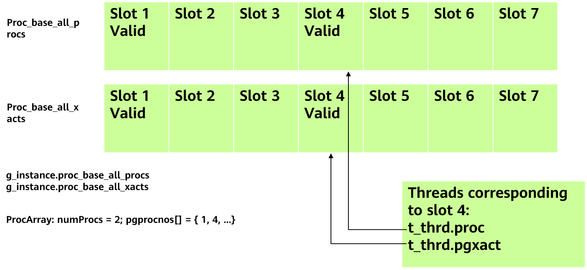

    Figure 5-15 Transaction information

    As shown in Figure 5-15, **proc_base_all_procs** and **proc_base_all_xacts** are global shared areas. When a thread starts, a slot is registered in the shared area, and the thread-level pointer variables _t_thrd.proc_ and _t_thrd.pgxact_ point to the area. When a transaction starts in the thread, information such as **xmin** and **xid** of the transaction is filled in the **pgxact** structure. The key functions and interfaces are as follows:

    \(1\) **GetOldestXmin**: Returns the value of **oldestXmin** cached by the current multi-version snapshot. \(For details about the multi-version snapshot mechanism, see the following sections.\)

    \(2\) ProcArrayAdd: Registers a slot in the shared area when a thread starts.

    \(3\) ProcArrayRemove: Removes the current thread from the ProcArray array.

    \(4\) TransactionIdIsInProgress: Checks whether an XID is in progress.

  - **Multi-Version Snapshot Mechanism**

    openGauss uses a shared memory segment to obtain snapshots and manage transaction information of each thread. If a shared lock is held when a snapshot is calculated and an exclusive lock is held when a transaction ends, severe lock contention occurs. To resolve this issue, openGauss introduces the multi-version snapshot mechanism. Each time a transaction ends, an exclusive lock is held, a version of the snapshot is calculated, and the version is recorded to a loop buffer queue memory. When another thread obtains the snapshot, the thread does not hold the shared lock to recalculate the snapshot. Instead, the thread obtains the latest snapshot from the top of the loop queue through atomic operations and increases the reference count by 1. After the snapshot information is copied, the reference count is decreased by 1. If the reference count of a slot is 0, the slot can be reused by a new snapshot.

    1\) Data structure of a multi-version snapshot

    The code of the data structure of a multi-version snapshot is as follows:

    ```
    typedef struct _snapxid {
        TransactionId xmin;
        TransactionId xmax;
        CommitSeqNo snapshotcsn;
        TransactionId localxmin;
        bool takenDuringRecovery;
        ref_cnt_t ref_cnt[NREFCNT]; /* Reference count of the snapshot. If the value is 0, the snapshot can be reused.*/
    } snapxid_t; /* Content of the multi-version snapshot. If CSNs are used in openGauss, only key information such as xmin, xmax, and snapshotcsn needs to be recorded. */

    static snapxid_t* g_snap_buffer = NULL;     /* Pointer of the buffer queue memory area*/
    static snapxid_t* g_snap_buffer_copy = NULL; /* Shallow copy of the buffer queue memory*/
    static size_t g_bufsz = 0;
    Whether the static bool g_snap_assigned = false;  /* Whether the buffer queue of the multi-version snapshot has been initialized.*/

    #define SNAP_SZ sizeof(snapxid_t) /* Size of each multi-version snapshot*/
    #define MaxNumSnapVersion 64    /* Size of the multi-version snapshot queue (64 versions)*/

    static volatile snapxid_t* g_snap_current = NULL; /* Current snapshot pointer*/
    static volatile snapxid_t* g_snap_next = NULL; /* Snapshot pointer of the next available slot*/
    ```

    2\) Process of creating a buffer queue

    When shared memory is created, the size of the shared memory area is calculated as follows: Value of **MaxNumSnapVersion** x Value of **SNAP_SZ**. **g_snap_current** is set to **0** and **g_snap_next** is set to the value of 1 x value of **SNAP_SZ**.

    3\) Calculating a multi-Version snapshot

    \(1\) Obtain the current **g_snap_next**.

    \(2\) Ensure that the exclusive lock of the PGPROC array is held, calculate key structures such as **xmin**, **xmax**, and the CSN, and save the calculation result to **g_snap_next**.

    \(3\) Search for the next reusable slot whose **refcount** is set to **0**, set **g_snap_current** to **g_snap_next**, and set **g_snap_next** to the reusable slot offset.

    4\) Obtaining a multi-version snapshot

    \(1\) Obtain the g_snap_current pointer and add 1 to the reference count of the current snapshot slot to prevent it from being reused during concurrent snapshot updates.

    \(2\) Copy the information in the current snapshot to the static snapshot memory of the current connection.

    \(3\) Release the current multi-version snapshot and decrease the reference count of the current snapshot slot by 1.

    5\) Key functions

    \(1\) CreateSharedRingBuffer: Creates shared memory information for a multi-version snapshot.

    \(2\) GetNextSnapXid: Obtains the position of the next multi-version snapshot. The function code is as follows:

    ```
    static inline snapxid_t* GetNextSnapXid()
    {
    return g_snap_buffer ? (snapxid_t*)g_snap_next : NULL;
    }
    ```

    \(3\) SetNextSnapXid: Obtains the next available slot and updates the current multi-version snapshot to the latest version. The function code is as follows:

    ```
    static void SetNextSnapXid()
    {
        if (g_snap_buffer != NULL) {
            g_snap_current = g_snap_next; /* Update the multi-version snapshot to the latest version. */
            pg_write_barrier(); /* Prevent ARM disorders during ring buffer initialization. */
            g_snap_assigned = true;
            snapxid_t* ret = (snapxid_t*)g_snap_current;
            size_t idx = SNAPXID_INDEX(ret);
        loop: /* Main loop. The overall idea is to continuously traverse the slot information of multiple versions and search for a reusable slot whose refcout is set to 0. */
            do {
                ++idx;
                /* Search again if rewinding occurs.*/
                if (idx == g_bufsz)
                    idx = 0;
                ret = SNAPXID_AT(idx);
                if (IsZeroRefCount(ret)) {
                    g_snap_next = ret;
                    return;
                }
            } while (ret != g_snap_next);
            ereport(WARNING, (errmsg("snapshot ring buffer overflow.")));
    /* Currently, the number of multi-version snapshots is 64. Theoretically, the slots may be fully occupied. If there is no idle slot, traverse the slots again.  */
            goto loop;
        }
    }
    ```

    \(4\) CalculateLocalLatestSnapshot: Calculates the information about the multi-version snapshot. The function code is as follows:

    ```
    void CalculateLocalLatestSnapshot(bool forceCalc)
    {
        …/*Initialize variables.*/

        snapxid_t* snapxid = GetNextSnapXid(); /* Set the slot information of the next idle multi-version snapshot.*/

        /* Initialize xmax to the value of latestCompletedXid + 1.*/
        xmax = t_thrd.xact_cxt.ShmemVariableCache->latestCompletedXid;
        TransactionIdAdvance(xmax);

         /* The values of xmin and oldestxmin are not recalculated when each transaction is committed. They are calculated only when 1000 transactions are committed or at an interval of 1s. In this case, the values of xmin and oldestxmin are small, but visibility determination is not affected.   */
        currentTimeStamp = GetCurrentTimestamp();
        if (forceCalc || ((++snapshotPendingCnt == MAX_PENDING_SNAPSHOT_CNT) ||
                             (TimestampDifferenceExceeds(snapshotTimeStamp, currentTimeStamp, CALC_SNAPSHOT_TIMEOUT)))) {
            snapshotPendingCnt = 0;
            snapshotTimeStamp = currentTimeStamp;

            /* Initialize xmin.*/
            globalxmin = xmin = xmax;

            int* pgprocnos = arrayP->pgprocnos;
            int numProcs;

            /*
              Traverse the PGPROC structure cyclically and calculate the snapshot value.
             */
            numProcs = arrayP->numProcs;
             /* The main process is to traverse proc_base_all_xacts, record the minimum value of pgxact->xid as xmin, and record the minimum value of pgxact->xmin as oldestxmin.   */
            for (index = 0; index < numProcs; index++) {
                int pgprocno = pgprocnos[index];
                volatile PGXACT* pgxact = &g_instance.proc_base_all_xacts[pgprocno];
                TransactionId xid;

                if (pgxact->vacuumFlags & PROC_IN_LOGICAL_DECODING)
                    continue;

             /* Skip xmin of autovacuum to prevent long operations by executing the VACUUM statement from blocking dirty tuple recycling.*/
                if (pgxact->vacuumFlags & PROC_IN_VACUUM)
                    continue;

                /* Use the minimum value of xmin to update globalxmin.*/
                xid = pgxact->xmin;

                if (TransactionIdIsNormal(xid) && TransactionIdPrecedes(xid, globalxmin))
                    globalxmin = xid;

                xid = pgxact->xid;

                if (!TransactionIdIsNormal(xid))
                    xid = pgxact->next_xid;

                if (!TransactionIdIsNormal(xid) || !TransactionIdPrecedes(xid, xmax))
                    continue;

                if (TransactionIdPrecedes(xid, xmin))
                    xmin = xid;
            }

            if (TransactionIdPrecedes(xmin, globalxmin))
                globalxmin = xmin;

            t_thrd.xact_cxt.ShmemVariableCache->xmin = xmin;
            t_thrd.xact_cxt.ShmemVariableCache->recentLocalXmin = globalxmin;
        }
         /* Assign values to the multi-version snapshot information. The values of xmin and oldestxmin may be small because they are not calculated in time. The value of xmax and CSN value are accurate. Note that the exclusive lock must be held when the snapshot is calculated.   */
        snapxid->xmin = t_thrd.xact_cxt.ShmemVariableCache->xmin;
        snapxid->xmax = xmax;
        snapxid->localxmin = t_thrd.xact_cxt.ShmemVariableCache->recentLocalXmin;
        snapxid->snapshotcsn = t_thrd.xact_cxt.ShmemVariableCache->nextCommitSeqNo;
        snapxid->takenDuringRecovery = RecoveryInProgress();
        SetNextSnapXid(); /* Set the current multi-version snapshot.*/
    }
    ```

    \(5\) GetLocalSnapshotData: Obtains the latest multi-version snapshot for transactions. The function code is as follows:

    ```
    Snapshot GetLocalSnapshotData(Snapshot snapshot)
    {
          /* Check whether a multi-version snapshot exists. Before the recovery process starts, the multi-version snapshot is not calculated. In this case, NULL is returned.  */
        if (!g_snap_assigned || (g_snap_buffer == NULL)) {
            ereport(DEBUG1, (errmsg("Falling back to origin GetSnapshotData: not assigned yet or during shutdown\n")));
            return NULL;
        }
        pg_read_barrier(); /* Prevent ARM disorders during ring buffer initialization.*/
        snapxid_t* snapxid = GetCurrentSnapXid(); /* Add 1 to refcount of the current multi-version snapshot to prevent it from being reused by transactions that concurrently calculate new snapshots.   */

        snapshot->user_data = snapxid;

        …  /* Assign the information in snapxid of the multi-version snapshot to the snapshot. Note that this is deep copy because the multi-version snapshot has only several key variables. You can directly assign a value to the snapshot. Then, you can release refcount of the multi-version snapshot.   */
        u_sess->utils_cxt.RecentXmin = snapxid->xmin;
        snapshot->xmin = snapxid->xmin;
        snapshot->xmax = snapxid->xmax;
        snapshot->snapshotcsn = snapxid->snapshotcsn;
    …
        ReleaseSnapshotData(snapshot);  /* Release refcount of the multi-version snapshot so that it can be reused.   */
        return snapshot;
    }
    ```

## 5.3 Lock Mechanism<a name="section11551016161"></a>

In a database, concurrency control on public resources is implemented by using locks. According to different purposes of locks, locks can be generally classified into three types: spinlock, LWLock, and regular lock. Further encapsulation can be performed based on the three types of locks. The general operation process of using a lock includes locking, performing operations in the critical section, and releasing the lock. On the premise of accuracy, lock usage and contention have become important factors that restrict performance. The following briefly describes three types of locks in openGauss, and then focuses on lock-related performance optimization of openGauss based on the Kunpeng architecture.

- **Spinlocks**

  A spinlock is generally implemented by using a test-and-set \(TAS\) atomic instruction of a CPU. There are only two states: locked and unlocked. A spinlock can be held by only one process. The difference between a spinlock and a semaphore is that when a process cannot obtain resources, the semaphore makes the process asleep and blocked, while the spinlock makes the process busy and waiting. The spinlock is mainly used in a scenario in which the locking duration is very short, for example, modifying a flag or reading a flag field, within dozens of instructions. When writing code, ensure that the spinlock is locked and unlocked in the same function. Deadlock cannot be detected and shall be guaranteed by the code itself. There are no waiting queues. The spinlock consumes CPU resources. If it is not used properly for a long time, a core dump is triggered. In openGauss, many 32-bit, 64-bit, and 128-bit variables are updated by compare-and-swap \(CAS\) atomic operations to avoid or reduce the use of spinlocks.

  Operations related to spinlocks are as follows:

  \(1\) SpinLockInit: Initializes the spinlock.

  \(2\) SpinLockAcquire: Locks the spinlock.

  \(3\) SpinLockRelease: Releases the spinlock.

  \(4\) SpinLockFree: Destroys the spinlock and clears related resources.

- **LWLocks**

  LWLocks are implemented by using atomic operations, waiting queues, and semaphores. There are two types of LWLocks: shared lock and exclusive lock. Multiple processes can obtain a shared lock at the same time, but an exclusive lock can be held by only one process. When a process cannot obtain resources, the LWLock makes the process asleep and blocked. LWLocks are mainly used in scenarios where operations in the internal critical section take a long time. Locking and unlocking operations can cross functions but must be released immediately after use. Deadlock shall be guaranteed by the code itself. However, due to code complexity and handling of different exceptions, openGauss provides a deadlock detection mechanism to avoid LWLock deadlock in various exception scenarios.

  Functions related to LWLocks are as follows:

  \(1\) LWLockAssign: Applies for an LWLock.

  \(2\) LWLockAcquire: Locks an LWLock.

  \(3\) LWLockConditionalAcquire: Conditionally locks an LWLock. If no lock is obtained, **false** is returned and the system does not keep waiting.

  \(4\) LWLockRelease: Releases an LWLock.

  \(5\) LWLockReleaseAll: Releases all LWLocks held by the current thread. If an error occurs during the transaction, all LWLocks are rolled back and released to prevent subsequent operations from being blocked.

  The related structure code is as follows:

  ```
  #define LW_FLAG_HAS_WAITERS ((uint32)1 << 30)
  #define LW_FLAG_RELEASE_OK ((uint32)1 << 29)
  #define LW_FLAG_LOCKED ((uint32)1 << 28)

  #define LW_VAL_EXCLUSIVE ((uint32)1 << 24)
  #define LW_VAL_SHARED 1 /* Mark the state of an LWLock to obtain or release the lock.*/

  typedef struct LWLock {
      uint16 tranche;         /* ID of an LWLock*/
      pg_atomic_uint32 state; /* Lock state*/
      dlist_head waiters;     /* Linked list of threads that are waiting for locks*/
  #ifdef LOCK_DEBUG
      pg_atomic_uint32 nwaiters; /* Number of threads waiting for locks*/
      struct PGPROC *owner;      /* Last holder of an exclusive lock*/
  #endif
  #ifdef ENABLE_THREAD_CHECK
      pg_atomic_uint32 rwlock;
      pg_atomic_uint32 listlock;
  #endif
  } LWLock;
  ```

- **Regular Locks**

  Regular locks are implemented by using a hash table. Regular locks support multiple lock modes. The semantics and conflicts between these lock modes are defined by conflict tables. Regular locks are used to lock database objects accessed by services. The locking of a regular lock complies with the two-phase locking protocol of the database. That is, a regular lock is locked during access and is released when a transaction is committed.

  A regular lock has a waiting queue and provides a deadlock detection mechanism. When a deadlock is detected, a transaction is rolled back.

  openGauss provides eight lock levels for controlling the concurrency of different statements. Level-1 locks are used for the SELECT statement. Level-3 locks are used for the INSERT, UPDATE, and DELETE statements. Level-4 locks are used for the VACUUM and ANALYZE statements. Level-8 locks are used for various DDL statements. The specific macro definitions and naming code are as follows:

  ```
  #define AccessShareLock 1  /* SELECT statement*/
  #define RowShareLock 2     /* SELECT FOR UPDATE and FOR SHARE statements*/
  #define RowExclusiveLock 3 /* INSERT, UPDATE, and DELETE statements*/
  #define ShareUpdateExclusiveLock  \
      4 /* VACUUM (non-FULL), ANALYZE, and CREATE INDEX CONCURRENTLY statements*/
  #define ShareLock 5 /* CREATE INDEX (WITHOUT CONCURRENTLY) statement*/
  #define ShareRowExclusiveLock                \
      6 /* It is similar to the exclusive mode, but concurrent access in ROW SHARE mode is allowed.*/
  #define ExclusiveLock                  \
      7 /* Blocks ROW SHARE. In this case, the SELECT...FOR UPDATE statement will not be executed.*/
  #define AccessExclusiveLock              \
      8 /* ALTER TABLE, DROP TABLE, VACUUM FULL, and LOCK TABLE statements*/
  ```

  Table 5-7 describes the eight levels of lock conflict and concurrency control, where √ indicates that two lock operations can be performed concurrently.

  **表 7** Lock conflict and concurrency control

  <a name="table112837289248"></a>
  <table><thead ><tr id="row1827218285241"><th class="cellrowborder"  width="37.38373837383738%" id="mcps1.2.10.1.1"><p id="p4271122852415"><a name="p4271122852415"></a><a name="p4271122852415"></a>Lock Level</p>
  </th>
  <th class="cellrowborder"  width="8.97089708970897%" id="mcps1.2.10.1.2"><p id="p4271328122414"><a name="p4271328122414"></a><a name="p4271328122414"></a><strong id="b15271028182414"><a name="b15271028182414"></a><a name="b15271028182414"></a>1</strong></p>
  </th>
  <th class="cellrowborder"  width="8.97089708970897%" id="mcps1.2.10.1.3"><p id="p20271122842419"><a name="p20271122842419"></a><a name="p20271122842419"></a><strong id="b42710288241"><a name="b42710288241"></a><a name="b42710288241"></a>2</strong></p>
  </th>
  <th class="cellrowborder"  width="7.140714071407141%" id="mcps1.2.10.1.4"><p id="p22713287244"><a name="p22713287244"></a><a name="p22713287244"></a><strong id="b152711284245"><a name="b152711284245"></a><a name="b152711284245"></a>3</strong></p>
  </th>
  <th class="cellrowborder"  width="7.140714071407141%" id="mcps1.2.10.1.5"><p id="p02711028122417"><a name="p02711028122417"></a><a name="p02711028122417"></a><strong id="b1827116284242"><a name="b1827116284242"></a><a name="b1827116284242"></a>4</strong></p>
  </th>
  <th class="cellrowborder"  width="7.140714071407141%" id="mcps1.2.10.1.6"><p id="p182716283242"><a name="p182716283242"></a><a name="p182716283242"></a><strong id="b1927113284246"><a name="b1927113284246"></a><a name="b1927113284246"></a>5</strong></p>
  </th>
  <th class="cellrowborder"  width="7.140714071407141%" id="mcps1.2.10.1.7"><p id="p132721328132414"><a name="p132721328132414"></a><a name="p132721328132414"></a><strong id="b1927212872411"><a name="b1927212872411"></a><a name="b1927212872411"></a>6</strong></p>
  </th>
  <th class="cellrowborder"  width="8.97089708970897%" id="mcps1.2.10.1.8"><p id="p182721628102417"><a name="p182721628102417"></a><a name="p182721628102417"></a><strong id="b027282816244"><a name="b027282816244"></a><a name="b027282816244"></a>7</strong></p>
  </th>
  <th class="cellrowborder"  width="7.140714071407141%" id="mcps1.2.10.1.9"><p id="p1527212812242"><a name="p1527212812242"></a><a name="p1527212812242"></a><strong id="b1027202810248"><a name="b1027202810248"></a><a name="b1027202810248"></a>8</strong></p>
  </th>
  </tr>
  </thead>
  <tbody><tr id="row7273122819246"><td class="cellrowborder"  width="37.38373837383738%" headers="mcps1.2.10.1.1 "><p id="p827232872413"><a name="p827232872413"></a><a name="p827232872413"></a>1. ACCESS SHARE</p>
  </td>
  <td class="cellrowborder"  width="8.97089708970897%" headers="mcps1.2.10.1.2 "><p id="p10272182882410"><a name="p10272182882410"></a><a name="p10272182882410"></a><a name="image112721328182414"></a><a name="image112721328182414"></a><span></span></p>
  </td>
  <td class="cellrowborder"  width="8.97089708970897%" headers="mcps1.2.10.1.3 "><p id="p92731283242"><a name="p92731283242"></a><a name="p92731283242"></a><a name="image52731128112418"></a><a name="image52731128112418"></a><span></span></p>
  </td>
  <td class="cellrowborder"  width="7.140714071407141%" headers="mcps1.2.10.1.4 "><p id="p9273112819241"><a name="p9273112819241"></a><a name="p9273112819241"></a><a name="image1127352872411"></a><a name="image1127352872411"></a><span></span></p>
  </td>
  <td class="cellrowborder"  width="7.140714071407141%" headers="mcps1.2.10.1.5 "><p id="p42736283245"><a name="p42736283245"></a><a name="p42736283245"></a><a name="image112731128182415"></a><a name="image112731128182415"></a><span></span></p>
  </td>
  <td class="cellrowborder"  width="7.140714071407141%" headers="mcps1.2.10.1.6 "><p id="p7273152842413"><a name="p7273152842413"></a><a name="p7273152842413"></a><a name="image1273192811244"></a><a name="image1273192811244"></a><span></span></p>
  </td>
  <td class="cellrowborder"  width="7.140714071407141%" headers="mcps1.2.10.1.7 "><p id="p1273162811241"><a name="p1273162811241"></a><a name="p1273162811241"></a><a name="image12273162817246"></a><a name="image12273162817246"></a><span></span></p>
  </td>
  <td class="cellrowborder"  width="8.97089708970897%" headers="mcps1.2.10.1.8 "><p id="p112732285243"><a name="p112732285243"></a><a name="p112732285243"></a><a name="image162731328192411"></a><a name="image162731328192411"></a><span></span></p>
  </td>
  <td class="cellrowborder"  width="7.140714071407141%" headers="mcps1.2.10.1.9 "><p id="p1227342818248"><a name="p1227342818248"></a><a name="p1227342818248"></a>-</p>
  </td>
  </tr>
  <tr id="row727582852419"><td class="cellrowborder"  width="37.38373837383738%" headers="mcps1.2.10.1.1 "><p id="p1227410286245"><a name="p1227410286245"></a><a name="p1227410286245"></a>2. ROW SHARE</p>
  </td>
  <td class="cellrowborder"  width="8.97089708970897%" headers="mcps1.2.10.1.2 "><p id="p202741628192418"><a name="p202741628192418"></a><a name="p202741628192418"></a><a name="image5274182819246"></a><a name="image5274182819246"></a><span></span></p>
  </td>
  <td class="cellrowborder"  width="8.97089708970897%" headers="mcps1.2.10.1.3 "><p id="p10274162852417"><a name="p10274162852417"></a><a name="p10274162852417"></a><a name="image1274228112419"></a><a name="image1274228112419"></a><span></span></p>
  </td>
  <td class="cellrowborder"  width="7.140714071407141%" headers="mcps1.2.10.1.4 "><p id="p927452802410"><a name="p927452802410"></a><a name="p927452802410"></a><a name="image7274528112411"></a><a name="image7274528112411"></a><span></span></p>
  </td>
  <td class="cellrowborder"  width="7.140714071407141%" headers="mcps1.2.10.1.5 "><p id="p18275122812415"><a name="p18275122812415"></a><a name="p18275122812415"></a><a name="image13274122862416"></a><a name="image13274122862416"></a><span></span></p>
  </td>
  <td class="cellrowborder"  width="7.140714071407141%" headers="mcps1.2.10.1.6 "><p id="p3275132816247"><a name="p3275132816247"></a><a name="p3275132816247"></a><a name="image1427502802414"></a><a name="image1427502802414"></a><span></span></p>
  </td>
  <td class="cellrowborder"  width="7.140714071407141%" headers="mcps1.2.10.1.7 "><p id="p1627518284241"><a name="p1627518284241"></a><a name="p1627518284241"></a><a name="image12275528182419"></a><a name="image12275528182419"></a><span></span></p>
  </td>
  <td class="cellrowborder"  width="8.97089708970897%" headers="mcps1.2.10.1.8 "><p id="p6275528132418"><a name="p6275528132418"></a><a name="p6275528132418"></a>-</p>
  </td>
  <td class="cellrowborder"  width="7.140714071407141%" headers="mcps1.2.10.1.9 "><p id="p3275142872414"><a name="p3275142872414"></a><a name="p3275142872414"></a>-</p>
  </td>
  </tr>
  <tr id="row182781928102419"><td class="cellrowborder"  width="37.38373837383738%" headers="mcps1.2.10.1.1 "><p id="p4277228142418"><a name="p4277228142418"></a><a name="p4277228142418"></a>3. ROW EXCLUSIVE</p>
  </td>
  <td class="cellrowborder"  width="8.97089708970897%" headers="mcps1.2.10.1.2 "><p id="p5277102892414"><a name="p5277102892414"></a><a name="p5277102892414"></a><a name="image192771028102414"></a><a name="image192771028102414"></a><span></span></p>
  </td>
  <td class="cellrowborder"  width="8.97089708970897%" headers="mcps1.2.10.1.3 "><p id="p14277172822418"><a name="p14277172822418"></a><a name="p14277172822418"></a><a name="image2277182832416"></a><a name="image2277182832416"></a><span></span></p>
  </td>
  <td class="cellrowborder"  width="7.140714071407141%" headers="mcps1.2.10.1.4 "><p id="p7277132892416"><a name="p7277132892416"></a><a name="p7277132892416"></a><a name="image1427712813243"></a><a name="image1427712813243"></a><span></span></p>
  </td>
  <td class="cellrowborder"  width="7.140714071407141%" headers="mcps1.2.10.1.5 "><p id="p727782814241"><a name="p727782814241"></a><a name="p727782814241"></a><a name="image8277172819249"></a><a name="image8277172819249"></a><span></span></p>
  </td>
  <td class="cellrowborder"  width="7.140714071407141%" headers="mcps1.2.10.1.6 "><p id="p6277228192413"><a name="p6277228192413"></a><a name="p6277228192413"></a>-</p>
  </td>
  <td class="cellrowborder"  width="7.140714071407141%" headers="mcps1.2.10.1.7 "><p id="p1727752818243"><a name="p1727752818243"></a><a name="p1727752818243"></a>-</p>
  </td>
  <td class="cellrowborder"  width="8.97089708970897%" headers="mcps1.2.10.1.8 "><p id="p7278162816241"><a name="p7278162816241"></a><a name="p7278162816241"></a>-</p>
  </td>
  <td class="cellrowborder"  width="7.140714071407141%" headers="mcps1.2.10.1.9 "><p id="p1027822815243"><a name="p1027822815243"></a><a name="p1027822815243"></a>-</p>
  </td>
  </tr>
  <tr id="row0279128152413"><td class="cellrowborder"  width="37.38373837383738%" headers="mcps1.2.10.1.1 "><p id="p15278202892419"><a name="p15278202892419"></a><a name="p15278202892419"></a>4. SHARE UPDATE EXCLUSIVE</p>
  </td>
  <td class="cellrowborder"  width="8.97089708970897%" headers="mcps1.2.10.1.2 "><p id="p82781428172417"><a name="p82781428172417"></a><a name="p82781428172417"></a><a name="image122782289248"></a><a name="image122782289248"></a><span></span></p>
  </td>
  <td class="cellrowborder"  width="8.97089708970897%" headers="mcps1.2.10.1.3 "><p id="p3278152852412"><a name="p3278152852412"></a><a name="p3278152852412"></a><a name="image15278102882415"></a><a name="image15278102882415"></a><span></span></p>
  </td>
  <td class="cellrowborder"  width="7.140714071407141%" headers="mcps1.2.10.1.4 "><p id="p3278102819245"><a name="p3278102819245"></a><a name="p3278102819245"></a><a name="image20278112842415"></a><a name="image20278112842415"></a><span></span></p>
  </td>
  <td class="cellrowborder"  width="7.140714071407141%" headers="mcps1.2.10.1.5 "><p id="p182781128172418"><a name="p182781128172418"></a><a name="p182781128172418"></a>-</p>
  </td>
  <td class="cellrowborder"  width="7.140714071407141%" headers="mcps1.2.10.1.6 "><p id="p1278428142420"><a name="p1278428142420"></a><a name="p1278428142420"></a>-</p>
  </td>
  <td class="cellrowborder"  width="7.140714071407141%" headers="mcps1.2.10.1.7 "><p id="p9278828112411"><a name="p9278828112411"></a><a name="p9278828112411"></a>-</p>
  </td>
  <td class="cellrowborder"  width="8.97089708970897%" headers="mcps1.2.10.1.8 "><p id="p102781728142415"><a name="p102781728142415"></a><a name="p102781728142415"></a>-</p>
  </td>
  <td class="cellrowborder"  width="7.140714071407141%" headers="mcps1.2.10.1.9 "><p id="p142791828152410"><a name="p142791828152410"></a><a name="p142791828152410"></a>-</p>
  </td>
  </tr>
  <tr id="row1128052852419"><td class="cellrowborder"  width="37.38373837383738%" headers="mcps1.2.10.1.1 "><p id="p10279172810243"><a name="p10279172810243"></a><a name="p10279172810243"></a>5. SHARELOCK</p>
  </td>
  <td class="cellrowborder"  width="8.97089708970897%" headers="mcps1.2.10.1.2 "><p id="p127972842419"><a name="p127972842419"></a><a name="p127972842419"></a><a name="image02790287245"></a><a name="image02790287245"></a><span></span></p>
  </td>
  <td class="cellrowborder"  width="8.97089708970897%" headers="mcps1.2.10.1.3 "><p id="p1727915285240"><a name="p1727915285240"></a><a name="p1727915285240"></a><a name="image5279112813247"></a><a name="image5279112813247"></a><span></span></p>
  </td>
  <td class="cellrowborder"  width="7.140714071407141%" headers="mcps1.2.10.1.4 "><p id="p11279828142419"><a name="p11279828142419"></a><a name="p11279828142419"></a>-</p>
  </td>
  <td class="cellrowborder"  width="7.140714071407141%" headers="mcps1.2.10.1.5 "><p id="p10279202892419"><a name="p10279202892419"></a><a name="p10279202892419"></a>-</p>
  </td>
  <td class="cellrowborder"  width="7.140714071407141%" headers="mcps1.2.10.1.6 "><p id="p527912842416"><a name="p527912842416"></a><a name="p527912842416"></a><a name="image11279172802419"></a><a name="image11279172802419"></a><span></span></p>
  </td>
  <td class="cellrowborder"  width="7.140714071407141%" headers="mcps1.2.10.1.7 "><p id="p1727932810247"><a name="p1727932810247"></a><a name="p1727932810247"></a>-</p>
  </td>
  <td class="cellrowborder"  width="8.97089708970897%" headers="mcps1.2.10.1.8 "><p id="p9279182820242"><a name="p9279182820242"></a><a name="p9279182820242"></a>-</p>
  </td>
  <td class="cellrowborder"  width="7.140714071407141%" headers="mcps1.2.10.1.9 "><p id="p1728012812248"><a name="p1728012812248"></a><a name="p1728012812248"></a>-</p>
  </td>
  </tr>
  <tr id="row028102812247"><td class="cellrowborder"  width="37.38373837383738%" headers="mcps1.2.10.1.1 "><p id="p1328010284244"><a name="p1328010284244"></a><a name="p1328010284244"></a>6. SHARE ROW EXCLUSIVE</p>
  </td>
  <td class="cellrowborder"  width="8.97089708970897%" headers="mcps1.2.10.1.2 "><p id="p10280328142416"><a name="p10280328142416"></a><a name="p10280328142416"></a><a name="image528012286248"></a><a name="image528012286248"></a><span></span></p>
  </td>
  <td class="cellrowborder"  width="8.97089708970897%" headers="mcps1.2.10.1.3 "><p id="p18280112819244"><a name="p18280112819244"></a><a name="p18280112819244"></a><a name="image2028072872419"></a><a name="image2028072872419"></a><span></span></p>
  </td>
  <td class="cellrowborder"  width="7.140714071407141%" headers="mcps1.2.10.1.4 "><p id="p1728072815246"><a name="p1728072815246"></a><a name="p1728072815246"></a>-</p>
  </td>
  <td class="cellrowborder"  width="7.140714071407141%" headers="mcps1.2.10.1.5 "><p id="p1228012872412"><a name="p1228012872412"></a><a name="p1228012872412"></a>-</p>
  </td>
  <td class="cellrowborder"  width="7.140714071407141%" headers="mcps1.2.10.1.6 "><p id="p52801128112411"><a name="p52801128112411"></a><a name="p52801128112411"></a>-</p>
  </td>
  <td class="cellrowborder"  width="7.140714071407141%" headers="mcps1.2.10.1.7 "><p id="p16281152815241"><a name="p16281152815241"></a><a name="p16281152815241"></a>-</p>
  </td>
  <td class="cellrowborder"  width="8.97089708970897%" headers="mcps1.2.10.1.8 "><p id="p128110281241"><a name="p128110281241"></a><a name="p128110281241"></a>-</p>
  </td>
  <td class="cellrowborder"  width="7.140714071407141%" headers="mcps1.2.10.1.9 "><p id="p2281528132420"><a name="p2281528132420"></a><a name="p2281528132420"></a>-</p>
  </td>
  </tr>
  <tr id="row11282102813245"><td class="cellrowborder"  width="37.38373837383738%" headers="mcps1.2.10.1.1 "><p id="p1728112842417"><a name="p1728112842417"></a><a name="p1728112842417"></a>7. EXCLUSIVE</p>
  </td>
  <td class="cellrowborder"  width="8.97089708970897%" headers="mcps1.2.10.1.2 "><p id="p828162816245"><a name="p828162816245"></a><a name="p828162816245"></a><a name="image228182872411"></a><a name="image228182872411"></a><span></span></p>
  </td>
  <td class="cellrowborder"  width="8.97089708970897%" headers="mcps1.2.10.1.3 "><p id="p92817289241"><a name="p92817289241"></a><a name="p92817289241"></a>-</p>
  </td>
  <td class="cellrowborder"  width="7.140714071407141%" headers="mcps1.2.10.1.4 "><p id="p6281028102419"><a name="p6281028102419"></a><a name="p6281028102419"></a>-</p>
  </td>
  <td class="cellrowborder"  width="7.140714071407141%" headers="mcps1.2.10.1.5 "><p id="p18282132819245"><a name="p18282132819245"></a><a name="p18282132819245"></a>-</p>
  </td>
  <td class="cellrowborder"  width="7.140714071407141%" headers="mcps1.2.10.1.6 "><p id="p16282132862416"><a name="p16282132862416"></a><a name="p16282132862416"></a>-</p>
  </td>
  <td class="cellrowborder"  width="7.140714071407141%" headers="mcps1.2.10.1.7 "><p id="p928252812247"><a name="p928252812247"></a><a name="p928252812247"></a>-</p>
  </td>
  <td class="cellrowborder"  width="8.97089708970897%" headers="mcps1.2.10.1.8 "><p id="p728213288248"><a name="p728213288248"></a><a name="p728213288248"></a>-</p>
  </td>
  <td class="cellrowborder"  width="7.140714071407141%" headers="mcps1.2.10.1.9 "><p id="p122829281246"><a name="p122829281246"></a><a name="p122829281246"></a>-</p>
  </td>
  </tr>
  <tr id="row228312872410"><td class="cellrowborder"  width="37.38373837383738%" headers="mcps1.2.10.1.1 "><p id="p1728232814241"><a name="p1728232814241"></a><a name="p1728232814241"></a>8. ACCESS EXCLUSIVE</p>
  </td>
  <td class="cellrowborder"  width="8.97089708970897%" headers="mcps1.2.10.1.2 "><p id="p02821328172412"><a name="p02821328172412"></a><a name="p02821328172412"></a>-</p>
  </td>
  <td class="cellrowborder"  width="8.97089708970897%" headers="mcps1.2.10.1.3 "><p id="p12283172817243"><a name="p12283172817243"></a><a name="p12283172817243"></a>-</p>
  </td>
  <td class="cellrowborder"  width="7.140714071407141%" headers="mcps1.2.10.1.4 "><p id="p3283152819245"><a name="p3283152819245"></a><a name="p3283152819245"></a>-</p>
  </td>
  <td class="cellrowborder"  width="7.140714071407141%" headers="mcps1.2.10.1.5 "><p id="p528372819246"><a name="p528372819246"></a><a name="p528372819246"></a>-</p>
  </td>
  <td class="cellrowborder"  width="7.140714071407141%" headers="mcps1.2.10.1.6 "><p id="p192831228192419"><a name="p192831228192419"></a><a name="p192831228192419"></a>-</p>
  </td>
  <td class="cellrowborder"  width="7.140714071407141%" headers="mcps1.2.10.1.7 "><p id="p6283328142419"><a name="p6283328142419"></a><a name="p6283328142419"></a>-</p>
  </td>
  <td class="cellrowborder"  width="8.97089708970897%" headers="mcps1.2.10.1.8 "><p id="p3283152816249"><a name="p3283152816249"></a><a name="p3283152816249"></a>-</p>
  </td>
  <td class="cellrowborder"  width="7.140714071407141%" headers="mcps1.2.10.1.9 "><p id="p2028332814246"><a name="p2028332814246"></a><a name="p2028332814246"></a>-</p>
  </td>
  </tr>
  </tbody>
  </table>

  The lock object data structure is as follows. Different lock objects are identified by assigning values to field 1 to field 5, and **locktag_type** is used to identify lock object types, such as table-level relation objects, row-level tuple objects, and transaction objects. The corresponding code is as follows:

  ```
  typedef struct LOCKTAG {
      uint32 locktag_field1;     /* 32 bits*/
      uint32 locktag_field2;     /* 32 bits*/
      uint32 locktag_field3;     /* 32 bits*/
      uint32 locktag_field4;     /* 32 bits*/
      uint16 locktag_field5;     /* 32 bits*/
      uint8 locktag_type;         /* For details, see LockTagType.*/
      uint8 locktag_lockmethodid; /* Lock method type*/
  } LOCKTAG;

  typedef enum LockTagType {
      LOCKTAG_RELATION, /* Table relation*/
      /* The ID of LOCKTAG_RELATION consists of the OID of the database and the OID of the table. If the OID of the database is 0, the table is a shared table. The OID is a common object identifier of the openGauss kernel.*/
      LOCKTAG_RELATION_EXTEND, /* Priority of the extension table*/
      /* ID of LOCKTAG_RELATION_EXTEND*/
      LOCKTAG_PARTITION,          /* Partition*/
      LOCKTAG_PARTITION_SEQUENCE, /* Partition sequence*/
      LOCKTAG_PAGE,              /* Page in the table*/
      /* The ID of LOCKTAG_PAGE is the value of RELATION + value of BlockNumber (page number).*/
      LOCKTAG_TUPLE, /* Physical tuple*/
      /* The ID of LOCKTAG_TUPLE is the value of PAGE + value of OffsetNumber (offset on the page).*/
      LOCKTAG_TRANSACTION, /* XID (to wait for the corresponding transaction to end)*/
      /* The ID of LOCKTAG_TRANSACTION is the XID.*/
      LOCKTAG_VIRTUALTRANSACTION, /* Virtual XID*/
      /* The ID of LOCKTAG_VIRTUALTRANSACTION is its virtual XID.*/
      LOCKTAG_OBJECT, /* Non-table database object*/
      /* The ID of LOCKTAG_OBJECT is data OID + class OID + object OID + sub-ID.*/
      LOCKTAG_CSTORE_FREESPACE, /* Free space of column store*/
      LOCKTAG_USERLOCK, /* Lock object reserved for the user lock*/
      LOCKTAG_ADVISORY, /* Advisory lock*/
      LOCK_EVENT_NUM
  } LockTagType;
  ```

  In the structure of a regular lock, **tag** is the unique identifier of a regular lock object, and the PROCLOCK structure is the pointer that connects all threads that hold the lock and those that are waiting for the lock. The corresponding code is as follows:

  ```
  typedef struct LOCK {
      /* Hash key*/
      LOCKTAG tag; /* Unique identifier of the lock object*/

      /* Data*/
      LOCKMASK grantMask;           /* Bit mask of the obtained lock object*/
      LOCKMASK waitMask;            /* Bit mask of the lock object that is waited for*/
      SHM_QUEUE procLockss;          /* Object linked list of the PROCLOCK structure associated with the lock*/
      PROC_QUEUE waitProcss;          /* Object linked list of the PGPROC structure waiting for the lock*/
      int requested[MAX_LOCKMODES]; /* Lock request counts*/
      int nRequested;               /* Total number of requested arrays*/
      int granted[MAX_LOCKMODES];   /* Count of obtained locks*/
      int nGranted;                 /* Total number of granted arrays*/
  } LOCK;
  ```

  The PROCLOCK structure is used to connect the information about the threads that wait for a lock and about those that hold the lock. The corresponding code is as follows:

  ```
  typedef struct PROCLOCK {
      /* Identifier*/
      PROCLOCKTAG tag; /* Object unique identifier of the PROCLOCK structure*/

      /* Data */
      LOCKMASK holdMask;    /* Bit mask of the lock type that has been obtained*/
      LOCKMASK releaseMask;    /* Bit mask of the lock type that has been pre-released*/
      SHM_QUEUE lockLink;    /* Pointer pointing to the linked list of a lock object*/
      SHM_QUEUE procLink;    /* Pointer pointing to the linked list of the PGPROC structure*/
  } PROCLOCK;
  ```

  The **waitLock** field in the t_thrd.proc structure records the lock that the thread is waiting for. The **procLocks** field in the structure associates all lock-related holders and waits. Figure 5-16 shows the queue relationship.

  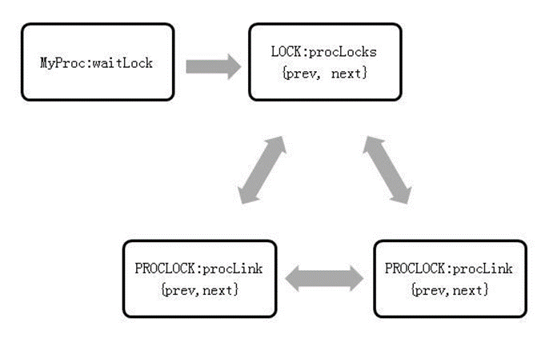

  Figure 5-16 Queue relationship of the t_thrd.proc structure

  The main functions of a regular lock are as follows:

  \(1\) LockAcquire: Locks a lock object.

  \(2\) LockRelease: Releases a lock object.

  \(3\) LockReleaseAll: Releases all lock resources.

- **Deadlock Detection Mechanism**

  A deadlock occurs because process B needs to access the resources of process A, but process A does not release the resources occupied by its lock due to various reasons. As a result, the database is always in the blocked state. As shown in Figure 5-17, T1 uses resource R1 and requests resource R2, while T2 holds resource R2 and requests resource R1.

  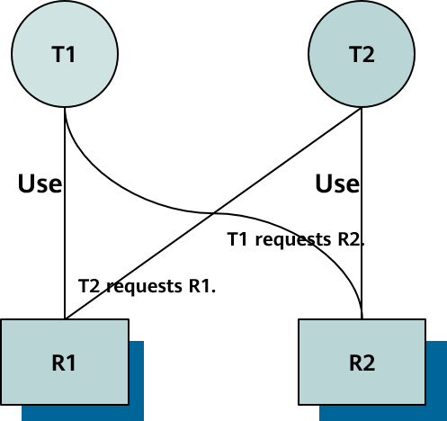

  Figure 5-17 Deadlock status

  The necessary condition for a deadlock is that resources are requested and held. Each process can use one resource and request another resource at the same time. A common way to break a deadlock is to interrupt the execution of one of the transactions and break waiting loop. openGauss provides a deadlock detection mechanism for both LWLocks and regular locks. The following describes the related principles and code.

  - **Deadlock Detection and Self-Sealing of LWLocks**

    openGauss uses an independent monitoring thread to detect, diagnose, and release deadlocks of LWLocks. A worker thread writes a timestamp value before successfully requesting a LWLock. After successfully obtaining the lock, the worker thread sets the timestamp to 0. The monitoring thread can quickly compare the timestamp values to locate the thread that fails to obtain the lock resource for a long time. This process is fast and lightweight. Diagnosis of deadlock detection is triggered only when a long lock wait is detected. This prevents frequent diagnosis from affecting service execution. Once a deadlock loop is confirmed, the monitoring thread records the deadlock information in the log, and then takes recovery measures to recover the deadlock. That is, the monitoring thread selects a thread in the deadlock loop to report an error and then exit. Figure 5-18 shows the mechanism.

    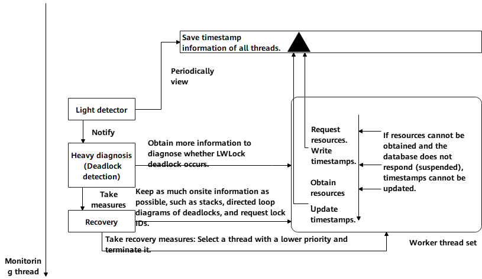

    Figure 5-18 Deadlock detection and self-healing of LWLocks

    Deadlock detection and verification are operations that consume too many CPU resources. To prevent the database performance and running stability from being affected, LWLock detection uses a lightweight detection method to quickly determine whether a deadlock may occur. The watchdog is used for detection by using timestamps. When a lock is requested, the worker thread writes the timestamp when the wait starts in the global memory. After the lock request is successful, the timestamp is set to 0. For a deadlocked thread, its lock request is in the wait state, and the timestamp is not set to 0. In addition, the difference between the timestamp and the current running timestamp becomes larger and larger. The GUC parameter **fault_mon_timeout** specifies the check interval. The default value is 5 seconds. Deadlock detection for LWLocks is performed at the interval specified by **fault_mon_timeout**. If the same thread and lock ID are detected and the timestamp exceeds the detection interval, deadlock detection is triggered. The functions for time statistics and lightweight detection are as follows:

    \(1\) pgstat_read_light_detect: Reads the timestamp related to the thread and lock ID from the statistical information structure and records the timestamp to the pointer queue.

    \(2\) lwm_compare_light_detect: Compares the state with that several seconds before detection. If threads and lock IDs that may be deadlocked are found, **true** is returned. Otherwise, **false** is returned.

    LWLock deadlock detection is a directed acyclic graph \(DAG\) determination process. Its implementation is similar to that of a regular lock, which will be described in detail in the following section. Deadlock detection requires two types of information: lock information \(including request and allocation information\) and thread information \(including waiting and holding information\). The information is recorded in corresponding global variables and can be accessed and determined by the deadlock monitoring thread. The related functions are as follows:

    \(1\) lwm_heavy_diagnosis: Detects whether a deadlock occurs.

    \(2\) lwm_deadlock_report: Reports detailed deadlock information for fault locating and diagnosis.

    \(3\) lw_deadlock_auto_healing: Heals a deadlock by selecting a thread in the loop to exit.

    The data structure related to the lock and thread used for deadlock detection is as follows:

    \(1\) **lock_entry_id** records thread information. **thread_id** and **sessionid** adapt to the thread pool framework so that correct information can be found from the statistics. The corresponding code is as follows:

    ```
    typedef struct {
        ThreadId thread_id;
        uint64 st_sessionid;
    } lock_entry_id;
    ```

    \(2\) **lwm_light_detect** records the thread that may be deadlocked and uses a linked list to connect all the current information. The corresponding code is as follows:

    ```
    typedef struct {
        /* Thread ID*/
        lock_entry_id entry_id;

        /* Reference count of LWLock detection*/
        int lw_count;
    } lwm_light_detect;
    ```

    \(3\) **lwm_lwlocks** records thread-related lock information, including the number of held locks and lock wait information. The corresponding code is as follows:

    ```
    typedef struct {
        lock_entry_id be_tid;         /* Thread ID*/
        int be_idx;                   /* Location of the background thread*/
        LWLockAddr want_lwlock;         /* Information about the lock that has been obtained in advance*/
        int lwlocks_num;              /* Number of LWLocks held by the thread*/
        lwlock_id_mode* held_lwlocks; /* LWLock array held by the thread*/
    } lwm_lwlocks;
    ```

  - **Deadlock Detection for Regular Locks**

    If no conflict occurs when openGauss obtains a lock, openGauss directly locks the lock. If a conflict occurs, openGauss sets a timer and waits. After the specified period of time, openGauss is called by the timer to detect deadlock. If process T2 is behind process T1 in the waiting queue of a lock, and the lock that process T2 needs to obtain conflicts with the lock that process T1 needs to obtain, there is a soft edge from T2 to T1. If the lock request from process T2 conflicts with the lock held by process T1, a hard edge exists. The overall idea is, by calling functions recursively, to start from the thread that is waiting for a lock currently and move forward along the waiting edge to check whether a loop exists. If a soft edge exists in the loop, the two processes in the loop are waiting for the lock. In this case, sort the lock waiting queue again to try to solve the deadlock conflict. If there is no soft edge, only the transaction waiting for the current lock can be terminated to solve the deadlock loop. As shown in Figure 5-19, the dashed line indicates a soft edge, and the solid line indicates a hard edge. Thread A waits for thread B, thread B waits for thread C, and thread C waits for thread A. Because thread A waits for thread B on a soft edge, the wait relationship is adjusted, as shown in Figure 5-19. In this case, thread A waits for thread C, and thread C waits for thread A. There is no soft edge, and a deadlock is detected.

    

    Figure 5-19 Deadlock detection for regular locks

    The main functions are as follows:

    \(1\) DeadLockCheck: Detects deadlocks.

    \(2\) DeadLockCheckRecurse: Returns **true** if a deadlock occurs, or returns **false** and resolves the deadlock conflict if a soft edge exists.

    \(3\) check_stack_depth: openGauss checks the deadlock recursive detection stack. \(If the deadlock detection recursive stack is too long, all LWLock partitions are held for a long time during deadlock detection, blocking services.\)

    \(4\) CheckDeadLockRunningTooLong: openGauss checks the deadlock detection time to prevent the time from being too long. If deadlock detection lasts for too long, all subsequent services are blocked. The corresponding code is as follows:

    ```
    static void CheckDeadLockRunningTooLong(int depth)
    {/* Check every four layers.*/
        if (depth > 0 && ((depth % 4) == 0)) {
            TimestampTz now = GetCurrentTimestamp();
            long secs = 0;
            int usecs = 0;

            if (now > t_thrd.storage_cxt.deadlock_checker_start_time) {
                TimestampDifference(t_thrd.storage_cxt.deadlock_checker_start_time, now, &secs, &usecs);
                if (secs > 600) { /* An error is reported if deadlock detection lasts for more than 10 minutes.   */
    #ifdef USE_ASSERT_CHECKING
                DumpAllLocks();/* All lock information for fault locating in the debug version is exported.   */
    #endif

                    ereport(defence_errlevel(), (errcode(ERRCODE_INTERNAL_ERROR),
                                                 errmsg("Deadlock checker runs too long and is greater than 10 minutes.")));
                }
            }
        }
    }
    ```

    \(5\) FindLockCycle: Checks for deadlock loops.

    \(6\) FindLockCycleRecurse: internal recursive function called during deadlock detection.

    The corresponding data structures are as follows:

    \(1\) The core and most critical directed edge data structure in deadlock detection. The corresponding code is as follows:

    ```
    typedef struct EDGE {
        PGPROC *waiter; /* Waiting thread*/
        PGPROC *blocker; /* Blocked thread*/
        int pred;        /* Workspace for topology sorting*/
        int link;        /* Workspace for topology sorting*/
    } EDGE;
    ```

    \(2\) A waiting queue that can be rearranged. The corresponding code is as follows:

    ```
    typedef struct WAIT_ORDER {
        LOCK *lock;     /* the lock whose wait queue is described */
        PGPROC **procs; /* array of PGPROC *'s in new wait order */
        int nProcs;
    } WAIT_ORDER;
    ```

    \(3\) Information printed at the end of the deadlock detection. The corresponding code is as follows:

    ```
    typedef struct DEADLOCK_INFO {
        LOCKTAG locktag;   /* Unique identifier of the lock object that is waited for*/
        LOCKMODE lockmode; /* Type of the lock object that is waited for*/
        ThreadId pid;      /* ID of the blocked thread*/
    } DEADLOCK_INFO;
    ```

- **Lockless Atomic Operation**

  openGauss encapsulates atomic operations of 32, 64, and 128 bits, which are used to replace spinlocks and implement atomic update operations of simple variables.

  \(1\) gs_atomic_add_32: Performs a 32-bit add operation and returns the new value. The corresponding code is as follows:

  ```
  static inline int32 gs_atomic_add_32(volatile int32* ptr, int32 inc)
  {
      return __sync_fetch_and_add(ptr, inc) + inc;
  }
  ```

  \(2\) Adds gs_atomic_add_64: Performs a 64-bit add operation and returns the new value. The corresponding code is as follows:

  ```
  static inline int64 gs_atomic_add_64(int64* ptr, int64 inc)
  {
      return __sync_fetch_and_add(ptr, inc) + inc;
  }
  ```

  \(3\) gs_compare_and_swap_32: 32-bit CAS operation. If the value of **dest** is not updated before, **newval** is written to **dest**. If the value of **dest** is not updated, **true** is returned. Otherwise, **false** is returned. The corresponding code is as follows:

  static inline bool gs_compare_and_swap_32\(int32\* dest, int32 oldval, int32 newval\)

  ```
  {
      if (oldval == newval)
          return true;

      volatile bool res = __sync_bool_compare_and_swap(dest, oldval, newval);

      return res;
  }
  ```

  \(4\) gs_compare_and_swap_64: 64-bit CAS operation. If the value of **dest** is not updated before, **newval** is written to **dest**. If the value of **dest** is not updated, **true** is returned. Otherwise, **false** is returned. The corresponding code is as follows:

  ```
  static inline bool gs_compare_and_swap_64(int64* dest, int64 oldval, int64 newval)
  {
      if (oldval == newval)
          return true;

      return __sync_bool_compare_and_swap(dest, oldval, newval);
  }
  ```

  \(5\) arm_compare_and_swap_u128: openGauss provides cross-platform 128-bit CAS operations. On an ARM platform, a separate instruction set is used to assemble 128-bit atomic operations to improve the lock concurrency performance of the kernel. For details, see the next section. The corresponding code is as follows:

  ```
  static inline uint128_u arm_compare_and_swap_u128(volatile uint128_u* ptr, uint128_u oldval, uint128_u newval)
  {
  #ifdef __ARM_LSE
      return __lse_compare_and_swap_u128(ptr, oldval, newval);
  #else
      return __excl_compare_and_swap_u128(ptr, oldval, newval);
  #endif
  }
  #endif
  ```

  \(6\) atomic_compare_and_swap_u128: 128-bit CAS operation. If the value of **dest** is not updated by other threads before update, **newval** is written to **dest**. If the value of **dest** is not updated, a new value is returned. Otherwise, the value updated by other threads is returned. Note that the upper-layer caller must ensure that the input parameters are 128-bit aligned. The corresponding code is as follows:

  ```
  static inline uint128_u atomic_compare_and_swap_u128(
      volatile uint128_u* ptr,
      uint128_u oldval = uint128_u{0},
      uint128_u newval = uint128_u{0})
  {
  #ifdef __aarch64__
      return arm_compare_and_swap_u128(ptr, oldval, newval);
  #else
      uint128_u ret;
      ret.u128 = __sync_val_compare_and_swap(&ptr->u128, oldval.u128, newval.u128);
      return ret;
  #endif
  }
  ```

- **Performance Optimization Based on Kunpeng Servers**

  This section describes how to optimize the lock-related functions and structures of openGauss based on hardware structures.

  - **WAL Group Insert Optimization**

    The redo log cache system of the database refers to the write cache for database redo log persistency. Database redo logs are written to the log cache before being written to disks for persistency. The write efficiency of the log cache is the main factor that determines the overall throughput of the database. To ensure that logs are written in sequence, lock contention occurs when threads write logs. As such, lock contention becomes the main performance bottleneck. Based on the CPU characteristics of ARM-based Kunpeng servers, openGauss inserts logs in groups to reduce lock contention and improve the efficiency of inserting WALs, thereby improving the throughput performance of the entire database. Figure 5-20 shows the process of inserting logs in groups.

    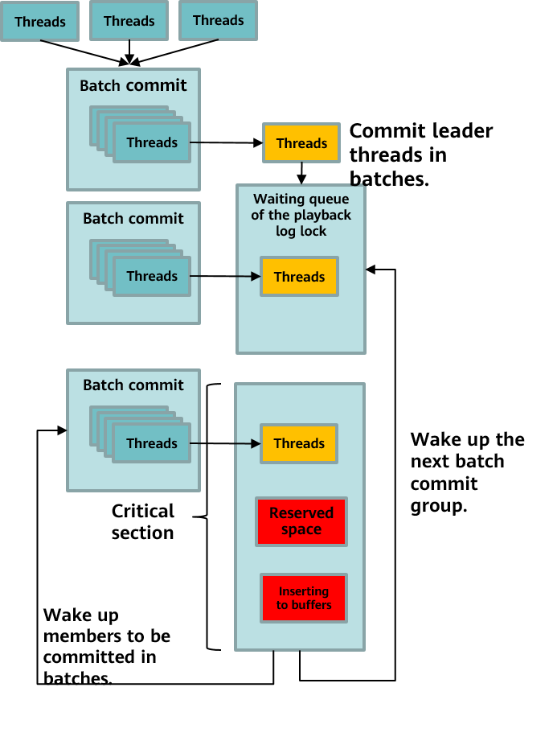

    Figure 5-20 Inserting logs in groups

    \(1\) All threads do not need to contend for a lock.

    \(2\) In the same time window, all threads join a group before contending for a lock. The first thread that joins the group is the leader thread. CAS atomic operations are performed to manage queues.

    \(3\) The leader thread contends for the lock on behalf of the entire group. Other follower threads in the group start to sleep and wait for the leader thread to wake them up.

    \(4\) After obtaining the lock, the leader thread traverses the logs to be inserted by all threads in the group to obtain the total space required. The leader thread reserves space only once.

    \(5\) The leader thread writes the logs to be written by all threads in the group to the log buffer.

    \(6\) The lock is released and all follower threads are awakened.

    \(7\) The follower threads do not need to contend for the lock because the logs to be written have been written by the leader thread. They directly enter the subsequent process.

    The key function code is as follows:

    ```
    static XLogRecPtr XLogInsertRecordGroup(XLogRecData* rdata, XLogRecPtr fpw_lsn)
    {
        …/* Initialize variables and perform simple verification.*/
        START_CRIT_SECTION();  /* Start the critical section.*/

        proc->xlogGroupMember = true;
        …
        proc->xlogGroupDoPageWrites = &t_thrd.xlog_cxt.doPageWrites;

        nextidx = pg_atomic_read_u32(&t_thrd.shemem_ptr_cxt.LocalGroupWALInsertLocks[groupnum].l.xlogGroupFirst);

        while (true) {
            pg_atomic_write_u32(&proc->xlogGroupNext, nextidx); /* Record the previous member to the PGPROC structure.*/
            /* Prevent ARM disorders to ensure that all previous write operations are visible.*/
            pg_write_barrier();

            if (pg_atomic_compare_exchange_u32(&t_thrd.shemem_ptr_cxt.LocalGroupWALInsertLocks[groupnum].l.xlogGroupFirst,
                    &nextidx,
                    (uint32)proc->pgprocno)) {
                break;
            } /* Obtain the proc no field of the previous member. If the field is invalid, the member is the leader.   */
        }
            } /* Non-leader members do not obtain the WAL Insert lock. They only wait until they are awakened by the leader.*/
        if (nextidx != INVALID_PGPROCNO) {
            int extraWaits = 0;

            for (;;) {
            } /* Function as a read barrier.*/
                PGSemaphoreLock(&proc->sem, false);
            } /* Function as a read barrier.*/
                pg_memory_barrier();
                if (!proc->xlogGroupMember) {
                    break;
                }
                extraWaits++;
            }

            while (extraWaits-- > 0) {
                PGSemaphoreUnlock(&proc->sem);
            }
            END_CRIT_SECTION();
            return proc->xlogGroupReturntRecPtr;
        }
    /* The leader member holds the lock.*/
        WALInsertLockAcquire();
            } /* Calculate the size of Xlog records of each member thread.*/
    …
        /* The leader thread inserts the Xlog records of all member threads into the buffer.*/
        while (nextidx != INVALID_PGPROCNO) {
            localProc = g_instance.proc_base_all_procs[nextidx];

            if (unlikely(localProc->xlogGroupIsFPW)) {
                nextidx = pg_atomic_read_u32(&localProc->xlogGroupNext);
                localProc->xlogGroupIsFPW = false;
                continue;
            }
            XLogInsertRecordNolock(localProc->xlogGrouprdata,
                localProc,
                XLogBytePosToRecPtr(StartBytePos),
                XLogBytePosToEndRecPtr(
                    StartBytePos + MAXALIGN(((XLogRecord*)(localProc->xlogGrouprdata->data))->xl_tot_len)),
                XLogBytePosToRecPtr(PrevBytePos));
            PrevBytePos = StartBytePos;
            StartBytePos += MAXALIGN(((XLogRecord*)(localProc->xlogGrouprdata->data))->xl_tot_len);
            nextidx = pg_atomic_read_u32(&localProc->xlogGroupNext);
        }

        WALInsertLockRelease();  /* Complete the work, release the lock, and wake up all member threads.*/
        while (wakeidx != INVALID_PGPROCNO) {
            PGPROC* proc = g_instance.proc_base_all_procs[wakeidx];

            wakeidx = pg_atomic_read_u32(&proc->xlogGroupNext);
            pg_atomic_write_u32(&proc->xlogGroupNext, INVALID_PGPROCNO);
            proc->xlogGroupMember = false;
            pg_memory_barrier();

            if (proc != t_thrd.proc) {
                PGSemaphoreUnlock(&proc->sem);
            }
        }

        END_CRIT_SECTION();
        return proc->xlogGroupReturntRecPtr;
    }
    ```

  - **False Sharing Elimination by Using Cache Alignment**

    When accessing the main memory, the CPU obtains the data of the entire cache line at a time. The typical value for x86 is 64 bytes. Both the L1 and L2 caches of the ARM 1620 chip occupy 64 bytes, and the L3 cache occupies 128 bytes. This method of obtaining data can greatly improve data access efficiency. However, if data at different locations in a same cache line is frequently read and written by different threads, a same cache line of another CPU becomes invalid during writing. Therefore, the CPU's efforts to obtain data in the main memory based on the cache line are not only wasted, but also become a performance burden. False sharing refers to a behavior with low performance in which different CPUs simultaneously access different locations in a same cache line.

    Take LWLocks as an example. The code is as follows:

    ```
    #ifdef __aarch64__
    #define LWLOCK_PADDED_SIZE PG_CACHE_LINE_SIZE(128)
    #else
    #define LWLOCK_PADDED_SIZE (sizeof(LWLock) <= 32 ? 32 : 64)
    #endif
    typedef union LWLockPadded
    {
    LWLocklock;
    charpad[LWLOCK_PADDED_SIZE];
    } LWLockPadded;
    ```

    In the current lock logic, access to LWLocks is still one of the mostly discussed topics. If the value of **LWLOCK_PADDED_SIZE** has 32 bytes and LWLocks are stored in a continuous array, a 64-byte cache line can contain two LWLockPadded structures, and a 128-byte cache line can contain four LWLockPadded structures at the same time. When the system contends fiercely for LWLocks, the corresponding cache line is continuously obtained and becomes invalid, wasting a large number of CPU resources. Therefore, when the ARM machine is optimized, **padding_size** is set to **128** to eliminate false sharing and improve the overall performance of LWLocks.

  - **Lock-free Critical Section Protection by Using 128-Bit CAS Operations of WAL Insert Locks**

    Currently, WAL of the database or file system needs to insert the log information generated in the memory to the log buffer. To implement high-speed log caching, the log management system concurrently inserts logs by reserving global locations. Generally, two 64-bit global data location indexes are used to indicate the start and end positions of store insertion. A maximum of 16-EB data indexes is supported. To protect the global location indexes, WAL introduces a high-performance atomic lock to protect each log buffer. In the NUMA architecture, especially in the ARM architecture, concurrent WAL cache protection becomes a bottleneck due to atomic lock backoff, high cross-CPU access latency, and cache consistency performance differences.

    A main idea involved in optimization is to replace an atomic lock with the information about the two 64-bit global data locations through 128-bit atomic operations, eliminating costs of cross-CPU access, backoff, and cache consistency of the atomic lock. For details, see Figure 5-21.

    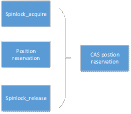

    Figure 5-21 Lock-free critical section protection by using 128-bit CAS operations

    The global location information includes a 64-bit start address and a 64-bit end address. These two addresses are combined into 128-bit information, and the lock-free location information is reserved through CAS atomic operations. The ARM platform does not support the 128-bit atomic operation library. openGauss loads two pieces of 64-bit ARM data by executing the **exclusive** command. The 64-bit ARM assembly instruction is LDXP/STXP.

    The key data structure and the code of the **ReserveXLogInsertLocation** function are as follows:

    ```
    typedef union {
        uint128   u128;
        uint64    u64[2];
        uint32    u32[4];
    } uint128_u; /* To ensure readability and operability of the code, 128-bit unsigned integers are designed as a union structure, and 64-bit values are assigned to the memory location.  */
    static void ReserveXLogInsertLocation(uint32 size, XLogRecPtr* StartPos, XLogRecPtr* EndPos, XLogRecPtr* PrevPtr)
    {
        volatile XLogCtlInsert* Insert = &t_thrd.shemem_ptr_cxt.XLogCtl->Insert;
        uint64 startbytepos;
        uint64 endbytepos;
        uint64 prevbytepos;

        size = MAXALIGN(size);

    #if defined(__x86_64__) || defined(__aarch64__)
        uint128_u compare;
        uint128_u exchange;
        uint128_u current;

        compare = atomic_compare_and_swap_u128((uint128_u*)&Insert->CurrBytePos);

    loop1:
        startbytepos = compare.u64[0];
        endbytepos = startbytepos + size;

        exchange.u64[0] = endbytepos; /* To ensure readability of the code, 128-bit unsigned integers are designed as a union structure. The start and end positions are written to exchange.  */
        exchange.u64[1] = startbytepos;

        current = atomic_compare_and_swap_u128((uint128_u*)&Insert->CurrBytePos, compare, exchange);
        if (!UINT128_IS_EQUAL(compare, current)) { /* If update is performed concurrently by other threads, it will be performed cyclically.*/
            UINT128_COPY(compare, current);
            goto loop1;
        }
        prevbytepos = compare.u64[1];

    #else
        SpinLockAcquire(&Insert->insertpos_lck); /* Other platforms use atomic spinlocks to protect variable updates.*/
        startbytepos = Insert->CurrBytePos;
        prevbytepos = Insert->PrevBytePos;
        endbytepos = startbytepos + size;
        Insert->CurrBytePos = endbytepos;
        Insert->PrevBytePos = startbytepos;

        SpinLockRelease(&Insert->insertpos_lck);
    #endif /* __x86_64__|| __aarch64__ */
        *StartPos = XLogBytePosToRecPtr(startbytepos);
        *EndPos = XLogBytePosToEndRecPtr(endbytepos);
        *PrevPtr = XLogBytePosToRecPtr(prevbytepos);
    }
    ```

  - **Clog Partition Optimization**

    For details about Clogs, see section 5.2.2 XID Allocation, Clogs, and CSNlogs. Each transaction has four states: **IN_PROGRESS**, **COMMITED**, **ABORTED**, and **SUB_COMMITED**. Each log occupies 2 bits. Clogs need to be stored on disks. One page \(occupying 8 KB\) can contain 2<sup>15</sup> logs, and each log file \(segment = 256 x 8 KB\) can contain 226 logs. Currently, access to Clogs is implemented through a buffer pool. A unified SLRU buffer pool is used in the code.

    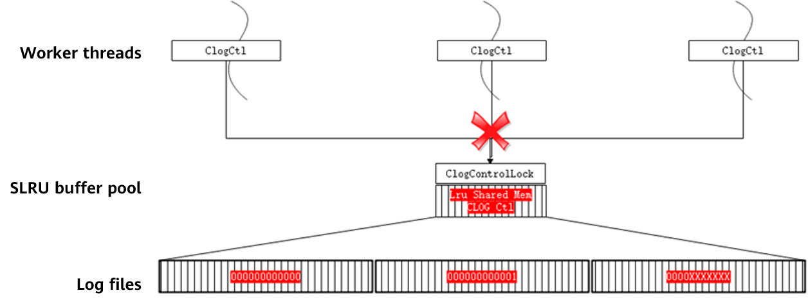

    Figure 5-22 Clog buffer pool before optimization

    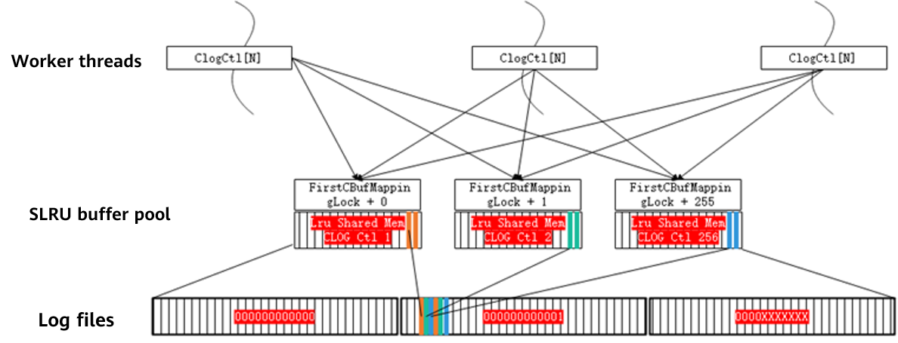

    Figure 5-23 Clog buffer pool after optimization

    As shown in Figure 5-22, the buffer pool of Clogs is globally unique in the shared memory in the name of **CLOG Ctl**, which is shared by worker threads. In a high-concurrency scenario, resource contention becomes a performance bottleneck. Figure 5-23 shows the Clog buffer pool after partition optimization. A modulo operation \(obtaining the remainder after dividing two numbers\) is performed based on the page number to evenly distribute logs to the buffer pools of multiple shared memory, and the logs are recorded in the thread local object array ClogCtlData. The buffer pools are named **CLOG Ctl** _i_ . Buffer pool objects and corresponding global locks are added to the shared memory synchronously. The overall throughput is improved in a scattered manner.

    To optimize Clog partitions, the operations related to the original buffer pool in the source code need to be changed to the operations on the buffer pool of the corresponding partition. The corresponding partition can be easily located based on the XID and page number, and the corresponding control lock is changed from one lock to multiple locks. The involved structure code is as follows. Table 5-8 lists the involved functions.

    ```
    /* Clog partition*/
    #define NUM_CLOG_PARTITIONS 256  /* Number of partitions*/
    /* Clog lightweight partition lock*/
    #define CBufHashPartition(hashcode) \
        ((hashcode) % NUM_CLOG_PARTITIONS)
    #define CBufMappingPartitionLock(hashcode) \
        (&t_thrd.shemem_ptr_cxt.mainLWLockArray[FirstCBufMappingLock + CBufHashPartition(hashcode)].lock)
    #define CBufMappingPartitionLockByIndex(i) \
        (&t_thrd.shemem_ptr_cxt.mainLWLockArray[FirstCBufMappingLock + i].lock)
    ```

    **表 8** Functions for Clog partition optimization

    <a name="table6168183214215"></a>
    <table><thead ><tr id="row1220712338215"><th class="cellrowborder"  width="27.18%" id="mcps1.2.3.1.1"><p id="p1020783312117"><a name="p1020783312117"></a><a name="p1020783312117"></a>Function</p>
    </th>
    <th class="cellrowborder"  width="72.82%" id="mcps1.2.3.1.2"><p id="p13207173352114"><a name="p13207173352114"></a><a name="p13207173352114"></a>Description</p>
    </th>
    </tr>
    </thead>
    <tbody><tr id="row1820719337219"><td class="cellrowborder"  width="27.18%" headers="mcps1.2.3.1.1 "><p id="p0207123382115"><a name="p0207123382115"></a><a name="p0207123382115"></a>CLOGShmemInit</p>
    </td>
    <td class="cellrowborder"  width="72.82%" headers="mcps1.2.3.1.2 "><p id="p320763332117"><a name="p320763332117"></a><a name="p320763332117"></a>Calls <strong id="b152078336219"><a name="b152078336219"></a><a name="b152078336219"></a>SimpleLruInit</strong> to initialize the Clog buffer in the shared memory.</p>
    </td>
    </tr>
    <tr id="row132071433102110"><td class="cellrowborder"  width="27.18%" headers="mcps1.2.3.1.1 "><p id="p0208633152113"><a name="p0208633152113"></a><a name="p0208633152113"></a>ZeroCLOGPage</p>
    </td>
    <td class="cellrowborder"  width="72.82%" headers="mcps1.2.3.1.2 "><p id="p192087337218"><a name="p192087337218"></a><a name="p192087337218"></a>Initializes the value on the Clog log page to <strong id="b72081133162118"><a name="b72081133162118"></a><a name="b72081133162118"></a>0</strong>.</p>
    </td>
    </tr>
    <tr id="row92081733192117"><td class="cellrowborder"  width="27.18%" headers="mcps1.2.3.1.1 "><p id="p13208333182114"><a name="p13208333182114"></a><a name="p13208333182114"></a>BootStrapCLOG</p>
    </td>
    <td class="cellrowborder"  width="72.82%" headers="mcps1.2.3.1.2 "><p id="p320843392117"><a name="p320843392117"></a><a name="p320843392117"></a>Creates an initial available Clog page in the buffer, calls <strong id="b1120853382118"><a name="b1120853382118"></a><a name="b1120853382118"></a>ZeroCLOGPage</strong> to initialize the value on the page to <strong id="b820812339210"><a name="b820812339210"></a><a name="b820812339210"></a>0</strong>, writes the Clog page to the disk, and returns to the page when a database is created.</p>
    </td>
    </tr>
    <tr id="row3208633122117"><td class="cellrowborder"  width="27.18%" headers="mcps1.2.3.1.1 "><p id="p72081933192117"><a name="p72081933192117"></a><a name="p72081933192117"></a>CLogSetTreeStatus</p>
    </td>
    <td class="cellrowborder"  width="72.82%" headers="mcps1.2.3.1.2 "><p id="p22081833192116"><a name="p22081833192116"></a><a name="p22081833192116"></a>Sets the final state of transaction commit.</p>
    </td>
    </tr>
    <tr id="row320863372117"><td class="cellrowborder"  width="27.18%" headers="mcps1.2.3.1.1 "><p id="p42084337211"><a name="p42084337211"></a><a name="p42084337211"></a>CLogGetStatus</p>
    </td>
    <td class="cellrowborder"  width="72.82%" headers="mcps1.2.3.1.2 "><p id="p1820811332214"><a name="p1820811332214"></a><a name="p1820811332214"></a>Queries the transaction state.</p>
    </td>
    </tr>
    <tr id="row9208173352110"><td class="cellrowborder"  width="27.18%" headers="mcps1.2.3.1.1 "><p id="p14208123314219"><a name="p14208123314219"></a><a name="p14208123314219"></a>ShutdownCLOG</p>
    </td>
    <td class="cellrowborder"  width="72.82%" headers="mcps1.2.3.1.2 "><p id="p20208103312212"><a name="p20208103312212"></a><a name="p20208103312212"></a>Closes the buffer and refreshes the data to the disk.</p>
    </td>
    </tr>
    <tr id="row1120893312214"><td class="cellrowborder"  width="27.18%" headers="mcps1.2.3.1.1 "><p id="p2208153362113"><a name="p2208153362113"></a><a name="p2208153362113"></a>ExtendCLOG</p>
    </td>
    <td class="cellrowborder"  width="72.82%" headers="mcps1.2.3.1.2 "><p id="p82091133162118"><a name="p82091133162118"></a><a name="p82091133162118"></a>Creates a Clog page for a newly allocated transaction.</p>
    </td>
    </tr>
    <tr id="row17209163342110"><td class="cellrowborder"  width="27.18%" headers="mcps1.2.3.1.1 "><p id="p1520933314218"><a name="p1520933314218"></a><a name="p1520933314218"></a>TruncateCLOG</p>
    </td>
    <td class="cellrowborder"  width="72.82%" headers="mcps1.2.3.1.2 "><p id="p1320923372111"><a name="p1320923372111"></a><a name="p1320923372111"></a>Deletes logs that expire due to the creation of log checkpoints to save space.</p>
    </td>
    </tr>
    <tr id="row182091133112119"><td class="cellrowborder"  width="27.18%" headers="mcps1.2.3.1.1 "><p id="p32091533112113"><a name="p32091533112113"></a><a name="p32091533112113"></a>WriteZeroPageXlogRec</p>
    </td>
    <td class="cellrowborder"  width="72.82%" headers="mcps1.2.3.1.2 "><p id="p2020973315213"><a name="p2020973315213"></a><a name="p2020973315213"></a>Writes the CLOG_ZEROPAGE XLOG log for future use when an Xlog page is created.</p>
    </td>
    </tr>
    <tr id="row1420933320212"><td class="cellrowborder"  width="27.18%" headers="mcps1.2.3.1.1 "><p id="p5209133182114"><a name="p5209133182114"></a><a name="p5209133182114"></a>clog_redo</p>
    </td>
    <td class="cellrowborder"  width="72.82%" headers="mcps1.2.3.1.2 "><p id="p182091337213"><a name="p182091337213"></a><a name="p182091337213"></a>Performs redo operations related to Clogs, including CLOG_ZEROPAGE and CLOG_TRUNCATE.</p>
    </td>
    </tr>
    </tbody>
    </table>

  - **NUMA-aware Data and Thread Access Distribution**

    Remote NUMA: Memory access involves two physical locations: access thread and accessed memory. Memory access is performed locally only when the locations are on the same NUMA node. Otherwise, cross-node remote access is involved, and in this case, the performance overhead is high.

    The numactl open-source software provides the libnuma library that allows applications to easily bind threads to a specific NUMA node or CPU list and allocate memory to a specified NUMA node. The following describes the APIs that may be involved in the openGauss code.

    \(1\) int numa_run_on_node\(int node\): Runs the current task and its subtasks on a specified node. The function corresponding to this API are as follows:

    ```
    numa_run_on_node: Runs the current task and its subtasks on a specific node. These tasks are not migrated to the CPUs of other nodes until the node association is reset by using the numa_run_on_node_mask function. –1 is passed to let the kernel schedule the tasks again on all nodes. The value 0 is returned when the operation is successful, and the value –1 is returned when the operation fails. The error code is recorded in errno.
    ```

    \(2\) void numa_set_localalloc\(void\): Sets the memory allocation policy of the caller thread to local allocation. That is, memory is preferentially allocated from the current node. The function corresponding to this API are as follows:

    ```
    numa_set_localalloc: Sets the memory allocation policy of the call task to local allocation. In this mode, the preferred node for memory allocation is the node where the task is being executed during memory allocation.
    ```

    \(3\) void numa_alloc_onnode\(void\): Allocates memory to a specified NUMA node. The function corresponding to this API are as follows:

    ```
    numa_alloc_onnode: Allocates memory to a specific node. The allocated size is a multiple of the system page size and is rounded up. If a specified node rejects the process externally, the call fails. Compared with the Malloc(3) function series, this function works slowly. The numa_free function must be used to release the memory. When an error occurs, NULL is returned.
    ```

    The internal data structure of openGauss is optimized based on the NUMA architecture.

    1\)Global PGPROC array optimization

    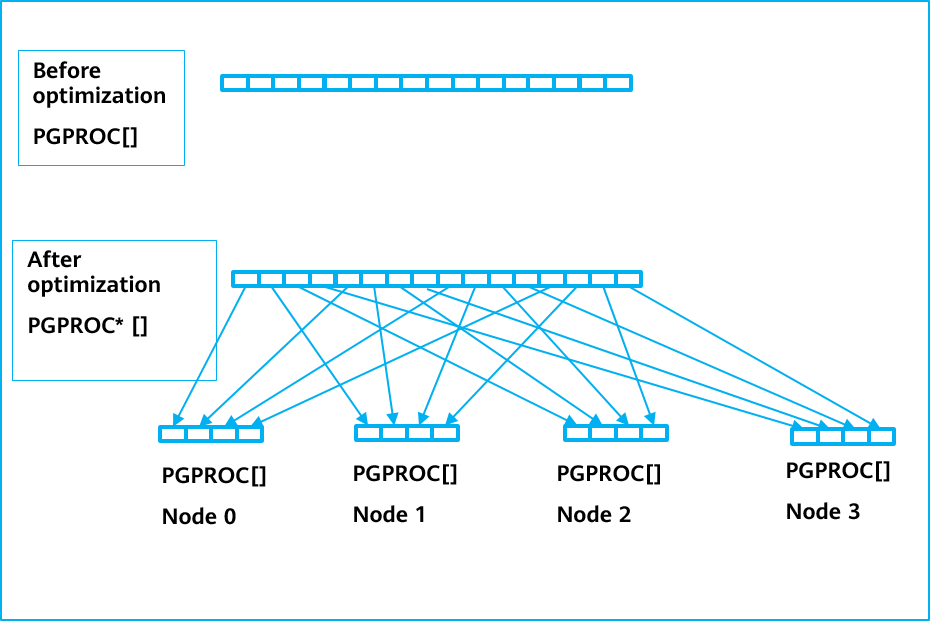

    Figure 5-24 Global PGPROC array optimization

    As shown in Figure 5-24, the system allocates a dedicated PGPROC structure for each client connection to maintain related information. ProcGlobal-\>allProcs is a global array with the PGPROC structure. However, the NUMA node where the physical memory is located is uncertain. As a result, when each transaction thread accesses its PGPROC structure, the thread may be scheduled among multiple NUMA nodes by the operating system. In addition, the physical memory location of the corresponding PGPROC structure is also uncertain, and there is a high probability that memory is accessed remotely.

    Because the PGPROC structure is frequently accessed, the global structure array is divided into multiple subarrays based on the number of NUMA nodes, and each subarray uses **numa_alloc_onnode** to allocate memory to NUMA nodes. To minimize structural changes to the current code, the structure of ProcGlobal-\>allProcs is changed from PGPROC\* to PGPROC\*\*. All access to ProcGlobal-\>allProcs needs to be adjusted accordingly \(an additional layer of indirect pointer reference is added\). The related code is as follows:

    ```
    #ifdef __USE_NUMA
        if (nNumaNodes > 1) {
            ereport(INFO, (errmsg("InitProcGlobal nNumaNodes: %d, inheritThreadPool: %d, groupNum: %d",
                nNumaNodes, g_instance.numa_cxt.inheritThreadPool,
                (g_threadPoolControler ? g_threadPoolControler->GetGroupNum() : 0))));

            int groupProcCount = (TotalProcs + nNumaNodes - 1) / nNumaNodes;
            size_t allocSize = groupProcCount * sizeof(PGPROC);
            for (int nodeNo = 0; nodeNo < nNumaNodes; nodeNo++) {
                initProcs[nodeNo] = (PGPROC *)numa_alloc_onnode(allocSize, nodeNo);
                if (!initProcs[nodeNo]) {
                    ereport(FATAL, (errcode(ERRCODE_OUT_OF_MEMORY),
                                    errmsg("InitProcGlobal NUMA memory allocation in node %d failed.", nodeNo)));
                }
                add_numa_alloc_info(initProcs[nodeNo], allocSize);
                int ret = memset_s(initProcs[nodeNo], groupProcCount * sizeof(PGPROC), 0, groupProcCount * sizeof(PGPROC));
                securec_check_c(ret, "\0", "\0");
            }
        } else {
    #endif
    ```

    2\) Global WALInsertLock array optimization

    WALInsertLocks are used to perform concurrency protection on WAL Insert operations. You can configure multiple WALInsertLocks, for example, 16. Before optimization, all WALInsertLocks are in the same global array and are allocated by using the shared memory. When a transaction thread is running, one of the WALInsertLocks in the entire global array is allocated for use. Therefore, there is a high probability that remote memory access is involved. That is, there is cross-node and cross-package contention among multiple threads. WALInsertLocks can also allocate memory separately by NUMA node, and each transaction thread uses only the WALInsertLock in the local node group. In this way, data contention can be limited to the same NUMA node. Figure 5-25 shows the basic principles.

    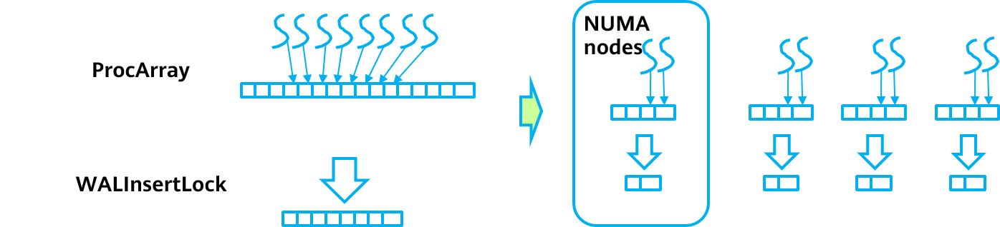

    Figure 5-25 Global WALInsertLock array optimization principles

    For example, if 16 WALInsertLocks and four NUMA nodes are configured, the original array with 16 elements will be split into four arrays, and each array has four elements. The global structure is WALInsertLockPadded \*\*GlobalWALInsertLocks. The local WALInsertLocks of the thread point to WALInsertLock\[4\] on the current node. Different NUMA nodes have WALInsertLock subarrays with different addresses. GlobalWALInsertLocks are used to trace WALInsertLock arrays under multiple nodes to facilitate traversal. Figure 5-26 shows the WALInsertLock grouping diagram.

    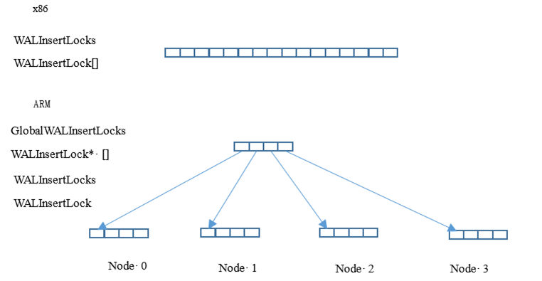

    Figure 5-26 WALInsertLock grouping diagram

    The code for initializing the WALInsertLock structure is as follows:

    ```
        WALInsertLockPadded** insertLockGroupPtr =
            (WALInsertLockPadded**)CACHELINEALIGN(palloc0(nNumaNodes * sizeof(WALInsertLockPadded*) + PG_CACHE_LINE_SIZE));
    #ifdef __USE_NUMA
        if (nNumaNodes > 1) {
            size_t allocSize = sizeof(WALInsertLockPadded) * g_instance.xlog_cxt.num_locks_in_group + PG_CACHE_LINE_SIZE;
            for (int i = 0; i < nNumaNodes; i++) {
                char* pInsertLock = (char*)numa_alloc_onnode(allocSize, i);
                if (pInsertLock == NULL) {
                    ereport(PANIC, (errmsg("XLOGShmemInit could not alloc memory on node %d", i)));
                }
                add_numa_alloc_info(pInsertLock, allocSize);
                insertLockGroupPtr[i] = (WALInsertLockPadded*)(CACHELINEALIGN(pInsertLock));
            }
        } else {
    #endif
            char* pInsertLock = (char*)CACHELINEALIGN(palloc(
                sizeof(WALInsertLockPadded) * g_instance.attr.attr_storage.num_xloginsert_locks + PG_CACHE_LINE_SIZE));
            insertLockGroupPtr[0] = (WALInsertLockPadded*)(CACHELINEALIGN(pInsertLock));
    #ifdef __USE_NUMA
        }
    #endif
    ```

    On an ARM platform, the two-dimensional array GlobalWALInsertLocks needs to be traversed to access WALInsertLocks. Specifically, NUMA nodes at the first layer and the WALInsertLock array on the nodes at the second layer are traversed.

    The LWLock memory structure referenced by WALInsertLocks is also optimized and adapted on the ARM platform. The code is as follows:

    ```
    typedef struct
    {
    LWLock lock;
    #ifdef __aarch64__
    pg_atomic_uint32xlogGroupFirst;
    #endif
    XLogRecPtrinsertingAt;
    } WALInsertLock;
    ```

    The lock member variable references an element in the global LWLock array in the shared memory. After WALInsertLock optimization, although the WALInsertLocks have been distributed by NUMA node, the LWLocks referenced by the WALInsertLocks cannot control their physical memory locations. Therefore, fierce cross-node contention is still involved when the WALInsertLocks are accessed. Therefore, the LWLocks are directly embedded into the WALInsertLocks. In this way, the LWLocks in use can be distributed to NUMA nodes, and access to cache lines is reduced.

## 5.4 Summary<a name="section1445811191664"></a>

This chapter describes the transaction system and concurrency control mechanism of openGauss.

As an important role of the database, the transaction system connects the SQL, execution, and storage modules. After receiving an external command, the transaction system determines the execution direction based on the current internal system state. This ensures the continuity and accuracy of transaction processing.

In addition to the basic and core transaction system of openGauss, this chapter also describes how openGauss optimizes its performance based on Kunpeng servers.

In a word, the transaction system and concurrency control module of openGauss provides extreme speed and stability.
