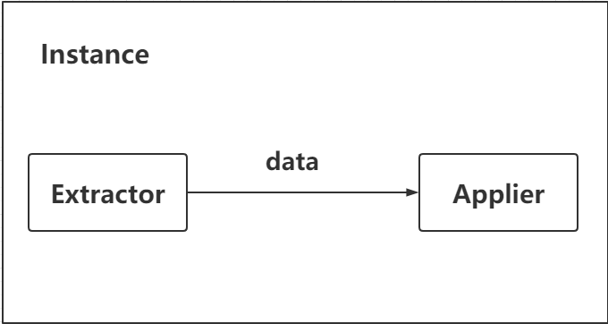
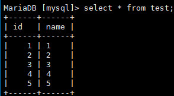
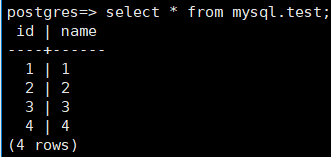
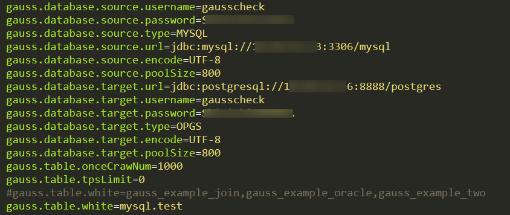
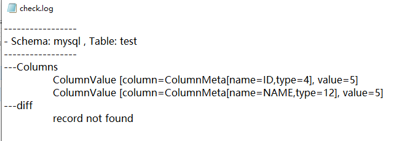

# Using DataChecker to Ensure Data Accuracy After Migration<a name="ZH-CN_TOPIC_0000001251426689"></a>

We have introduced several tools for migrating data from Oracle or MySQL to openGauss. Now, we can use the DataChecker tool to ensure data accuracy after migration.

## 1 Introduction to DataChecker<a name="section162252361959"></a>

DataChecker is a tool written in Java for checking data consistency between two databases. Some of its architecture and implementation are based on Alibaba's open-source data migration tool yugong.

Code repository: https://gitee.com/opengauss/openGauss-tools-datachecker

- 1.1 Application Scenario

  Generally, DataChecker is used to verify data accuracy after the data is migrated. After migrating a large amount of data from one database to another, you need to check whether the migrated data is accurate and complete. In this case, you can use DataChecker to check whether the data in the two databases is consistent.

- 1.2 Implementation Principles

  The architecture of DataChecker consists of two parts: Extractor and Applier.

  

  Extractor is used to extract data from the source database. Data is extracted in batches based on the sequence of the data in the source table.

  Applier is used to locate the data extracted by Extractor in the target database, compare the columns one by one, and return the result.

## 2 Usage Guide<a name="section148017507510"></a>

- 2.1 Environment Requirements

  **Operating System**

  DataChecker is developed based on Java with bat and shell scripts. It supports both Windows and Linux.

  JDK 1.6.25 or later is recommended.

  **Database**

  The source database supports MySQL and will support Oracle in the future.

  The target database supports only openGauss.

- 2.2 Downloading DataChecker

  You can download the source code and compiled package at https://gitee.com/opengauss/openGauss-tools-datachecker.

  Self-compilation:

  ```
  git clone git@gitee.com:opengauss/openGauss-tools-datachecker.git
  cd openGauss-tools-datachecker
  mvn clean install -Dmaven.test.skip -Denv=release
  ```

  If you do not want to compile the binary package by yourself, you can obtain the complied binary package **DataChecker-1.0.0-SNAPSHOT.tar.gz** in the **target** folder in the cloned home directory.

- 2.3 Directory Structure

  The structure of the **target** directory is as follows:

  <a name="table55614381937"></a>
  <table><tbody><tr id="row1929233811313"><td class="cellrowborder"  width="100%"><p id="p229263814312"><a name="p229263814312"></a><a name="p229263814312"></a>/target</p>
  <p id="p192921738131"><a name="p192921738131"></a><a name="p192921738131"></a>bin/</p>
  <p id="p42927381738"><a name="p42927381738"></a><a name="p42927381738"></a>startup.bat</p>
  <p id="p52925383320"><a name="p52925383320"></a><a name="p52925383320"></a>startup.sh</p>
  <p id="p5292838734"><a name="p5292838734"></a><a name="p5292838734"></a>stop.sh</p>
  <p id="p10292138239"><a name="p10292138239"></a><a name="p10292138239"></a>conf/</p>
  <p id="p1729243812311"><a name="p1729243812311"></a><a name="p1729243812311"></a>gauss.properties</p>
  <p id="p529212385314"><a name="p529212385314"></a><a name="p529212385314"></a>logback.xml</p>
  <p id="p0292113811316"><a name="p0292113811316"></a><a name="p0292113811316"></a>lib/</p>
  <p id="p2029263811318"><a name="p2029263811318"></a><a name="p2029263811318"></a>logs/</p>
  </td>
  </tr>
  </tbody>
  </table>

  The **bin** directory contains three files, namely, **startup.bat**, **startup.sh**, and **stop.sh**, for starting and stopping programs in Windows and Linux.

  The **conf** directory contains two configuration files. Generally, only **gauss.properties** is configured.

  The **lib** directory stores the dependency files required for running.

  The **logs** directory stores the result logs after running.

- 2.4 Configuration Modification

  Modify the configuration in the **/conf/ gauss.properties** file. Generally, you only need to modify basic information, such as the addresses of the source and target databases and the tables to be verified. For other information, you can use the default values or modify it as required.

<a name="table196610389312"></a>

<table><thead ><tr id="row1029323820318"><th class="cellrowborder"  width="33.89%" id="mcps1.1.4.1.1"><p id="p829333812318"><a name="p829333812318"></a><a name="p829333812318"></a>Parameter</p>
</th>
<th class="cellrowborder"  width="40.54%" id="mcps1.1.4.1.2"><p id="p729313385311"><a name="p729313385311"></a><a name="p729313385311"></a>Description</p>
</th>
<th class="cellrowborder"  width="25.569999999999997%" id="mcps1.1.4.1.3"><p id="p12293133820318"><a name="p12293133820318"></a><a name="p12293133820318"></a>Default Value</p>
</th>
</tr>
</thead>
<tbody><tr id="row1729373816311"><td class="cellrowborder"  width="33.89%" headers="mcps1.1.4.1.1 "><p id="p42933381138"><a name="p42933381138"></a><a name="p42933381138"></a>gauss.database.source.username</p>
</td>
<td class="cellrowborder"  width="40.54%" headers="mcps1.1.4.1.2 "><p id="p929333814313"><a name="p929333814313"></a><a name="p929333814313"></a>Specifies the username for accessing the source database.</p>
</td>
<td class="cellrowborder"  width="25.569999999999997%" headers="mcps1.1.4.1.3 "><p id="p52947385311"><a name="p52947385311"></a><a name="p52947385311"></a>N/A</p>
</td>
</tr>
<tr id="row329410387314"><td class="cellrowborder"  width="33.89%" headers="mcps1.1.4.1.1 "><p id="p1229413382315"><a name="p1229413382315"></a><a name="p1229413382315"></a>gauss.database.source.password</p>
</td>
<td class="cellrowborder"  width="40.54%" headers="mcps1.1.4.1.2 "><p id="p32941038737"><a name="p32941038737"></a><a name="p32941038737"></a>Specifies the password for accessing the source database.</p>
</td>
<td class="cellrowborder"  width="25.569999999999997%" headers="mcps1.1.4.1.3 "><p id="p14294123811315"><a name="p14294123811315"></a><a name="p14294123811315"></a>N/A</p>
</td>
</tr>
<tr id="row8294153811319"><td class="cellrowborder"  width="33.89%" headers="mcps1.1.4.1.1 "><p id="p32948384318"><a name="p32948384318"></a><a name="p32948384318"></a>gauss.database.source.type</p>
</td>
<td class="cellrowborder"  width="40.54%" headers="mcps1.1.4.1.2 "><p id="p1129411386311"><a name="p1129411386311"></a><a name="p1129411386311"></a>Specifies the type of the source database.</p>
</td>
<td class="cellrowborder"  width="25.569999999999997%" headers="mcps1.1.4.1.3 "><p id="p529417381836"><a name="p529417381836"></a><a name="p529417381836"></a>Mysql</p>
</td>
</tr>
<tr id="row2294103816310"><td class="cellrowborder"  width="33.89%" headers="mcps1.1.4.1.1 "><p id="p52946381536"><a name="p52946381536"></a><a name="p52946381536"></a>gauss.database.source.url</p>
</td>
<td class="cellrowborder"  width="40.54%" headers="mcps1.1.4.1.2 "><p id="p1729420384311"><a name="p1729420384311"></a><a name="p1729420384311"></a>Specifies the URL for connecting to the source database. The URL must comply with certain format requirements.</p>
</td>
<td class="cellrowborder"  width="25.569999999999997%" headers="mcps1.1.4.1.3 "><p id="p192951338934"><a name="p192951338934"></a><a name="p192951338934"></a>N/A</p>
</td>
</tr>
<tr id="row13295338933"><td class="cellrowborder"  width="33.89%" headers="mcps1.1.4.1.1 "><p id="p229519384313"><a name="p229519384313"></a><a name="p229519384313"></a>gauss.database.source.encode</p>
</td>
<td class="cellrowborder"  width="40.54%" headers="mcps1.1.4.1.2 "><p id="p2295038930"><a name="p2295038930"></a><a name="p2295038930"></a>Specifies the encoding format of the source database.</p>
</td>
<td class="cellrowborder"  width="25.569999999999997%" headers="mcps1.1.4.1.3 "><p id="p3295133818310"><a name="p3295133818310"></a><a name="p3295133818310"></a>UTF-8</p>
</td>
</tr>
<tr id="row1029514380312"><td class="cellrowborder"  width="33.89%" headers="mcps1.1.4.1.1 "><p id="p929516382319"><a name="p929516382319"></a><a name="p929516382319"></a>gauss.database.target.username</p>
</td>
<td class="cellrowborder"  width="40.54%" headers="mcps1.1.4.1.2 "><p id="p15295138732"><a name="p15295138732"></a><a name="p15295138732"></a>Specifies the username for accessing the target database.</p>
</td>
<td class="cellrowborder"  width="25.569999999999997%" headers="mcps1.1.4.1.3 "><p id="p1929518381039"><a name="p1929518381039"></a><a name="p1929518381039"></a>N/A</p>
</td>
</tr>
<tr id="row132958389316"><td class="cellrowborder"  width="33.89%" headers="mcps1.1.4.1.1 "><p id="p729510381030"><a name="p729510381030"></a><a name="p729510381030"></a>gauss.database.target.password</p>
</td>
<td class="cellrowborder"  width="40.54%" headers="mcps1.1.4.1.2 "><p id="p62951381238"><a name="p62951381238"></a><a name="p62951381238"></a>Specifies the password for accessing the target database.</p>
</td>
<td class="cellrowborder"  width="25.569999999999997%" headers="mcps1.1.4.1.3 "><p id="p92951438938"><a name="p92951438938"></a><a name="p92951438938"></a>N/A</p>
</td>
</tr>
<tr id="row17296438036"><td class="cellrowborder"  width="33.89%" headers="mcps1.1.4.1.1 "><p id="p6296113816314"><a name="p6296113816314"></a><a name="p6296113816314"></a>gauss.database.target.type</p>
</td>
<td class="cellrowborder"  width="40.54%" headers="mcps1.1.4.1.2 "><p id="p16296183820320"><a name="p16296183820320"></a><a name="p16296183820320"></a>Specifies the type of the target database.</p>
</td>
<td class="cellrowborder"  width="25.569999999999997%" headers="mcps1.1.4.1.3 "><p id="p132968381832"><a name="p132968381832"></a><a name="p132968381832"></a>OPGS (openGauss)</p>
</td>
</tr>
<tr id="row1029693811315"><td class="cellrowborder"  width="33.89%" headers="mcps1.1.4.1.1 "><p id="p92961538632"><a name="p92961538632"></a><a name="p92961538632"></a>gauss.database.target.url</p>
</td>
<td class="cellrowborder"  width="40.54%" headers="mcps1.1.4.1.2 "><p id="p02961538133"><a name="p02961538133"></a><a name="p02961538133"></a>Specifies the URL for connecting to the target database. The URL must comply with certain format requirements.</p>
</td>
<td class="cellrowborder"  width="25.569999999999997%" headers="mcps1.1.4.1.3 "><p id="p14296193811318"><a name="p14296193811318"></a><a name="p14296193811318"></a>N/A</p>
</td>
</tr>
<tr id="row629614380310"><td class="cellrowborder"  width="33.89%" headers="mcps1.1.4.1.1 "><p id="p1929613381131"><a name="p1929613381131"></a><a name="p1929613381131"></a>gauss.database.target.encode</p>
</td>
<td class="cellrowborder"  width="40.54%" headers="mcps1.1.4.1.2 "><p id="p102963387312"><a name="p102963387312"></a><a name="p102963387312"></a>Specifies the encoding format of the target database.</p>
</td>
<td class="cellrowborder"  width="25.569999999999997%" headers="mcps1.1.4.1.3 "><p id="p129616381535"><a name="p129616381535"></a><a name="p129616381535"></a>UTF-8</p>
</td>
</tr>
<tr id="row32966381831"><td class="cellrowborder"  width="33.89%" headers="mcps1.1.4.1.1 "><p id="p4296123813312"><a name="p4296123813312"></a><a name="p4296123813312"></a>gauss.table.onceCrawNum</p>
</td>
<td class="cellrowborder"  width="40.54%" headers="mcps1.1.4.1.2 "><p id="p62971438435"><a name="p62971438435"></a><a name="p62971438435"></a>Specifies the maximum number of records processed by Extractor or Applier in each batch.</p>
</td>
<td class="cellrowborder"  width="25.569999999999997%" headers="mcps1.1.4.1.3 "><p id="p1729715381033"><a name="p1729715381033"></a><a name="p1729715381033"></a>1000</p>
</td>
</tr>
<tr id="row829712381237"><td class="cellrowborder"  width="33.89%" headers="mcps1.1.4.1.1 "><p id="p029720387319"><a name="p029720387319"></a><a name="p029720387319"></a>gauss.table.tpsLimit</p>
</td>
<td class="cellrowborder"  width="40.54%" headers="mcps1.1.4.1.2 "><p id="p6297238636"><a name="p6297238636"></a><a name="p6297238636"></a>Specifies the limit on transactions per second (TPS). The value <strong id="b529743812316"><a name="b529743812316"></a><a name="b529743812316"></a>0</strong> indicates that TPS is not limited.</p>
</td>
<td class="cellrowborder"  width="25.569999999999997%" headers="mcps1.1.4.1.3 "><p id="p10297103816317"><a name="p10297103816317"></a><a name="p10297103816317"></a>0</p>
</td>
</tr>
<tr id="row729714388312"><td class="cellrowborder"  width="33.89%" headers="mcps1.1.4.1.1 "><p id="p18297738739"><a name="p18297738739"></a><a name="p18297738739"></a>gauss.table.skipApplierException</p>
</td>
<td class="cellrowborder"  width="40.54%" headers="mcps1.1.4.1.2 "><p id="p82973381033"><a name="p82973381033"></a><a name="p82973381033"></a>The value <strong id="b82971638837"><a name="b82971638837"></a><a name="b82971638837"></a>true</strong> indicates that a single abnormal data record can be ignored when a database exception occurs in Applier, for example, constraint key conflict.</p>
</td>
<td class="cellrowborder"  width="25.569999999999997%" headers="mcps1.1.4.1.3 "><p id="p152971538238"><a name="p152971538238"></a><a name="p152971538238"></a>false</p>
</td>
</tr>
<tr id="row132972388312"><td class="cellrowborder"  width="33.89%" headers="mcps1.1.4.1.1 "><p id="p14297538836"><a name="p14297538836"></a><a name="p14297538836"></a>gauss.table.white</p>
</td>
<td class="cellrowborder"  width="40.54%" headers="mcps1.1.4.1.2 "><p id="p1429718381032"><a name="p1429718381032"></a><a name="p1429718381032"></a>Specifies the whitelist that lists the tables to be verified.</p>
<p id="p62975384317"><a name="p62975384317"></a><a name="p62975384317"></a>The format of the value is <em id="i629717388313"><a name="i629717388313"></a><a name="i629717388313"></a>schema.tablename</em>. Multiple table names can be separated by commas (,). To verify all tables in a schema, you only need to enter the schema name.</p>
</td>
<td class="cellrowborder"  width="25.569999999999997%" headers="mcps1.1.4.1.3 "><p id="p202971538533"><a name="p202971538533"></a><a name="p202971538533"></a>N/A</p>
</td>
</tr>
<tr id="row729718381839"><td class="cellrowborder"  width="33.89%" headers="mcps1.1.4.1.1 "><p id="p132975381733"><a name="p132975381733"></a><a name="p132975381733"></a>gauss.table.black</p>
</td>
<td class="cellrowborder"  width="40.54%" headers="mcps1.1.4.1.2 "><p id="p162978381733"><a name="p162978381733"></a><a name="p162978381733"></a>Specifies the blacklist that lists the tables to be ignored. The format of the value is the same as that specified by <strong id="b1329713813319"><a name="b1329713813319"></a><a name="b1329713813319"></a>gauss.table.white.</strong></p>
</td>
<td class="cellrowborder"  width="25.569999999999997%" headers="mcps1.1.4.1.3 "><p id="p1229810381236"><a name="p1229810381236"></a><a name="p1229810381236"></a>N/A</p>
</td>
</tr>
<tr id="row129823816310"><td class="cellrowborder"  width="33.89%" headers="mcps1.1.4.1.1 "><p id="p1329813384317"><a name="p1329813384317"></a><a name="p1329813384317"></a>gauss.table.inc.tablepks</p>
</td>
<td class="cellrowborder"  width="40.54%" headers="mcps1.1.4.1.2 "><p id="p112987381537"><a name="p112987381537"></a><a name="p112987381537"></a>Specifies the primary key of the tables to be verified, which is used to speed up verification. The format of the value is <em id="i229812381338"><a name="i229812381338"></a><a name="i229812381338"></a>tablename1&amp;pk1&amp;pk2|tablename2&amp;pk1</em>.</p>
</td>
<td class="cellrowborder"  width="25.569999999999997%" headers="mcps1.1.4.1.3 "><p id="p11298638234"><a name="p11298638234"></a><a name="p11298638234"></a>N/A</p>
</td>
</tr>
<tr id="row12981389318"><td class="cellrowborder"  width="33.89%" headers="mcps1.1.4.1.1 "><p id="p92981138634"><a name="p92981138634"></a><a name="p92981138634"></a>gauss.table.concurrent.enable</p>
</td>
<td class="cellrowborder"  width="40.54%" headers="mcps1.1.4.1.2 "><p id="p1529893813312"><a name="p1529893813312"></a><a name="p1529893813312"></a>Specifies whether to enable parallel processing for multiple tables. If the value is <strong id="b729814381315"><a name="b729814381315"></a><a name="b729814381315"></a>false</strong>, serial processing is required.</p>
</td>
<td class="cellrowborder"  width="25.569999999999997%" headers="mcps1.1.4.1.3 "><p id="p829817388313"><a name="p829817388313"></a><a name="p829817388313"></a>true</p>
</td>
</tr>
<tr id="row1129817381239"><td class="cellrowborder"  width="33.89%" headers="mcps1.1.4.1.1 "><p id="p1329819381132"><a name="p1329819381132"></a><a name="p1329819381132"></a>gauss.table.concurrent.size</p>
</td>
<td class="cellrowborder"  width="40.54%" headers="mcps1.1.4.1.2 "><p id="p929833816314"><a name="p929833816314"></a><a name="p929833816314"></a>Specifies the number of tables that can be concurrently processed.</p>
</td>
<td class="cellrowborder"  width="25.569999999999997%" headers="mcps1.1.4.1.3 "><p id="p229814381735"><a name="p229814381735"></a><a name="p229814381735"></a>5</p>
</td>
</tr>
<tr id="row1298173812316"><td class="cellrowborder"  width="33.89%" headers="mcps1.1.4.1.1 "><p id="p4298193810318"><a name="p4298193810318"></a><a name="p4298193810318"></a>gauss.table.retry.times</p>
</td>
<td class="cellrowborder"  width="40.54%" headers="mcps1.1.4.1.2 "><p id="p132989381036"><a name="p132989381036"></a><a name="p132989381036"></a>Specifies the number of retry times after an error occurs in table verification.</p>
</td>
<td class="cellrowborder"  width="25.569999999999997%" headers="mcps1.1.4.1.3 "><p id="p229812382313"><a name="p229812382313"></a><a name="p229812382313"></a>3</p>
</td>
</tr>
<tr id="row142984381333"><td class="cellrowborder"  width="33.89%" headers="mcps1.1.4.1.1 "><p id="p229933812314"><a name="p229933812314"></a><a name="p229933812314"></a>gauss.extractor.dump</p>
</td>
<td class="cellrowborder"  width="40.54%" headers="mcps1.1.4.1.2 "><p id="p62997381935"><a name="p62997381935"></a><a name="p62997381935"></a>Specifies whether to record all data extracted by Extractor.</p>
</td>
<td class="cellrowborder"  width="25.569999999999997%" headers="mcps1.1.4.1.3 "><p id="p1629933813316"><a name="p1629933813316"></a><a name="p1629933813316"></a>false</p>
</td>
</tr>
<tr id="row19299338539"><td class="cellrowborder"  width="33.89%" headers="mcps1.1.4.1.1 "><p id="p32992384314"><a name="p32992384314"></a><a name="p32992384314"></a>gauss.extractor.concurrent.global</p>
</td>
<td class="cellrowborder"  width="40.54%" headers="mcps1.1.4.1.2 "><p id="p329916381437"><a name="p329916381437"></a><a name="p329916381437"></a>Extractor adopts the global thread pool mode. If the value is <strong id="b62995381431"><a name="b62995381431"></a><a name="b62995381431"></a>true</strong>, all Extractor tasks use a group of thread pools. The thread pool size is specified by <strong id="b1429953810319"><a name="b1429953810319"></a><a name="b1429953810319"></a>concurrent.size.</strong></p>
</td>
<td class="cellrowborder"  width="25.569999999999997%" headers="mcps1.1.4.1.3 "><p id="p2299338939"><a name="p2299338939"></a><a name="p2299338939"></a>false</p>
</td>
</tr>
<tr id="row22991138936"><td class="cellrowborder"  width="33.89%" headers="mcps1.1.4.1.1 "><p id="p72991938438"><a name="p72991938438"></a><a name="p72991938438"></a>gauss.extractor.concurrent.size</p>
</td>
<td class="cellrowborder"  width="40.54%" headers="mcps1.1.4.1.2 "><p id="p929915389319"><a name="p929915389319"></a><a name="p929915389319"></a>Specifies the number of threads that can be concurrently processed. This parameter takes effect only after <strong id="b72993381319"><a name="b72993381319"></a><a name="b72993381319"></a>concurrent.enable</strong> is enabled.</p>
</td>
<td class="cellrowborder"  width="25.569999999999997%" headers="mcps1.1.4.1.3 "><p id="p92992387317"><a name="p92992387317"></a><a name="p92992387317"></a>30</p>
</td>
</tr>
<tr id="row929915381431"><td class="cellrowborder"  width="33.89%" headers="mcps1.1.4.1.1 "><p id="p132991238634"><a name="p132991238634"></a><a name="p132991238634"></a>gauss.applier.dump</p>
</td>
<td class="cellrowborder"  width="40.54%" headers="mcps1.1.4.1.2 "><p id="p5299103810315"><a name="p5299103810315"></a><a name="p5299103810315"></a>Specifies whether to record all data extracted by Applier.</p>
</td>
<td class="cellrowborder"  width="25.569999999999997%" headers="mcps1.1.4.1.3 "><p id="p1299133811313"><a name="p1299133811313"></a><a name="p1299133811313"></a>false</p>
</td>
</tr>
<tr id="row1299123811317"><td class="cellrowborder"  width="33.89%" headers="mcps1.1.4.1.1 "><p id="p11299738839"><a name="p11299738839"></a><a name="p11299738839"></a>gauss.applier.concurrent.enable</p>
</td>
<td class="cellrowborder"  width="40.54%" headers="mcps1.1.4.1.2 "><p id="p430011389312"><a name="p430011389312"></a><a name="p430011389312"></a>Specifies whether parallel processing is enabled for Applier.</p>
</td>
<td class="cellrowborder"  width="25.569999999999997%" headers="mcps1.1.4.1.3 "><p id="p73003381315"><a name="p73003381315"></a><a name="p73003381315"></a>true</p>
</td>
</tr>
<tr id="row430013381539"><td class="cellrowborder"  width="33.89%" headers="mcps1.1.4.1.1 "><p id="p1430063816319"><a name="p1430063816319"></a><a name="p1430063816319"></a>gauss.applier.concurrent.global</p>
</td>
<td class="cellrowborder"  width="40.54%" headers="mcps1.1.4.1.2 "><p id="p173003382035"><a name="p173003382035"></a><a name="p173003382035"></a>Applier adopts the global thread pool mode. If the value is <strong id="b63006382030"><a name="b63006382030"></a><a name="b63006382030"></a>true</strong>, all Applier tasks use a group of thread pools. The thread pool size is specified by <strong id="b9300113813317"><a name="b9300113813317"></a><a name="b9300113813317"></a>concurrent.size</strong>.</p>
</td>
<td class="cellrowborder"  width="25.569999999999997%" headers="mcps1.1.4.1.3 "><p id="p17300938739"><a name="p17300938739"></a><a name="p17300938739"></a>false</p>
</td>
</tr>
<tr id="row7300203817310"><td class="cellrowborder"  width="33.89%" headers="mcps1.1.4.1.1 "><p id="p83005389316"><a name="p83005389316"></a><a name="p83005389316"></a>gauss.applier.concurrent.size</p>
</td>
<td class="cellrowborder"  width="40.54%" headers="mcps1.1.4.1.2 "><p id="p1300203810318"><a name="p1300203810318"></a><a name="p1300203810318"></a>Specifies the number of threads that can be concurrently processed. This parameter takes effect only after <strong id="b17300938839"><a name="b17300938839"></a><a name="b17300938839"></a>concurrent.enable</strong> is enabled.</p>
</td>
<td class="cellrowborder"  width="25.569999999999997%" headers="mcps1.1.4.1.3 "><p id="p730018385312"><a name="p730018385312"></a><a name="p730018385312"></a>30</p>
</td>
</tr>
<tr id="row153003381737"><td class="cellrowborder"  width="33.89%" headers="mcps1.1.4.1.1 "><p id="p1630015381838"><a name="p1630015381838"></a><a name="p1630015381838"></a>gauss.stat.print.interval</p>
</td>
<td class="cellrowborder"  width="40.54%" headers="mcps1.1.4.1.2 "><p id="p530015386310"><a name="p530015386310"></a><a name="p530015386310"></a>Specifies the frequency of printing statistical information.</p>
<p id="p1630012381638"><a name="p1630012381638"></a><a name="p1630012381638"></a>If the value is<strong id="b1430016381833"><a name="b1430016381833"></a><a name="b1430016381833"></a> 5</strong>, statistical information is printed once after five rounds of Extractor and Applier operations are complete.</p>
</td>
<td class="cellrowborder"  width="25.569999999999997%" headers="mcps1.1.4.1.3 "><p id="p183003389310"><a name="p183003389310"></a><a name="p183003389310"></a>5</p>
</td>
</tr>
</tbody>
</table>

- 2.5 Starting and Stopping the Tool

  **Starting the Tool in Linux**

  sh startup.sh

  **Stopping the Tool in Linux**

  sh stop.sh

  **Starting the Tool in Windows**

  startup.bat

  **Stopping the Tool in Windows**

  You can directly close the terminal.

- 2.6 Log Description

  The log structure is as follows:

  <a name="table171125383310"></a>
  <table><tbody><tr id="row830110381533"><td class="cellrowborder"  width="100%"><p id="p13301193813311"><a name="p13301193813311"></a><a name="p13301193813311"></a>/logs</p>
  <p id="p13301143815316"><a name="p13301143815316"></a><a name="p13301143815316"></a>summary/</p>
  <p id="p16301193818316"><a name="p16301193818316"></a><a name="p16301193818316"></a>summary.log</p>
  <p id="p11301238731"><a name="p11301238731"></a><a name="p11301238731"></a>gauss/</p>
  <p id="p14301163816319"><a name="p14301163816319"></a><a name="p14301163816319"></a>table.log</p>
  <p id="p15301338839"><a name="p15301338839"></a><a name="p15301338839"></a>${table}/</p>
  <p id="p12301438733"><a name="p12301438733"></a><a name="p12301438733"></a>table.log</p>
  <p id="p430283812310"><a name="p430283812310"></a><a name="p430283812310"></a>extractor.log</p>
  <p id="p1730233814315"><a name="p1730233814315"></a><a name="p1730233814315"></a>applier.log</p>
  <p id="p330215381739"><a name="p330215381739"></a><a name="p330215381739"></a>check.log</p>
  </td>
  </tr>
  </tbody>
  </table>

  The **table.log** file in the **gauss** directory records all logs in the entire verification process.

  The **summary.log** file in the **summary** directory records the names of all tables whose verification results are incorrect. That is, the data in the two tables is inconsistent.

  _$\{table\}_ indicates the name of each table. In the **$\{table\}** directory, the **table.log** file records all logs generated during verification of a table, the **extractor.log** file records all logs generated during data extraction, and the **applier.log** file records all logs generated during verification implementation \(data comparison\). The **check.log** file records the data that fails to be verified in a specific line. If the **check.log** file does not exist, the verification result is correct.

- 2.7 Example

  **Preparing the Database**

  Create a table in the **mysql** schema in MySQL, as shown in the following figure.

  

  Assume that after data is migrated to openGauss, only four of the five data records are successfully migrated, as shown in the following figure.

  

  **Configuring gauss.properties**

  

  **Running startup.bat or startup.sh**

  

  **Viewing Logs**

  Check the **/logs/summary/summary.log** file and locate the **mysql.test** table where the error occurs.

  Access **/logs/mysql.test/** to view details.

  

  There are four log files. You can mainly view **check.log**.

  

  The record whose ID is 5 and whose name is 5 fails to be migrated.
