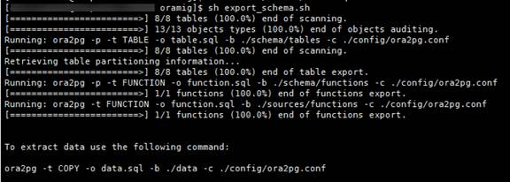
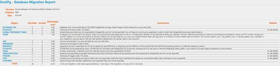
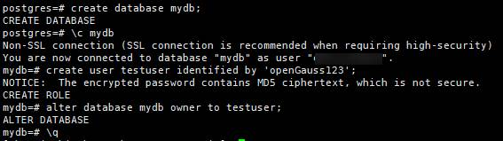
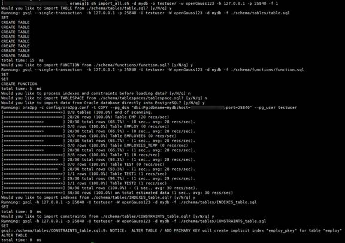
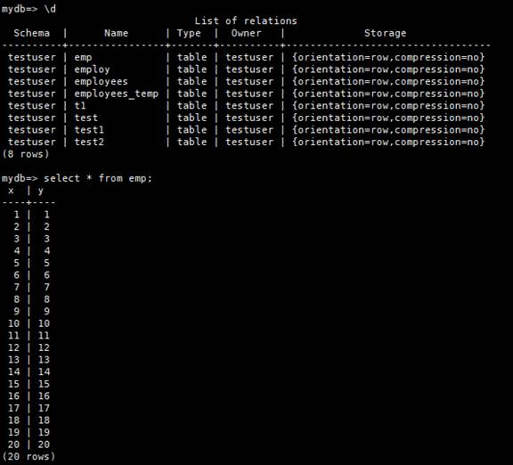

# Using Ora2Pg to Migrate Data from Oracle to openGauss<a name="ZH-CN_TOPIC_0000001206626666"></a>

## **Introduction to Ora2Pg**<a name="section1021957194617"></a>

Ora2Pg is an open-source tool for migrating data from Oracle to PostgreSQL. By connecting to Oracle, Ora2Pg automatically scans and extracts object structures and data, generates SQL scripts, and applies the scripts to PostgreSQL manually or automatically.

Official website: https://ora2pg.darold.net/

## **Advantages of Ora2Pg**<a name="section586310534715"></a>

- Supports exporting most types of database objects, including tables, views, sequences, indexes, foreign keys, constraints, functions, stored procedures, and others.
- Automatically converts the PL/SQL syntax to the PL/pgSQL syntax, avoiding manual modification to some extent.
- Generates migration reports, containing migration difficulty evaluation and person-day estimation.
- Compresses exported data to reduce disk overhead as required.
- Provides various configuration items, allowing you to customize migration operations.

## **Application of Ora2Pg in openGauss**<a name="section16481224710"></a>

The main language of Ora2Pg is Perl. It uses the Perl DBI module and connects to the target PostgreSQL database by using DBD: Pg. openGauss is compatible with PostgreSQL communication protocols and most syntaxes. As such, you only need to modify some names. Ora2Pg can also be used in openGauss.

## **Usage Example of Ora2Pg**<a name="section1080118294479"></a>

Ora2Pg exports DDL statements of object structures to SQL files. Table data can be exported to files by running the INSERT or COPY statement or be directly imported to the target database without generating intermediate SQL files.

Ora2Pg provides the **ora2pg** command to complete these processes. Generally, multiple commands need to be executed for one migration. Ora2Pg provides a more convenient method to obtain the export and import scripts and the migration directory template by creating a migration project. The scripts integrate several **ora2pg** commands and the **psql** command \(**gsql** for openGauss\) required for importing SQL files. You only need to run the two scripts to complete the migration. The demonstration in this document uses the scripts.

- 1. Installing Dependencies

  The language of Ora2Pg is Perl. Therefore, you need to install the required Perl module.

  ```
  # Perform the following operations as the root user:
  yum install -y perl-ExtUtils-CBuilder perl-ExtUtils-MakeMaker
   yum install perl-CPAN
  ```

  Install DBI, DBD:Pg, DBD:Oracle on which Ora2Pg depends to connect to the database.

  ```
  perl -MCPAN -e 'install DBI'
  perl -MCPAN -e 'install DBD:Pg'
  ```

  Install Oracle Instant Client or Oracle on the local host before installing DBD:Oracle.

  ```
  # Download Oracle Instant Client from the Oracle official website and install it.
  rpm -ivh oracle-instantclient12.2-basic-12.2.0.1.0-1.x86_64.rpm
  rpm -ivh oracle-instantclient12.2-devel-12.2.0.1.0-1.x86_64.rpm
  rpm -ivh oracle-instantclient12.2-jdbc-12.2.0.1.0-1.x86_64.rpm
  rpm -ivh oracle-instantclient12.2-sqlplus-12.2.0.1.0-1.x86_64.rpm
  # Set the environment variable ORACLE_HOME.
  export ORACLE_HOME=/usr/lib/oracle/11.2/client64
  # Set ORACLE_HOME as follows if Oracle has been installed on the local host:
  export ORACLE_HOME=/opt/oracle/product/19c/dbhome_1
  export LD_LIBRARY_PATH=$ORACLE_HOME/lib
  # Install DBD:Oracle.
  perl -MCPAN -e 'install DBD:Oracle'
  ```

- 2. Installing Ora2Pg and Creating a Migration Project

  Source code path: https://github.com/darold/ora2pg

  ```
  # Go to the code directory. <you_install_dir> is the target installation path.
  perl Makefile.PL PREFIX=<your_install_dir>
   make && make install

  # Set environment variables and check whether the installation is successful. <source_code_dir> is the path for downloading the code.
  export PERL5LIB=<source_code_dir>/lib
  export PATH=$PATH:<your_install_dir>/usr/local/bin
   ora2pg –help

  # Create a migration project.
   ora2pg --init_project oramig
  ```

  After a migration project is created, the **oramig** directory template is generated in the current directory, as shown in the following figure. The directory template contains the **export_schema.sh** and **import_all.sh** scripts, which are used for subsequent data export and import. The **schema** and **sources** directories store DDL statements of each object. The **schema** directory stores statements after the PL/SQL syntax is converted into the PL/pgSQL syntax, while the **sources** directory stores PL/SQL statements before conversion. The **data** directory stores table data files, the **config** directory contains the **ora2pg.conf** configuration file, and the **reports** directory stores migration reports.

  ```
  ./oramig/
   schema/
    dblinks/
    directories/
    functions/
    grants/
    mviews/
    packages/
    partitions/
    procedures/
    sequences/
    synonyms/
    tables/
    tablespaces/
    triggers/
    types/
    views/
    sources/
    functions/
    mviews/
    packages/
    partitions/
    procedures/
    triggers/
    types/
    views/
   data/
   config/
    reports/
  ```

  Now, you can run the **ora2pg** command. The following lists some command-line parameters that can be specified when you run the **ora2pg** command. These parameters can be set in the **ora2pg.conf** file. When you specify a configuration file, the values of the command-line parameters overwrite the corresponding values in the configuration file.

  ```
  Usage: ora2pg [-dhpqv --estimate_cost --dump_as_html] [--option value]

  -a | --allow str: Specifies the list of objects that can be exported. The objects are separated by commas (,).
  -b | --basedir dir: Specifies the default export directory for storing exported SQL files.
  -c | --conf file: Specifies the path of the configuration file.
  -e | --exclude str: Specifies the list of objects that are excluded from the export. The objects are separated by commas (,).
  -i | --input file: Specifies the SQL file to be imported. You do not need to connect to Oracle when importing the file.
  -o | --out file: Specifies the path for storing the exported SQL file. The default value is the output.sql file in the current directory.
  -p | --plsql: Enables the conversion from PL/SQL code to PL/pgSQL code.
  -s | --source DSN: Specifies the data source of Oracle DBI.
  -t | --type export: Specifies the export type. This parameter will overwrite the export type (specified by TYPE) in the configuration file.
  -u | --user name: Specifies the username for connecting to Oracle. You can also use the ORA2PG_USER environment variable.
  -w | --password pwd: Specifies the user password for connecting to Oracle. You can also use the ORA2PG_PASSWD environment variable.
  --init_project NAME: Initializes a typical Ora2Pg project and generates a directory template.
  --view_as_table str: Exports views as tables. Use commas (,) to separate multiple views.
  ```

- 3. Configuring Ora2Pg

  The **ora2pg.conf** file contains all configuration items, which can be used to customize migration operations. The following describes some common configuration items.

  **ORACLE_HOME**: Specifies the environment variable _ORACLE_HOME_. The DBD:Oracle module uses this variable to search for the required Oracle database. The setting method is involved in dependency installation.

  **ORACLE_DSN**: Specifies the data source name in the standard DBI DSN form. For example:

  ```
   ORACLE_DSN dbi:Oracle:host=oradb_host.myhost.com;sid=DB_SID;port=1521
  ```

  or

  ```
   ORACLE_DSN dbi:Oracle:DB_SID
  ```

  For the second method, you need to declare the system identifier \(SID\) in the **$ORACLE_HOME/network/admin/tnsnames.ora** file or the **tnsnames.ora** file in the directory specified by the environment variable _TNS_ADMIN_.

  **ORACLE_USER** and **ORACLE_PWD**: Define the username and password for connecting to Oracle, respectively. Note that if possible, log in as the Oracle super administrator to avoid permission issues and ensure that nothing is missing.

  **PG_DSN**: Specifies the name of the target database. The following uses openGauss as an example. The database to be connected is **mydb** with the IP address **localhost** and the port number **5432**.

  ```
   PG_DSN dbi:Pg:dbname=mydb;host=localhost;port=5432
  ```

  **PG_USER** and **PG_PWD**: Specify the username and password for connecting to the target database, respectively. Note that the user must have the permission to remotely connect to openGauss as well as read and write permissions on the corresponding database. Specifically, the host where Ora2Pg runs and the user must be in the remote access whitelist of openGauss.

  **SCHEMA**: Specifies the schema to be exported. As shown in the following, the objects associated to the **APPS** schema are extracted.

  ```
  SCHEMA APPS
  ```

  **ORA_INITIAL_COMMAND**: Sends an initial command to Oracle after the connection. For example, disable an access control policy before reading an object or set some session parameters.

  **TYPE**: Specifies the type of the objects to be exported, including tables, views, sequences, indexes, foreign keys, constraints, functions, stored procedures, and others. The default value is **TABLE**. As shown in the following, ordinary tables and views are exported.

  ```
   TYPE TABLE VIEW
  ```

  For more details about the configuration items, visit the official website at the following link:

  https://ora2pg.darold.net/documentation.html

  Test the connection. After configuring the DSN of Oracle, run the following command to test the database connection:

  ```
   ora2pg -t SHOW_VERSION -c config/ora2pg.conf
  ```

  The version of Oracle will be displayed by running the preceding command.

- 4. Running Migration Scripts

  The configuration is as follows. Connect to the target database as the **system** user.

  ```
  ORACLE_HOME     /opt/oracle/product/19c/dbhome_1
  ORACLE_DSN       dbi:Oracle:host=127.0.0.1;sid=ORCLCDB;port=1521
  ORACLE_USER     system
  ORACLE_PWD      manager
  SCHEMA                testuser
  PG_DSN                 dbi:Pg:dbname=mydb;host=127.0.0.1;port=5432
  PG_USER               testuser
  PG_PWD                openGauss123
  ```

  Modify the export type of **export_schema.sh**. In this migration, tables and functions are exported.

  

  Run the export script and wait until the migration is complete. A DDL file of the corresponding type is generated in the **schema** and **source** subdirectories, and the command for exporting table data is provided at the end.

  ```
   sh export_schema.sh
  ```

  

  In addition, a migration report in HTML format is generated in the **reports** directory.

  

  Before running the import script, perform the following operations:

  1.  Create a database in openGauss, create a user in the database, and set the owner of **mydb** to the user. \(In **import_all.sh**, **createuser** and **createdb** of PostgreSQL are used to create users and databases.\)

      

  2.  Create the environment variable in the **bin** directory of openGauss, so that the client tool gsql can be used.
  3.  Change **psql** in **import_all.sh** to **gsql**.
  4.  Add an option for executing the script when data is imported by a common user, and specify the user password to avoid frequent password input.

      Run the import script. In the script, the **testuser** user is used to log in to the **mydb** database with the IP address **127.0.0.1** and the port number **5432**. The **-f** option indicates that the check on whether the user and database need to be created is skipped.

      ```
       sh import_all.sh -d mydb -o testuser –h 127.0.0.1 -p 5432 –f 1
      ```

      After the script is executed, the system prompts you whether to import the object structures and data, as shown in the following figure. \(In the preceding information, the **-w** option is added by manually modifying the **import_all.sh** script.\)

      

      For table indexes and constraints, you can import them after data is imported.

      Log in to openGauss to view the migration result.

      

## **Disadvantages of Ora2Pg**<a name="section8143551124717"></a>

1.  Ora2Pg uses regular expressions and adopts text replacement to convert the PL/SQL syntax to the PL/pgSQL syntax. However, for design reasons, Ora2Pg supports only conversion of some syntaxes.
2.  DDL statements are generated by concatenating character strings. However, this method does not fully support some syntaxes, such as the syntax for creating partitioned tables.
