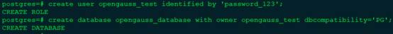
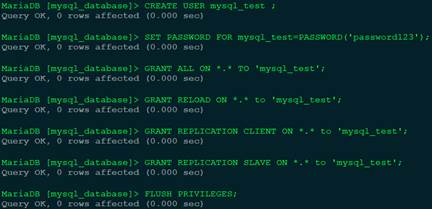
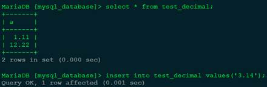
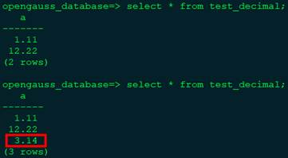

# Using pg_chameleon to Migrate Data from MySQL to openGauss<a name="ZH-CN_TOPIC_0000001251106703"></a>

## Introduction to pg_chameleon<a name="section666916208586"></a>

pg_chameleon is a real-time replication tool compiled in Python 3 for migrating data from MySQL to PostgreSQL. The tool uses the mysql-replication library to extract row images from MySQL. The row images are stored in PostgreSQL in JSONB format.

A **pl/pgsql** function in PostgreSQL is executed to decode row images in JSONB format and replay the changes to PostgreSQL. In addition, the tool uses the read-only mode to pull full data from MySQL to PostgreSQL through initial configuration. In this way, the tool provides the function of copying the initial full data and subsequent incremental data online in real time.

pg_chameleon has the following features:

- Provides online real-time replication by reading the MySQL BinLog.
- Supports reading data from multiple MySQL schemas and restoring the data to the target PostgreSQL database. The source schemas and target schemas can use different names.
- Implements real-time replication through a daemon. The daemon consists of two subprocesses. One is responsible for reading logs from MySQL, and the other is responsible for replaying changes to PostgreSQL.

openGauss is compatible with PostgreSQL communication protocols and most syntaxes. For this reason, you can use pg_chameleon to migrate data from MySQL to openGauss. In addition, the real-time replication capabilities of pg_chameleon greatly reduce the service interruption duration during database switchover.

## pg_chameleon Issues in openGauss<a name="section567512055818"></a>

1.  pg_chameleon depends on the psycopg2 driver, and the psycopg2 driver uses the pg_config tool to check the PostgreSQL version and restricts PostgreSQL of earlier versions from using this driver. The pg_config tool of openGauss returns the version of openGauss \(the current version is openGauss 2.0.0\). As a result, the driver reports a version error " Psycopg requires PostgreSQL client library \(libpq\) \>= 9.1". You need to use psycopg2 through source code compilation and remove related restrictions in the source header file **psycopg/psycopg.h**.
2.  pg_chameleon sets the GUC parameter **LOCK_TIMEOUT** to limit the timeout for waiting for locks in PostgreSQL. openGauss does not support this parameter. \(openGauss supports the GUC parameter **lockwait_timeout**, which needs to be set by the administrator.\) You need to delete related settings from the source code of pg_chameleon.
3.  pg_chameleon uses the syntax of the UPSERT statement to specify the replacement operation when a constraint is violated. The function and syntax of the UPSERT statement supported by openGauss is different from those supported by PostgreSQL. openGauss uses the **ON DUPLICATE KEY UPDATE \{ column_name = \{ expression | DEFAULT \} \} \[, ...\]** syntax, while PostgreSQL uses the **ON CONFLICT \[ conflict_target \] DO UPDATE SET \{ column_name = \{ expression | DEFAULT \} \}** syntax. Therefore, these two databases differ slightly in functions and syntaxes. You need to modify the related UPSERT statement in the source code of pg_chameleon.
4.  pg_chameleon uses the **CREATE SCHEMA IF NOT EXISTS** and **CREATE INDEX IF NOT EXISTS** syntaxes. openGauss does not support the **IF NOT EXISTS** option of schemas and indexes. You need to modify the logic so that the system checks whether the schemas and indexes exist before creating them.
5.  To select the array range, openGauss runs **column_name\[start, end\]**, while PostgreSQL runs **column_name\[start:end\]**. You need to modify the array range selection mode in the source code of pg_chameleon.
6.  pg_chameleon uses the INHERITS function, but openGauss does not support inherited tables. You need to modify the SQL statements and tables that use inherited tables.

Next, use pg_chameleon to migrate data from MySQL to openGauss.

## Configuring pg_chameleon<a name="section14682112005818"></a>

pg_chameleon uses the **config-example.yaml** configuration file in **\~/.pg_chameleon/configuration** to define configurations during migration. The configuration file consists of four parts: **global settings**, **type_override**, **postgres destination connection**, and **sources**. **global settings** is used to set the log file path, log level, and others. **type_override** allows users to customize type conversion rules and overwrite existing default conversion rules. **postgres destination connection** is used to configure the parameters for connecting to openGauss. **sources** is used to define the parameters for connecting to MySQL and other configurable items during replication.

For more details about the configuration items, see the official website:

https://pgchameleon.org/documents\_v2/configuration\_file.html

The following is an example of the configuration file:

```
# global settings
pid_dir: '~/.pg_chameleon/pid/'
log_dir: '~/.pg_chameleon/logs/'
log_dest: file
log_level: info
log_days_keep: 10
rollbar_key: ''
rollbar_env: ''
# type_override allows the user to override the default type conversion
# into a different one.
type_override:
"tinyint(1)":
    override_to: boolean
    override_tables:
    - "*"
# postgres  destination connection
pg_conn:
  host: "1.1.1.1"
  port: "5432"
  user: "opengauss_test"
  password: "password_123"
  database: "opengauss_database"
  charset: "utf8"
sources:
  mysql:
    db_conn:
      host: "1.1.1.1"
      port: "3306"
      user: "mysql_test"
      password: "password123"
      charset: 'utf8'
      connect_timeout: 10
    schema_mappings:
      mysql_database:sch_mysql_database
    limit_tables:
    skip_tables:
    grant_select_to:
      - usr_migration
    lock_timeout: "120s"
    my_server_id: 1
    replica_batch_size: 10000
    replay_max_rows: 10000
    batch_retention: '1 day'
    copy_max_memory: "300M"
    copy_mode: 'file'
    out_dir: /tmp
    sleep_loop: 1
    on_error_replay: continue
    on_error_read: continue
    auto_maintenance: "disabled"
    gtid_enable: false
    type: mysql
keep_existing_schema: No
```

The preceding configuration file indicates that the username and password for connecting to MySQL are **mysql_test** and **password123** respectively during data migration. The IP address and port number of the MySQL server are 1.1.1.1 and 3306, respectively. The source database is **mysql_database**.

The username and password for connecting to openGauss are **opengauss_test** and **password_123**, respectively. The IP address and port number of the openGauss server are 1.1.1.1 and 5432, respectively. The target database is **opengauss_database**. The **sch_mysql_database** schema is created in **opengauss_database**, and all tables to be migrated are in this schema.

Note that the user must have the permission to remotely connect to MySQL and openGauss as well as the read and write permissions on the corresponding databases. For openGauss, the host where pg_chameleon runs must be in the remote access whitelist of openGauss. For MySQL, the user must have the **RELOAD**, **REPLICATION CLIENT**, and **REPLICATION SLAVE** permissions.

The following describes the migration procedure.

## Creating Users and Databases<a name="section13691172075816"></a>

The following shows how to create the users and databases in openGauss required for migration.



The following shows how to create the users in MySQL required for migration and grant related permissions to the users.



## Enabling the Replication Function of MySQL<a name="section20692152017586"></a>

Modify the MySQL configuration file. Generally, the configuration file is **/etc/my.cnf** or the **cnf** configuration file in the **/etc/my.cnf.d**/ folder. Modify the following configurations in the **\[mysqld\]** configuration block \(if the **\[mysqld\]** configuration block does not exist, add it\):

```
[mysqld]
binlog_format= ROW
log_bin = mysql-bin
server_id = 1
binlog_row_image=FULL
 expire_logs_days = 10
```

After the modification, restart MySQL for the configurations to take effect.

## Runing pg_chameleon to Migrate Data<a name="section1669482020583"></a>

1.  Create and activate a virtual Python environment.

    **_<u>python3 -m venv venv</u>_**

    **_<u>source venv/bin/activate</u>_**

2.  Download and install psycopg2 and pg_chameleon.

    Run the **pip install pip --upgrade** command to upgrade pip.

    Add the folder where the pg*config tool of openGauss is located to the *$PATH\_ environment variable. Example:

    **_<u>export PATH=\{openGauss-server\}/dest/bin:$PATH</u>_**

    Download the source code of psycopg2 at https://github.com/psycopg/psycopg2, remove the restriction of checking the PostgreSQL version, and run the **python setup.py install** command to compile the source code and install the tool.

    Download the source code of pg_chameleon at https://github.com/the4thdoctor/pg\_chameleon, solve the preceding issues in openGauss, and run the **python setup.py install** command to compile the source code and install the tool.

3.  Create the configuration file directory of pg_chameleon.

    **_<u>chameleon set_configuration_files</u>_**

4.  Modify the configuration file of pg_chameleon.

    **_<u>cd \~/.pg_chameleon/configuration</u>_**

    **_<u>cp config-example.yml default.yml</u>_**

    Modify the **default.yml** file as required. Modify the connection configuration information, user information, database information, and schema mapping specified by **pg_conn** and **mysql**. An example of the configuration file is provided for reference.

5.  Initialize the replication stream.

    **_<u>chameleon create_replica_schema --config default</u>_**

    **_<u>chameleon add_source --config default --source mysql</u>_**

    In this step, an auxiliary schema and table are created for the replication process in openGauss.

6.  Copy basic data.

    **_<u>chameleon init_replica --config default --source mysql</u>_**

    After this step is complete, the current full data in MySQL is copied to openGauss.

    You can view the replication result in openGauss.

    

7.  Enable online real-time replication.

    **_<u>chameleon start_replica --config default --source mysql</u>_**

    After real-time replication is enabled, insert a data record into MySQL.

    

    View the data in the **test_decimal** table in openGauss.

    

    The newly inserted data record is successfully copied to openGauss.

8.  Disable online replication.

    **_<u>chameleon stop_replica --config default --source mysql</u>_**

    **_<u>chameleon detach_replica --config default --source mysql</u>_**

    **_<u>chameleon drop_replica_schema --config default</u>_**
