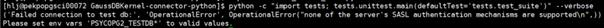

# Using the Python Driver psycopg2 of openGauss<a name="ZH-CN_TOPIC_0000001251226653"></a>

## Introduction to psycopg2<a name="section13310153615369"></a>

psycopg2 is a Python driver of PostgreSQL. It is the only Python driver specified and supported by PostgreSQL and is the most widely used and stable Python driver of PostgreSQL.

## psycopg2 Issues in openGauss<a name="section183128368368"></a>

openGauss is evolved from PostgreSQL XC \(PGXC\) and performs security hardening on native PostgreSQL communication protocols. Therefore, it is incompatible with the default PostgreSQL communication protocols, and by default, the native PostgreSQL that uses psycpog2 cannot connect to GaussDB. An error similar to the following is reported:



## Solution 1: Modifying the GUC Parameter<a name="section23131436133613"></a>

The involved GUC parameter is **password_encryption_type**. By default, PostgreSQL uses MD5 encryption, which is insecure. According to Huawei's security and trustworthiness requirements, openGauss uses SHA256 encryption by default. Therefore, the preceding error is reported. openGauss does not delete MD5 encryption and its verification logic. As such, MD5 encryption can be enabled by modifying the GUC parameter.

Method:

```
gs_guc reload -D $PGDATA -c "password_encryption_type = 1"
```

You must create a user after setting the preceding parameter. Then, you can log in to the database as the user.

## Solution 2: Replacing libpq<a name="section23201436183618"></a>

MD5 encryption is risky. To use a more secure encryption algorithm, you must replace the original libpq of PostgreSQL. To replace libpq, perform the following steps:

1.  Run the **pip install psycopg2-binary** command to install the Python driver of PostgreSQL.
2.  Switch to the installation directory of psycopg2, which is generally **/$PYTHONINSTALL/lib/pythonx.x/site-packages/psycopg2**.
3.  Execute the **ldd ./\_psycopg.cpython-37m-x86_64-linux-gnu.so** file. The file name is for reference only.
4.  Copy libpq and related SO files in the **lib** directory of openGauss to replace the original files of PostgreSQL with the same names.

## Solution 3: Recompiling psycopg2<a name="section16332936173612"></a>

In addition to manually replacing libpq, you can also use the psycopg2 source code to compile a package in the environment with openGauss installed. In this way, the compiled psycopg2 package contains the libpq and its dependency files of openGauss. **Note**:

1.  If PostgreSQL is installed in the environment, ensure that the path of the openGauss library file has a higher priority. Specifically, the path is placed in the front part of _LD_LIBRARY_PATH_.
2.  The **libpq.so** file has many dependency files which contain some algorithm libraries. These files must be released together with the **libpq.so** file. You can run the **ldd** command to view the dependency file list.

## Compilation method:<a name="section733816362366"></a>

1.  Install openGauss in the environment and configure environment variables.
2.  Download the psycopg2 source code and switch to the root directory of the source code.
3.  Run the **python setup.py build** command.
4.  In this case, an error is reported, indicating that the version does not match. Then, modify the version in the corresponding position in the **setup.py** file to shield the error. You can also run the **sed -i "s/\(pgmajor, pgminor, pgpatch\)/\(9, 2, 4\)/g" setup.py** command to replace the version \(in about line 440 in the file\).
5.  Perform step 3 again.
6.  After the compilation is complete, the **build** subdirectory is generated in the root directory and it contains the compiled package.
