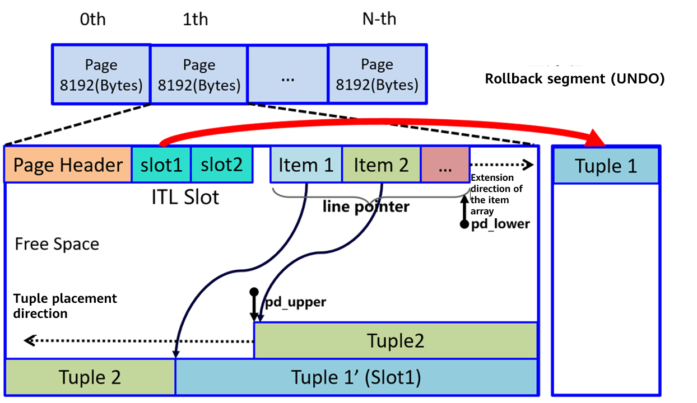
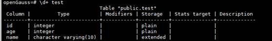
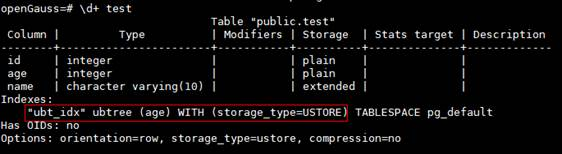

# Ustore, Rebuilding the "Soul" of openGauss Data Storage<a name="ZH-CN_TOPIC_0000001206306730"></a>

On August 20, 2021, HUAWEI CLOUD GaussDB \(for openGauss\) officially launched a new kernel feature, Ustore, a storage engine that provides high-performance database services for enterprise-level users and further injects energy into enterprise digital transformation. The openGauss community will also release this feature soon to explore the cutting-edge theories and best practices of databases with many database kernel developers.

The Ustore storage engine, also called in-place update storage engine, is a new storage mode added to the openGauss Kernel. The row storage engine used by the earlier openGauss Kernel versions is in append update mode. The append update mode has good performance in addition, deletion, and HOT \(Heap Only Tuple\) update \(that is, update on the same page\) in the service. However, in a non-HOT UPDATE scenario across data pages, garbage collection is not efficient. Ustore can solve this problem.

## **Ustore Design Principles**<a name="section8564747173619"></a>

Ustore stores valid data of the latest version and junk data of historical versions separately. The valid data of the latest version is stored on the data page, and an independent UNDO space is created for managing the junk data of historical versions in a unified manner. Therefore, the data space does not expand due to frequent updates, and the junk data is recycled more efficiently. Ustore adopts the NUMA-aware UNDO subsystem design, which enables the UNDO subsystem to be effectively expanded on a multi-core platform. In addition, Ustore adopts the multi-version index technology to clear indexes and improve the efficiency of recycling and reusing storage space.

Ustore works with the UNDO space to implement more efficient and comprehensive flashback query and recycle bin mechanisms, quickly rolls back misoperations, and provides rich enterprise-level functions for openGauss.



Ustore data storage: The latest data is stored on the original page, and the old data is managed in the UNDO space.

## **Core Advantages of Ustore**<a name="section106082633719"></a>

**High performance**: For services with different loads, such as insertion, update, and deletion, the performance and resource usage are relatively balanced. The in-place update mode is used for update operations. In frequent update scenarios, the performance is higher and more stable. It is suitable for typical OLTP service scenarios that require short transactions, frequent updates, and high performance.

**Efficient storage**:In-place update is supported to the maximum extent, greatly saving space. The rollback segment and data pages are stored separately to ensure more efficient and stable I/O usage. The UNDO subsystem uses the NUMA-aware design and features better multi-core scalability. The UNDO space is allocated and recycled in a unified manner, which improves reuse efficiency and ensures more efficient and stable storage space usage.

**Fine-grained resource control**: Ustore provides multi-dimensional transaction monitoring. It can monitor transaction running based on the transaction running duration, size of UNDO space used by a single transaction, and overall UNDO space limitation to prevent abnormal and unexpected behaviors. This helps the database administrator to regulate and restrict the use of database system resources.

Ustore provides stable performance in scenarios where data is frequently updated, enabling service systems to run more stably and adapt to more service scenarios and workloads, especially core financial service scenarios that have higher requirements on performance and stability.

In the future, openGauss will use the AI autonomy technology to optimize Ustore to be more intelligent, secure, and efficient, providing customers with more advanced and high-quality database services.

## **Ustore Usage Guide**<a name="section11325125319387"></a>

- **Introduction**

  Ustore coexists with the original append update \(Astore\) storage engine. Ustore shields the implementation details of the storage layer. The SQL syntax is basically the same as that of the original Astore storage engine. The only difference lies in table creation and index creation.

- **Table Creation Methods**

  Ustore contains UNDO logs. Before creating a table for Ustore, you need to set **undo_zone_count** in the **postgresql.conf** file. This parameter indicates the number of UNDO logs. The recommended value is **16384**, that is, **undo_zone_count=16384**. After the configuration is complete, restart the database.

  \[postgresql.conf configuration\]

  ```
  undo_zone_count=16384
  ```

  Method 1: Specify the storage engine type when creating a table.

  ```
  create table test(id int, name varchar(10)) with (storage_type=ustore);
  ```

  Method 2: Specify Ustore by configuring GUC parameters.

  - Step 1: Before starting a database, set **enable_default_ustore_table** to **on** in **postgresql.conf** to specify that Ustore is used when a user creates a table by default.

    \[postgresql.conf configuration\]

    ```
    enable_default_ustore_table=on
    ```

  - Step 2: Create a table.

    ```
    create table test(id int, name varchar(10));
    ```

- **Index Creation Methods**

  UBtree is developed for Ustore and is the only index type supported by Ustore.

  Assume that the **test** table structure is as follows and a UBtree index is to be added to the **age** column of the **test** table.

  

  Method 1: If the index type is not specified, a UBtree index is created by default.

  ```
  create index ubt_idx on test(age);
  ```

  

  Method 2: When creating an index, use the **using** keyword to set the index type to **ubtree**.

  ```
  create index ubt_idx on test using ubtree(age);
  ```

  
