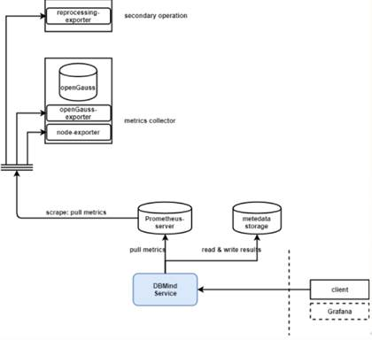
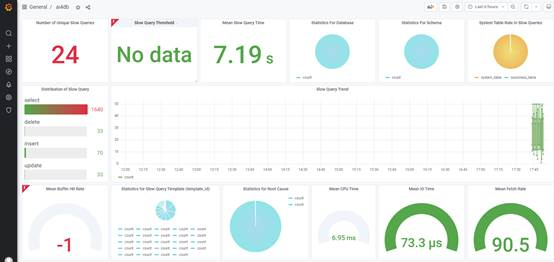

# openGauss AI Capability Upgrade, Building a New AI-Native Database

What will happen when databases are combined with AI? The answers may vary among different database vendors, open-source communities, and teachers and students. Although it is difficult to form a uniform accurate concept, their answers all point to the same direction. Since the first version was released in the open-source community, openGauss has continuously evolved and contributed code in this field. openGauss 3.0.0 continues in this vein.

In this release, the openGauss AI capability is changed in the following ways:

1.  The AI4DB functions are integrated into the open-source openGauss database autonomous platform.
2.  The AI4DB capabilities are refactored to run plug-ins as services.
3.  The Prometheus ecosystem is supported.
4.  New features such as slow SQL root cause analysis and time series forecast are added to optimize the existing AI capabilities.
5.  DB4AI supports more algorithms.

## **Upgrading the Native DB4AI Engine**

In this release of openGauss, the native DB4AI engine further supports more machine learning algorithms, such as the non-linear kernel function of SVM and XGBoost. In addition, openGauss provides the Explain API to view model information.

## **Supporting AI4DB Plug-ins as Services**

The original openGauss AI4DB capability is an offline tool. It cannot monitor the database completely in the background or periodically detect database problems. Therefore, in this release, the openGauss implements the background monitoring service and periodically checks the database system status in the background. In this way, the autonomous database platform DBMind is formed. The diagnosis results are saved in offline calculation mode. Users can use software such as Grafana to visualize the results so that problems can be detected and root causes can be obtained in a timely manner.

The running status of the openGauss database system needs to be periodically monitored in the background. Therefore, you need to connect to the monitoring platform to collect database monitoring metrics and perform offline computation. In this release, openGauss provides two types of exporters to interconnect with the Prometheus platform. The architecture is as follows:

openGauss-exporter is used to obtain monitoring metrics of the database system, and reprocessing-exporter is used to perform secondary processing on data stored in Prometheus. The data of the preceding two exporters can be periodically collected by Prometheus. The DBMind system periodically obtains time series data from Prometheus and performs parallel computing on the DBMind deployment machine. After the computing is complete, the computing result is stored in the meta-database. Then, you may obtain the diagnosis result from the metabase, and further, may perform visualization by configuring Grafana or the like.

The preceding figure shows an example of visualization using Grafana based on data in the meta-database.

In this release, openGauss fully integrates the existing AI capabilities and redesigns them in plug-ins. For example, if you want to call the parameter tuning function to debug database parameters based on reinforcement learning, run the following command:

gs_dbmind component xtuner tune ...

That is, the **gs_dbmind** command is used to call all AI functions, and the **component** subcommand is used to call a specific AI function. You can run the following command to view the help information:

gs_dbmind component --help

Based on the preceding design, if developers in the openGauss community want to contribute a certain database AI function, they only need to ensure that the API can be obtained by gs_dbmind. In addition, the developed plug-ins can call all APIs provided by DBMind, for example, the data access interface \(DAI\) for obtaining data from Prometheus and the database access object \(DAO\) API for inserting data into the meta-database.

## **Comprehensively Improving the AI4DB AI Capabilities**

In this release, the openGauss upgrades the existing functions such as index recommendation and time series forecast. In addition, it provides root cause analysis and recommendation for slow SQL statements to help DBAs quickly identify slow SQL statements. Based on the monitored database running metrics, it uses the AI feature library identification algorithm to innovatively provide the causes and confidence of slow SQL statements, and provides optimization suggestions.

## **Laying a Foundation for the Development of a Comprehensive Database AI Autonomous Platform**

As mentioned above, openGauss 3.0.0 innovatively integrates historical AI capabilities and discards the burden left over from the historical R&D process, the innovative DBMind platform is service-oriented, offline, plug-in-based, and freely assembled. It is released with the database installation package. You can use tools such as Grafana to customize and visualize the diagnosis result. \(We will provide a Grafana example.\)

This lays a foundation for us to further upgrade the DBMind platform in the future. It is estimated that openGauss will enrich more AI functions to the platform this year, separate the platform from the existing code repository, and provide a native web front-end and back-end display platform. In addition, the automatic recovery function is supported, enabling users to experience one-click and out-of-the-box database autonomous driving.
