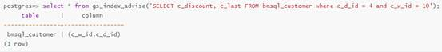
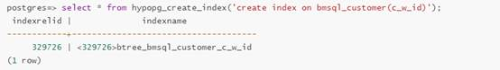
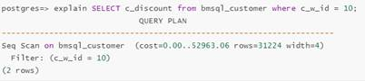
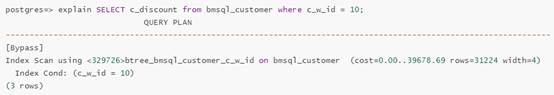
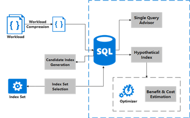
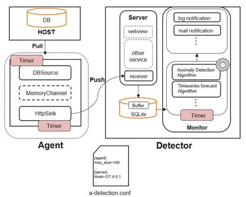

# openGauss AI4DB and DB4AI

The AI feature is one of the key features of openGauss. In the earlier versions, openGauss provided the open-source AI parameter self-tuning and slow SQL discovery functions, which attracted attention from developers and users. To further improve AI capabilities, new functions are added to the latest openGauss based on the AI4DB and DB4AI features.

The AI4DB feature enables openGauss through AI technologies, simplifies database operation and management, and provides users with end-to-end self-O&M and self-optimization suites. In the new version, the **database intelligent index recommendation** and **database monitoring and exception detection** functions are added. The DB4AI feature provides the AI computing capability in the database. The built-in AI algorithm of the database provides users with inclusive AI capabilities. In the new version, the **machine learning algorithm framework DeepSQL** in the database is added. The following describes the foregoing new functions in detail.

## 1. AI4DB

- **Intelligent Database Index Recommendation**

  In a large-scale relational database, index design and optimization are critical to the execution efficiency of SQL statements. For a long time, database administrators often manually design and adjust indexes based on previous knowledge and experience. This consumes a lot of time and manpower, and manual design cannot ensure the optimal index.

  openGauss provides the intelligent index recommendation function. This function automates and standardizes the index design process and recommends the optimal index for a single query statement or workload, improving job efficiency and reducing O&M operations of database management personnel. The intelligent index recommendation function of the openGauss covers multiple application scenarios and includes the following features:

- 1. Index recommendation for a single query statement

  This feature generates recommended indexes for a single query statement entered by a user based on the semantic information of the query statement and database statistics.

  You can use the **gs_index_advise** system function of openGauss to recommend single-column and combined indexes. A specific example is as follows. The recommendation result of the index includes the corresponding table name and column name.

  

- 2. Virtual index

  This feature can simulate the creation of real indexes and avoid the time and space overhead required for creating real indexes. You can use the optimizer to evaluate the impact of virtual indexes on specified query statements.

  This feature provides a series of operations, including creating and deleting virtual indexes, and evaluating performance and storage space overhead. You can use the openGauss system functions to flexibly operate virtual indexes. Examples of some operations are as follows:

  - Use the **hypopg_create_index** system function to create a virtual index. The input parameter is the SQL statement for creating the index.

    

  - By executing EXPLAIN for a specific query statement, you can evaluate the index performance based on the execution plan provided by the optimizer.

    The execution plan before the virtual index is created is as follows:

    

    After the virtual index is created, the execution plan is changed as follows:

    

    By comparing the two execution plans, you can find that the index will reduce the execution time of the specified query statement. Based on this conclusion, you can create a real index.

- 3. Workload-based index recommendation

  With the workload consisting of multiple DML statements as the input, the algorithm can recommend a batch of indexes to be created. These indexes can be used to optimize the overall workload. The following figure shows the process of the algorithm.

  

  Based on the preceding two features, this feature compresses the workload, filters out a batch of typical SQL statements, and generates candidate indexes for each SQL statement using the index recommendation function of a single query statement. Finally, further filtering is performed by using the virtual index function, and the index that has the largest positive contribution to the workload is used as the output.

  **Database Metric Monitoring and Exception Detection**

  Database metrics can reflect the health status of the database. Abnormal user operations or database performance deterioration may cause changes in database metrics. Therefore, it is necessary to monitor database metrics. The benefits are as follows:

  （1） This helps you understand the running status of the database from multiple perspectives and better plan the database.

  （2） This helps users detect database exceptions and potential performance problems in advance and report the situation to users in a timely manner to avoid unnecessary loss.

  Anomaly-detection is an AI tool integrated into openGauss. It can be used to collect and predict database metrics, as well as monitor and diagnose exceptions.

  The following figure shows the anomaly-detection structure.

  

  This tool consists of an agent and a detector. Agent is a data collection module that collects database metric data and pushes the data to the detector. Detector is an exception detection module. It has three functions: 1. Collect data pushed by the agent and store the data locally. 2. Perform exception detection on the collected metric data. 3. Push exception information to users.

  Currently, the database indicators collected by the tool by default include IO_Read, IO_Write, CPU_Usage, Memory_Usage, and disk space occupied by the database. Based on the collected data, the tool predicts the change trend of indicators and detects exceptions to implement functions such as insufficient disk space warning, memory leakage warning, and CPU resource consumption warning, preventing unnecessary loss caused by database exceptions.

  Anomaly-detection provides functions such as one-click deployment, one-click startup or shutdown, and metric prediction, which is easy to use. In addition, you can quickly add new monitoring parameters or time series prediction algorithms based on service scenario requirements.

## 2. DB4AI

The database management system can add, delete, modify, and query data records conveniently by constructing an ordered file organization structure. In the AI field, people use the computing power provided by computers to analyze and mine data. Data storage and computing are the key to data governance.

In traditional scenarios, when a data user wants to analyze and train data stored in a database, the data user usually needs to extract the data from the storage system, cache the data to the memory, and then use a third-party package of Python, such as TensorFlow and scikit-learn, to perform data analysis or model training. This development process is not efficient. First, this process involves the Python language, third-party machine learning packages, and databases. The developed technology stack is fragmented. Second, performance of the process is not excellent. Data of a training model usually needs to be transmitted by using a network. When the data volume is large, a relatively large quantity of network transmission overheads are caused, and data localization calculation is not implemented. In addition, the technical standards of developers are often uneven, which cannot fully exploit the computing power of the CPU or GPU. In some data-sensitive fields, data extraction requires operations such as permission obtaining and anonymization, which further increases costs. Therefore, the AI computing capability is integrated into the database, and the computing power of the database is very advantageous. On one hand, data can be calculated locally. On the other hand, the optimization capability of the database can be used to select the optimal execution plan. Finally, you only need one SQL statement to implement faster model training and prediction than implementing algorithms by yourself.

DeepSQL is compatible with the Apache MADlib ecosystem and supports more than 60 common algorithms, including regression algorithms \(such as linear regression, logistic regression, and random forest\), classification algorithms \(such as KNN\), and clustering algorithms \(such as K-means\). In addition to basic machine learning algorithms, graph-related algorithms are also included, such as algorithms about the shortest path and graph diameter. Also, it supports data processing methods \(such as PCA\), sparse vector data format, common statistical algorithms \(such as covariance and Pearson coefficient calculation\), training set and test set segmentation, and cross validation.

In addition to the preceding algorithms obtained through compatibility with MADLib, DeepSQL also supports three common algorithms: prophet, GBDT, and XGBoost.

The time series prediction algorithm prophet is implemented based on time series data decomposition and local Bayesian. It is an open-source algorithm provided by Facebook and is a practical time series prediction algorithm in engineering scenarios. Compared with other time series prediction algorithms, prophet is faster, more accurate, and more robust, the computation workload is much less than that of the RNN.

GBDT and XGBoost belong to the Boosting algorithm that uses the regression tree to fit residuals.

The GBDT algorithm uses the tree module in the MADlib framework to complete the algorithm. It inherits the style of the MADlib function API and uses input parameters to set the hyperparameters of the model. The algorithm supports regression and classification tasks. By default, the model is a regression model. Mean squared error \(MSE\) is used to calculate the residual of the previous base learner in each iteration. For the regression tree computation, the branching strategy is selected by minimizing the square error of each node.

After the XGBoost algorithm is integrated, the gs_boost module is implemented to provide SQL-like APIs which are compatible with the MADlib style and support classification and regression tasks. The gs_xgboost module supports model hyperparameter selection and model evaluation through grid search.

These are the latest open-source AI features of openGauss. Come and experience these features. If you have any comments or suggestions, feel free to contact us in the open source community. We'd love to hear your thoughts, and we will take this as the direction and motivation for improvement. We believe that with the joint efforts of developers and users, the convergence of openGauss and AI will be continuously strengthened to bring more intelligent and excellent services to users.
