# openGauss Database Performance Optimization<a name="ZH-CN_TOPIC_0000001251106701"></a>

## Overview<a name="section12148114712205"></a>

This document describes the key system-level optimization configurations required by the openGauss database to achieve optimal database performance on the openEuler OS based on the TaiShan server.

## Hardware Specifications<a name="section98505017212"></a>

CPU: Kunpeng 920 \(Hi1620\) ARM AArch64 \(64 cores\) x 2

Memory: ≥ 512 GB

Disk: NVMe SSD \(\> 1 TB\) x 4

NIC: 1822 10GE NICEthernet controller: Huawei Technologies Co., Ltd. Hi1822 Family \(4\*25GE\) \(rev 45\)

## Software Specifications<a name="section5762385211"></a>

OS: openEuler 20.03 \(LTS\)

Database: openGauss 1.0.0

Benchmark: benchmarksql-5.0

JDK: jdk1.8.0_212

Ant: apache-ant-1.9.15

The following optimizes the database by configuring BIOS, operating system, file system, network, core binding, and constructing TPCC test data. - Third-party tool: JDK ant benchmark- Linux tool: htop iostat

For details about how to install and use the benchmark htop iostat tool, see _Benchmark Usage_. \(https://opengauss.org/zh/blogs/blogs.html?post/optimize/opengauss-tpcc/\)

## BIOS Settings<a name="section537616277214"></a>

Log in to a server management system, restart a server, enter the BIOS screen, modify BIOS settings, and restart the server. \(The server management system depends on the actual situation.\)

- 1. After the machine self-check, startup options are displayed.

  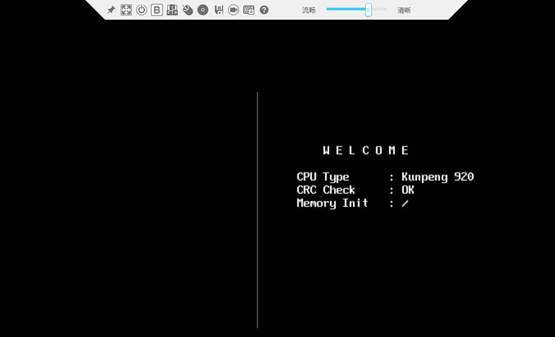

- 2. Press **Del** to enter the BIOS screen.

  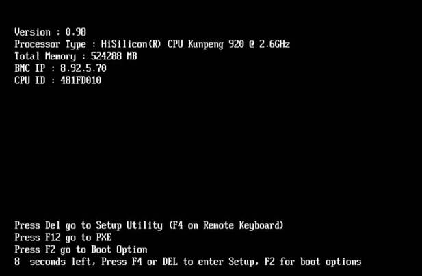

- 3. Enter the BIOS password.

  

- 4. Restore to factory settings.

  Press **F9** to restore to the factory settings. It is recommended that you restore to the factory settings first because many default BIOS settings may have been changed.

- **5. **Modify BIOS settings.

  The modification includes:

  ```
  # Choose BIOS > Advanced > MISC Config and set Support Smmu to Disabled.
  # Choose BIOS > Advanced > MISC Config and set CPU Prefetching Configuration to Disabled.
  # Choose BIOS > Advanced > Memory Config and set Die Interleaving to Disable.
  ```

  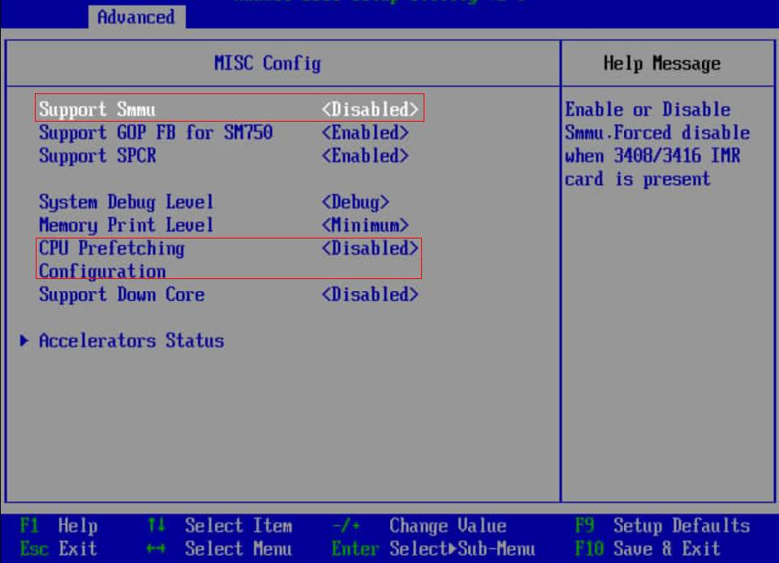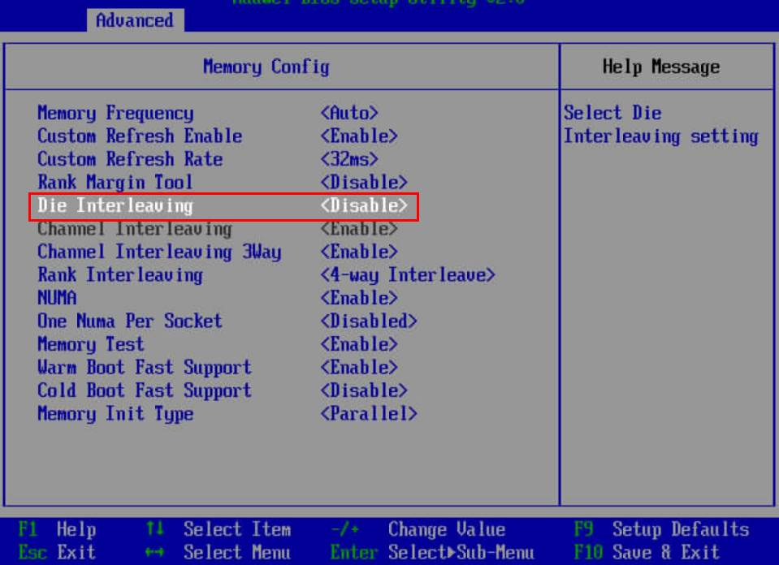

- **6. **Save the BIOS settings and restart the server.

  Press **F10** to save the settings and exit. Restart the system.

  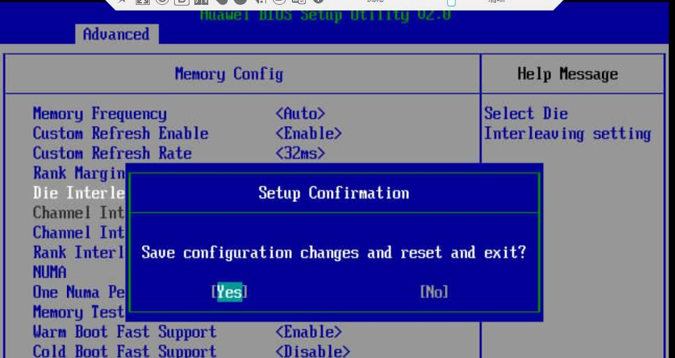

## OS Configuration<a name="section13600125221711"></a>

- Optimizing OS Configuration

  **irqbalance** disabled: If a GaussDB process and a client preempt CPU resources, the CPU usage is unbalanced. If the htop shows that some CPUs are overloaded and some are idle, check whether **irqbalance** is disabled.

  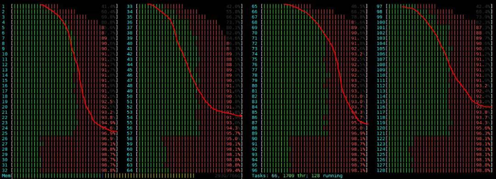

  ```
  service irqbalance stop
  echo 0 > /proc/sys/kernel/numa_balancing
  echo 'never' > /sys/kernel/mm/transparent_hugepage/enabled
  echo 'never' > /sys/kernel/mm/transparent_hugepage/defrag
  echo none > /sys/block/nvme*n*/queue/scheduler  ## Setting the I/O queue scheduling mechanism for NVMe drives
  ```

## File System Configuration<a name="section4266658181817"></a>

- Change the block size of the XFS file system to 8 KB.

  \(1\) Check the existing block sizes of the mount points corresponding to the NVMe drives. Run the following command to check the NVMe drives that are mounted:

  ```
  df -h | grep nvme
  /dev/nvme0n1      3.7T  2.6T  1.2T  69% /data1
  /dev/nvme1n1      3.7T  1.9T  1.8T  51% /data2
  /dev/nvme2n1      3.7T  2.2T  1.6T  59% /data3
  /dev/nvme3n1      3.7T  1.4T  2.3T  39% /data4
  ```

  You can run the **xfs_info** command to view information about the NVMe drives.

  xfs_info /data1

  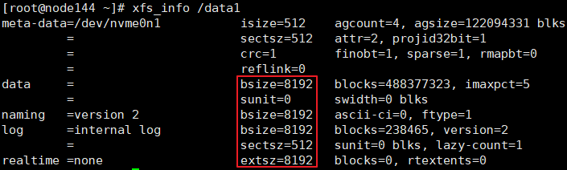

  In the preceding figure, the block size is 8 KB and does not need to be changed. If the data block size is not 8 KB, back up and format the data.

  \(2\) Back up the data on the disk to be formatted.

  Back up the required data to other disks or machines as required.

  \(3\) Format the disk and set the block size to 8 KB.

  Take the **/dev/nvme0n1** disk and the **/data1** mount point as an example. The commands are as follows:

  ```
  umount /data1
  mkfs.xfs -b size=8192 /dev/nvme0n1 -f
  mount /dev/nvme0n1 /data1
  ```

  \(4\) Run the **xfs_info** command again to check whether the block size is set correctly.

## Network Configuration<a name="section78151566198"></a>

- **1. **Multi-Queue Interrupt Settings

  As TaiShan servers have a large number of cores, NIC multi-queues need to be configured on servers and clients. The recommended configuration is as follows: 16 interrupt queues are configured for NICs on servers, and 48 interrupt queues are configured for NICs on clients.

  Multi-queue Interrupt Setting Tool \(1822-FW\)

  You can obtain the released Hi1822 NIC version from the following link: https://support.huawei.com/enterprise/en/intelligent-accelerator-components/in500-solution-pid-23507369/software. IN500 solution 5.1.0.SPC401 and later versions support multi-queues.

  - \(1\) Decompress **Hi1822-NIC-FW.zip**, go to the directory, and install hinicadm as user **root**.

    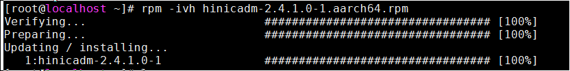

  - \(2\) Determine the NIC to which the currently connected physical port belongs. The network port and NIC name vary according to the hardware platform. In the following example, the private network port enp3s0 is used and belongs to the hinic0 NIC.

    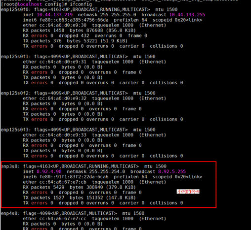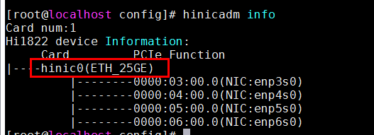

  - \(3\) Go to the **config** directory and use the hinicconfig tool to configure the interrupt queue firmware configuration file.

    64-queue configuration file: std_sh_4x25ge_dpdk_cfg_template0.ini;

    16-queue configuration file: std_sh_4x25ge_nic_cfg_template0.ini;

    Set the number of queues for hinic0 to different values. \(The default value is **16** and it can be changed as needed.\)

    ./hinicconfig hinic0 -f std_sh_4x25ge_dpdk_cfg_template0.ini

    Restart the OS for the modification to take effect. Run the **ethtool -l enp3s0** command to view the result. In the following figure, 32 is displayed.

    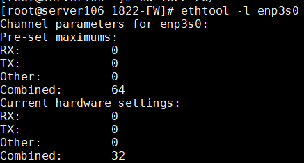

    Run the **ethtool -L enp3s0 combined 48** command to change the value of **combined**. \(The optimized value varies according to the platform and application. For the 128-core platform, the optimized value on the server is **16** and that on the client is **48**.\)

- **2. **Interrupt Tuning

  When the openGauss database is fully loaded \(the CPU usage is greater than 90%\), the CPU becomes the bottleneck. In this case, offload network slices to NICs.

  ```
  ethtool –K enp3s0 tso on
  ethtool –K enp3s0 lro on
  ethtool –K enp3s0 gro on
  ethtool –K enp3s0 gso on
  ```

  Take the 1620 platform as an example. The NIC interrupts are bound to the last four cores on each NUMA node, and each core is bound to three interrupts. The core binding interrupt script is as follows. This script is called by gs_preinstall during the openGauss installation. For details, see the product installation guide.

  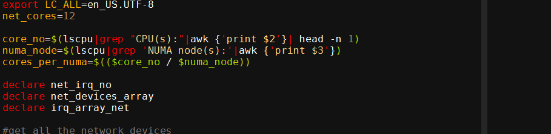

  ```
  sh bind_net_irq.sh  16
  ```

- **3. **Confirming and Updating the NIC Firmware

  Check whether the firmware version of the private NIC in the current environment is 2.5.0.0.

  ```
  ethtool -i enp3s0
  driver: hinic
  version: 2.3.2.11
  firmware-version: 2.5.0.0
  expansion-rom-version:
  bus-info: 0000:03:00.0
  ```

  If the version is 2.5.0.0, you are advised to replace it with 2.4.1.0 for better performance.

  NIC Firmware Update Procedure

  \(1\) Upload the NIC firmware driver to the server. The firmware file is **Hi1822_nic_prd_1h_4x25G.bin**.

  \(2\) Run the following command as user **root**:

  **hinicadm updatefw -i **_<Physical NIC device name\>_** -f **_<Firmware file path\>_

  _Physical NIC device name_ indicates the NIC name in the system. For example, **hinic0** indicates the first NIC, and **hinic1** indicates the second NIC. For details about how to query the NIC name, see "Multi-Queue Interrupt Settings." For example:

  ```
  # hinicadm updatefw -i <Physical NIC device name> -f <Firmware file path>
  Please do not remove driver or network device
  Loading...
  [>>>>>>>>>>>>>>>>>>>>>>>>>>>>>>>>>>>>>>>>>>>>>>>>>>]  [100%] [\]
  Loading firmware image succeed.
  Please reboot OS to take firmware effect.
  ```

  \(3\) Restart the server and check that whether the firmware version of the private NIC is updated to 2.4.1.0.

  ```
  ethtool -i enp3s0
  driver: hinic
  version: 2.3.2.11
  firmware-version: 2.4.1.0
  expansion-rom-version:
  bus-info: 0000:03:00.0
  ```

  The firmware version of the private NIC is successfully updated.

## Core Binding on the Database Server and Client<a name="section277452415552"></a>

Install the database by referring to the openGauss installation document.

The general procedure is as follows:

◾ Stop a database.

◾ Modify **postgresql.conf** parameters.

◾ Start the database in core binding mode by running the **numactl --interleave=all bin/gaussdb -D $\{DATA_DIR\} --single_node** command.

◾ Start the benchmark in core binding mode by running the **numactl -C 0-19,32-51,64-83,96-115 ./runBenchmark.sh props.pg** command.

Run the preceding command based on the core binding configuration and benchmark configuration file. Cores bound to the benchmark are different from cores bound to the database.

- **1. **Core Binding Settings on the Server

  \(1\) During the running of service processes, the network interruption reported by the hardware causes frequent context switching, which severely affects the efficiency. Therefore, the network interruption and services must be bound to different cores. For details about the core binding for network interruption, see the previous section.

  \(2\) The thread pool mechanism is introduced in openGauss. When the database is started, the thread pool creates a specified number of threads to provide services. When a thread is created, it is bound to a core. Therefore, the core binding information of the NIC needs to be transferred through the GUC parameter, to facilitate core binding configuration during system running. The following figure shows the parameters when 128 cores are used.

  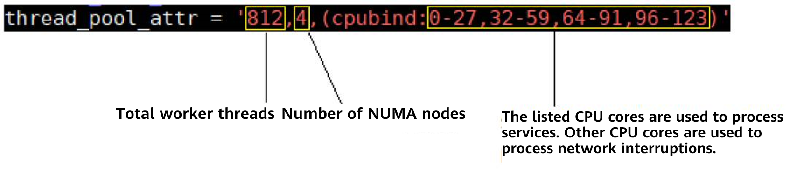

  Total number of threads = \(Number of CPUs – Number of CPUs processing the network\) x Number of threads per core \(7.25 is recommended\) = \(128 – 16\) x 7.25 = 812. The number of NUMA nodes is 4, and the number of cores for processing interrupts is 16.

  The following is an example of CPU binding for auxiliary allocation:

  ```
  numactl -C 0-27,32-59,64-91,96-123 gaussdb --single_node -D {DATA_DIR} -p {PORT} &
  ```

  Or

  ```
  numactl --interleave=all gaussdb --single_node -D {DATA_DIR} -p {PORT} &
  ```

- **2. **Server Parameter Setting

  The **- advance_xlog_file_num = 10** parameter is added to the **postgresql.conf** file.

  This parameter indicates that the background thread BackgroundWALWriter periodically checks and initializes the next 10 XLogs in advance to avoid initializing XLogs only when transactions are committed, reducing the transaction commit delay. This parameter is valid only in the performance pressure test. Generally, you do not need to set this parameter. The default value is **0**, indicating that no initialization is performed in advance. - numa_distribute_mode = 'all'

  This parameter can be set to **all** or **none**. The value **all** indicates that NUMA optimization is enabled. Working threads and corresponding PGPROC and WALInsertlock are grouped and bound to corresponding NUMA nodes to reduce CPU remote memory access on key paths. The default value is **none**, indicating that the NUMA distribution feature is disabled. It is used only when multiple NUMA nodes are involved and the cost of remote fetch is obviously higher than that of local fetch. You are advised to enable this function during performance pressure tests.

  **thread_pool_attr** configuration:

  thread_pool_attr = '812,4,\(cpubind: 0-27,32-59,64-91,96-123\)'

  Parameter description:

  ```
  max_connections = 4096
  allow_concurrent_tuple_update = true
  audit_enabled = off
  checkpoint_segments = 1024
  checkpoint_timeout = 15min
  cstore_buffers = 16MB
  enable_alarm = off
  enable_codegen = false
  enable_data_replicate = off
  full_page_writes = on
  max_files_per_process = 100000
  max_prepared_transactions = 2048
  shared_buffers = 350GB
  use_workload_manager = off
  wal_buffers = 1GB
  work_mem = 1MB
  log_min_messages = FATAL
  transaction_isolation = 'read committed'
  default_transaction_isolation = 'read committed'
  synchronous_commit = on
  fsync = on
  maintenance_work_mem = 2GB
  vacuum_cost_limit = 2000
  autovacuum = on
  autovacuum_mode = vacuum
  autovacuum_max_workers = 5
  autovacuum_naptime = 20s
  autovacuum_vacuum_cost_delay = 10
  xloginsert_locks = 48
  update_lockwait_timeout = 20min

  enable_mergejoin = off
  enable_nestloop = off
  enable_hashjoin = off
  enable_bitmapscan = on
  enable_material = off

  wal_log_hints = off
  log_duration = off
  checkpoint_timeout = 15min
  autovacuum_vacuum_scale_factor = 0.1
  autovacuum_analyze_scale_factor = 0.02
  enable_save_datachanged_timestamp = false

  log_timezone = 'PRC'
  timezone = 'PRC'
  lc_messages = 'C'
  lc_monetary = 'C'
  lc_numeric = 'C'
  lc_time = 'C'

  enable_thread_pool = on
  thread_pool_attr = '812,4,(cpubind:0-27,32-59,64-91,96-123)'
  enable_double_write = off
  enable_incremental_checkpoint = on
  enable_opfusion = on
  advance_xlog_file_num = 10
  numa_distribute_mode = 'all'

  track_activities = off
  enable_instr_track_wait = off
  enable_instr_rt_percentile = off
  track_counts = on
  track_sql_count = off
  enable_instr_cpu_timer = off

  plog_merge_age = 0
  session_timeout = 0

  enable_instance_metric_persistent = off
  enable_logical_io_statistics = off
  enable_page_lsn_check = off
  enable_user_metric_persistent = off
  enable_xlog_prune = off

  enable_resource_track = off
  instr_unique_sql_count=0
  enable_beta_opfusion=on
  enable_beta_nestloop_fusion=on
  ```

- **3. **Configuring Core Binding for the TPC-C Client

  The client uses numactl to bind the client to cores except the NIC. The following figure uses a 128-core environment as an example. A total of 80 cores are used to process service logic, and the remaining 48 cores are used to process network interruption.

  

  The corresponding tpmC program is as follows:

  ```
  numactl -C 0-19,32-51,64-83,96-115 ./runBenchmark.sh props.pg
  ```

  Other cores are used to process network interruptions.

## Constructing TPC-C Initial Data<a name="section14299528105719"></a>

- **1. **Modify benchmark configurations.

  Copy **props.pg** and rename it **props.opengauss.1000w**. Edit the file and replace the following configuration in the file:

  ```
  cp props.pg props.opengauss.1000w
  vim props.opengauss.1000w
  db=postgres
  driver=org.postgresql.Driver
  // Modify the connection string, including the IP address, port number, and database.
  conn=jdbc:postgresql://ip:port/tpcc1000?prepareThreshold=1&batchMode=on&fetchsize=10
  // Set the user name and password for logging in to the database.
  user=user
  password=******

  warehouses=1000
  loadWorkers=200

  // Set the maximum number of concurrent tasks, which is the same as the maximum number of work tasks on the server.
  terminals=812
  //To run specified transactions per terminal- runMins must equal zero
  runTxnsPerTerminal=0
  //To run for specified minutes- runTxnsPerTerminal must equal zero
  runMins=5
  //Number of total transactions per minute
  limitTxnsPerMin=0

  //Set to true to run in 4.x compatible mode. Set to false to use the
  //entire configured database evenly.
  terminalWarehouseFixed=false

  //The following five values must add up to 100
  //The default percentages of 45, 43, 4, 4 & 4 match the TPC-C spec
  newOrderWeight=45
  paymentWeight=43
  orderStatusWeight=4
  deliveryWeight=4
  stockLevelWeight=4

  // Directory name to create for collecting detailed result data.
  // Comment this out to suppress.
  resultDirectory=my_result_%tY-%tm-%td_%tH%tM%tS
  osCollectorScript=./misc/os_collector_linux.py
  osCollectorInterval=1
  // Collect OS load information.
  //osCollectorSSHAddr=osuer@10.44.133.78
  //osCollectorDevices=net_enp3s0 blk_nvme0n1 blk_nvme1n1 blk_nvme2n1 blk_nvme3n1
  ```

- **2. **Prepare for importing TPC-C data.

  \(1\) Replace the **tableCreats.sql** file.

  Download the **tableCreates.sql** file \(at https://blog.opengauss.org/zh/post/optimize/images/tableCreates.sql\). Use this file to replace the corresponding file in **benchmarksql-5.0/run/sql.common/** of the benchmark SQL.

  The file is modified as follows:

  ◾ Two tablespaces are added.

  ```
  CREATE TABLESPACE example2 relative location 'tablespace2';
  CREATE TABLESPACE example3 relative location 'tablespace3';
  ```

  ◾ The **bmsql_hist_id_seq** sequence is deleted.

  ◾ The FACTOR attribute is added to each table.

  ```
  create table bmsql_stock (
    s_w_id       integer       not null,
    .....
    s_dist_10    char(24)
  ) WITH (FILLFACTOR=80) tablespace example3;
  ```

  \(2\) Modify the **indexCreates.sql** file.

  Modify the **run/sql.common/indexCreates.sql** file.

  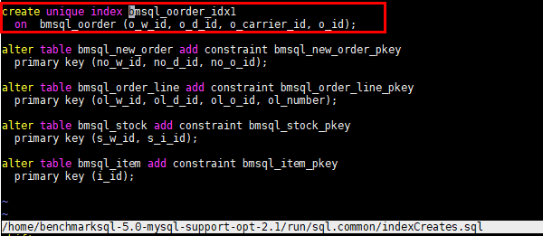

  Modify the content in the red box in the preceding figure as follows:

  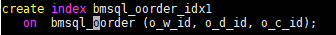

  Add the content in red in the following figure to the file so that the data can be automatically generated in different data tablespaces when the benchmark tool automatically generates data. If the content is not added, modify the data in the database after the benchmark tool generates data for disk division.

  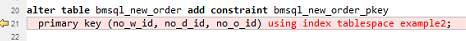

  \(3\) Modify the **runDatabaseBuild.sh** file. Modify the content in the following figure to avoid unsupported foreign keys during data generation.

  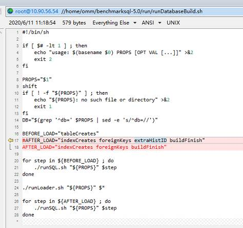

- **3. **Import data.

  Execute **runDatabaseBuild.sh** to import data.

- **4. **Back up data.

  To facilitate multiple tests and reduce the time for importing data, you can back up the exported data. A common method is to stop the database and copy the entire data directory. The reference script for restoration is as follows:

  ```
  #!/bin/bash
  rm -rf /ssd/omm108/gaussdata
  rm -rf /usr1/omm108dir/tablespace2
  rm -rf /usr2/omm108dir/tablespace3
  rm -rf /usr3/omm108dir/pg_xlog
  cp -rf /ssd/omm108/gaussdatabf/gaussdata /ssd/omm108/ &
  job0=$!
  cp -rf /usr1/omm108dir/tablespace2bf/tablespace2 /usr1/omm108dir/ &
  job1=$!
  cp -rf /usr2/omm108dir/tablespace3bf/tablespace3 /usr2/omm108dir/ &
  job2=$!
  cp -rf /usr3/omm108dir/pg_xlogbf/pg_xlog /usr3/omm108dir/ &
  job3=$!
  wait $job1 $job2 $job3 $job0
  ```

- **5. **Partition data disks.

  During the performance test, data needs to be distributed to different storage media to increase the I/O throughput. The data can be distributed to the four NVMe drives on the server. Place the **pg_xlog**, **tablespace2**, and **tablespace3** directories on the other three NVMe drives and provide the soft link pointing to the actual location in the original location. **pg_xlog** is in the database directory, and **tablespace2** and **tablespace3** are in the **pg_location** directory. For example, run the following commands to partition **tablespace2**:

  ```
  mv $DATA_DIR/pg_location/tablespace2 $TABSPACE2_DIR/tablespace2
  cd $DATA_DIR/pg_location/
  ln -svf $TABSPACE2_DIR/tablespace2 ./
  ```

- **6. **Run the TPC-C program.

  ```
  numactl –C 0-19,32-51,64-83,96-115 ./runBenchmark.sh props.opengauss.1000w
  ```

- **7. **Monitor performance.

  Use htop to monitor the CPU usage of the database server and TPC-C client. In the extreme performance test, the CPU usage of each service is greater than 90%. If the CPU usage does not meet the requirement, the core binding mode may be incorrect and needs to be adjusted.

  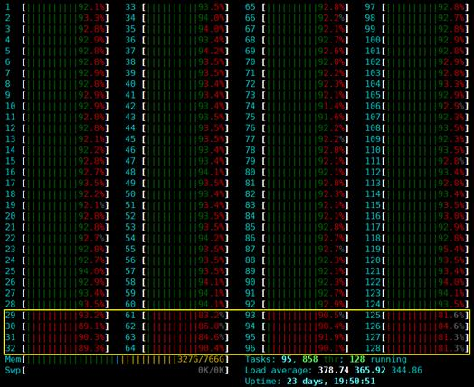

  In the preceding figure, the CPU in the yellow box is used to process network interruption.

- **8. **View the monitoring status after tuning.

  The htop state after tuning is reliable.

  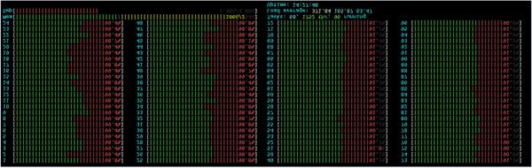

  Database tuning is a tedious task. You need to continuously modify configurations, run TPC-C, and perform commissioning to achieve the optimal performance configuration.

  TPC-C running result:

  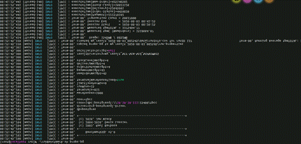
