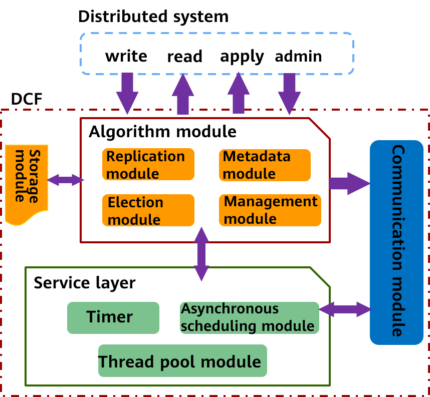
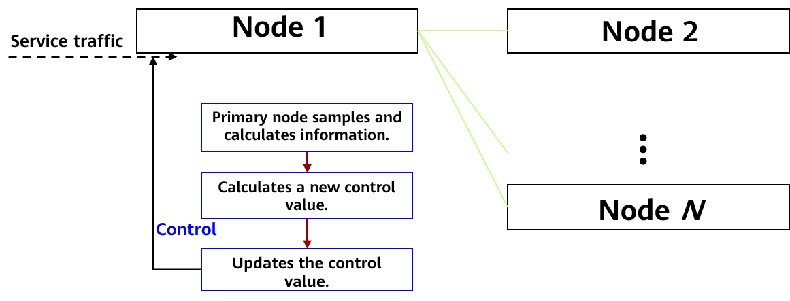
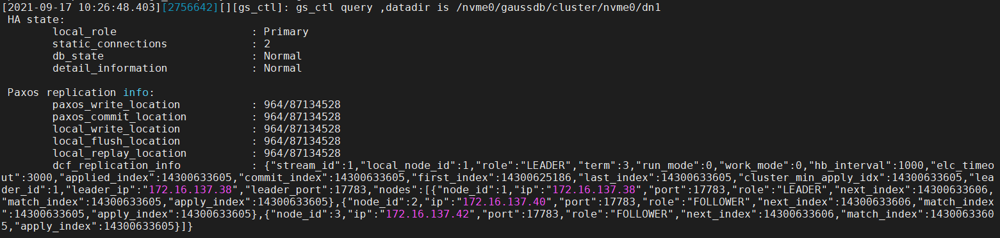

# openGauss Log Consensus Framework<a name="ZH-CN_TOPIC_0000001206146734"></a>

The distributed consistency algorithm is a basic problem of a distributed system. What needs to be resolved is how a distributed system achieves strong consistency on a value \(resolution\), so as to resolve the high availability problem of the system. Paxos is the most important distributed consistency algorithm, and many people use it as a synonym of distributed consistency protocols.

The Paxos theory has been put forward for many years and products using Paxos and its variant protocols are emerging one after another. However, there are few industrial-grade third-party independent libraries and open-source projects. Common open-source products that refer to the Paxos protocol include ZooKeeper and etcd. The protocol does not support high-throughput state machine replication and does not provide an independent third-party library for other systems to quickly access.

Therefore, the DCF feature is designed and implemented to support the distributed strong consistency scenario involved in openGauss.

## 1 What is DCF?<a name="section11501455151020"></a>

Its full name is distributed consensus framework. Typical algorithms for resolving distributed consistency problems are Paxos and Raft. DCF implements the Paxos algorithm. DCF provides capabilities such as log replication and cluster HA. It supports multiple types of nodes based on the Paxos protocol and the node roles can be adjusted as required. Log replication supports dynamic traffic adjustment, minority forcible startup, and automatic primary selection.

DCF is a high-performance, highly mature, reliable, scalable, and easy-to-use independent basic library. Other systems can easily interconnect with DCF through APIs to obtain the strong consistency, high availability, and automatic disaster recovery capabilities provided by the Paxos algorithm.



As shown in the preceding figure, DCF consists of the algorithm module, storage module, communication module, and service layer.

- Algorithm module:

  The algorithm module is implemented based on the Multi-Paxos protocol. Based on the service scenarios, and requirements for high performance and ecosystem, DCF has made many function extensions and performance optimization to enrich the functions compared with the basic Multi-Paxos protocol, and the performance is significantly improved in multiple deployment scenarios. It mainly includes a leader election module, a log replication module, a metadata module, and a cluster management module.

- Storage module:

  For specific service scenarios and optimal performance, DCF extracts a set of public interfaces for log storage and implements a default high-performance storage module. If you have specific scenarios or requirements for optimal performance and cost, you can connect the existing storage system to the log storage interface of DCF to meet specific requirements. This is one of the advantages of DCF as a third-party independent library.

- Communication module:

  The communication module is implemented based on the message exchange component \(MEC\), provides the communication capability between DCF component instances, and provides an asynchronous event processing framework. The main functions are as follows: multiple extensible communication protocols, unicast, broadcast, and loopback sending APIs, asynchronous message processing framework, multi-channel mechanism, multi-priority queues, compression, and batch sending.

- Service layer:

  The service layer is the basis for driving the running of the entire DCF and provides various basic services required for program running, such as lock, asynchronous task scheduling, thread pool service, and timer capability.

## 2 What Can DCF Do?<a name="section135481515151117"></a>

- 2.1 Adding and Deleting Nodes Online and Transferring the Leader Capability Online

  Based on the standard multi-paxos, DCF can add or delete nodes online and transfer the leader capability to other nodes online. This is more suitable for a wide range of service scenarios and helps build a development ecosystem.

- 2.2 Priority-based Primary Selection and Policy-based Majority

  **Policy-based majority:** In the classic Paxos theory, data can be submitted after the majority faction reaches an agreement. However, the majority faction is not specific and cannot ensure that one or more nodes can obtain complete data. In actual applications, nodes that are geographically close to each other usually have strongly consistent data. The nodes that are far away from each other are always in the non-strongly consistent state and when city-level disaster recovery occurs, they cannot be activated as primary nodes. The policy-based majority capability allows users to dynamically configure one or more nodes to ensure data consistency. When a disaster recovery requirement occurs, the node can be activated as the primary node immediately.

  **Priority-based primary selection:** You can specify the priority of each node. DCF selects the primary node based on the specified priority. DCF activates the node with a lower priority only when all nodes with a higher priority are unavailable.

- 2.3 Diversified Node Roles

  In addition to the typical leader, follow, and candidate roles, DCF provides custom roles, such as the passive role\(with logs and data, but without the right to be elected or participate in the majority voting\),and the log role \(with logs and the right to participate in the majority voting, but without data or the right to be elected\). With the support of these node roles, DCF supports multi-cluster deployment modes, such as synchronous deployment and synchronous/asynchronous hybrid deployment.

- 2.4 Batch & Pipeline

  Batch: DCF supports multi-level batch operations, including: \(1\) Combine multiple logs into a single message for sending. \(2\) Combine multiple logs and writes them to disks. \(3\) Combine and replicate multiple logs. Batch can effectively reduce the extra loss caused by the message granularity and improve the throughput.

  Pipeline: Before a result of a previous message is returned, the message is concurrently sent to the corresponding node. By increasing the number of concurrent messages \(pipelines\), the delay of a single concurrent request can be effectively reduced and the performance can be improved. DCF uses the asynchronous mode in multiple stages, such as log persistence, network transmission, and log replication, to maximize the pipeline performance.

- 2.5 Efficient Flow Control Algorithm

  Batching and pipelining can improve the throughput and performance of the entire system. However, if the batch size is too large, the delay of a single request is too long. As a result, the number of concurrent requests is too large, affecting the throughput and request delay. Therefore, DCF designs a set of efficient and adaptive flow control algorithms, automatically detects parameters such as the network bandwidth, network sending delay, and number of concurrent requests, and adjusts batch and pipeline parameters to control service traffic injection.

The flow control algorithm process is as follows:



The core algorithm process is as follows:

1.  The DCF primary node periodically samples and calculates consensus information, including the end-to-end consensus latency, end-to-end consensus log bandwidth, and overall log playback bandwidth.
2.  The primary node obtains the performance change trend based on the sampling result and historical result, adjusts the control direction and step based on the historical control value and change trend, and calculates a new control value for better performance.
3.  After the control period expires, the control value is updated.
4.  The control value is continuously applied to service traffic to control the frequency of service traffic injection.

DCF will continue to evolve in scenarios such as data communication, multiple log streams, and parallel large-capacity replication to provide users with efficient, reliable, and easy-to-manage log multi-copy replication and backup capabilities, meeting users' requirements for database disaster recovery and high availability.

## 3 How Do We Use DCF?<a name="section198432026141419"></a>

Assume that there are three nodes in the cluster and their IP addresses are 192.168.0.11, 192.168.0.12, and 192.168.0.13.

The node IDs are 1, 2, and 3, and the node roles are LEADER, FOLLOWER, and FOLLOWER.

To use DCF, set **enable_dcf** to **on** during FusionSphere OpenStack OM installation and deployment. This parameter disabled by default. For example:

Obtain the XML file template from **script/gspylib/etc/conf/centralized/cluster_config_template_HA.xml**.

The following values are examples and can be replaced as required. Each line is described with a comment.

```
<?xml version="1.0" encoding="UTF-8"?>
<ROOT>
  <!-- Overall information -->
  <CLUSTER>
  <!-- Database name -->
    <PARAM name="clusterName" value="Sample1" />
  <!-- Database node name (hostname) -->
    <PARAM name="nodeNames" value="node1,node2,node3" />
  <!-- Node IP address, which corresponds to nodeNames -->
    <PARAM name="backIp1s" value="192.168.0.11,192.168.0.12,192.168.0.13"/>
  <!-- Database installation directory -->
    <PARAM name="gaussdbAppPath" value="/opt/huawei/newsql/app" />
  <!-- Log directory -->
    <PARAM name="gaussdbLogPath" value="/opt/huawei/logs/gaussdb" />
  <!-- Temporary file directory -->
    <PARAM name="tmpMppdbPath" value="/opt/huawei/logs/temp" />
  <!-- Database tool directory -->
    <PARAM name="gaussdbToolPath" value="/opt/huawei/tools" />
  <!-- Cluster or database type. A non-distributed cluster is used as an example here, that is, the centralized mode is used. -->
    <PARAM name="clusterType" value="single-inst"/>
  <!--Whether to enable the DCF mode. on: enable; off: disable -->
    <PARAM name="enable_dcf" value="on/off"/>
 <!-- DCF configuration information -->
    <PARAM name="dcf_config" value="[{&quot;stream_id&quot;:1,&quot;node_id&quot;:1,&quot;ip&quot;:&quot;192.168.0.11&quot;,&quot;port&quot;:17783,&quot;role&quot;:&quot;LEADER&quot;},{&quot;stream_id&quot;:1,&quot;node_id&quot;:2,&quot;ip&quot;:&quot;192.168.0.12&quot;,&quot;port&quot;:17783,&quot;role&quot;:&quot;FOLLOWER&quot;},{&quot;stream_id&quot;:1,&quot;node_id&quot;:3,&quot;ip&quot;:&quot;192.168.0.13&quot;,&quot;port&quot;:17783,&quot;role&quot;:&quot;FOLLOWER&quot;}]"/>
  </CLUSTER>
```

- 3.1 Querying the Cluster Status After the Installation Is Complete

  Use **gs_ctl** to query the cluster status.

  ```
   # gs_ctl query –D <data_dir>
  # gs_ctl query -D /nvme0/gaussdb/cluster/nvme0/dn1
  ```

  

  In the preceding information, **dcf_replication_info** indicates the DCF information of the current node.

  **role**: role of the current node. The value can be **LEADER**, **FOLLOWER**, **LOGGER**, **PASSIVE**, **PRE_CANDICATE**, **CANDIDATE**, or **UNKNOW**. The preceding figure shows that the current node is a leader node.

  **term**: election term.

  **run_mode**: DCF running mode. The value **0** indicates that the automatic election mode is enabled, and the value **2** indicates that the automatic election mode is disabled.

  **work_mode**: DCF working mode.

  **hb_interval**: heartbeat interval between DCF nodes, in milliseconds.

  **elc_timeout**: DCF election timeout period, in milliseconds.

  **applied_index**: log location that is applied to the state machine.

  **commit_index**: log location that has been saved by most DCF nodes. Logs before **commit_index** have been made persistent.

  **first_index**: location of the first log saved on the DCF node. This location is moved backward when the DN calls **dcf_truncate**. The previous logs will be cleared.

  **last_index**: location of the last log saved by the DCF node. This log location contains the logs that are stored in the memory of the DCF node but are not made persistent. Therefore, last_index ≥ commit_index.

  **cluster_min_apply_idx**: location of the smallest applied log in the cluster.

  **leader_id**: leader node ID.

  **leader_ip**: IP address of the leader node.

  **leader_port**: port of the leader node, for DCF internal use.

  **nodes**: information about other nodes in the cluster.

- 3.2 Online Cluster Scale Adjustment

  To add a copy online, run the following command:

  ```
  # gs_ctl member --opration=add --nodeid=<node_id> --ip=<ip> --port=<port> -D <data_dir>
  ```

  To reduce the number of copies online, run the following command:

  ```
  # gs_ctl member --operation=remove --nodeid=<node_id> -D <data_dir>
  ```

  If the cluster is normal, a single copy can be deleted within 5 minutes.

- 3.3 Minority Forcible Startup

  In the majority fault scenario, no agreement can be reached based on the normal Paxos protocol. As a result, the system cannot continue to provide services. In this case, minority forcible startup is required to provide emergency services.

  Run the following command:

  ```
   # cm_ctl setrunmode –n <node_id> -D <data_dir> --xmode=minority --votenum=<num>
  ```

  In the three-copy cluster scenario, if two copies are faulty, data can be committed with one copy.

- 3.4 Switchover

  Switchover between the primary and standby database instances is supported in one-primary and multiple-standby deployment mode to implement switchover between AZs. Switchover is performed for maintenance. Before a switchover, ensure that the cluster instances are running properly, all services are stopped, and the **pgxc_get_senders_catchup_time\(\)** view shows no ongoing catchup between the primary and standby nodes.

  For example, run the following command to switch the standby node to the primary node:

  ```
  # cm_ctl switchover –n <node_id> -D <data_dir>
  ```

- 3.5 Standby Node Rebuild

  The full build is supported in primary/standby mode. After receiving a full build request, the primary DN is blocked from reclaiming DCF logs, and the standby DN replicates Xlogs and data files from the primary DN. After the kernel of the standby DN is started, DCF starts to replicate log points.

  The following is an example:

  ```
   # gs_ctl build –b full –Z datanode –D <new_node_data_dir>
  ```

  The open-source DCF feature is another exploration of openGauss in the distributed field and another substantial contribution to open-source technologies. openGauss has been committed to promoting in-depth innovation of database technologies, increasing investment in basic database research and database theory innovation, fully opening up top-notch technical capabilities, and working with developers around the world to promote the innovation and development of database production, learning, and research.
