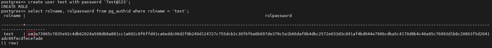
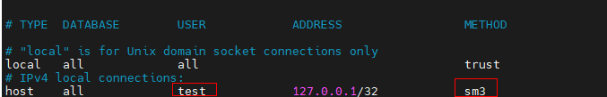
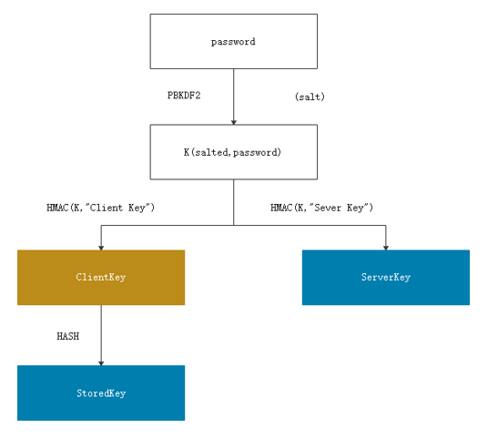
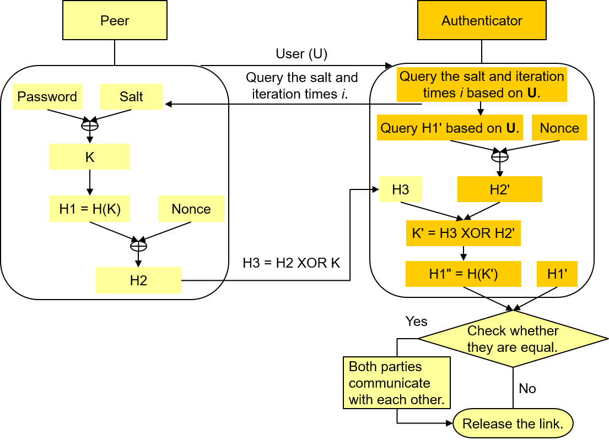
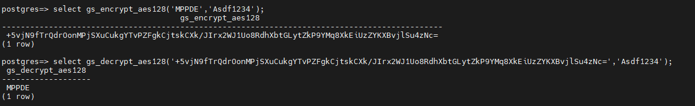
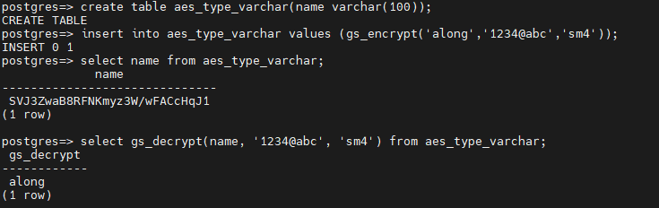
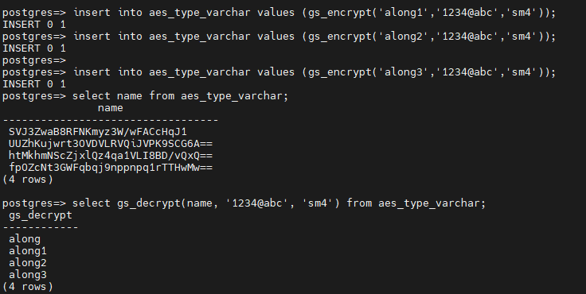

# openGauss Supports SM3 and SM4 Algorithms<a name="ZH-CN_TOPIC_0000001251426693"></a>

## 1. Introduction to the Chinese Cryptographic Algorithms<a name="section1368913722517"></a>

Chinese cryptographic algorithms are Chinese algorithms issued by the State Cryptography Administration Office of Security Commercial Code Administration \(OSCCA\). Common algorithms include SM1, SM2, SM3, and SM4. The key length and block length are both 128 bits. To meet bank customers' requirements for database security capabilities, openGauss 2.0.0 and later versions support Chinese cryptographic algorithms to enhance enterprise-level security capabilities of databases and improve product security competitiveness, including the SM3 algorithm \(http://www.gmbz.org.cn/main/viewfile/20180108023812835219.html\) for user authentication, and the SM4 algorithm for data encryption and decryption \(http://www.gmbz.org.cn/main/viewfile/20180108015408199368.html\)

## 2. SM3 Algorithm – User Authentication<a name="section1383392282510"></a>

- 2.1 Usage

openGauss supports four user authentication methods, which are determined by the **password_encryption_type** parameter in the **postgresql.conf** file. The following table lists the mapping between authentication methods and **password_encryption_type**.

```
| Authentication Method | Parameter |
| ---------- | -------------------------- |
| md5        | password_encryption_type=0 |
| sha256+md5 | password_encryption_type=1 |
| sha256     | password_encryption_type=2 |
| sm3        | password_encryption_type=3 |
```

The SM3 algorithm supports three connection modes: gsql, JDBC, and ODBC.

To create a user supporting SM3 authentication, perform the following steps:

\(1\) Set **password_encryption_type** to **3** in the **postgresql.conf** file and restart the database for the parameter to take effect. Then, the SM3 algorithm will be used to encrypt plaintext passwords for newly created users.


\(2\) Create a user.

In the following example, a user **test** is created. You can view the encryption type during user creation in the **rolpassword** field of the **pg_authid** system catalog. The following figure shows that the SM3 algorithm is used for encryption.

\(3\) In the **pg_hba.conf** file, set the authentication method to SM3.



In this case, the **test** user can pass the authentication through remote login.


A user created by using the SM3 encryption algorithm can pass the authentication only when both the encryption algorithm and authentication method are SM3.

For SM3 users, when JDBC is used for remote connection, you need to manually download the **bcprov-jdk15on** JAR package and import it to the application.

\[Download Link\] \(https://mvnrepository.com/artifact/org.bouncycastle/bcprov-jdk15on/1.68\)

The procedure for creating a user by using other authentication methods is similar to that for creating a user by using SM3 authentication.

- 2.2 Implementation Principle

  openGauss uses the RFC 5802 password authentication solution.

  - User key generation

  The following figure shows the RFC 5802 key derivation process.

  

  ```
    SaltedPassword := PBKDF2 (password, salt, i)
    ClientKey := HMAC(SaltedPassword, "Client Key")
    StoredKey := Hash(ClientKey)
  ```

  StoredKey and ServerKey are stored on the server.

  1\) The StoredKey is used to authenticate the client.

  The server authenticates the client by performing the exclusive OR operation on the ClientSignature and ClientProof sent by the client to obtain the ClientKey, performing the hash operation on the ClientKey, and comparing the obtained value with the StoredKey. If they are the same, the client passes the authentication.

  2\) ServerKey is used to identify the client

  Similarly, the client authenticates the server by comparing ServerSignature with the value sent by the server. If they are the same, the client authenticates the server.

  3\) During the authentication, the server can calculate the ClientKey. After the authentication is complete, the ClientKey is discarded and does not need to be stored.

  To ensure legal login, you must obtain the Password, SaltedPassword, or ClientKey. If the StoryKey and ServerKey are disclosed, illegal login may occur.

  - Authentication process

  The following figure shows the standard RFC 5802 password authentication process.

  

  1. The client sends the username to the server.

  2. The server returns the AuthMessage and calculated ServerSignature to the client.

  3. After receiving the message, the client uses the salt and iteration count in AuthMessage to calculate SaltedPassword based on the Password, and then calculates all lower-layer keys. The client checks whether the values of HMAC\(ServerKey, AuthMessage\) equals ServerSignature. If they are equal, the client authenticates the server.

  4. The client sends the calculated ClientProof to the server.

  5. The server uses the saved StoredKey and AuthMessage to calculate the HMAC, performs the exclusive OR operation on the HMAC and the ClientProof received from the client to obtain the ClientKey, and then performs the hash operation on the ClientKey to check whether the ClientKey is the same as the saved StoredKey. If they are the same, the client passes the authentication.

  After receiving the request from the client, the server interacts with the client for authentication based on the authentication method configured in the **pg_hba.conf** file.

## 3. SM4 Algorithm – Data Encryption and Decryption<a name="section1818513912815"></a>

Chinese cryptographic algorithm SM4 can be used to encrypt or decrypt data in a column of a table. The newly added encryption and decryption functions gs_decrypt and gs_decrypt are compatible with gs_encrypt_aes128 and sgs_decrypt_aes128, and supports encryption and decryption using AES128 and SM4. The SM4 algorithm invokes the EVP_sm4_cbc\(\) interface of OpenSSL.

The gs_encrypt_aes128 and gs_decrypt_aes128 functions are described as follows:

- gs_encrypt_aes128\(encryptstr, keystr\)

​ Description: Encrypts **encryptstr** strings using **keystr** as the key and returns encrypted strings.

- gs_decrypt_aes128\(decryptstr,keystr\)

​ Description: Decrypts **decryptstr** strings using **keystr** as the key and returns decrypted strings.

The gs_encrypt and gs_decrypt functions are described as follows:

- gs_encrypt\(encryptstr, keystr, algorithm\)

​ Description: Encrypts **encryptstr** strings using **keystr** as the key and returns encrypted strings. The options are **sm4** and **aes128**.

- gs_decrypt_aes128\(decryptstr,keystr, algorithm\)

​ Description: Decrypts **decryptstr** strings using **keystr** as the key and returns the decrypted strings. The options are **sm4** and **aes128**.

The following figures show how to encrypt and decrypt table data using the SM4 algorithm.





openGauss supports SM3 for user authentication and SM4 for data encryption and decryption.
