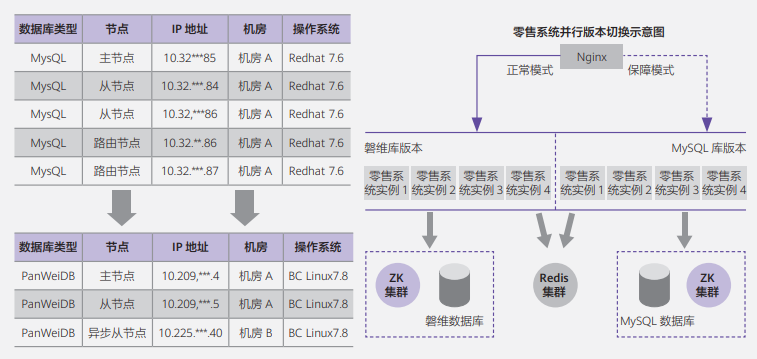

## 案例背景

为贯彻国家科技创新战略、集团数智化转型和智慧中台发展战略、IT领域十四五系统发展规划，江苏移动公司积极响应国家号召，以加强自主创新能力为目标，持续将现有应用系统开发及数据库架构承载采用全栈自主研发环境。

## 解决方案

为满足全栈自主创新的建设需求，PanWeiDB 数据库助力适配应用开发商进行业务系统架构适配及应用兼容性改造，从传统国外开源数据库 MySQL 转型适配自主创新数据库 PanWeiDB 。 PanWeiDB 在 openGauss 开源软件强大内核基础上增强了高可用性、分布式能力、MySQL 兼容性、配套工具等功能，满足了零售系统系统快速完成适配改造，实现业务快速上线运行。

### 磐维数据库组件架构

- 磐维数据库业务访问任务被推送到服务节点执行，通过服务器的高并发，实现对数据处理的快速响应。同时通过日志复制可以把数据复制到备机，提供数据的高可靠和读扩展。

### 系统部署架构

- 通过采取磐维跨机房高可用部署，实现跨机房容灾，在数据库主库异常宕机时，主动进行主从切换，规避单点风险。

- 使用BC-LINUX移动自研操作系统部署。

- 通过建立应用保障模式，采取双通道运行，管控割接风险。

## 客户收益

- 依托磐PanWeiDB技术专家团队的服务能力，快速支撑开发商进行了数据库的迁移改造工作，保质保量的满足业务系统上线时间周期，实现业务系统安全和自主创新建设的目标。

- PanWeiDB的MySQL高兼容性能力，简化了开发适配的时间周期，系统开发适配的效率提升了50%，减轻了开发的工作压力，提高了业务系统送代效率。

- PanWeiDB配套工具简化了磐维数据库运维、监控工作复杂度，提升了整体数据库运维处置效率与质量。

- 当前PanWeiDB已承载零售系统高效平稳运行半年多时间，整体运行效率及数据处理效率上比原MySQL库架构上提升了45%，有效提升了系统用户体验。

## 合作伙伴

  
  

