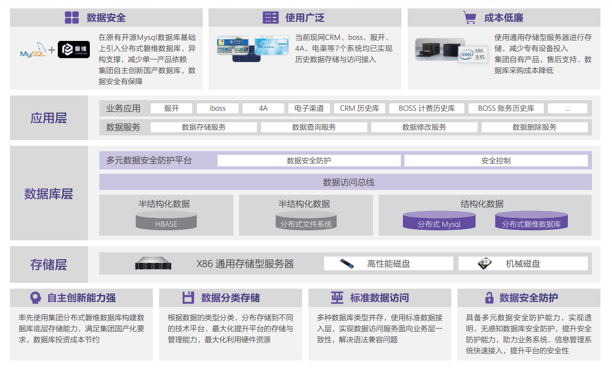
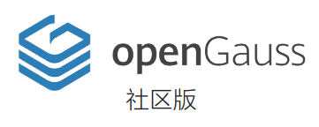

## 案例背景

新疆移动业务周期管理平台为新疆公司 B 域、M 域各业务系统提供海量业务数据的低成本存储与低时延的查询能力。而面向结构化数据存储需求，新疆移动业务数据周期管理平台在原有 mysql 数据库存储基础上，率先引入集团分布式磐维数据库，实现自主创新能力背景下历史数据高效、可靠、低成本、高性价比存储能力实现。

## 解决方案

## 客户收益

- 存储节约：数据库纳管7个业务与平台数据累计存储数据共计40TB节约投资48万。

- 数据库节约：底层存储使用集团自主研发磐维数据库减少数据库投资35万。

- 数据打通：数据访问、存储安全加密分布式数据库扩容等维护操作效率提升35%。

## 合作伙伴

  
  

