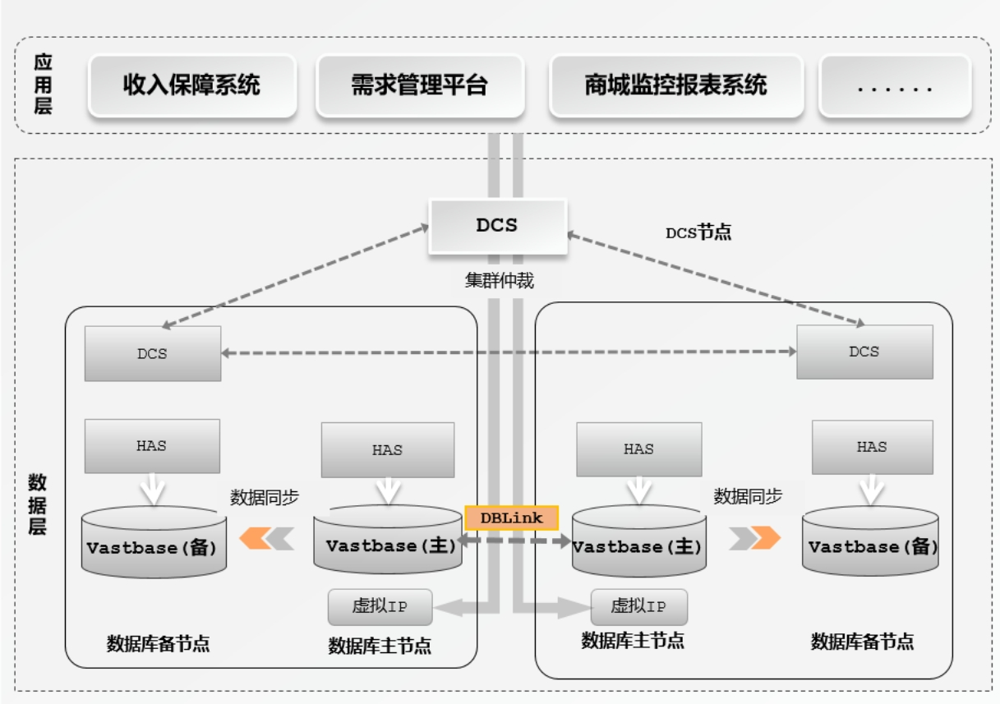

## 应用场景

支撑运营商基础设施数智化升级

## 解决方案

• 集群包含2节点HAS&Vastbase&DCS + 1节点DCS，三节点DCS进行仲裁，保障RPO=0, RTO≤10S

• 良好的Oracle兼容性，实现极速迁移，减少业务调整

• 支持云底座通用的x86及ARM架构处理器，释放算力潜能

• 提供外部数据封装能力，可通过DBLINK访问Vastbase及Oracle中的数据

## 客户收益

• 海量数据提供专业的上线保障服务以及高效的迁移工具，≤3人天即完成源端Oracle数据库的移植，兼容度高达99.98%，实现低成本、高效率投产。

• 支撑用户应用微服务化改造，在复杂的数据库交互架构中，支持数据库链接功能（DBLink）,使得同一业务中不同集群的数据库可以相互访问，提高交互效率。

## 合作伙伴

    
    

