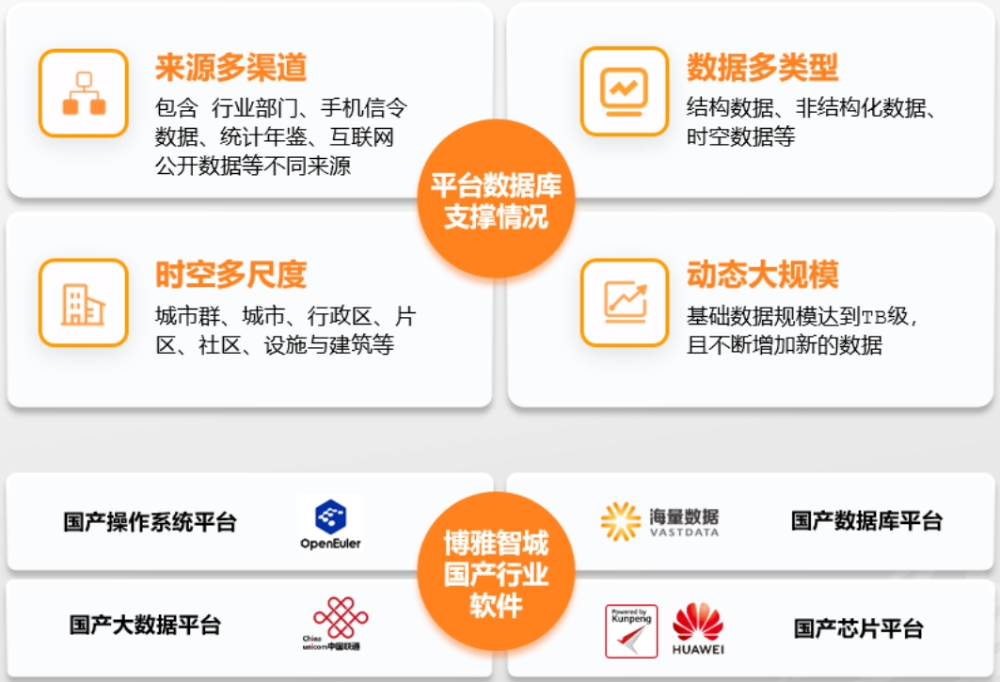

## 客户挑战

海量数据携手北京大学，为 博雅智城-城市智慧决策平台。

## 解决方案

CitySPS提供多模混合负载的数据库平台。城市规划-建设-监测评估-治理一体化决策支持基于数据库技术的大数据治理与挖掘，成为智慧平台建设的基础关键环节。

## 客户收益

• 空间分析能力：城市、地理时空大数据分析，空间多尺度 、高时空颗粒度 、二维&三维时空分析

• 高计算性能：时空大数据 + 城市全系统计量模型，对数据处理性能提出了较高要求；功能模块100+ 项，计算变量1000+个；城市栅格细胞10万级，城市交通路径100万级，个人出行链数据10亿级

• 信息安全：智慧城市数据资源关乎国家安全、城市安全、社会稳定。近年来，《数据安全法》、《个人信息保护法》、《网络数据安全管理条例（征求意见稿）》等法律法规，体现了国家维护信息安全的决心

• 高可用性：城市治理、城市运营生产环境，对可用性提出了较高要求；故障时间短，修复时间快，数据丢失容忍度低

• 事务/分析并重：OLTP-快速写入新数据；OLAP-快速分析数据

## 合作伙伴

    
    

