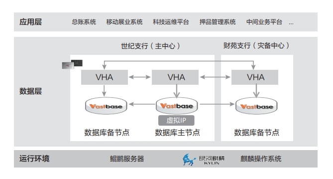

## 案例背景

承德银行于 2002 年成立，是河北省乃至环渤海地区具有重要市场影响力的商业银行之一。承德银行为加快数字化转型于 2020 年筹备组建数字银行部，并于 2022 年启动交易级大总账项目改造。经过多方考察调研，多轮严格选型测试，最终采用海量数据库替换原有 Oracle。

交易级总账系统承接全行业务数据，业务量较大，主要负责总账生成、年终决算、准备金计算、税务处理、集团并表等功能。需要保障系统日终批量的高效率，同时需要保障行内数据的安全性以及业务的连续稳定运行。

## 客户挑战

- 国内数据库的软件供应商相对较少，担心生态系统建设会受限，以及在集成、支持和维护等方面可能面临困难。

- 涉及大量隐私数据，如用户身份信息、税务信息等，需满足国家等保要求，达到对数据零错误，零丢失的极高数据可靠性要求。

- 数据迁移对数据的一致性和业务连续性要求非常高，需要稳定可靠的数据迁移工具和方案。

## 解决方案

数据库采用基于用 openGauss 的发行版海量数据 Vastbase，在基础环境方面全面采用国内标准构建，摒弃了以美国科技公司为代表的的 IBM 小型机、AIX 操作系统、WebSphere 中间件、等软硬件，形成了以海光超融合服务器、中标麒麟操作系统、海量数据库、东方通中间件为基础的软硬件环境，实现自主可控。

## 用户收益

- 生态优势：鲲鹏（CPU）+ 麒麟（OS）+ Vastbase（DB）解决方案形成适配 ARM 指令的技术体系，一体化的计算产业体系，发挥极致算力。

- 安全可靠：拥有多重安全防护机制，如全密态、动态脱敏等；同时采用主备高可用架构，实现故障自动检测切换，业务运行稳定安全。

- 高效迁移：对国外主流数据库具有高兼容特性，搭配 exBase 可最大程度减少代码改造，实现降本增效，交易级总账系统迁移成功率 100%。

## 合作伙伴

  
  

