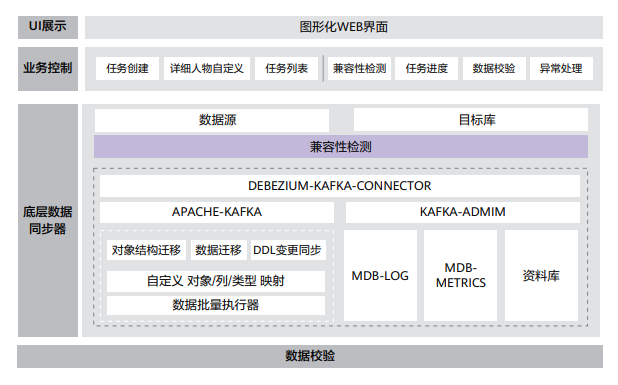

## 案例背景

在互联网金融业务快速增长的背景下，以及国家政策的强力推动下，银行作为国民经济的承载体，肩负着推动金融科技自主创新的重大使命。作为小型城市商业银行的典型代表，哈密市商业银行在探索数据库替代的历程中成功牵手云和恩墨，依托MogDB数据库在兼容适配、平滑迁移、企业级特性等方面的优势，不仅克服了技术人才短缺、选型复杂、应用改造风险等重重挑战，更开辟出了一条国内数据库持续、稳定、高效发展的新路径。

## 解决方案

本次哈密市商业银行的MogDB数据库改造项目主要涉及新建A类超级柜台系统的应用，以及积分、党建、云课堂、人才招聘、农户经济档案、人力资源等 B 类和 C 类系统的迁移。在 MogDB 数据库配套的在线迁移工具MDB以及云和恩墨技术专家的服务支持下，案例客户非常顺利地完成数据库画像、兼容性评估、整体迁移、数据比对、应用适配等重要环节，让异构数据库之间改造适配难度降低 30%，并减少了 20% 的应用软件代码改造成本。

## 客户收益

- MogDB 的高可用管理工具 MogHA 满足了双中心主备容灾架构的高可用自动化管理，符合哈密市商业银行在主数据中心主备VIP服务自动切换，以及主备中心自动化读写分离的需求，保证了业务的连续性。

- 经过前期三次科学验证后，正式迁移过程中业务中断时间不超过 5 分钟，极大程度缩短了整个迁移业务离线周期，保障了业务的正常开展和用户体验。

- 哈密市商业银行借此契机，完成了向鲲鹏服务器架构的转型，在硬件、数据库软件以及运维服务方面的资金成本节省 30%，实现了降本增效的既定目标，并把核心数据资产相关的技术牢牢掌握在自己手里。

## 合作伙伴

  
  

