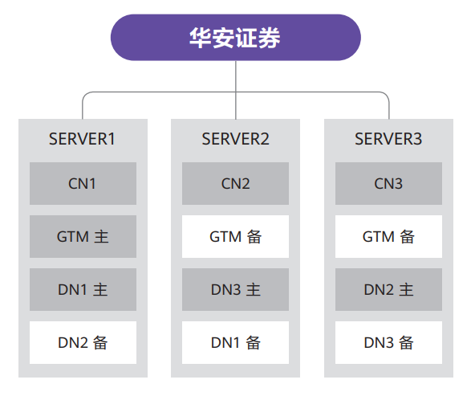

## 行业背景

华安证券以安徽为总部业务网络辐射全国二十多个省份，拥有 151 家证券分支机构，13 家期货分支机构。华安证券具有统一的数据中心基础设施管理平台。伴随业务发展，平台原有系统逐渐浮现并发瓶颈，系统响应也有所延迟。2023 年底，采用 GBase 8c 分布式数据库解决方案替换原有数据库，来提升系统的并发能力和及时响应能力。

## 解决方案

基于企业数字化转型要求，本项目搭载全套国内软硬件平台，使用华为鲲鹏服务器，银河麒麟高级服务器操作系统，数据库为 GBase 8c V5 分布式集群。

本项目设计了一套具有高可用性的部署方案，三台服务器上建立三个 CN（计算节点）和三个高可用组。系统通过 GBase 8c 的 CN 节点访问集群。三台服务器均可读写。每台服务器和每个高可用组均含一主一备节点，交叉部署，任一服务器出现故障情况，其他服务器上的备节点可以在 1 分钟内切换为主，切换对应用系统完全透明，业务中断时间短，数据无损失，用户感知好。同时具备负载均衡、读写分离效果，提升数据访问并发量，又保证了数据的高可用性。

## 客户收益

- GBase 8c 灵活应对业务数据规模的增长，通过水平扩容来提升系统的计算和存储能力，同时不中断业务运行，保证系统的持续可用性。

- GBase 8c 支持标准 SQL，同时高度兼容主流数据库语法，可以实现应用近似零修改迁移。

- 适配绝大多数国内服务器、操作系统基础生态环境，满足客户的数字化转型要求，为平台的建设和数据安全防护提供了有力保障。

## 合作伙伴

  

