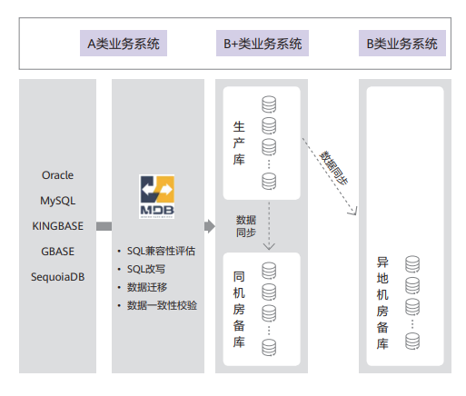

## 案例背景

为了积极推进信息技术应用创新，晋商银行于2020年便开始了数字化转型的探索之路，这其中，通过国内数据库替代国外的商业数据库便是很重要的一项工作，经过层层筛选，慎重抉择，晋商银行最终决定采用基于 openGauss 内核的商业版MogDB作为数据库替代方案之一。

## 解决方案

晋商银行结合上线业务系统的重要程度，采用一主一备或一主多备等架构部署 MogDB 数据库，同时采用两地双中心的高可用方案，实现异地数据异步传输、异地级联复制、异地演练、异地切换等能力，确保数据库系统具备高可用性和业务连续性，避免业务非计划中断的风险，提高系统的可靠性。

同时，MogDB基于可观测工程中的三大支柱 —— Logging、Metrics 和 Tracing 打造了晋商银行数据库系统可观测框架，可以增强对系统和数据库性能的监控和故障预测预防能力，实现对数据库全栈的可观测、可跟踪、可诊断。此外，MogDB 还支持动态数据脱敏，可以在查询过程中对数据进行脱敏处理，有效保护敏感信息不被泄露。

## 客户收益

- MogDB通过列存储和向量化执行引擎技术结合，实现了高效的数据处理和查询性能，可以在短时间内完成大量数据的分析和计算，大幅提高复杂类查询性能。结合云和恩墨工程师对数据库的全链路优化和并发处理等技术手段，提高了数据库的性能和吞吐量，系统性能极大增强，优化后的多个性能指标提升 30% ～ 40%。

- 截至目前，晋商银行共有 17 套使用 MogDB 的业务系统正式上线，上线时间最长的系统已平稳高效运行 500 多天，已上线的业务系统承载的用户规模已达几十万人，数据规模均在百 GB 以上，其中规模最大的业务系统数据量高达 4TB，充分验证了 MogDB 在实际应用中的强大效能与安全可靠。

## 合作伙伴

  
  

