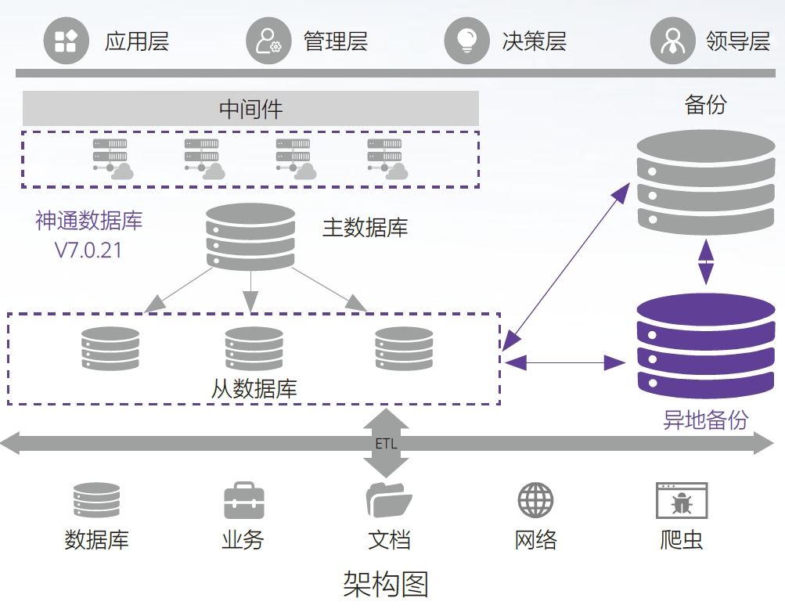

## 应用场景

• 为了及时获悉政府的相关政策指令、法律法规，分析对公司发展的相关政策、计划和趋势走向，并做合理部署与应对。

• 对政府政策支持项目的申报、政府有关资金申请、重要资质的申报和认定等， 及时与公司业务相关的行业监管部门保持紧密联络，时刻跟踪监管部门对互联网金融行业的政策更新。

• 这些决策类的信息需求一般是跨多个业务系统，仅通过手工方式来实现，是难以满足这些需求的时效性和准确性的。

## 解决方案

方案一：
神通数据库管理系统V7.0.21面对大并发场景，通过多核数据结构，增量检查点，大内存缓冲区管理实现更高效率的TPMC。

方案二：
集群架构，采用SQL-Bypass智能选路执行技术；一定程度上实现负载均衡的作用。

方案三：
本地和异地备份采用数据页CRC校验，损坏数据页通过备机自动修复机制保障数据的完整性。

## 客户收益

• 全面满足了应用层、管理层的需要，为决策和管理层提供数据支持，从而进一步提高全行业务经营和管理水平，满足客户金融数据的审计、安全性要求。

• 通过系统对各个政策、上级指令严格划分，管理分明、高效部署，在各部门之间紧密联系，实现流程化管理。信息之间相互联通，打破了系统间的孤岛问题，并且通过有效的架构支持，做到了快速读写、快速响应，2000并发系统响应时间压缩至1.5秒之内，比原系统规定时间提高50%。

• 应对高并发等极端情况，也通过备份及容灾保障了数据安全和一致性。

## 合作伙伴

    

