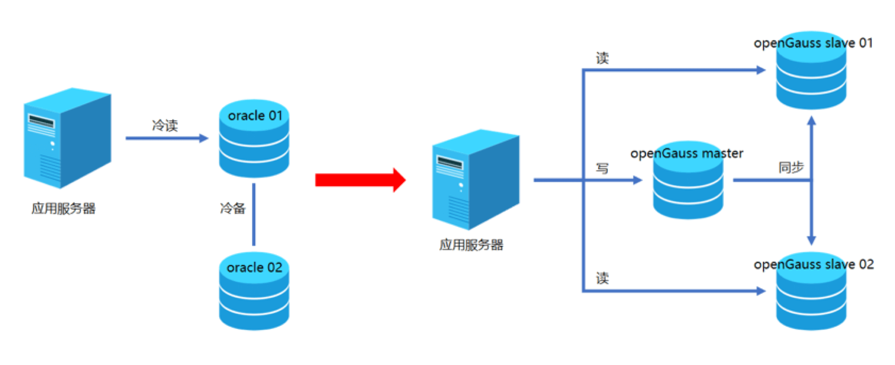

## 应用场景

冠字号码管理系统根据《中国人民银行货币金银局关于进一步做好冠字号码查询工作的通知》（银货金[2015]10 号）的文件要求，实现冠字号码信息上报、区分现金收入和付出业务类型、关联客户业务信息、与现钞实物同步流转等功能。同时，基于业务管理的需要，优化清分业务量统计功能，将机具管理纳入系统管理。

## 解决方案

冠字号码管理系统新增数据库服务器采用 openGauss 数据库单轨运行，替代 oracle 数据库。采用一主两备的高可用数据库部署架构。

## 客户收益

· 总数据量达 TB 级，使用 openGauss 后系统运行平稳，性能达到预期，满足业务需求。

## 合作伙伴

