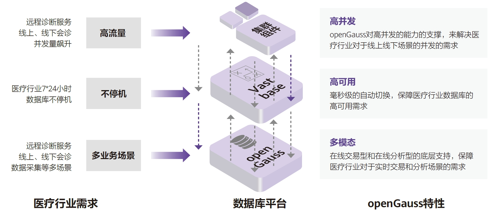

## 客户挑战

随着“互联网+医疗健康”日益紧密相连，医疗卫生行业积极探索信息化升级，一方面提高医生工作效率，另一方面大大提升患者的就诊体验，满足个性化的就诊需求。用户在选型中亟待解决与国际主流数据库兼容性、性能是否满足业务需求、便利运维等现有的业务痛点。

## 解决方案

Vastbase以良好的兼容性、基于openGauss内核的稳定性能、智能化运维性，满足选型中重点考量的业务痛点，助力远程影像诊断平台互联互通，打造医疗卫生行业信息化建设解决方案。

## 客户收益

• 高性能、高并发：基于openGauss内核的良好性能使得Vastbase最高能支持一万并发，有效满足用户的业务需求，效率提高7倍以上

• 高可用：主备自动切换，可做到RPO=0，RTO<=10s，有效保障业务连续性。

• 多模态：支持多种存储方式，满足不同使用场景需求。

• 易迁移：使用海量exbase迁移工具，大大缩短迁移时间和成本，迁移成功率高达99.5%。

## 合作伙伴

    
    

