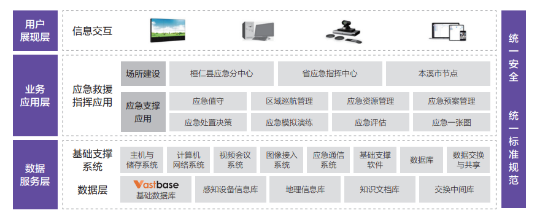
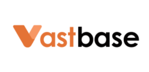

## 行业背景

为贯彻落实国务院、省政府及交通运输部的部署要求，确保辽宁省内河水上交通安全和应急救援工作落实，保障水路出行安全，辽宁省交通运输厅开展内河水上交通安全应急救援体系建设。建设内容包含水上交通安全应急资源管理、区域巡航管理、应急预案管理、应急培训演练、系统管理等模块开发，以及应急系统数据接口开发、数据库、数据备份、北斗短报文接收软件开发、数据、机房等产品及服务。

## 系统架构

应急管理系统八大业务模块采用统一部署，分级应用的建设模式，根据各层级部门的角色和工作职能，分派相关使用用户。在数据服务层，选择 Vastbase G100 作为基础数据库对上层应用进行支撑。

## 核心能力

- 生态成熟：支持 Intel、鲲鹏等不同架构体系 CPU；具有跨主流操作系统平台能力。
- 安全保障：提供精细化的数据安全保护机制，保障项目后期等保三级测评、代码审计等评审计划。
- 数据备份：提供细粒度的数据库备份方案，兼容主流数据备份平台，保障业务数据安全。

## 用户收益

- 全方位、高安全集成，充分利用现有资源，并依靠信息交互平台实现各层级部门数据共享。

- 形成完善的监测预警体系防范于未然，强化桓仁县四湖船舶航行安全风险管控能力。

- 高效的底层数据服务能力，Vastbase 具备跨平台（CPU、OS）支撑能力以及后端数据备份服务，能够保障应急救援指挥系统数据层安全服务的及时性。

## 合作伙伴

    
    

