近日，北京志凌海纳科技有限公司（以下简称 “SmartX”）携手 openGauss 社区完成了 openGauss 数据库基于 SmartX 超融合平台（SMTX OS）和 SmartX 分布式存储平台（SMTX ZBS）的性能测试和调优。

结果显示，在超融合环境中，openGauss 数据库性能提升了 41% ~ 174%；在分布式存储环境中，其最高值能可达到裸金属服务器 + 本地 NVMe SSD 性能的 110%。

## 背景

随着信息技术应用与创新转型进入深水区，国产数据库的市场占有率快速增长，openGauss 作为重要的企业级开源关系数据库，其商业版本被广泛的应用于金融、政府、电信、能源等关键行业的核心场景。

为帮助用户更好的了解 openGauss 数据库在自主创新硬件平台及 SmartX 软件平台上的运行表现，SmartX 携手 openGauss 社区围绕 openGauss-5.1.0 企业版在 SmartX 超融合自主创新平台和 SmartX 分布式存自主创新平台（基于鲲鹏芯片的自主创新服务器）上进行了一系列的性能测试和调优，并通过本文分享相关的测试结果与调优思路。

## 测试方法

本次测试使用 BenchmarkSQL 基于 TPC-C 基准执行测试，以便更客观地评价 openGauss 数据库在 SmartX 自主创新平台上的性能表现。

### TPC-C

TPC-C 是一个业界公认的事务处理性能基准测试。它是 Transaction Processing Performance Council（TPC）发布的标准基准测试之一，用于测试在线事务处理（OLTP）系统的性能。TPC-C 测试基于一个虚拟的在线订单处理应用程序，它包括了一系列的事务操作，如客户订单、库存管理、交付处理等。TPC-C 测试结果以“每分钟事务处理量”（TPM）为单位进行度量。

### BenchmarkSQL

BenchmarkSQL 是一款可以使用 TPC-C 测试规范来运行基准测试的工具。具体来说，BenchmarkSQL 可以使用 TPC-C 测试规范中定义的事务操作和数据结构，来模拟一个 TPC-C 测试环境，并对数据库系统进行性能测试。因此，BenchmarkSQL 可以被认为是TPC-C 测试的一种实现方式。

## SMTX OS 超融合场景测试

### 1. 测试环境

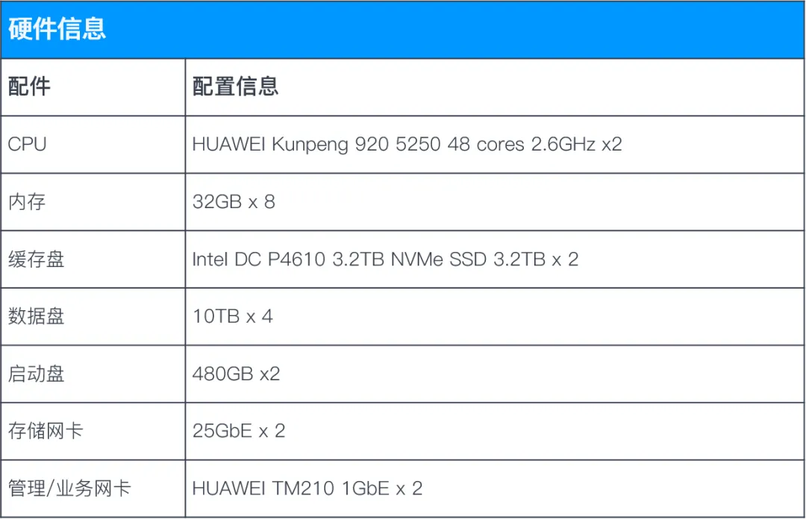

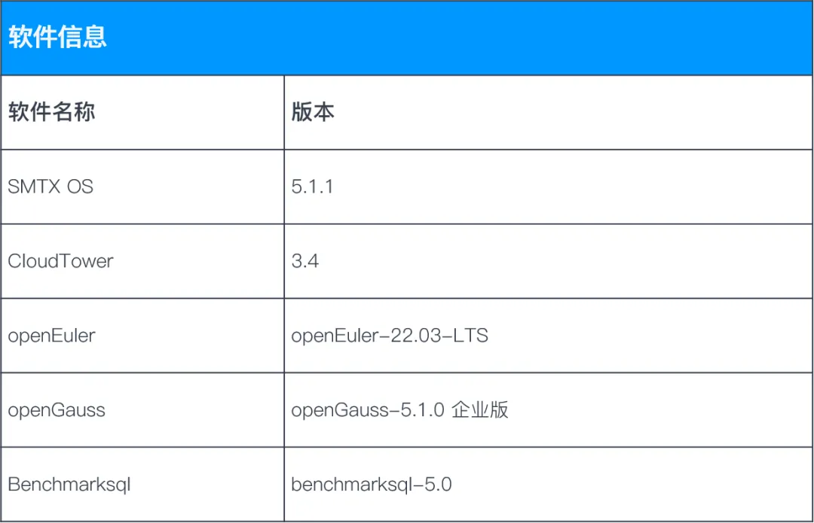

*超融合测试场景中，需要留部分 CPU 和内存资源给 SMTX OS 作为开销，因此，openGauss数据库无法独占物理机。

### 2. 测试模型

超融合场景测试分为两种部署架构：

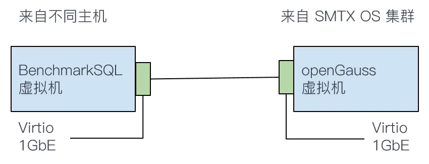

部署架构 1：openGauss 数据库和 BenchmarkSQL 压力程序分别部署在不同的虚拟机（并运行在不同物理服务器节点），BenchmarkSQL 虚拟机的访问请求通过网络发送到 openGauss 数据库虚拟机进行处理。

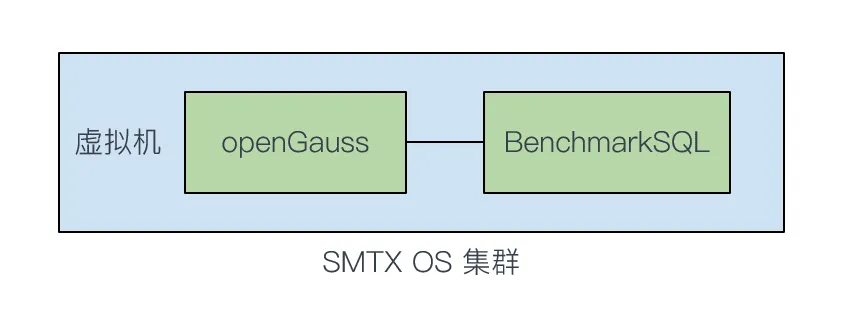

部署架构 2：openGauss 数据库和 BenchmarkSQL 部署在同一虚拟机之内（openGauss 所在虚拟机），BenchmarkSQL 虚拟机的访问请求在虚拟机内部直接传送到 openGauss 数据库虚拟机进行处理，没有网络开销。

### 3. 测试模型

#### 3.1 优化前的初步测试结果

部署架构 1 测试结果：（测试结果为 Neworder 交易，单位：TPM）

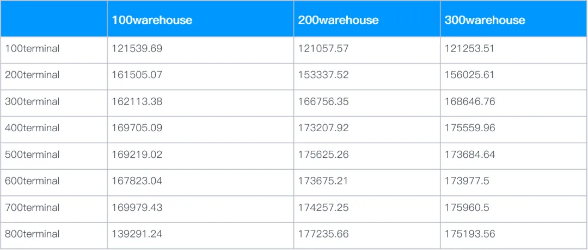

部署架构 2 测试结果：（测试结果为 Neworder 交易，单位：TPM）

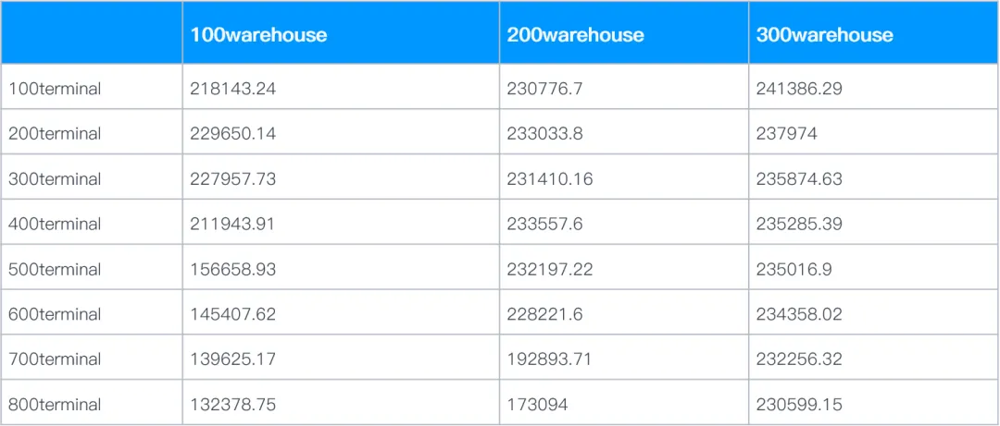

#### 3.2 主要调优手段

**主机优化**

- 无BIOS 开启性能模式（CPU 最大性能）

**超融合软件优化**

- 开启 boost 模式加速（降低 IO 延时）

- 开启 RDMA 网络（降低网络延时）

**虚拟机优化**

- 开启 vCPU 绑定（不共享 CPU）

- 利用多个虚拟卷分开存放表空间以及日志文件（提升 IO 并发）

**操作系统优化**

- 网络中断参数优化（降低网络延时）

- 文件系统设置块大小为 8k（与数据库块大小对齐）

- 关闭 swap 

- 关闭内存大页

- 启动参数优化（禁用不必要服务）

**数据库参数优化**

- 为数据库进程绑定 numa 拓扑

- 调整 redo log 大小

- 开启/关闭异步 IO

- ……

**BenchmarkSQL 优化**

- 创建分表，引入索引（提升数据库并发访问）

#### 3.3 调优前后测试结果对比

本次测试包含多项调优项目，但由于篇幅有限，无法逐一介绍调优效果，因此选择了两项提升幅度较大的调优项目给大家参考：

**BenchmarkSQL 优化 - 创建分表**

当 BenchmarkSQL 程序填充数据时，它主要通过调用脚本来创建数据库表格。然而，原始脚本只通过创建单一表格来进行填充，这会限制并发访问的优势。为了解决该问题，我们对创建脚本进行了优化，将数据分表存放，让数据库访问时可以获取多个表格的响应。

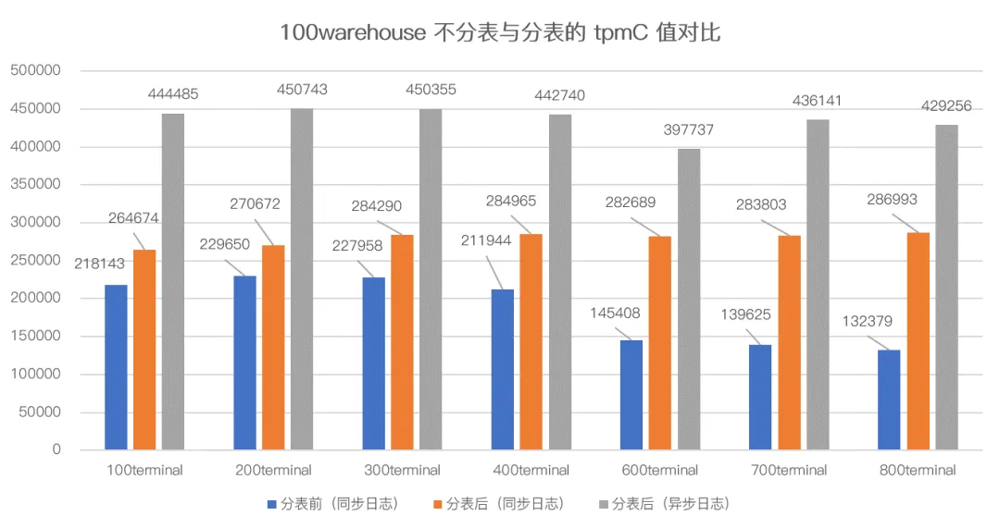

基于测试结果，我们可以得出以下结论：

- 在默认情况下，分表后 tpmC 值有明显提升，增长区间为 17%~116%，且并发度越高，tpmC 值提升越明显。

- 在数据库启用异步日志后，性能有较大提升（50% 以上），经后台监控查看，初步判断 IO 此时成为主要性能瓶颈。

**IO 优化**

由于观察到同步日志下，其性能会受到 IO 性能影响。因此我们对现有环境进行 IO 及运算能力的优化：

- 加虚拟磁盘，分离日志文件和表空间放置在不同的虚拟磁盘。

- 调整宿主机 profile。

- vCPU NUMA 绑定。

经调优后，tpmC 性能提升了 16%~ 43%。

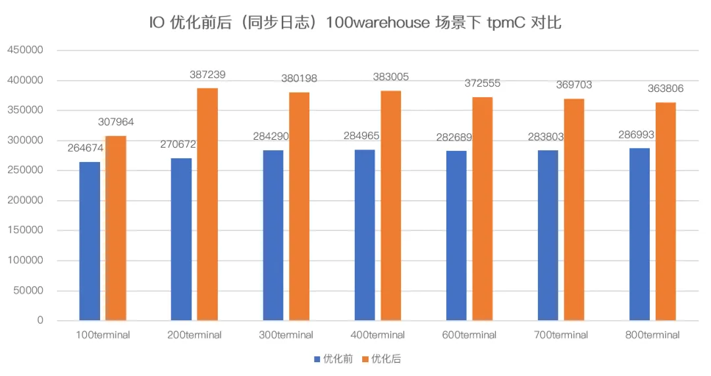

**综合调优前后性能对比**

在超融合场景下，经过多种手段调优后，tpmC 性能综合提升了 41% ~ 174%，性能提升效果非常明显。

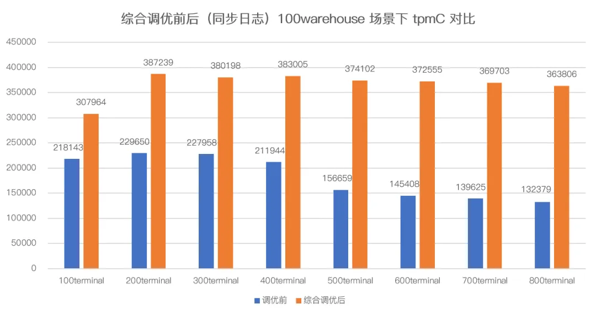

## SMTX ZBS 分布式存储场景测试

### 1. 测试环境

#### 1.1 使用 iSCSI 方式时，计算端配置情况

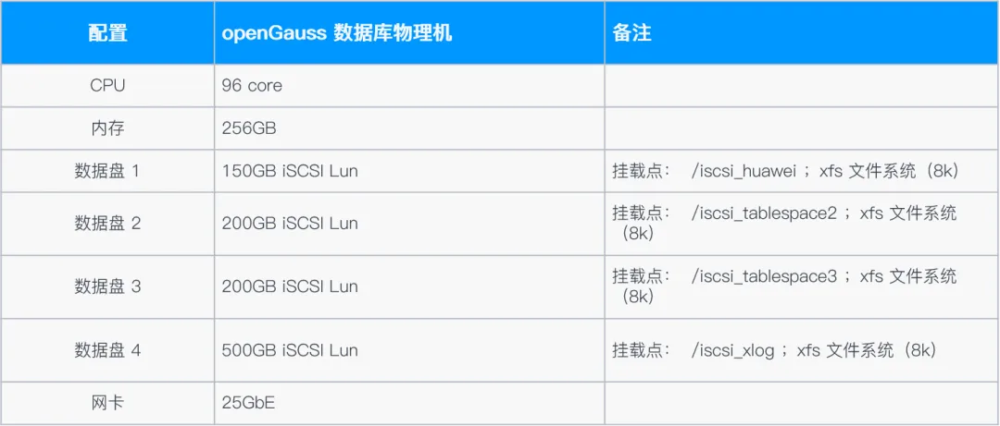

#### 1.2 使用 NVMe-oF 方式时，计算端配置情况

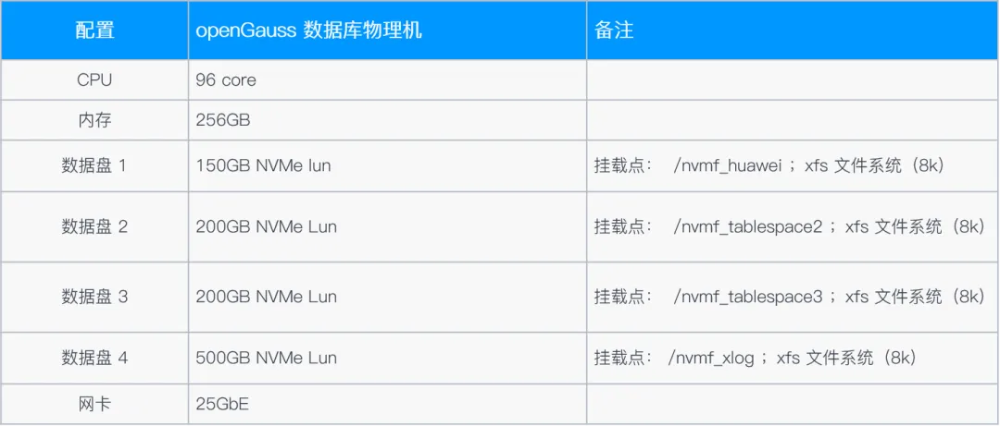

*分离式部署场景中， openguass 数据库直接部署在物理机上，可完全独占这台服务器的所有资源。

### 2. 测试模型

分离式部署场景测试分为两种部署架构：

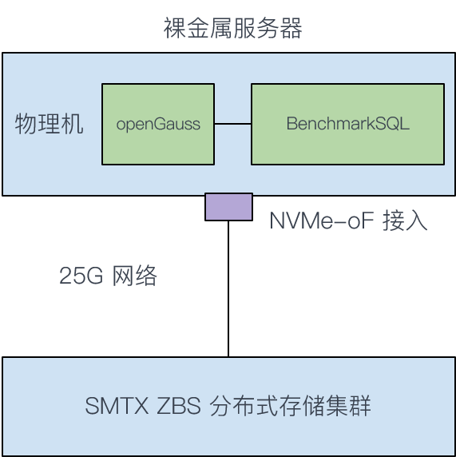

部署架构 1：openGauss 数据库服务器通过 iSCSI 协议连接 SMTX ZBS 分布式存储，这是一种连接分布式存储最常用（最通用）的协议，由于 iSCSI 协议性能开销较大，因此 IO 延时较高。

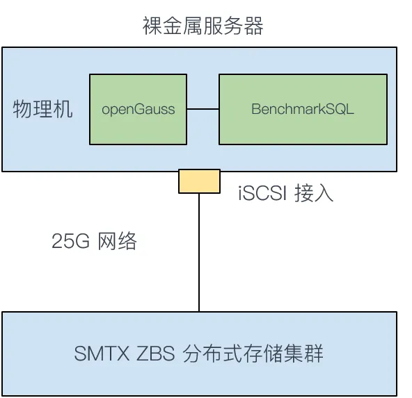

部署架构 2：为应对 IO 延时要求苛刻的数据库场景，SMTX ZBS 提供了高性能、低延时的 NVMe-oF 接入协议。openGauss 数据库服务器通过 NVMe-oF 协议接入存储可有效降低 IO 延时。

### 3. 测试内容

#### 3.1 NVMe-oF 接入协议对比 iSCSI 协议的性能提升

在 SMTX ZBS 分离部署场景下沿用了前面章节 SMTX OS 超融合场景的调优手段，并额外增加了索引的优化，性能测试结果如下：

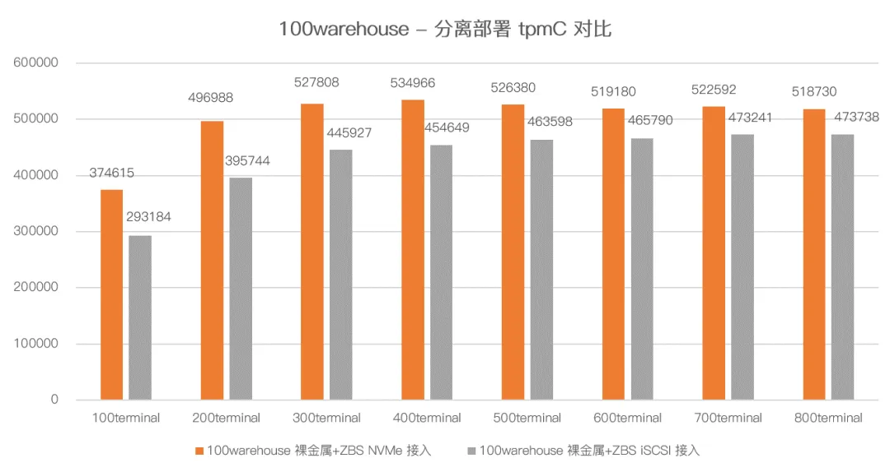

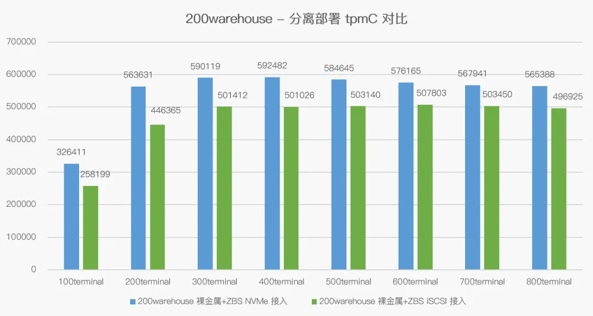

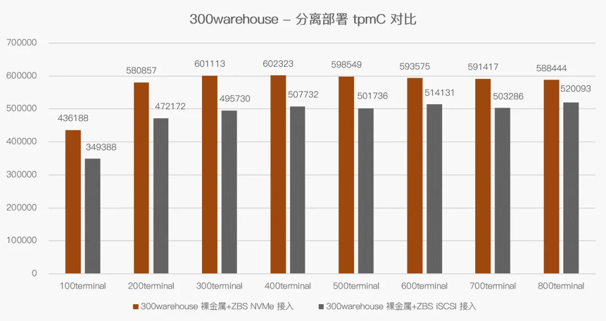

基于测试结果，我们可以得出以下结论：

- 采用 NVMe-oF 接入协议，相比 iSCSI 接入协议在所有场景下均能获得性能提升，tpmC 性能提升比例在 9% ~ 25% 之间。

#### 3.2 NVMe-oF 接入 ZBS 分布式存储对比本地 NVMe SSD 的测试结果

为帮助用户更好的理解测试结果，我们还增加了裸金属服务器 + 本地 NVMe SSD 的性能测试，其采用本地 NVMe SSD 裸盘格式化后用作数据库的存储空间进行测试。

其中，BenchmarkSQL 程序也部署在 openGauss 数据库所在的裸金属服务器中。

众所周知，NVMe 裸盘的 IO 性能是非常优秀的，因为我们以此模型为参照物，对比 SMTX ZBS 分布式存储在 NVMe-oF 接入协议下的性能表现，其测试结果如下：

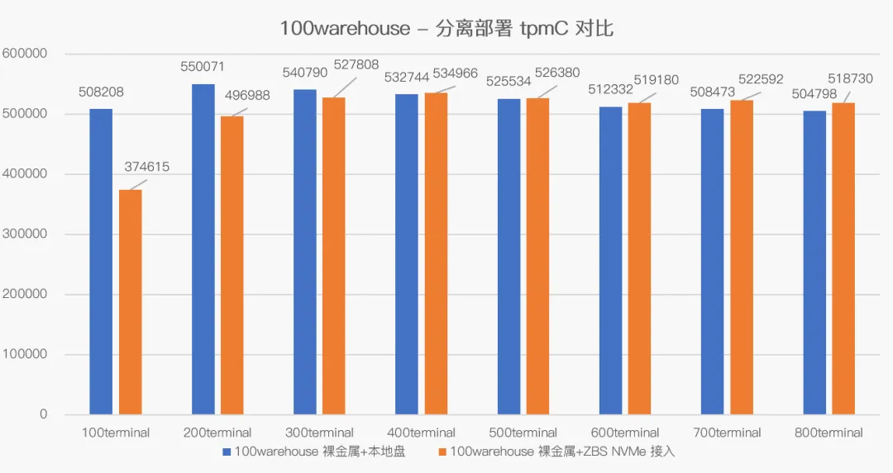

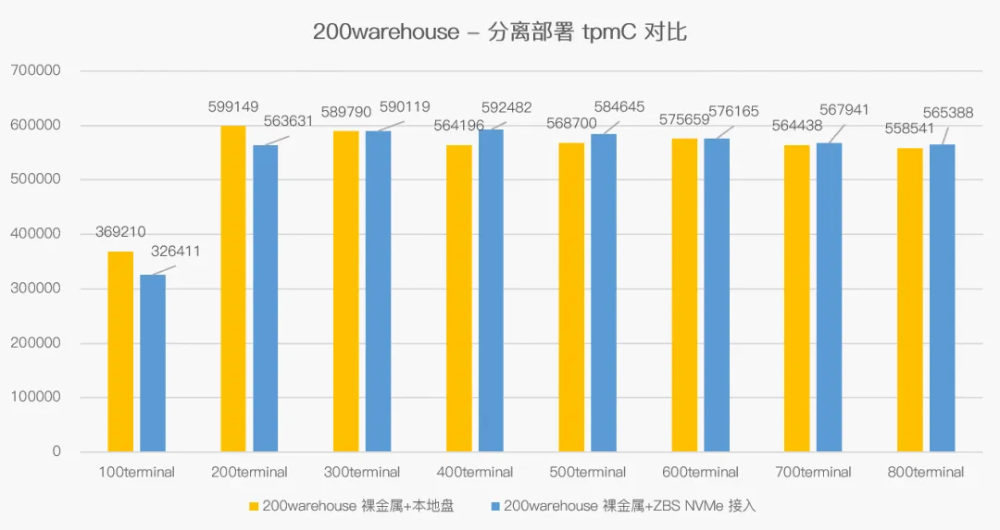

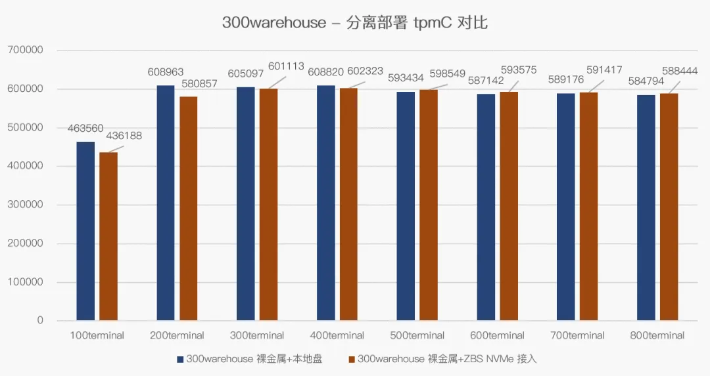

基于测试结果，我们可以得出以下结论：

- 大部分场景下，裸金属服务器 +ZBS NVMe-oF 协议接入的性能与裸金属服务器 + 本地 NVMe SSD 持平甚至略高。

- 多个测试模型中，裸金属服务器 +ZBS NVMe-oF 协议接入 tpmC 值最低也可以达到裸金属服务器 + 本地 NVMe SSD 性能的 73%，最高值能达到裸金属服务器 + 本地 NVMe SSD 性能的 110%。

本次测试为双方用户展示了 openGauss 数据库在 SmartX 平台上的真实表现，为用户提供了更多选择和参考。