## 1. openGauss可观测架构介绍

openGauss 是一款企业级开源关系性数据库。在企业的生产系统中，数据库一般位于上层应用和操作系统中间的位置。上层应用通过数据库处理分析数据，数据库与操作系统紧密结合，利用高效的存储硬件，对数据进行安全可靠的存放。如果缺少数据库的可观测能力，当上层应用出现异常时，运维人员往往只能看到问题的表象，无法发现数据库的潜在问题和性能瓶颈。所以可观测能力对数据库系统来说非常重要。

openGauss 通过将业界的性能分析手段与数据库内核逻辑相结合，提出了全栈的可观测、可追踪的架构。在内核中，openGauss 构建了三种类型的资源追踪链：存储资源消耗链，网络资源消耗链，CPU/内存资源消耗链。

通过这三条资源消耗链，实现了上钻下探的故障定位手段。

具体来讲，如果上层应用出现的异常，可以顺着资源消耗链往下去探究，看该应用在数据库内核中资源的消耗，在操作系统中的资源消耗，以及在硬件层面的资源占用。

反过来，如果网络或存储的硬件资源性能有异常波动，可以顺着资源消耗链往上去探究，看该资源的异常对数据库内核会产生什么样的影响，对上层应用会产生什么样的影响，及时发现潜在的问题。


<div class="case-img">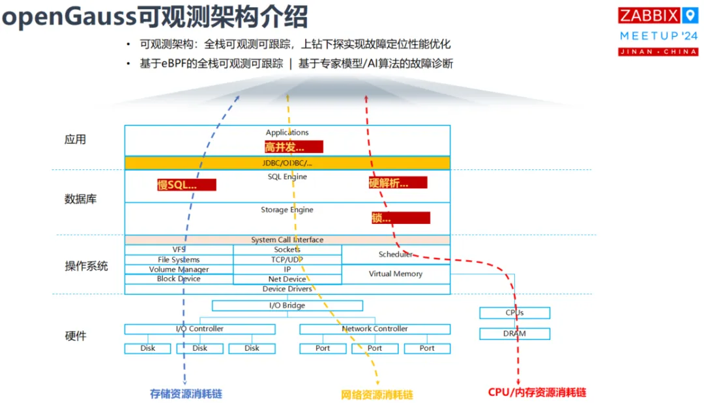</div>

## 2. openGauss WDR 功能介绍

WDR(Workload Diagnosis Report) 基于两次不同时间点系统的性能快照数据，生成这两个时间点之间的性能表现报表，用于诊断数据库内核的性能故障。

使用 generate_wdr_report(…) 可以生成基于两个性能快照的性能报告。

### 1. 配置 WDR 开关配置为 on

```
enable_wdr_snapshot = on
```

### 2. 执行如下命令新建报告文件。

```
touch  /home/om/wdrTestNode.html
```

### 3. 执行如下命令连接数据库

```
gsql -d postgres -p 端口号 -r
```

### 4. 查询已经生成的快照

```
openGauss=# select * from snapshot.snapshot;

 snapshot_id |           start_ts            |            end_ts            

-------------+-------------------------------+-------------------------------

           1 | 2020-09-07 10:20:36.763244+08 | 2020-09-07 10:20:42.166511+08

           2 | 2020-09-07 10:21:13.416352+08 | 2020-09-07 10:21:19.470911+08

(2 rows)
```

### 5. 生成格式化性能报告 wdrTestNode.html

```
openGauss=# \a \t \o /home/om/wdrTestNode.html

Output format is unaligned.

Showing only tuples.
```

### 6. 向性能报告 wdrTestNode.html 中写入数据

```
openGauss=# select generate_wdr_report(1, 2, 'all', 'node', 'dn_6001_6002_6003');
```

### 7. 关闭性能报告 wdrTestNode.html

```
openGauss=# \o
```

### 8. 生成格式化性能报告 wdrTestCluster.html

```
openGauss=# \o /home/om/wdrTestCluster.html
```

### 9. 向格式化性能报告 wdrTestCluster.html 中写入数据

```
openGauss=# select generate_wdr_report(1, 2, 'all', 'cluster');
```

### 10. 关闭性能报告 wdrTestCluster.html

```
openGauss=# \o \a \t

Output format is aligned.

Tuples only is off.
```

<div class="case-img">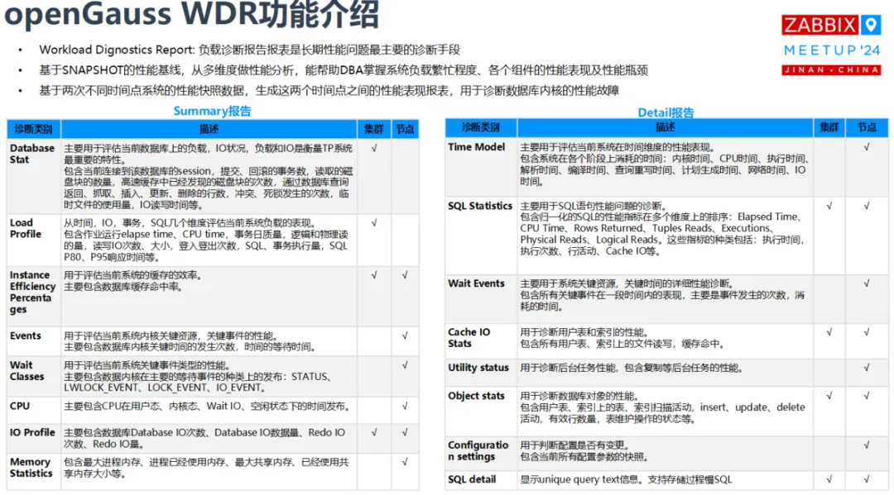</div>

WDR报告样例的部分截图如下：

<div class="case-img">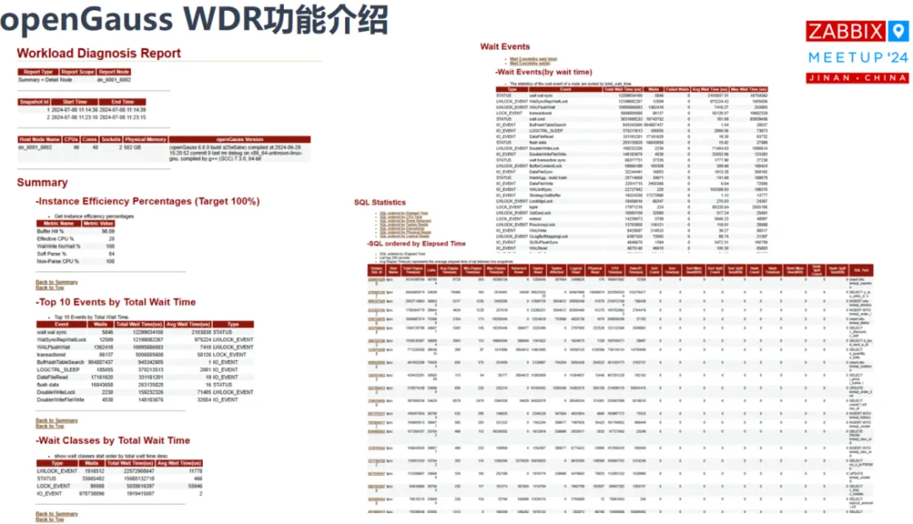</div>

## 3. openGauss ASP 功能介绍

ASP(Active Session Profile) 活跃会话概要信息，主要用于诊断秒级性能抖动场景，可记录某时刻SQL语句、等待事件、锁信息、事务语句开始时间等。

通过采样实例活跃会话的状态信息，低成本复现过去一段时间的系统活动，主要包含会话基本信息，会话事务，语句，等待事件，会话状态（active、idle等），当前正阻塞在哪个事件上，正在等待哪个锁，或被哪个会话阻塞。

ASP 每秒获取活跃会话事件，放到内存中，当内存中的数据到达阈值，会存放到 gs_asp 表中。

<div class="case-img">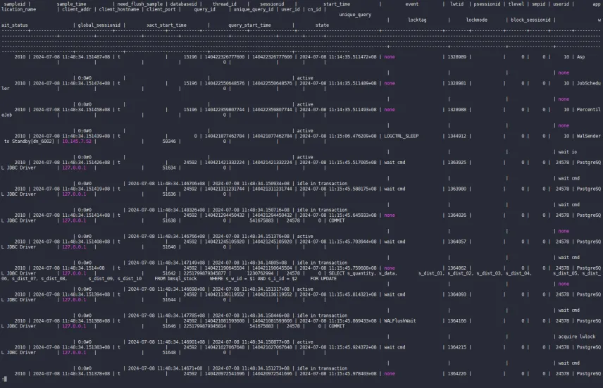</div>

## 4. 基于openGauss适配Zabbix

Zabbix 监控平台默认情况下，原生不支持 openGauss 数据库作为后台数据存储。通过简单的适配修改后，可以将 Zabbix 监控平台对接到 openGauss 数据库上。

1.在 openGauss 数据库中建立和导入 Zabbix 系统需要的所有底层表数据

<div class="case-img">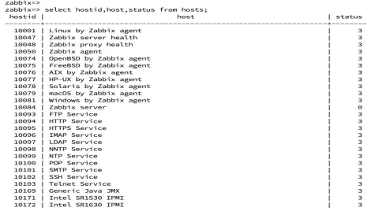</div>

2.修改Zabbix源码中对数据库版本的要求，重新编译安装

<div class="case-img">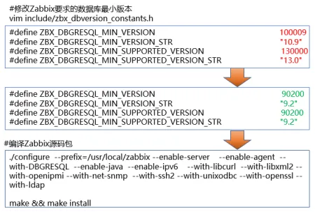</div>

3.修改Zabbix Server中连接底层数据库的配置参数，启动Zabbix Server和Agentd

<div class="case-img">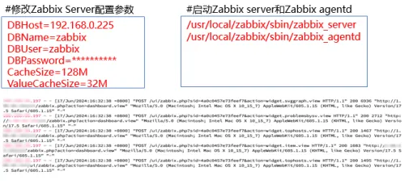</div>

4.适配完成，启动后，检查Zabbix监控平台各个功能均正常运行，性能稳定

<div class="case-img">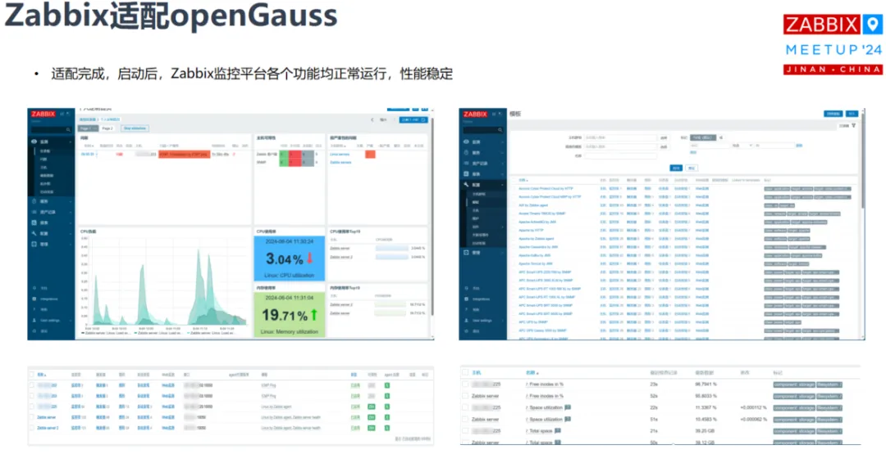</div>

## 5. 使用Zabbix监控openGauss的运行状态

通过Zabbix高度灵活的自定义模板的功能可以快速创建出适配openGauss的模板。

<div class="case-img">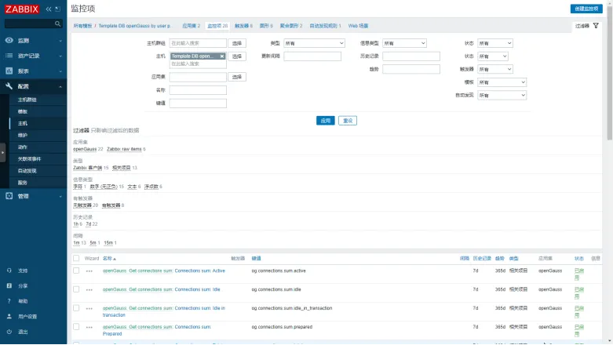</div>

在Zabbix中添加openGauss数据库所在的主机后，可以正确监控到当前数据库的版本等基本信息。

<div class="case-img">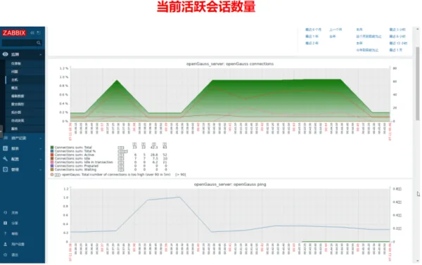</div>

<div class="case-img">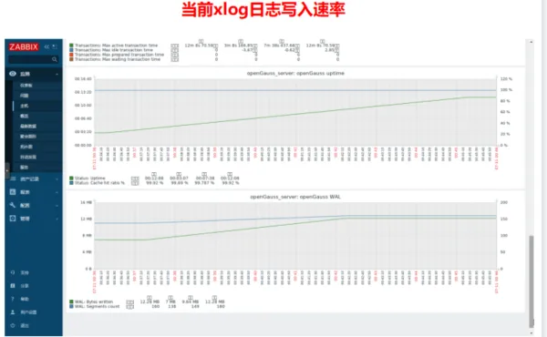</div>