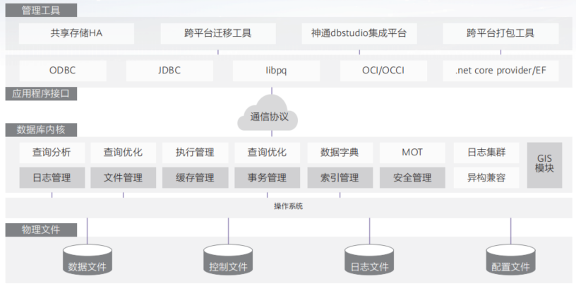

## 产品介绍

神通数据库（openGauss版）是一款高性能、高安全、高可靠的企业级关系型数据库，采用客户端/服务器、单进程多线程架构，支持单机和一主多备部署方式，备机可读，支持双机高可用和读扩展，将有力支撑企业数字化转型，助推我国数字经济健康发展。

## 高性能

• 两路鲲鹏性能150万tpmC；

• 面向多核架构的并发控制技术；

• NUMA-Aware存储引擎；

• SQL-Bypass智能选路执行技术；

• 面向实时高性能场景的内存引擎。

## 高安全

• 业务无忧，故障切换时间低于10s；

• 精细安全管理：细粒度访问控制、多维度审计；

• 全方位数据保护：存储&传输&导出加密。

## 易运维

• 智能参数调优: 结合深度强化学习和启发式算法,实现参数自动推荐;

• 慢SQL诊断，多维性能自监控视图，实时掌控系统性能表现;

• 提供在线自学习的SQL时间预测、快速定位、急速调优。

