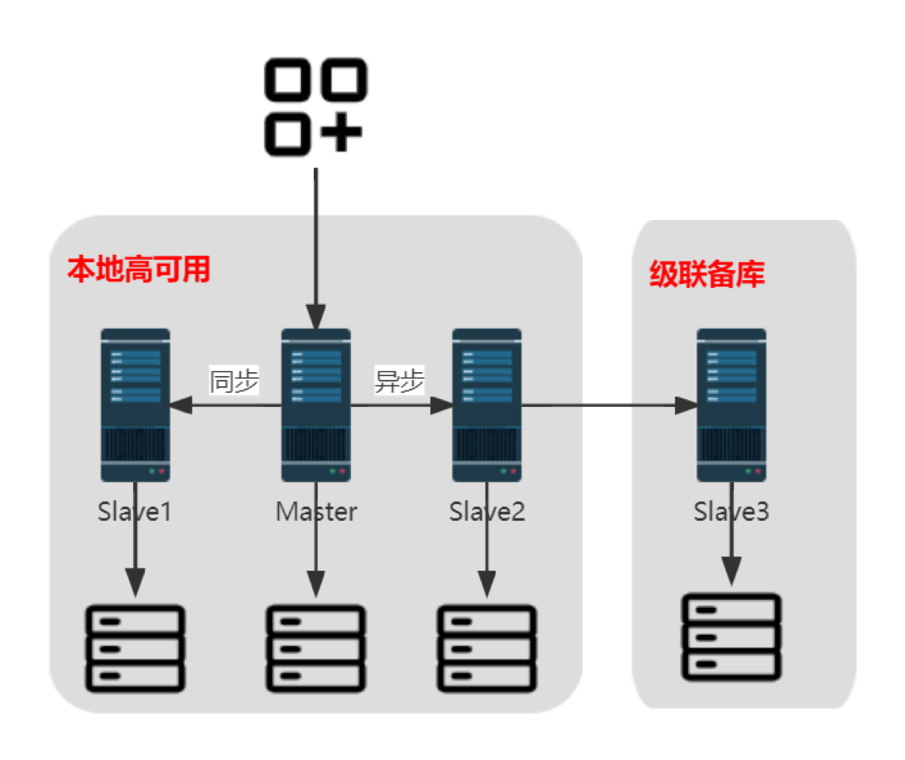

## 应用场景

兴业银行支付系统为签约商户提供网络支付、对账、清算等服务，是对多渠道客户的重要支付服务平台。为进一步优化支付系统功能，提升支付系统业务处理能力和服务水平，系统引入 openGauss 数据库部分替代 Infomix 数据库。

## 解决方案

兴业银行支付系统属于存量系统，迁移到 openGauss 数据库涉及数据库结构和数据迁移、应用适配。兴业银行借助第三方数据库迁移工具，实现自动化、流程化迁移，解决了迁移前后数据库的字符集、存储过程语法兼容等问题。
系统灾备体系架构采用“1 主 2 备 1 级联”，并通过性能监控、预警的运维机制保障迁移后数据库的高可用性。

在上期所业务系统替代改造过程中，云和恩墨及 MogDB 提供如下技术支持：

## 客户收益

· 系统运行平稳，符合业务与研发预期，推荐向支付系统其他相关场景迁移替代。

## 合作伙伴

