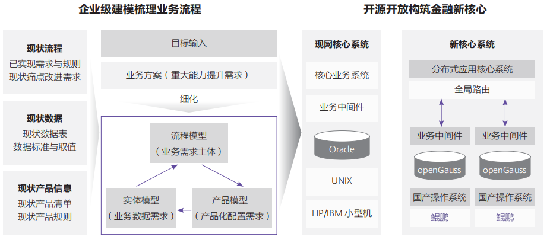

## 应用场景

在数字化时代，邮政储蓄银行积极利用科技进行金融服务探索，坚持以开源开放的技术路线构筑自主可演
进的金融核心系统，对银行现有的业务进行变革，以支持业务创新及未来可持续发展。

## 解决方案

通过鲲鹏+国产操作系统+openGauss软硬全栈作为IT基础设施，以高性能、高安全、高可靠的出色综合表
现为邮政储蓄银行分布式金融核心提供了底层IT能力，支持存款、汇款等核心业务处理。

## 客户收益

• 支持邮政储蓄银行全国数亿用户，数万个网点，日均数十亿的交易。

• 平均查询效率提升50%，业务体验提升，客户满意度提高。

• 新核心系统有效地支持起邮政储蓄银行未来业务创新和发展。

## 合作伙伴

    

