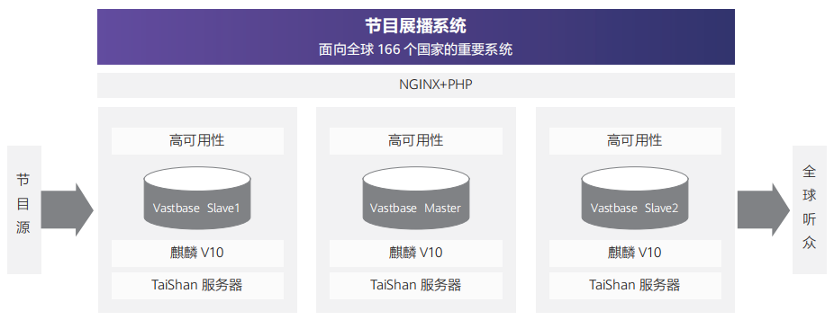

## 客户挑战

原有的 MySQL 数据库存在以下关键问题：
• 基于 binlog 的跨 AZ 异步复制，RPO>0，双云切换丢失数据
• 单库 500GB 容量瓶颈，分库分表架构无法弹性扩展，应用开发复杂

## 解决方案

GaussDB(for openGauss)通过提供以下解决方案，完成消费者云关键业务数据库的云化改造。

• 分布式高扩展：提供分布式扩展能力，提供分布式事务 ACID 保障

• 同城跨 AZ 多活、跨 Region 容灾：单集群同城跨 AZ 部署，RPO=0、RTO<60s，AZ 级故障数据不丢失。跨 Region 多活容灾，业务就近接入。

## 客户收益

• 累计上线 GaussDB(for openGauss)超过 4000 节点、万亿级海量数据，系统运行平稳；定位服务吞吐量提升 4 倍；
• 单集群 10 万+并发响应能力，弹性扩缩容；
• 分布式事务强一致，简化应用开发。
• 在线扩容，业务不中断。同城跨 AZ 双活、RPO=0。

## 合作伙伴

    
    

