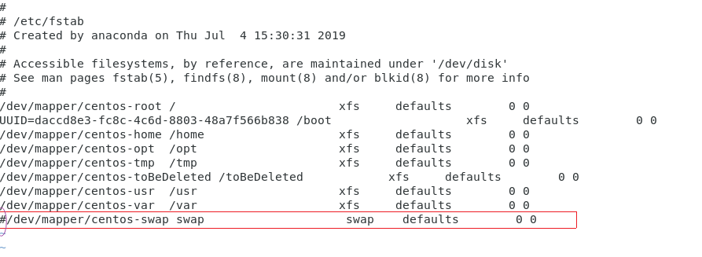
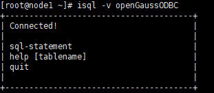
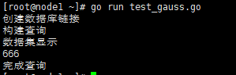

# Go 语言连接 openGauss 环境搭建过程（含 OG 安装）<a name="ZH-CN_TOPIC_0000001232453175"></a>

## 1.前言<a name="section115121517141910"></a>

本文共分为 openGauss 单机版安装部分和连接环境搭建部分，提供了通过 go 语言来连接 openGauss 的一种方案。openGauss 现在也有了基于 go 的驱动，但是我觉得 ODBC 的方式更为通用一些，也不应被丢弃，因此本文使用 go 通过 ODBC 来连接 openGauss。

- 硬件及软件环境：

  硬件环境：虚拟机的内存 8GB，4 核心 CPU，900G 磁盘（非必须）

  软件环境：CentOS7.6

  数据库版本：opengauss2.0 企业版：openGauss-2.0.0-CentOS-64bit-all.tar.gz

## 2.openGauss 单机版安装：<a name="section105852041121919"></a>

- 2.1. 关闭防火墙

  ```
  #停止firewall
  systemctl stop firewalld.service
  #禁止firewall开机启动
  systemctl disable firewalld.service
  #检查防火墙是否关闭。
   systemctl status firewalld
  ```

  - 说明：

    若防火墙状态显示为 active \(running\)，则表示防火墙未关闭。

    若防火墙状态显示为 inactive \(dead\)，则无需再关闭防火墙。

- 2.2. 设置时区和时间

  将各数据库节点的时区设置为相同时区，可以将/usr/share/zoneinfo/目录下的时区文件拷贝为/etc/localtime 文件。

  ```
  cp /usr/share/zoneinfo/Asia/Shanghai  /etc/localtime
  ```

- 2.3. 关闭 SELinux

  ```
  [root@node1 ~]#

  getenforce
  sed -i 's/^SELINUX=.*/SELINUX=disabled/' /etc/selinux/config
  setenforce 0
  getenforce
  #检查
   cat /etc/selinux/config|grep SELINUX
  输出：

  # SELINUX= can take one of these three values:

  SELINUX=disabled

  # SELINUXTYPE= can take one of three values:

  SELINUXTYPE=targeted

  [root@node1 ~]#
  ```

- 2.4. 修改/etc/hosts

  ```
  #添加一行

  cat >>/etc/hosts <<EOF
  192.168.183.28 node1
  EOF
  ```

- 2.5. 配置库路径

  ```
  cat>> /etc/profile<<EOF
  export LD_LIBRARY_PATH=/opt/software/openGauss/script/gspylib/clib:$LD_LIBRARY_PATH
  EOF
  ```

- 2.6. 关闭 os 交换区

  编辑/etc/fstab 文件，将交换区的那一行注释掉

  vi /etc/fstab

  

  :wq 保存退出 vi

  临时关闭交换区命令：

  ```
  swapoff -a
  free
  ```

- 2.7. 设置 root 用户远程登陆

  ```
  sed -i "s/#Banner none/Banner none/g" /etc/ssh/sshd_config
  cat >>/etc/ssh/sshd_config<<EOF
  PermitRootLogin yes
  EOF
   systemctl restart sshd
  #检查
  cat /etc/ssh/sshd_config  | grep PermitRootLogin
  cat /etc/ssh/sshd_config | grep Banner
  ```

  如下显示修改正确：

  ```
  PermitRootLogin yes
  Banner none
  ```

- 2.8. 文件系统参数、系统支持的最大进程数

  ```
  echo "* soft nofile 1000000" >>/etc/security/limits.conf
  echo "* hard nofile 1000000" >>/etc/security/limits.conf
  echo "* soft nproc unlimited" >>/etc/security/limits.conf
  echo "* hard nproc unlimited" >>/etc/security/limits.conf
  ```

- 2.9. 安装 python3.6.x

  ```
  yum install openssl* -y
  yum install python3* -y
  ```

  检查

  ```
  [omm@node1 dn]$ python3 -V
  Python 3.6.8
  ```

  其他软件包，如需要可以安装（也可以直接使用安装）：

  ```
  yum install -y libaio-devel flex bison ncurses-devel glibc-devel patch redhat-lsb-core readline-devel
  yum install openssl* -y
  yum install -y java-1.8.0-openjdk* psmisc bzip2 python3 python3-devel lksctp*
  reboot   #重新启动服务器
  ```

- 2.10. 创建安装包的存放目录

  ```
  mkdir -p /opt/software/openGauss
  chmod 755 -R /opt/software
  ```

- 2.11. 下载 openGauss 数据库软件

  下载地址为：[<u>https://opengauss.org/zh/download/</u>](https://opengauss.org/zh/download/)

  下载完成后上传到 centos 中

- 2.12. 解压缩 openGauss DBMS 介质

  ```
  cd /opt/software/openGauss
  tar -zxvf openGauss-2.0.0-CentOS-64bit-all.tar.gz
  tar -zxvf openGauss-2.0.0-CentOS-64bit-om.tar.gz
  ```

- 2.13. 创建 XML 文件

  下面是 xml 文件官方模板，一般只需要改一下自己 centos 机器的 IP

  ```
  cat > clusterconfig.xml<<EOF
  <?xml version="1.0" encoding="UTF-8"?>
  <ROOT>
      <!-- openGauss整体信息 -->
      <CLUSTER>
          <!-- 数据库名称 -->
          <PARAM name="clusterName" value="dbCluster" />
          <!-- 数据库节点名称(hostname) -->
          <PARAM name="nodeNames" value="node1" />
          <!-- 数据库安装目录-->
          <PARAM name="gaussdbAppPath" value="/opt/huawei/install/app" />
          <!-- 日志目录-->
          <PARAM name="gaussdbLogPath" value="/var/log/omm" />
          <!-- 临时文件目录-->
          <PARAM name="tmpMppdbPath" value="/opt/huawei/tmp" />
          <!-- 数据库工具目录-->
          <PARAM name="gaussdbToolPath" value="/opt/huawei/install/om" />
          <!-- 数据库core文件目录-->
          <PARAM name="corePath" value="/opt/huawei/corefile" />
          <!-- 节点IP，与数据库节点名称列表一一对应 -->
          <PARAM name="backIp1s" value="192.168.183.28"/>
      </CLUSTER>
      <!-- 每台服务器上的节点部署信息 -->
      <DEVICELIST>
          <!-- 节点1上的部署信息 -->
          <DEVICE sn="node1">
              <!-- 节点1的主机名称 -->
              <PARAM name="name" value="node1"/>
              <!-- 节点1所在的AZ及AZ优先级 -->
              <PARAM name="azName" value="AZ1"/>
              <PARAM name="azPriority" value="1"/>
              <!-- 节点1的IP，如果服务器只有一个网卡可用，将backIP1和sshIP1配置成同一个IP -->
              <PARAM name="backIp1" value="192.168.183.28"/>
              <PARAM name="sshIp1" value="192.168.183.28"/>
      <!--dbnode-->
      <PARAM name="dataNum" value="1"/>
      <PARAM name="dataPortBase" value="26000"/>
      <PARAM name="dataNode1" value="/opt/huawei/install/data/dn"/>
              <PARAM name="dataNode1_syncNum" value="0"/>
          </DEVICE>
      </DEVICELIST>
  </ROOT>
  EOF
  ```

- 2.14. 检查环境变量

  ```
  echo $LD_LIBRARY_PATH
  ```

- 2.15. 安装前进行交互式检查

  ```
  [root@node1 script]#  ./gs_preinstall -U omm -G dbgrp -X /opt/software/openGauss/clusterconfig.xml
  ```

  出现以下内容代表检查没问题。

  Parsing the configuration file.

  ```
  Successfully parsed the configuration file.
  Installing the tools on the local node.
  Successfully installed the tools on the local node.
  Setting pssh path
  Successfully set core path.
  Are you sure you want to create the user[omm] and create trust for it (yes/no)? yes
  Please enter password for cluster user.
  Password: omm123
  Please enter password for cluster user again.
  Password: omm123
  Successfully created [omm] user on all nodes.
  Preparing SSH service.
  Successfully prepared SSH service.
  Checking OS software.
  Successfully check os software.
  Checking OS version.
  Successfully checked OS version.
  Creating cluster's path.
  Successfully created cluster's path.
  Setting SCTP service.
  Successfully set SCTP service.
  Set and check OS parameter.
  Setting OS parameters.
  Successfully set OS parameters.
  Warning: Installation environment contains some warning messages.
  Please get more details by "/opt/software/openGauss/script/gs_checkos -i A -h node1 --detail".
  Set and check OS parameter completed.
  Preparing CRON service.
  Successfully prepared CRON service.
  Setting user environmental variables.
  Successfully set user environmental variables.
  Setting the dynamic link library.
  Successfully set the dynamic link library.
  Setting Core file
  Successfully set core path.
  Setting pssh path
  Successfully set pssh path.
  Set ARM Optimization.
  No need to set ARM Optimization.
  Fixing server package owner.
  Setting finish flag.
  Successfully set finish flag.
  Preinstallation succeeded
  ```

- 2.16. 开始安装 openGauss DBMS 和创建数据库

  使用 root 执行如下命令

  ```
  cd /opt/software/openGauss/script
  chmod -R 755 /opt/software/openGauss/script
  chown -R omm:dbgrp /opt/software/openGauss/script
  ```

  使用 omm 用户安装 openGauss DBMS 和创建 openGauss 数据库

  ```
  su - omm
  cd /opt/software/openGauss/script
  cp ../clusterconfig.xml .
  gs_install -X /opt/software/openGauss/script/clusterconfig.xml
  ```

  重要提示：用户需根据提示输入数据库的密码，密码需要具有一定的复杂度，为保证用户正常使用该数据库，请记住输入的数据库密码。此处建议密码设置为 huawei@1234

  ```
  [omm@node1 ~]$ cd /opt/software/openGauss/script
  [omm@node1 script]$ cp ../clusterconfig.xml .
  [omm@node1 script]$ gs_install -X /opt/software/openGauss/script/clusterconfig.xml
  ```

  ```
  Parsing the configuration file.
  Check preinstall on every node.
  Successfully checked preinstall on every node.
  Creating the backup directory.
  Successfully created the backup directory.
  begin deploy..
  Installing the cluster.
  begin prepare Install Cluster..
  Checking the installation environment on all nodes.
  begin install Cluster..
  Installing applications on all nodes.
  Successfully installed APP.
  begin init Instance..
  encrypt cipher and rand files for database.
  Please enter password for database:huawei@1234
  Please repeat for database:huawei@1234
  begin to create CA cert files
  The sslcert will be generated in /opt/huawei/install/app/share/sslcert/om
  Cluster installation is completed.
  Configuring.
  Deleting instances from all nodes.
  Successfully deleted instances from all nodes.
  Checking node configuration on all nodes.
  Initializing instances on all nodes.
  Updating instance configuration on all nodes.
  Check consistence of memCheck and coresCheck on database nodes.
  Configuring pg_hba on all nodes.
  Configuration is completed.
  Successfully started cluster.
  Successfully installed application.
  end deploy..
  ```

  查看数据库状态：

  ```
  [omm@node1 script]$ gs_om -t status
  ```

  会出现以下内容:

  ***

  ```
  cluster_name    : dbCluster
  cluster_state   : Normal
  redistributing  : No
  ---------------------------------------------------------------------
  [omm@node1 script]$
  ```

  启动数据库（安装完默认已经启动）：

  ```
  [omm@node1 db1]$ gs_om -t start
  Starting cluster.

  =========================================

  [SUCCESS] node1:

  [2021-04-01 16:50:13.969][29784][][gs_ctl]: gs_ctl started,datadir is /opt/huawei/install/data/dn

  [2021-04-01 16:50:13.974][29784][][gs_ctl]:  another server might be running; Please use the restart command

  =========================================

  Successfully started.
  ```

  - 使用 omm 用户执行下面的操作。

    登录到数据库，

    ```
    gsql -d postgres -p 26000 -r
    ```

    \#执行上条命令会出现以下提示内容。

    ```
    gsql ((openGauss 2.0.0 build 78689da9) compiled at 2021-03-31 21:04:03 commit 0 last mr  )
    Non-SSL connection (SSL connection is recommended when requiring high-security)
    Type "help" for help.
    ```

    其他常见的基本命令

    ```
    \q  #退出会话
    gs_om  -t stop #关闭数据库
    gs_om  -t restart  #重启数据库
    ```

    更多操作使用说明见官方文档：[https://opengauss.org/zh/docs/2.1.0/docs/Quickstart/Quickstart.html](https://opengauss.org/zh/docs/2.1.0/docs/Quickstart/Quickstart.html)

## 3. 连接环境搭建<a name="section67612261914"></a>

- 3.1 安装 go 语言环境

  安装 go 语言，安装包下载地址：[https://dl.google.com/go/go1.17.5.linux-amd64.tar.gz](https://dl.google.com/go/go1.17.5.linux-amd64.tar.gz)

  上传压缩包后解压： tar -C /usr/local/ -xvf go1.11.4.linux-amd64.tar.gz

  配置环境变量

  ```
  vi /etc/profile
  ```

  追加以下内容：

  ```
  export PATH=$PATH:/usr/local/go/bin
  ```

  让环境变量配置生效：

  ```
  source /etc/profile
  ```

  验证 go 是否安装成功：

  ```
  go version
  ```

  出现以下内容代表安装成功（我装的是 1.16 版本，以你下载的安装包版本为准）：

  

- 3.2 搭建 unixODBC 环境

  下载安装 unixODBC:

  ```
  yum install unixODBC
  yum install unixODBC-devel  #非必须
  ```

  下载 openGauss ODBC 驱动 ODBC_2.1.0：[https://opengauss.org/zh/download/](https://opengauss.org/zh/download/)

  下载之后上传到 centos 机器上/soft 路径（该路径不是必须） ，把驱动拷贝到指定目录下：

  ```
  cd /soft
  tar -xzvf openGauss-2.1.0-ODBC.tar.gz
  cp lib/* /usr/local/lib
  cp odbc/lib/* /usr/local/lib
  ```

  安装完 unixODBC 后，/etc 目录下会有一个文件: odbcinst.ini ，接下来配置这个文件

  ```
  vim odbcinst.ini
  ```

  将下列内容添加进去：

  ```
  [openGauss]
  Driver64=/usr/local/lib/psqlodbcw.so
  setup=/usr/local/lib/psqlodbcw.so
  ```

  另外在/etc 下编辑 odbc.ini\(如没有则新建\)：

  ```
  vim /etc/odbc.ini
  ```

  将下列内容拷贝进去：

  ```
  [openGaussODBC]
  Driver=openGauss
  Servername=192.168.183.28
  Database=postgres
  Username=gem
  Password=huawei@1234
  Port=26000
  DatabaseName=postgres
  ```

  注，上面要填自己的 IP,数据库用户名和口令，且不能是 omm 初始用户。

  到此配置基本完成了，下面验证 odbc 是否可以 openGauss（数据库要开启）:

  ```
  isql -v openGaussODBC
  ```

  若出现以下内容代表配置 ok，连接没有问题：

  

- 3.3 编写 go 语言通过 ODBC 连接 openGauss 的测试脚本并执行验证

  ```
  vim test_gauss.go :
  package main
  import (
      "database/sql"
      "fmt"
      _ "odbc/driver"
  )

  func main() {
      fmt.Printf("%s\n", "创建数据库链接")
      conn, err := sql.Open("odbc","DSN=openGaussODBC;UID=gem;PWD=huawei@1234")
      if err != nil {
          fmt.Println("链接错误")
          return
      }
      defer conn.Close()
      fmt.Printf("%s\n", "构建查询")
      stmt, err := conn.Prepare("select 666;")
      if err != nil {
          fmt.Println("查询异常：", err)
          return
      }
      defer stmt.Close()
      row, err := stmt.Query()
      if err != nil {
          fmt.Println("查询错误：", err)
      }
      defer row.Close()
      fmt.Printf("%s\n", "数据集显示")
      for row.Next() {
          var id int
          if err := row.Scan(&id); err == nil {
              fmt.Println(id)
          }
  ```

  在脚本路径下执行测试：

  ```
  go run test_gauss.go
  ```

  若出现以下结果表明连接成功。

  

## 4.总结<a name="section124961839121819"></a>

个人认为，比较容易出错的点是，虚拟机内存要大于等于 8GB，unixODBC 两个配置文件 odbc.ini 和 odbcinst.ini 的配置稍麻烦，最后，数据库一定要 start 才能连接成功，个人有一次犯了一次这个错误，虽然是很浅显的道理哈哈。
