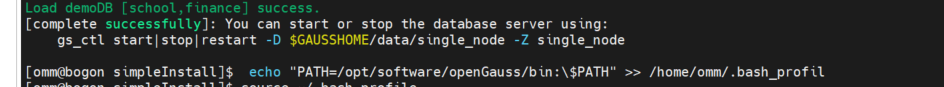

# centos7 安装 openGauss 极简版本<a name="ZH-CN_TOPIC_0000001186895100"></a>

1 基础环境准备：<a name="section1331515366620"></a>

- 系统：

  ```
  [root@bogon ~]# cat /etc/redhat-release
  CentOS Linux release 7.9.2009 (Core)
  [root@bogon ~]#
  ```

- 相关软件：

  安装 netstat，由于 centos7 默认不带这个命令需要单独安装

  ```
  yum install net-tools -y
  ```

  安装 bzip2 因为官方的安装包是 openGauss-x.x.x-openEuler-64bit.tar.bz2 不安装这个软件直接解压命令报错

  ```
  yum -y install bzip2 -y
  ```

  修改内核的配置因为在你安装 install 命令的时候会出现如下报错

  ```
  On systemwide basis, the maximum number of SEMMNI is not correct. the current SEMMNI value is: 128. Please check it.
  ```

  **解决：**在/etc/sysctl.conf 中加入语句 kernel.sem = 250 32000 100 999，然后执行 sysctl -p

  安装 wget 命令用于下载 openGauss 的软件包

  ```
   wget https://opengauss.obs.cn-south-1.myhuaweicloud.com/2.1.0/x86/openGauss-2.1.0-CentOS-64bit.tar.bz2
  ```

- 关闭防火墙和 selinux

  ```
  ## 关闭防火墙

  systemctl status firewalld

  systemctl disable firewalld.service

  systemctl stop firewalld.service


   ## 关闭SELinux

  sed -i '/SELINUX=/d' etc/selinux/config

  echo "SELINUX=disabled" >> /etc/selinux/config

  cat etc/selinux/config|grep -v ^#|grep -v '^$'
  ```

- 输入这个命令 selinux 直接关闭不用重启

  ```
  setenforce 0
  ```

## 2 安装环境准备：<a name="section68386201185"></a>

```
groupadd -g 1001 dbgrp
useradd -u 2001 -g dbgrp omm
mkdir -p /opt/software/openGauss
chown -R omm:dbgrp opt
```

- 切换 omm 用户安装

  ```
  [root@db1 ~]# su - omm
  [omm@db1 ~]$ cd /opt/software/openGauss/
  [omm@db1 openGauss]$ tar -jxf openGauss-2.1.0-CentOS-64bit.tar.bz2 -C /opt/software/openGauss/
  ```

- 安装：

  ```
  [omm@bogon ~]$ cd /opt/software/openGauss/simpleInstall/
  [omm@bogon simpleInstall]$ ls
  finance.sql  install.sh  README.md  school.sql
  [omm@bogon simpleInstall]$ sh install.sh -w gauss#123
  - -w：初始化数据库密码（gs_initdb指定），安全需要必须设置。
  -p：指定的openGauss端口号，如不指定，默认为5432。
  -h|–help：打印使用说明。
  ```

  安装后，该数据库部署结点的名称为 sgnode（gs_initdb 指定）。

  执行时，如果出现报错“the maximum number of SEMMNI is not correct, the current SEMMNI is xxx. Please check it.”，请使用有 root 权限的用户执行如下命令 。

  安装成功会出现如下界面：

  

- 启动成功：

  ```
  [omm@bogon ~]$  gs_ctl start -D $GAUSSHOME/data/single_node -Z single_node
  [2021-12-14 15:32:45.083][11887][][gs_ctl]: gs_ctl started,datadir is /opt/software/openGauss/data/single_node
  [2021-12-14 15:32:45.089][11887][][gs_ctl]:  another server might be running; Please use the restart command
  [omm@bogon ~]$ gsql -d postgres -p  -r
  failed to connect Unknown:-r.
  [omm@bogon ~]$ gsql -d postgres -p
  gsql：选项需要一个参数 -- p
  Try "gsql --help" for more information.
  [omm@bogon ~]$ gsql -d postgres -p 5432 -r
  gsql ((openGauss 2.1.0 build 590b0f8e) compiled at 2021-09-30 14:29:04 commit 0 last mr  )
  Non-SSL connection (SSL connection is recommended when requiring high-security)
  Type "help" for help.

  openGauss=# \l
                                List of databases
     Name    | Owner | Encoding |   Collate   |    Ctype    | Access privileges
  -----------+-------+----------+-------------+-------------+-------------------
   postgres  | omm   | UTF8     | en_US.UTF-8 | en_US.UTF-8 |
   template0 | omm   | UTF8     | en_US.UTF-8 | en_US.UTF-8 | =c/omm           +
             |       |          |             |             | omm=CTc/omm
   template1 | omm   | UTF8     | en_US.UTF-8 | en_US.UTF-8 | =c/omm           +
             |       |          |             |             | omm=CTc/omm
  (3 rows)

  openGauss=# \q
  ```

文档写的很粗糙，但是安装完使用完全没有问题。

参考连接：https://opengauss.org/zh/docs/2.1.0/docs/installation/%E5%8D%95%E8%8A%82%E7%82%B9%E5%AE%89%E8%A3%85.html

opengauss
