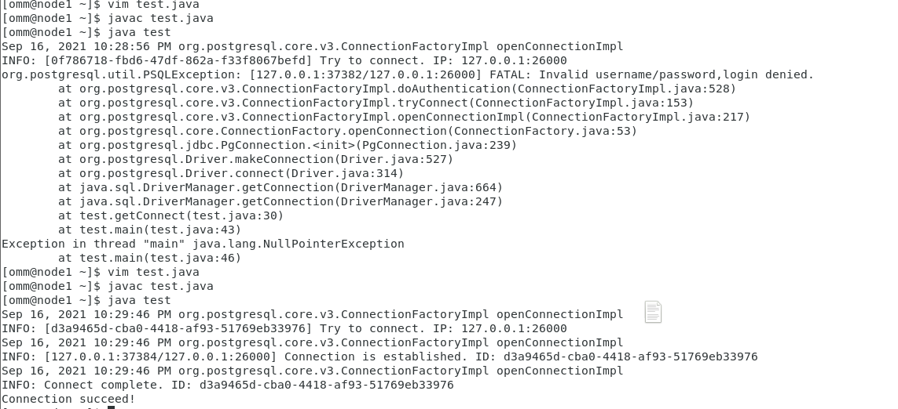

# openGauss 单机部署<a name="ZH-CN_TOPIC_0000001232574675"></a>

## 一、安装环境<a name="section88371844112410"></a>

1.  操作系统：虚拟机 VMware、CentOS7.9
2.  环境设置：

    - （1）虚拟机内存 3G、磁盘 100G
    - （2）系统版本修改

      一开始使用了 centos8，无法安装，因此降低版本，选用 7.9 后依然存在一些问题，因此修改/etc/redhat-release 文件中系统版本为 CentOS Linux release 7.6\(Core\)

    - （3）配置 YUM 源

      ① 删除系统自带 yum 源

      ```
      rm -rf /etc/yum.repos.d/*
      ```

      ② 下载阿里云 yum 源

      ```
      wget -O /etc/yum.repos.d/CentOS-Base.repo http://mirrors.aliyun.com/repo/Centos-7.repo
      ```

      ③ 生成仓库缓存

      ```
      yum makecache
      ```

    - （4）安装依赖包

      ```
      1 yum install ‐y libaio‐devel flex bison ncurses‐devel glibc.devel patch lsb_release
      2 yum install ‐y openssl* python3
      ```

    - （5）关闭 SELINUX 和 Firewall

      ```
      1 setenforce 0
      2 systemctl disable firewalld.service
      3 systemctl stop firewalld.service
      ```

    - （6）关闭交换内存

      ```
      swapoff -a
      ```

    - （7）关闭透明大页

      ```
      1 vim /etc/rc.d/rc.local
      2 if test ‐f /sys/kernel/mm/transparent_hugepage/enabled;
      3 then
      4 echo never > /sys/kernel/mm/transparent_hugepage/enabled
      5 fi
      6 if test ‐f /sys/kernel/mm/transparent_hugepage/defrag;
      7 then
      8 echo never > /sys/kernel/mm/transparent_hugepage/defrag
      9 fi
      ```

    - （8）修改主机名

      ```
      1 echo "node1" > /etc/hostname
      2 echo  “ 192.168.17.129 node1” >>/etc/hosts
      ```

## 二、安装详细步骤<a name="section14801132418136"></a>

1.  Opengauss 安装

    - （1）下载 opengauss 安装包及创建用户组和目录

      ```
      1 groupadd dbgrp
      2 useradd -g dbgrp -d /home/omm  -m -s /bin/bash omm
      3 echo "omm" | passwd  -‐stdin omm
      4 mkdir -p /opt/software/openGauss
      5 chmod 755 -R /opt/software
      6 chown -R omm:dbgrp  /opt/software/openGauss
       cd /opt/software/openGauss/
      7 wget https://opengauss.obs.cn-south-1.myhuaweicloud.com/2.0.0/x86/openGauss-2.0.0-CentOS-64bit-all.tar.gz
      8 tar -zxvf openGauss-2.0.0-CentOS-64bit-all.tar.gz
      9 tar -zxvf openGauss-2.0.0-CentOS-64bit-om.tar.gz
      ```

    - （2）单机 xml 配置文件

      首先从如下地址复制文件至当前位置

      ```
      cp script/gspylib/etc/conf/cluster_config_template.xml .
      ```

      修改配置文件具体如下，配置文件中要注意配置一下几个参数：nodeNAMES、backips

      ```
      <?xml version="1.0" encoding="UTF-8"?>
      <ROOT>    <!-- openGauss整体信息 -->
      <CLUSTER>        <!-- 数据库名称 -->
      <PARAM name="clusterName" value="singlenode" />        <!-- 数据库节点名称(hostname) -->
      <PARAM name="nodeNames" value="node1" />        <!-- 数据库安装目录-->
      <PARAM name="gaussdbAppPath" value="/opt/huawei/install/app" />        <!-- 日志目录-->
      <PARAM name="gaussdbLogPath" value="/opt/huawei/log" />        <!-- 临时文件目录-->
      <PARAM name="tmpMppdbPath" value="/opt/huawei/tmp" />        <!-- 数据库工具目录-->
      <PARAM name="gaussdbToolPath" value="/opt/huawei/install/om" />        <!-- 数据库core文件目录-->
      <PARAM name="corePath" value="/opt/huawei/corefile" />        <!-- 节点IP，与数据库节点名称列表一一对应 -->
      <PARAM name="clusterType" value="single-inst"/>
      <PARAM name="backIp1s" value="192.168.17.129"/>
      </CLUSTER>    <!-- 每台服务器上的节点部署信息 -->
      <DEVICELIST>        <!-- 节点1上的部署信息 -->
      <DEVICE sn="1000001">            <!-- 节点1的主机名称 -->
       <PARAM name="name" value="node1"/>            <!-- 节点1所在的AZ及AZ优先级 -->
      <PARAM name="azName" value="AZ1"/>
      <PARAM name="azPriority" value="1"/>            <!-- 节点1的IP，如果服务器只有一个网卡可用，将backIP1和sshIP1配置成同一个IP -->
      <PARAM name="backIp1" value="192.168.17.129"/>
      <PARAM name="sshIp1" value="192.168.17.129"/>        <!--dbnode-->
      <PARAM name="dataNum" value="1"/>
      <PARAM name="dataPortBase" value="26000"/>
      <PARAM name="dataNode1" value="/opt/huawei/install/data/db1"/>
      <PARAM name="dataNode1_syncNum" value="0"/>
      </DEVICE>
      </DEVICELIST>
      </ROOT>
      ```

    - （3）设置 lib 库

```
vim .bashrc
添加
export GPHOME=/opt/huawei/install/om
export PATH=$GPHOME/script/gspylib/pssh/bin:$GPHOME/script:$PATH
export LD_LIBRARY_PATH=$GPHOME/lib:$LD_LIBRARY_PATH
export PYTHONPATH=$GPHOME/lib
export GAUSSHOME=/opt/huawei/install/app
export PATH=$GAUSSHOME/bin:$PATH
export LD_LIBRARY_PATH=$GAUSSHOME/lib:$LD_LIBRARY_PATH
export S3_CLIENT_CRT_FILE=$GAUSSHOME/lib/client.crt
export GAUSS_VERSION=2.0.0
export PGHOST=/opt/huawei/tmp
export GAUSSLOG=/opt/huawei/log/omm
umask 077
export GAUSS_ENV=2
export GS_CLUSTER_NAME=singlenode
```

1.  （4）执行交互式初始化

    - ① 预安装，操作如下：

      ```
      1    cd /opt/software/openGauss/script
      2 root@node1 script]#python3 gs_preinstall -U omm -G dbgrp -X /opt/software/openGauss/cluster_config_template.xml
      Parsing the configuration file.
      Successfully parsed the configuration file.
      Installing the tools on the local node.
      Successfully installed the tools on the local node.
      Setting pssh path
      Successfully set core path.
      Are you sure you want to create the user[omm] and create trust for it (yes)? yes
      Preparing SSH service.
      Successfully prepared SSH service.
      Checking OS software.
      Successfully check os software.
      Checking OS version.
      Successfully checked OS version.
      Creating cluster's path.
      Successfully created cluster's path.
      Setting SCTP service.
      Successfully set SCTP service.
      Set and check OS parameter.
      Setting OS parameters.
      Successfully set OS parameters.
      Warning: Installation environment contains some warning messages.
      Please get more details by "/opt/software/openGauss/script/gs_checkos -i A -h node1 --detail".
      Set and check OS parameter completed.
      Preparing CRON service.
      Successfully prepared CRON service.
      Setting user environmental variables.
      Successfully set user environmental variables.
      Setting the dynamic link library.
      Successfully set the dynamic link library.
      Setting Core file
      Successfully set core path.
      Setting pssh path
      Successfully set pssh path.
      Set ARM Optimization.
      No need to set ARM Optimization.
      Fixing server package owner.
      Setting finish flag.
      Successfully set finish flag.
      Preinstallation succeeded.
      ```

      当出现“Preinstallation succeeded.”时，预安装成功。

      ② 安装

      进入 script 目录后进行正式安装，命令如下，其中“/opt/software/openGauss/cluster_config_template.xml”为前几步中编辑的配置文件。

      此过程需要输入密码，且设置的密码要符合复杂度要求如下：

      最少包含 8 个字符；

      不能和用户名和当前密码（ALTER）相同，或和当前密码反序；

      至少包含大写字母（A-Z），小写字母（a-z），数字，非字母数字字符（限定为\~!@\#$%^&\*\(\)-\_=+|\[\{\}\];:,<.\>/?）四类字符中的三类字符：

      ```
      [omm@node1 openGauss]$ cd script/
      [omm@node1 script]$ gs_install -X /opt/software/openGauss/cluster_config_template.xml
      Parsing the configuration file.
      Check preinstall on every node.
      Successfully checked preinstall on every node.
      Creating the backup directory.
      Successfully created the backup directory.
      begin deploy..
      Installing the cluster.
      begin prepare Install Cluster..
      Checking the installation environment on all nodes.
      begin install Cluster..
      Installing applications on all nodes.
      Successfully installed APP.
      begin init Instance..
      encrypt cipher and rand files for database.
      Please enter password for database:
      Please repeat for database:
      begin to create CA cert files
      The sslcert will be generated in /opt/huawei/install/app/sslcert/om
      Cluster installation is completed.
      Configuring.
      Deleting instances from all nodes.
      Successfully deleted instances from all nodes.
      Checking node configuration on all nodes.
      Initializing instances on all nodes.
      Updating instance configuration on all nodes.
      Check consistence of memCheck and coresCheck on database nodes.
      Configuring pg_hba on all nodes.
      Configuration is completed.
      Successfully started cluster.
      Successfully installed application.
      end deploy..
      ```

      测试安装是否成功，首先需要使数据库处于开启状态，然后输入”gsql -d postgres -p 26000”命令使数据库在本地运行，其中-p 为数据库端口 dataPortBase，具体数值在前述过程中 xml 配置文件中确定，这里为 26000。

      

      

2.  Opengauss 连接设置

    - （1）安装 java，确认 jdk 版本为 1.8
    - （2）从官网下载 jdbc 压缩包后，将其解压至路径/usr/lib/jvm/java-1.8.0-openjdk-1.8.0.302.b08-0.el7_9.x86_64/jre/lib/ext 下
    - （3）配置数据库服务器中的白名单与监听名单

      - ① 以操作系统用户 omm 登录数据库主节点
      - ② 执行如下命令增加对外提供服务的网卡 IP 或者主机名（英文逗号分隔），其中 NodeName 为当前节点名称，如：

        ```
         gs_guc reload -N NodeName -I all -c "listen_addresses='localhost,192.168.17.129'"
        ```

      - ③ 执行如下命令在数据库主节点配置文件中增加一条认证规则。（这里假设客户端 IP 地址为 192.168.17.129，即远程连接的机器的 IP 地址）

        ```
        gs_guc reload -N all -I all -h "host all yushan 192.168.17.129/32 sha256"
        - -N all表示openGauss中的所有主机。
        - -I all表示主机中的所有实例。
        - -h表示指定需要在“pg_hba.conf”增加的语句。
        - all表示允许客户端连接到任意的数据库。
        - yushan表示连接数据库的用户。
        - 192.168.17.129/32表示只允许IP地址为192.168.17.129的主机连接。在使用过程中，请根据用户的网络进行配置修改。32表示子网掩码为1的位数，即255.255.255.255
        - sha256表示连接时jack用户的密码使用sha256算法加密。
        ```

        与之效果相同的代替操作：

        在/opt/huawei/install/data/db1 路径（创建的节点名叫 db1）下编辑 pg_hba.conf 文件

        

      （4）通过编写 java 程序即可连接，example 如下

      ```
      import java.sql.Connection;
      import java.sql.DriverManager;
      import java.sql.PreparedStatement;
      import java.sql.SQLException;
      import java.sql.Statement;
      import java.sql.CallableStatement;
      public class test{
      public static Connection getConnect(String username, String passwd)
          {
              //驱动类。
              String driver = "org.postgresql.Driver";
              //数据库连接描述符。
              String sourceURL = "jdbc:postgresql://127.0.0.1:26000/postgres";
              Connection conn = null;

              try
              {
                  //加载驱动。
                  Class.forName(driver);
              }
              catch( Exception e )
              {
                  e.printStackTrace();
                  return null;
              }

              try
              {
                   //创建连接。
                  conn = DriverManager.getConnection(sourceURL, username, passwd);
                  System.out.println("Connection succeed!");
              }
              catch(Exception e)
              {
                  e.printStackTrace();
                  return null;
              }

              return conn;
          };
      	public static void main(String[] args) {
      		// TODO Auto-generated method stub
      		Connection conn = getConnect("yushan", "1qaz@wsx");
      		//BatchInsertData(conn);
      		try {
      			conn.close();
      			} catch (SQLException e) {
      				e.printStackTrace();
      			}
      	}
      }
      ```

      编译执行程序后，如图，连接成功。

      

## 三、安装过程中碰到的问题与解决办法<a name="section1414234611246"></a>

1.  问题 1

    在安装结束后，准备运行后，发现 gsom 无法启动。

    **解决过程：**

    猜测可能是内存不足，虚拟机一开始设置的内存为 1G，查阅相关博客发现，1G 内存对于企业版不足，后将虚拟机内存设置为 3G。

2.  问题 2

    运行 gsom 后报错如下

    

    **解决过程：**

    检查发现 pg_hba.conf 文件配置出错，修改如下

    

3.  问题 3

    一开始安装的虚拟机为 centos8，进行预安装后发现不支持该版本操作系统。

    **解决过程：**

    切换为 centos7.9，但依然报错，因此修改/etc/redhat-release 文件中系统版本为 CentOS Linux release 7.6\(Core\)
