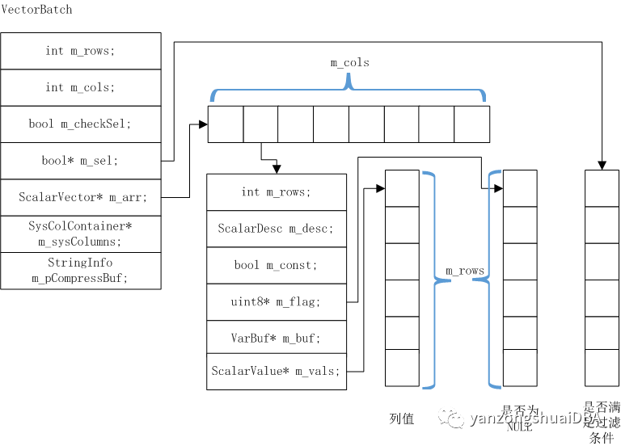
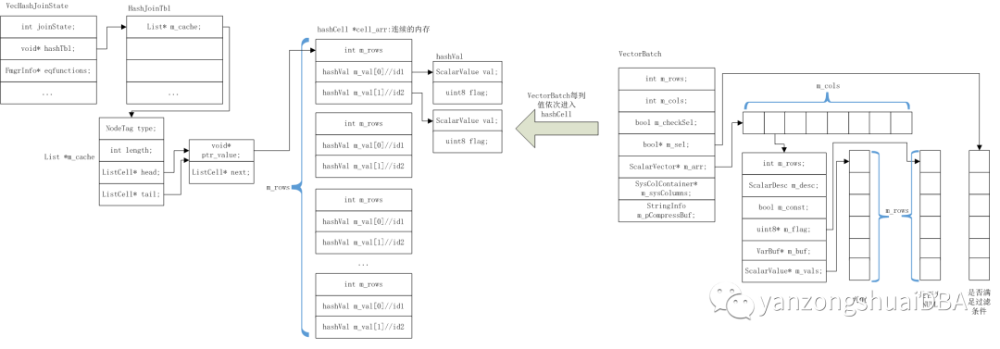
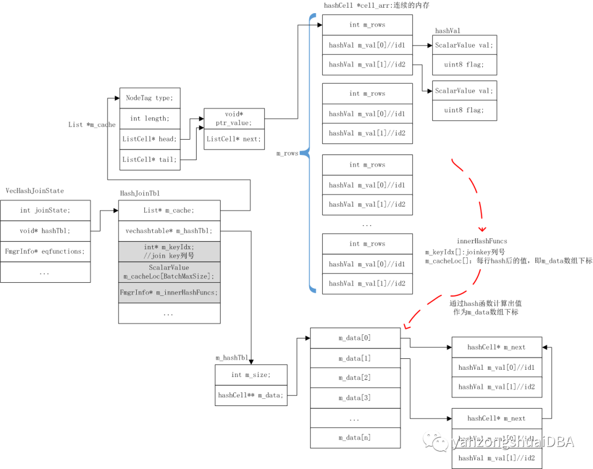
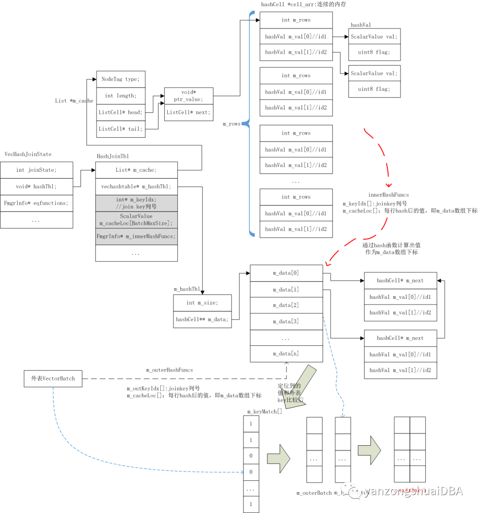

# openGauss 向量化引擎--hash join<a name="ZH-CN_TOPIC_0000001232574681"></a>

传统的行执行器采用一次一个元组的执行模式，执行过程中 CPU 大部分时间没有用了处理数据，都用在了遍历执行树等操作，导致 CPU 的有效利用率较低。面向 OLAP 场景大量函数调用次数，需要巨大开销，为解决次问题，openGauss 中开发了向量化引擎。采用一次一批元组的执行模式，可大幅减少遍历执行节点及调用函数的开销。

本文主要介绍 hash join 如何进行向量化的。

## 算子之间数据传递结构<a name="section399332011400"></a>

算子之间数据组织及传递结构是 VectorBatch：

```
class VectorBatch : public BaseObject {

public:
    // number of rows in the batch.
    int m_rows;
    // number of columns in the batch.
    int m_cols;
    // Shall we check the selection vector.
    bool m_checkSel;
    // Selection vector;
    bool* m_sel;
    // ScalarVector
    ScalarVector* m_arr;
   // SysColumns
    SysColContainer* m_sysColumns;
    // Compress buffer
    StringInfo m_pCompressBuf;
...
}
```



主要由 3 个数组在表示：m_vals 为列值数组，m_flag 为对应列的行值是否为 NULL，m_sel 为该行是否满足过滤条件。

## VecHashJoin<a name="section96181740174117"></a>

向量化 hash join 的算子是 VecHashJoin。其执行函数是 ExecVecHashJoin，分为 2 个阶段：HASH_BUILD 和 HASH_PROBE。

```
VectorBatch* ExecVecHashJoin(VecHashJoinState* node)
{
    int64 rows = 0;
    for (;;) {
        switch (node->joinState) {
            case HASH_BUILD: {
        if (node->hashTbl == NULL)
          node->hashTbl = New(CurrentMemoryContext) HashJoinTbl(node);
        ((HashJoinTbl*)(node->hashTbl))->Build();//构建hash表
        rows = ((HashJoinTbl*)(node->hashTbl))->getRows();
            } break;
            case HASH_PROBE: {
                result = ((HashJoinTbl*)(node->hashTbl))->Probe();//进行hash探测并构建join结果
                return result;
            }
            default:
                break;
        }
    }
}
```

## HASH_BUILD<a name="section64014469421"></a>

其中 build 的阶段又分为 2 个小阶段：1）获取内表的 batch，然后通过 m_funBuild：申请 hashCell \*cell_arr 连续内存，每个节点是一个 hashCell，大小是 m_cellSize，共有 batch 中记录的行数个。然后将其接入 m_cache 链表。然后将 batch 中列值依次存入 cell_arr 中。2）通过 PrepareProbe 函数构建 Hash 表，并将 cell_arr 中值放到 hash 表中。

```
void HashJoinTbl::Build()
{
  for (;;) {
    batch = VectorEngine(inner_node);//获取内表batch
    if (unlikely(BatchIsNull(batch)))
        break;
    RuntimeBinding(m_funBuild, m_strategy)(batch);
  }
  PushDownFilterIfNeed();
  PrepareProbe();
  ...
}
```

第 1 阶段：



第 2 阶段：



第 2 阶段，通过 m_keyIdx 数组得到哪一列是 join key，将 cell_arr 中该列值拿出来通过 m_innerHashFuncs 函数计算 hash 值，将其保存到 m_cacheLoc\[\]数组中，作为 m_data 数组下标，通过这种方式将内表列值放到 hash 表中。

## HASH_PROBE<a name="section416964144412"></a>

通过 probeHashTable 进行探测，并 join。也分为 2 个小阶段：1）外表 hash 阶段：首先获取外表的 batch，通过 m_outerHashFuncs hash 函数将外表的 join key 列 hash 出的值放到 m_cacheLoc 数组中，作为 hash 表数组的下标：m_hashTbl-\>m_data\[m_cacheLoc\[i\]\]。2）join 阶段：定位到的 m_hashTbl-\>m_data\[m_cacheLoc\[i\]\]中列值和外表中列值是否相同，若相等则通过 m_keyMatch\[\]数组标记。最后将 m_keyMatch\[\]数组标记为 1 的列值构建成向量 batch，并返回。

```
VectorBatch* HashJoinTbl::probeHashTable(hashSource* probSource)
{
    VectorBatch* res_batch = NULL;
    while (true) {
        switch (m_probeStatus) {
            case PROBE_FETCH:
        //获取外表batch
                m_outRawBatch = probSource->getBatch();
                if (BatchIsNull(m_outRawBatch)) {
                } else {
                    int row = m_outRawBatch->m_rows;
                    int mask = m_hashTbl->m_size - 1;
hashBatch(m_outRawBatch, m_outKeyIdx, m_cacheLoc, m_outerHashFuncs);
          for (int i = 0; i < row; i++) {
            m_cacheLoc[i] = m_outRawBatch->m_arr[icol].m_vals[i] & mask;
            m_cellCache[i] = m_hashTbl->m_data[m_cacheLoc[i]];
            m_match[i] = false; /* flag all the row no match */
            m_keyMatch[i] = true;
          }
          ...
                }
                break;
            case PROBE_DATA:
                res_batch = (this->*m_joinFun)(m_outRawBatch);
                if (!BatchIsNull(res_batch))
                    return res_batch;
                break;
            case PROBE_FINAL:
                return endJoin();
            default:
                break;
        }
    }
}
//
VectorBatch* HashJoinTbl::innerJoinT(VectorBatch* batch)//外部batch
{
  while (m_doProbeData) {
        last_build_idx = 0;
    RuntimeBinding(m_matchKeyFunction, i)(&batch->m_arr[m_outKeyIdx[i]], row, m_keyIdx[i], i);
    for (row_idx = last_build_idx; row_idx < row; row_idx++) {
      if (m_keyMatch[row_idx]) {
        val = m_cellCache[row_idx]->m_val;
        for (i = 0; i < m_innerBatch->m_cols; i++) {
                    p_vector = &m_innerBatch->m_arr[i];

                    p_vector->m_vals[result_row] = val[i].val;
                    p_vector->m_flag[result_row] = val[i].flag;
                }
                for (i = 0; i < m_outerBatch->m_cols; i++) {
                    p_vector = &m_outerBatch->m_arr[i];
                    p_vector->m_vals[result_row] = batch->m_arr[i].m_vals[row_idx];
                    p_vector->m_flag[result_row] = batch->m_arr[i].m_flag[row_idx];
                }
                result_row++;
      }
    }
  }
  return buildResult(m_innerBatch, m_outerBatch, true);
}
```


